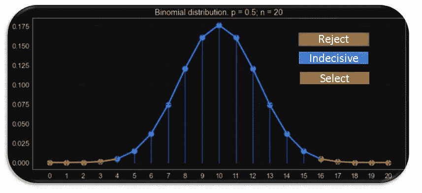
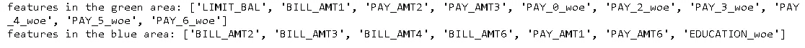
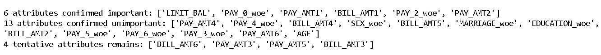
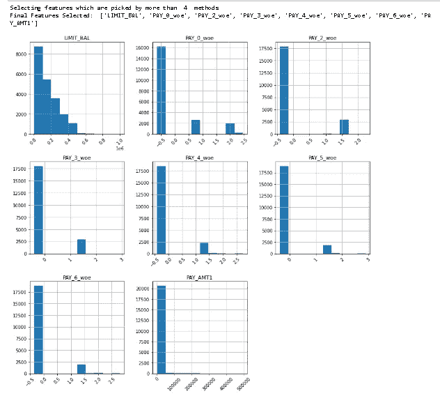

# 深入探讨 Python 中特性选择的 ML 技术—第 3 部分

> 原文：<https://towardsdatascience.com/deep-dive-on-ml-techniques-for-feature-selection-in-python-part-3-de2a7593247f>

## Python 中 AI 驱动的特征选择！

## 基于 ML 的特征选择系列文章的最后一部分，在这里我们将讨论像 Borutapy 和 Borutashap 这样的高级方法。此外，讨论如何组合多种方法的结果。


[https://unsplash.com/photos/bTRsbY5RLr4](https://unsplash.com/photos/bTRsbY5RLr4)

我首先要感谢并祝贺那些完成了基于 ML 的特征选择方法系列博客最后部分的读者！
如果您还没有看完前两部分，请仔细阅读:

[***深入探讨 Python 中用于特征选择的 ML 技术—第 1 部分***](https://indraneeldb1993ds.medium.com/deep-dive-on-ml-techniques-for-feature-selection-in-python-part-1-3574269d5c69)

[***深入探讨 Python 中用于特征选择的 ML 技术—第二部分***](https://indraneeldb1993ds.medium.com/deep-dive-on-ml-techniques-for-feature-selection-in-python-part-2-c258f8a2ac43)

我们已经在前面的章节中介绍了以下内容:

*A)特征选择方法的类型(第一部分)
B)相关性:皮尔逊、点双序列、克莱姆 V(第一部分)
C)证据和信息值的权重(第一部分)
D)贝塔系数(第二部分)
E)拉索回归(第二部分)
F)递归特征选择和顺序特征选择器(第二部分)*

我们将重点关注以下内容:

*A)博鲁塔派(第三部分)
B)博鲁塔派(第三部分)
C)把所有的东西结合在一起(第三部分)*

如前所述，数据集的细节和整个代码(包括数据准备)可以在这个 [Github repo](https://github.com/IDB-FOR-DATASCIENCE/ML-based-feature-selection.git) 中找到。所以让我们开始吧！

# a)突变性

Boruta 在 2010 年作为 R ( [paper link](https://www.jstatsoft.org/article/view/v036i11) )的一个包首次亮相。它很快成为最流行和最先进的特征选择方法之一，它基于两个概念:

***概念 1:阴影特征***

在 Boruta 中，特性的选择是基于它们相对于随机版本的性能。主要的逻辑是，只有当一个特性的性能优于随机特性时，它才是有用的。以下是其背后的主要步骤:

1.  基于特征上的原始数据帧，通过随机洗牌产生另一个数据帧。置换特征被称为阴影特征。
2.  然后阴影数据帧与原始数据帧结合
3.  在此组合数据框架上拟合用户定义的模型
4.  获取所有特征的重要性(原始特征+阴影特征)
5.  获得阴影特征中记录的最高特征重要性(从现在起我们称之为阈值)。python 版本在这一步有一个小变化，我们将在后面讨论。
6.  当原始特征的重要性高于这个阈值时，我们称之为“命中”

将阴影要素的最大值作为选择要素的阈值有时非常保守，因此 python 包允许用户将阴影要素重要性的百分比设置为阈值。默认值 100 相当于 R 版本的 Boruta 所做的。

***概念二:二项分布***

下一个想法是基于多次重复前面提到的步骤，以使结果更加可靠。如果我们称每次迭代为试验，那么在试验中选择一个特性的概率是多少？鉴于我们事先不知道某个特征是否重要，概率是 50%，并且由于每个独立试验可以给出二元结果(命中或未命中)，这一系列的 *n* 试验遵循[二项式分布。](https://www.statisticshowto.com/probability-and-statistics/binomial-theorem/binomial-distribution-formula/)

如果我们以 50%的成功概率和 5%的显著性水平绘制 20 次试验的二项式概率分布，概率曲线将看起来像:



作者图片

在 Borutapy 中，特性分为 3 个部分。这些部分基于分布的两个极端部分，称为尾部(由显著性水平决定):

*   **拒绝**(红色区域):这里的特征被认为是噪声，应该丢弃。在上面的图片中，如果一个特性的命中率低于 20 分之 4，那么它就在这个区域。
*   **优柔寡断**(蓝色区域):此处的特征并不确定，因此，该模型无法自信地说放弃/保留。在上面的图片中，如果一个特性的点击次数少于 16 次，多于 20 次中的 3 次，那么它就在这个区域。
*   **接受**(绿色区域):这里的特征是一个重要的估计量。在我们上面的图片中，如果一个功能在 20 次点击中超过 15 次，那么它就在这个区域。

如何计算 BorutaPy 的详细示例可以在[这里](/boruta-explained-the-way-i-wish-someone-explained-it-to-me-4489d70e154a#:~:text=Boruta%20is%20a%20pretty%20smart,and%20can%20be%20found%20here.)找到。

***boru tapy 的 Python 实现***

[python](https://github.com/scikit-learn-contrib/boruta_py) 包比 R 包有一些改进:

*   *由于 scikit-learn，运行时间更快*
*   *Scikit-learn like 接口*
*   *兼容 scikit-learn 的任何集成方法*
*   *自动 n _ 估算器选择*
*   *功能排名*
*   *特征重要性源自基尼系数，而非随机森林 R 包的 MDA。*

另外，强烈建议我们使用修剪过的深度在 3-7 之间的树。关于 python 包的更多细节可以在这里找到[。功能`borutapy_feature_selection`允许用户从 3 种流行的基于树的算法中选择:XG Boost，Random Forest 和 Light GBM。该函数从用户使用`borutapy_estimator`参数指定的列表中设置任何估计值。如果没有提到，默认情况下 XG boost 模型是合适的。他们还可以改变许多其他特性，比如试验次数(参见下面代码中函数的输入部分)。](https://github.com/scikit-learn-contrib/boruta_py)

```
#7\. Select features based on BorutaPy method# BorutaPy:
borutapy_estimator = "XGBoost"
borutapy_trials = 10
borutapy_green_blue = "both"################################ Functions #############################################################def borutapy_feature_selection(data, train_target,borutapy_estimator,borutapy_trials,borutapy_green_blue):

    #Inputs
    # data - Input feature data 
    # train_target - Target variable training data
    # borutapy_estimator - base model (default: XG Boost)
    # borutapy_trials -  number of iteration
    # borutapy_green_blue - choice for green and blue features## Initialize borutapy

    if borutapy_estimator == "RandomForest":
        # Manual Change in Parameters - RandomForest
        # Link to function parameters - [https://scikit-learn.org/stable/modules/generated/sklearn.ensemble.RandomForestClassifier.html](https://scikit-learn.org/stable/modules/generated/sklearn.ensemble.RandomForestClassifier.html)
        estimator_borutapy=RandomForestClassifier(n_jobs = -1,
                                                  random_state=101,
                                                  max_depth=7)
    elif borutapy_estimator == "LightGBM":
        # Manual Change in Parameters - LightGBM
        # Link to function parameters - [https://lightgbm.readthedocs.io/en/latest/pythonapi/lightgbm.LGBMClassifier.html](https://lightgbm.readthedocs.io/en/latest/pythonapi/lightgbm.LGBMClassifier.html)
        estimator_borutapy=lgb.LGBMClassifier(n_jobs = -1,
                                              random_state=101,
                                              max_depth=7)
    else:
        # Manual Change in Parameters - XGBoost
        # Link to function parameters - [https://xgboost.readthedocs.io/en/stable/parameter.html](https://xgboost.readthedocs.io/en/stable/parameter.html)       
        estimator_borutapy = XGBClassifier(n_jobs = -1,
                                           random_state=101,
                                           max_depth=7)## fit Borutapy
    # Manual Change in Parameters - Borutapy
    # Link to function parameters - [https://github.com/scikit-learn-contrib/boruta_py](https://github.com/scikit-learn-contrib/boruta_py)
    borutapy = BorutaPy(estimator = estimator_borutapy,
                        n_estimators = 'auto', 
                        max_iter = borutapy_trials)
    borutapy.fit(np.array(data), np.array(train_target))

    ## print results
    green_area = data.columns[borutapy.support_].to_list()
    blue_area = data.columns[borutapy.support_weak_].to_list()
    print('features in the green area:', green_area)
    print('features in the blue area:', blue_area) if borutapy_green_blue == "both":
        borutapy_top_features = green_area + blue_area
    else:
        borutapy_top_features = green_area

    borutapy_top_features_df =pd.DataFrame(borutapy_top_features,
                                           columns = ['Feature'])
    borutapy_top_features_df['Method'] = 'Borutapy'

    return borutapy_top_features_df,borutapy################################ Calculate borutapy #############################################################borutapy_top_features_df,boruta = borutapy_feature_selection(train_features_v2, train_target,borutapy_estimator,borutapy_trials,borutapy_green_blue)borutapy_top_features_df.head(n=20)
```



作者图片

# 博鲁塔·SHAP

BorutaPy 的致命弱点是它强烈依赖于可能有偏差的特征重要性的计算。这就是沙普利附加解释公司(SHAP)适合这个难题的地方。简单来说，SHAP 值可以解释一个复杂的模型如何做出决策。它实际上是为每个观察值计算所有排列中每个特征的平均边际贡献。由于计算的附加性质，我们可以对每个观察值取这些边际贡献的平均值，以获得全局特征重要性。如何计算 SHAP 值的详细例子可以在找到。

这种方法的唯一缺点是评估时间，因为需要计算许多排列。

***Python 实现的 BorutaShap***

功能`borutapy_feature_selection`允许用户从 3 种流行的基于树的算法中选择:XG Boost、随机森林和轻型 GBM。该功能从用户使用`borutapy_estimator`参数指定的列表中设置任何估计值。如果没有提到，默认情况下 XG boost 模型是合适的。他们还可以改变许多其他特性，比如试验次数(参见下面代码中函数的输入部分)。

```
#8\. Select features based on BorutaShap method# BorutaShap:
borutashap_estimator = "XGBoost"
borutashap_trials = 10
borutashap_green_blue = 'both'################################ Functions #############################################################def borutashap_feature_selection(data, train_target,borutashap_estimator,borutashap_trials,borutashap_green_blue):

    #Inputs
    # data - Input feature data 
    # train_target - Target variable training data
    # borutashap_estimator - base model (default: XG Boost)
    # borutashap_trials -  number of iteration
    # borutashap_green_blue - choice for green and blue features## Initialize borutashap

    if borutashap_estimator == "RandomForest":
        # Manual Change in Parameters - RandomForest
        # Link to function parameters - [https://scikit-learn.org/stable/modules/generated/sklearn.ensemble.RandomForestClassifier.html](https://scikit-learn.org/stable/modules/generated/sklearn.ensemble.RandomForestClassifier.html)
        estimator_borutashap=RandomForestClassifier(n_jobs = -1,
                                                    random_state=1,
                                                    max_depth=7)
    elif borutashap_estimator == "LightGBM":
        # Manual Change in Parameters - LightGBM
        # Link to function parameters - [https://lightgbm.readthedocs.io/en/latest/pythonapi/lightgbm.LGBMClassifier.html](https://lightgbm.readthedocs.io/en/latest/pythonapi/lightgbm.LGBMClassifier.html)
        estimator_borutashap=lgb.LGBMClassifier(n_jobs = -1,
                                                random_state=101,
                                                max_depth=7)
    else:
        # Manual Change in Parameters - XGBoost
        # Link to function parameters - [https://xgboost.readthedocs.io/en/stable/parameter.html](https://xgboost.readthedocs.io/en/stable/parameter.html)       
        estimator_borutashap=XGBClassifier(n_jobs = -1,
                                           random_state=101,
                                           max_depth=7)## fit BorutaShap
    # Manual Change in Parameters - BorutaShap
    # Link to function parameters - [https://github.com/scikit-learn-contrib/boruta_py](https://github.com/scikit-learn-contrib/boruta_py)
    borutashap = BorutaShap(model = estimator_borutashap,
                            importance_measure = 'shap',
                            classification = True)
    borutashap.fit(X = data, y = train_target, 
                   n_trials = borutashap_trials)

    ## print results
    %matplotlib inline
    borutashap.plot(which_features = 'all')## print results
    green_area = borutashap.accepted
    blue_area = borutashap.tentative
    print('features in the green area:', green_area)
    print('features in the blue area:', blue_area) if borutashap_green_blue == "both":
        borutashap_top_features = green_area + blue_area
    else:
        borutashap_top_features = green_area

    borutashap_top_features_df=pd.DataFrame(borutashap_top_features,
                                            columns = ['Feature'])
    borutashap_top_features_df['Method'] = 'Borutashap' return borutashap_top_features_df,borutashap################################ Calculate borutashap #############################################################borutashap_top_features_df,borutashap = borutashap_feature_selection(train_features_v2, train_target,borutashap_estimator,borutashap_trials,borutashap_green_blue)
borutashap_top_features_df.head(n=20)
```



作者图片

关于 python 包的更多细节可以在[这里](https://github.com/Ekeany/Boruta-Shap)找到。

# ***C)汇集一切***

> 永远不要把所有的鸡蛋放在一个篮子里

这句至理名言非常适合数据科学的大多数应用。大多数情况下，没有一个 ML 模型是没有缺陷的，但是每个模型都有自己的优点。根据我的经验，不要只依赖一种方法，如果可能的话，使用多种方法的组合总是一个好策略。这样，我们就不会受到任何方法的主要缺点的影响，并利用多种方法的优势。相同的逻辑可以应用于特征选择技术。现在我们已经学习了 8 种不同的方法，我建议读者使用它们的组合(或全部),并选择大多数方法选择的特征。下面是一个快速的 python 代码

```
# Methods Selectedselected_method = [corr_top_features_df, woe_top_features_df,beta_top_features_df,lasso_top_features_df,
                   rfe_top_features_df,sfs_top_features_df,borutapy_top_features_df,borutashap_top_features_df]# Combining features from all the models
master_df_feature_selection = pd.concat(selected_method, axis =0)
number_of_methods = len(selected_method)
selection_threshold = int(len(selected_method)/2)
print('Selecting features which are picked by more than ', selection_threshold, ' methods')
master_df_feature_selection_v2 = pd.DataFrame(master_df_feature_selection.groupby('Feature').size()).reset_index()
master_df_feature_selection_v2.columns = ['Features', 'Count_Method']
master_df_feature_selection_v3 = master_df_feature_selection_v2[master_df_feature_selection_v2['Count_Method']>selection_threshold]
final_features = master_df_feature_selection_v3['Features'].tolist()
print('Final Features Selected: ',final_features)
train_features_v2[final_features].hist(figsize = (14,14), xrot =  45)
plt.show()
master_df_feature_selection_v3.head(n=30)
```



作者图片

# 最后的话

> 恭喜你！

我们已经完成了基于 ML 的特征选择技术系列！我们深入探讨了 8 种主要方法，它们分布在不同的类别(过滤器、包装器和嵌入式)、计算难度和易于理解的程度。我们不仅学习了它背后的理论，还能够用 python 实现它们。我们还讨论了使用它们时的最佳实践。这个博客系列以及参考资料应该足以让任何人开始使用这些方法。

这里的最后一块拼图是要记住，我们在这里只涉及了科学，但是特征选择也是一门艺术。通过实践，我们会做得更好，但我想用一条建议来结束这个系列:尽可能多地使用方法，并始终根据业务逻辑来验证结果。有时，即使模型不能挑选一些关键特性，但业务逻辑要求我们使用它，我也会建议添加它。

# 参考材料

1.  [Borutapy python 包](https://github.com/scikit-learn-contrib/boruta_py)
2.  [Borutshap python 包](https://github.com/Ekeany/Boruta-Shap)

# 我们连线吧！

如果你和我一样，对 AI、数据科学或经济学充满热情，请随时在 [LinkedIn](http://www.linkedin.com/in/indraneel-dutta-baruah-ds) 、 [Github](https://github.com/IDB-FOR-DATASCIENCE) 和 [Medium](https://medium.com/@indraneeldb1993ds) 上添加/关注我。


照片由[威廉·冈克尔](https://unsplash.com/@wilhelmgunkel)在 [Unsplash](https://unsplash.com/photos/L04Kczg_Jvs) 上拍摄