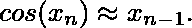
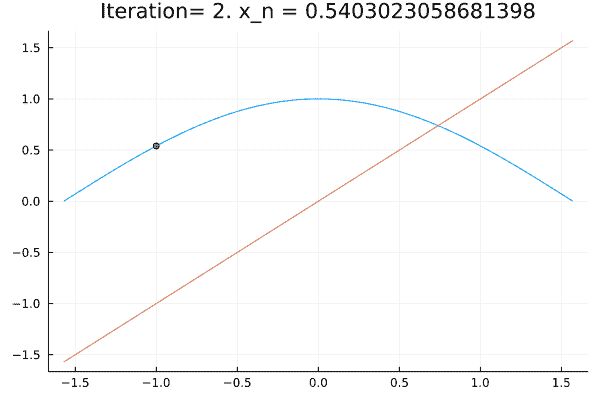
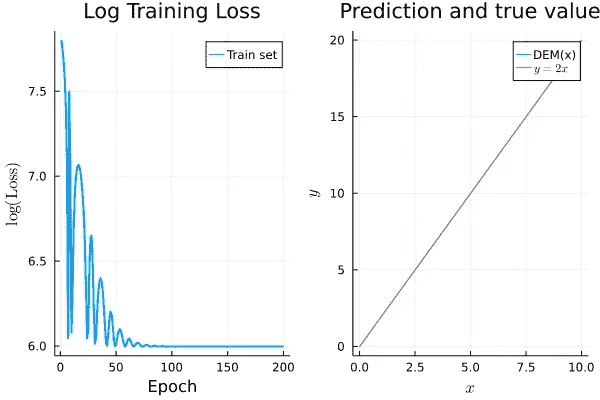
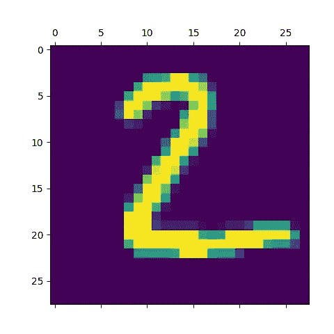

# 基于神经微分方程的深度平衡模型

> 原文：<https://towardsdatascience.com/deep-equilibrium-models-via-neural-odes-c25a3ac8d004>

## 结合神经网络、不动点和常微分方程的艺术


来源:[https://pix abay . com/photos/sea-waves-nature-light-ripples-7484743/](https://pixabay.com/photos/sea-waves-nature-light-ripples-7484743/)

# 介绍

最近，聪明的研究人员已经意识到，我们可以将看似无关的想法结合起来，重新解释神经网络如何工作以及我们如何训练它们。首先，如果我们将神经网络的隐藏层数增加到无穷大，我们可以将神经网络的输出视为一个**不动点问题**。第二，神经网络和**常微分方程** (ODEs)之间有很深的联系。我们可以用微分方程求解器来训练神经网络。那么，如果我们把这两个想法结合在一起呢？也就是说，我们通过找到 ODE 的稳态来训练一个**神经网络。**事实证明，这种方法非常有效，这也是这篇博文的目的。

**演职员表:**本帖基于这篇优秀的[博文](https://julialang.org/blog/2021/10/DEQ/)，第一次看的时候完全炸了我的心。

# 不动点

假设我们有一个由关系式 x'=f(x)定义的动力系统。当左侧等于左侧时，达到系统的固定点:x*=f(x*)。为了找到一个固定点，可以从随机猜测开始，然后应用函数 f 和一定次数。

下面用固定点 cos(x)=x 来说明这个过程。我从最初的猜测 x0 = -1 开始。然后，我使用规则 x1 = cos(x0)更新我的猜测。然后我重复这个过程。经过几次迭代，xn 真的接近红线(45°线)，这表明



计算定点 cos(x)=x .来源:作者的计算。

*细心的读者请注意:*这里一切正常的原因是因为函数 x- > cos(x)是感兴趣区间上的收缩映射。参见:[https://en.wikipedia.org/wiki/Banach_fixed-point_theorem](https://en.wikipedia.org/wiki/Banach_fixed-point_theorem)

跟神经网络有什么关系？好吧，让我们考虑一个单层 x'=NN(x)的神经网络。现在，假设我们添加另一层，使用相同的架构:x'' = NN(NN(x))。我们再做一遍那个运算:x''' = NN(NN(NN(x)))。等等…这个过程和我们上面做的真的很像，简单的不动点问题 cos(x)=x。

# 常微分方程

到目前为止，一切顺利。现在，让我们假设我们正在考虑一个物理系统(一个球，一个火箭，等等。)与位置 x，我们假设 f 给我们系统的速度:f(x) = dx/dt。现在 dx ≈ x_{n+1}-x_{n}，所以


速度为零时物理系统不动:f(x) = 0。物理系统在 g(x)=x 时也不动，其中就是上述类型的不动点问题。**重点是不动点问题和寻找颂歌的稳态之间存在联系。**

# 定点+ ODE +神经网络

有时，我们可以找到常微分方程的精确解。大多数时候，我们不能，所以我们必须找到数字近似值。一个(绝妙的)想法是使用神经网络来近似求解。更具体地说，对于上面的函数 g，我们使用神经网络。

对于给定的 g，我们可以使用一个 ODE 求解器，它给出了 ODE 的固定点。**更进一步，我们可以训练神经网络，这样对于给定的输入，ODE 的固定点就是我们想要预测的量**。简而言之，这就是**深度均衡模型** (DEM)的全部内容。

# 应用 1:学习 y=2x

首先，我们可以检查这种方法是否适用于一个非常简单的案例。这里，给定 x，我们希望 DEM 预测值 2x。下面的代码使用了 Julia，它被描述为“快速 Python”:

它应该输出类似于下图的图形:



来源:作者基于上述代码的计算。基于[https://julialang.org/blog/2021/10/DEQ/](https://julialang.org/blog/2021/10/DEQ/)的代码

事情按预期运行。然而，使用 DEM 学习函数 y=2x 感觉就像用火箭筒打死一只苍蝇。在下一个应用程序中，我们要处理一个稍微有点雄心勃勃的目标:MNIST 数据集和从图像中预测数字。

# 应用 2: MNIST

代码有点复杂，但主要思想保持不变。对于给定的输入，输出是 ODE 的固定点，其中 ODE 依赖于神经网络。

在这里，我们必须做更多的工作，因为我们首先要把图像转换成矢量。然后，我们使用 softmax 层将 ODE 的稳态转换为数字预测(已经包含在损失函数`logitcrossentropy).`中)。还要注意，ODE 层夹在另外两层之间。请随意尝试其他架构。

训练之后，您应该会看到类似这样的内容



来源:作者基于上述代码的计算。基于[https://julialang.org/blog/2021/10/DEQ/](https://julialang.org/blog/2021/10/DEQ/)的代码

```
DEM prediction: 2
True digit: 2
```

# 结论

这篇博客文章概述了什么是深度均衡模型。我们可以创建一个结合了神经网络、ode 和固定点的预测机器，这看起来几乎是不可思议的。读完这篇博客后，我希望你能多理解一点这个魔术背后的机制。

# 参考

白，，科尔特和弗拉德连科尔顿。“深度平衡模型。”*神经信息处理系统进展* 32 (2019)。

陈，李瑞奇，等。神经常微分方程。*神经信息处理系统进展* 31 (2018)。

Julia 中的可组合性:通过神经微分方程实现深度平衡模型。网址:【https://julialang.org/blog/2021/10/DEQ/ 