# 深度特征合成与遗传特征生成

> 原文：<https://towardsdatascience.com/deep-feature-synthesis-vs-genetic-feature-generation-6ba4d05a6ca5>

## 机器学习的两种自动特征生成策略的逐步比较


[视觉效果](https://unsplash.com/@visuals?utm_source=medium&utm_medium=referral)在 [Unsplash](https://unsplash.com?utm_source=medium&utm_medium=referral) 上拍照

# 介绍

功能工程是从现有功能创建新功能的过程，目的是获取第一组功能本身没有的与目标列的关系。这个过程对于提高机器学习算法的性能非常重要。尽管当数据科学家应用特定于用例的转换时，特性工程工作得最好，但是有一些方法可以自动地完成这项工作，而不需要预先的领域知识。

在这个故事中，我们将通过一个例子来解释如何使用 [ATOM](https://github.com/tvdboom/ATOM) 包来快速比较两种自动特征生成算法:深度特征合成(DFS)和遗传特征生成(GFG)。ATOM 是一个开源的 Python 包，旨在帮助数据科学家加快机器学习管道的探索。如果你想对图书馆有一个温和的介绍，读读这个故事。声明:这个故事的作者也是这个包的作者。

## 基线

让我们开始仅使用初始特征来训练模型。我们将要使用的数据是来自 Kaggle 的澳大利亚天气数据集的[变体。这个数据集的目标是预测明天是否会下雨，在目标列`RainTomorrow`上训练一个二元分类器。](https://github.com/tvdboom/ATOM/blob/master/examples/datasets/weatherAUS.csv)

```
import pandas as pd
from atom import ATOMClassifier# Load the data and have a look
X **=** pd**.**read_csv("./datasets/weatherAUS.csv")
X**.**head()
```

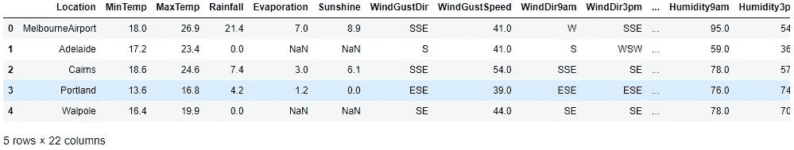

初始化 atom 实例并为建模准备数据。出于解释目的，我们仅使用数据集的一个子集(1000 行)。下面几行估算缺失值并对分类列进行编码。

```
atom = ATOMClassifier(X, y="RainTomorrow", n_rows=1e3, verbose=2)
atom**.**impute()
atom**.**encode()
```

输出如下所示。


我们可以使用`dataset`属性快速检查数据在转换后的样子。

`atom.dataset.head()`

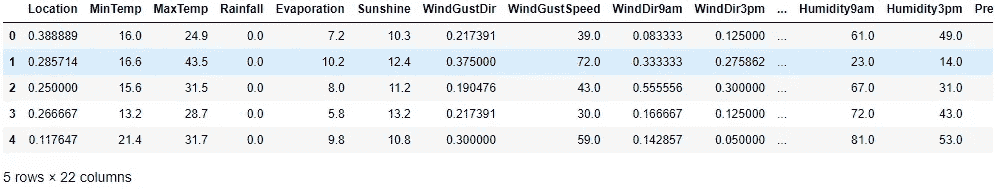

数据现在可以被模型接收了。在这个故事中，我们将使用 [LightGBM](https://lightgbm.readthedocs.io/en/latest/pythonapi/lightgbm.LGBMClassifier.html) 模型进行预测。使用 atom 训练和评估模型非常简单:

`atom.run(models="LGB", metric="accuracy")`

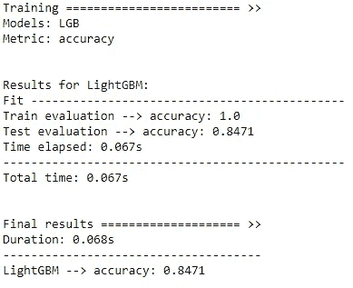

我们在测试集上实现了 0.8471 的精度。还不错。让我们看看自动化特征生成是否能在这方面有所改进。

## 深度特征合成

DFS 对现有特征应用标准的数学运算符(加、减、乘等),进行组合。例如，在我们的数据集上，DFS 可以创建新的特征`MinTemp + MaxTemp`或`WindDir9am x WindDir3pm`。

为了能够比较这些模型，我们为 DFS 管道创建了一个新的分支。如果你不熟悉 [ATOM 的分支系统](https://tvdboom.github.io/ATOM/user_guide/data_management/#branches)，看看[这个](/how-to-test-multiple-machine-learning-pipelines-with-just-a-few-lines-of-python-1a16cb4686d)的故事。

`atom.branch = "dfs"`

使用 atom 的 [*特征生成*](https://tvdboom.github.io/ATOM/API/ATOM/atomclassifier/#feature-generation) 方法在新分支上运行 DFS。为了简化，我们只使用加法和乘法来创建新的特征(使用`div`、`log`或`sqrt`操作符可以返回带有`inf`或`nan`值的特征，这些值必须再次估算)。

```
atom.feature_generation(
    strategy="dfs",
    n_features=10,
    operators=["add", "mul"],
)
```

**注意:** ATOM 使用头罩下的 [*featuretools*](https://docs.featuretools.com/en/v0.16.0/index.html) 包来运行 DFS。

由于我们使用 n_features=10，从所有可能的组合中随机选择的 10 个要素被添加到数据集中。

`atom.dataset.head()`

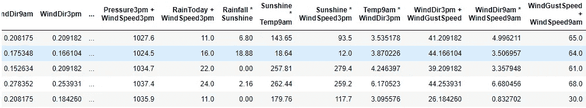

使用以下内容再次训练模型:

`atom.run(models="LGB_dfs")`

注意两件事:

*   我们在模型的首字母缩略词后添加标签`_dfs`，以避免覆盖基线模型。
*   不再需要指定用于验证的指标。atom 实例将自动使用与之前模型相同的标准。在我们的例子中，准确性。

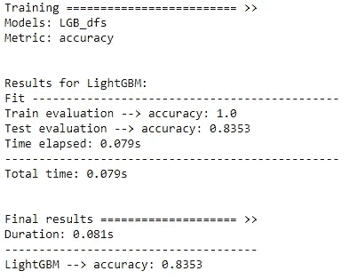

看起来 DFS 并没有改进模型。结果甚至变得更糟。让我们看看 GFG 表现如何。

## **遗传特征生成**

GFG 使用遗传编程(进化编程的一个分支)来确定哪些特征是成功的，并在此基础上创造新的特征。DFS 盲目地尝试各种功能的组合，而 GFG 则试图通过每一代算法来改进其功能。GFG 使用与 DFS 相同的操作符，但它不是只应用一次转换，而是进一步发展它们，创建功能组合的嵌套结构。仅使用运算符 add (+)和 mul (x)，一个示例特征可能是:

`add(add(mul(MinTemp, WindDir3pm), Pressure3pm), mul(MaxTemp, MinTemp))`

与 DFS 一样，我们首先创建一个新的分支(从最初的`master`分支中，将 DFS 排除在管道之外)，然后我们训练和评估模型。同样，我们创建了 10 个新功能。

**注意:** ATOM 使用头罩下的[*gp learn*](https://gplearn.readthedocs.io/en/stable/)*包运行 GFG。*

```
*atom.branch = "gfg_from_master"atom.feature_generation(
    strategy="GFG",
    n_features=10,
    operators=["add", "mul"],
)*
```

*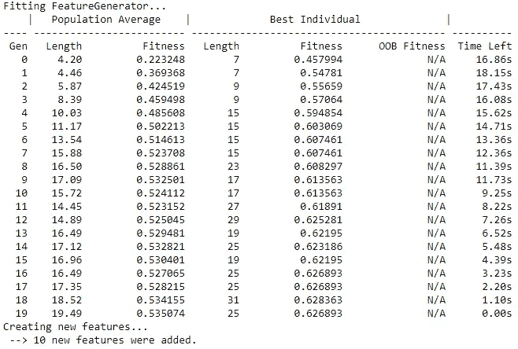*

*可以通过`genetic_features`属性访问新生成特征的概述、它们的名称以及它们的适应性(在遗传算法中获得的分数)。*

*`atom.genetic_features`*

*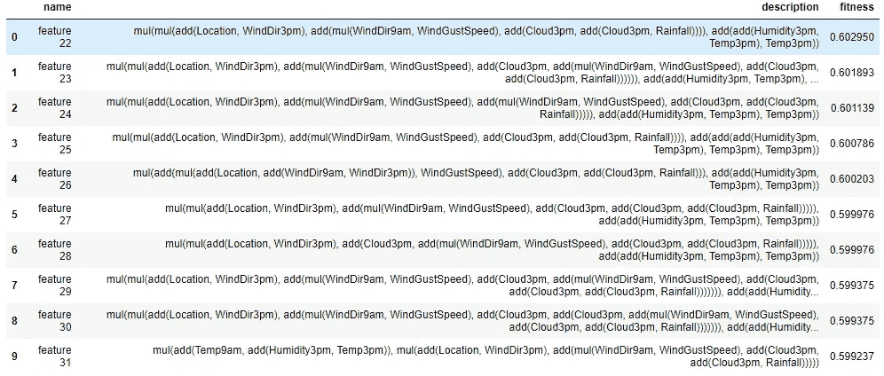*

*请注意，由于要素的描述可能会变得很长，新要素被命名为`feature n`，其中 n 代表数据集中的第 n 个要素。*

*`atom.dataset.head()`*

*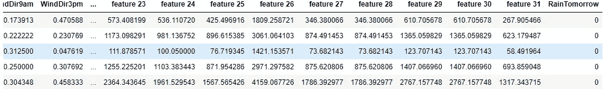*

*再次运行该模型会产生:*

*`atom.run(models="LGB_gfg")`*

*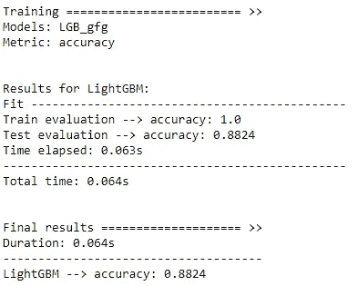*

*这一次我们获得了 0.8824 的准确度分数，比基线模型获得的 0.8471 好得多！*

## *结果*

*现在这三个模型都训练好了，是时候分析结果了。使用`results`属性获得所有模型在训练集和测试集上的分数。*

*`atom.results`*

*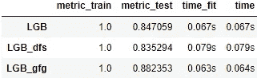*

*使用 [atom 的绘图方法](https://tvdboom.github.io/ATOM/user_guide/plots/)进一步比较模型的特性和性能。*

*`atom.plot_roc()`*

*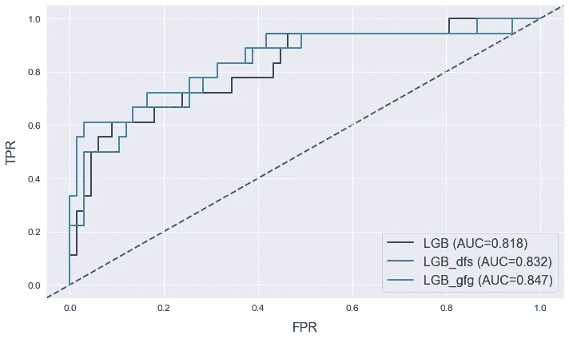*

*让我们来看看哪些特征对模型的预测贡献最大。使用 atom 的[画布](https://tvdboom.github.io/ATOM/user_guide/plots/#canvas)绘制多个相邻的地块。*

```
*with atom.canvas(1, 3, figsize=(20, 8)):
    atom.lgb.plot_feature_importance(show=10, title="LGB")
    atom.lgb_dfs.plot_feature_importance(show=10, title="LGB + DFS")
    atom.lgb_gfg.plot_feature_importance(show=10, title="LGB + GFG")*
```

*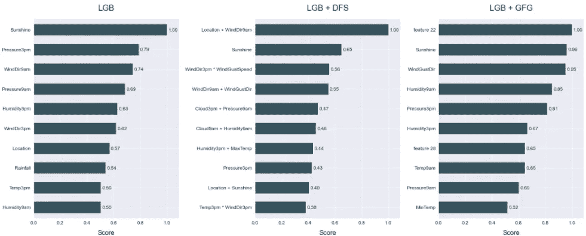*

*对于两个非基线模型来说，生成的特征似乎是最重要的，这表明新特征与目标列相关，并且它们对模型的预测起着重要作用。*

*使用[决策图](https://tvdboom.github.io/ATOM/API/plots/decision_plot/)，还可以查看数据集中各个行的特性的影响。*

*`atom.lgb_dfs.decision_plot(index=0, show=15)`*

*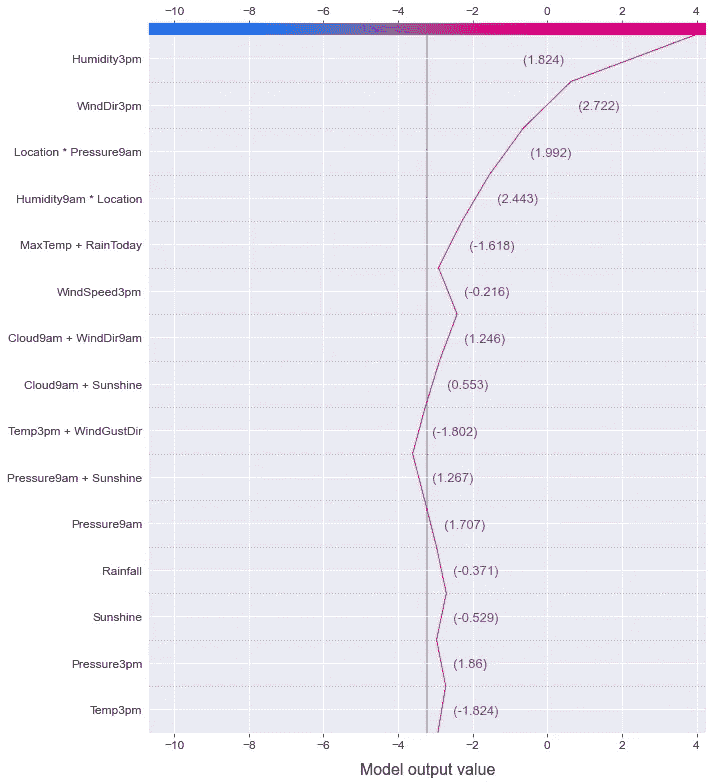*

# *结论*

*我们比较了使用两种自动特征生成技术生成的新特征丰富的数据集上训练的分类器的性能。结果表明，使用这些技术可以大大提高模型的性能。当然，请注意，这只是一个用于解释目的的模拟示例。在真实用例中改进模型可能要复杂得多。*

*关于 ATOM 的更多信息，请看软件包的[文档](https://tvdboom.github.io/ATOM/)。对于 bug 或功能请求，请不要犹豫，在 [GitHub](https://github.com/tvdboom/ATOM) 上提出问题或给我发电子邮件。*

*相关故事:*

*   *[https://towards data science . com/atom-a-python-package-for-fast-exploration-of-machine-learning-pipelines-653956 a16 e7b](/atom-a-python-package-for-fast-exploration-of-machine-learning-pipelines-653956a16e7b)*
*   *[https://towards data science . com/how-to-test-multiple-machine-learning-pipelines-with-just-the-less-lines-of-python-1 a16 CB 4686d](/how-to-test-multiple-machine-learning-pipelines-with-just-a-few-lines-of-python-1a16cb4686d)*
*   *[https://towards data science . com/from-raw-data-to-we B- app-deployment-with-atom-and-streamlit-d 8df 381 aa 19 f](/from-raw-data-to-web-app-deployment-with-atom-and-streamlit-d8df381aa19f)*
*   *[https://towards data science . com/exploration-of-deep-learning-pipelines-made-easy-e1cf 649892 BC](/exploration-of-deep-learning-pipelines-made-easy-e1cf649892bc)*

*参考资料:*

*   *天气数据由澳大利亚政府根据[知识共享属性许可](https://creativecommons.org.au/learn/licences/)发布，并从 [Kaggle](https://www.kaggle.com/jsphyg/weather-dataset-rattle-package) 收集。*
*   *这个故事中所有没有说明的图片都是作者创作的。*