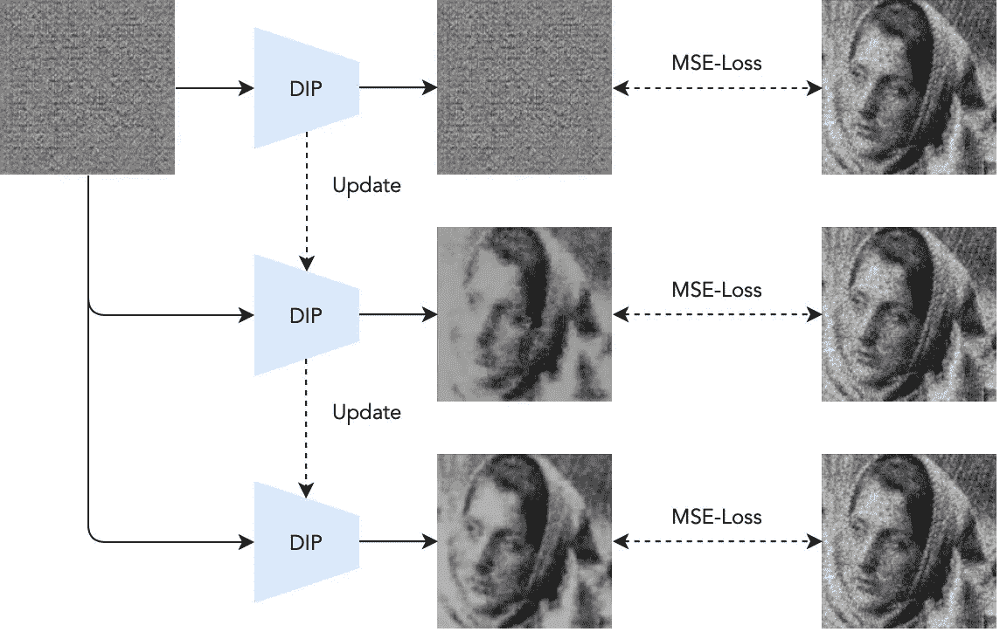
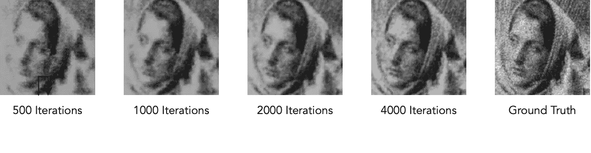

# PyTorch 中的深层图像先验

> 原文：<https://towardsdatascience.com/deep-image-prior-in-pytorch-e6edf666a480>

## 无数据随机网络图像去噪

图一。浸渍管道。单个图像用于训练，目的是从噪声中重建图像。最终，网络学会重建图像的去噪版本。作者创建的图像。

深度学习和神经网络一直与大数据紧密相关。无论是语言翻译的图像分类，您几乎总是需要大量的数据来提高模型适用于真实世界数据集的任务准确性。即使在[少量或一次性场景](/building-a-one-shot-learning-network-with-pytorch-d1c3a5fafa4a)下，初步的情况是你仍然需要大量的数据来训练网络。但是，如果我告诉你，你不需要任何数据或任何预先训练的网络，但你可以执行图像恢复甚至超分辨率呢？

在本文中，我们将深入到深度网络的一个完全不同的领域，即深度图像先验(DIP)，它不需要任何数据集进行训练，但学会分离噪声和图像来执行图像恢复。我们将详细讨论 PyTorch 教程，展示 DIP 的强大功能。

# 什么是深度图像先验？

图 1 简单展示了 DIP 的工作原理。出乎意料的简单。你首先有一个随机初始化的网络，目的是从纯噪声中重建目标图像。然后将网络的输出重建与原始图像进行比较，以计算损失函数，随后更新网络。经过一些迭代，你会惊讶地发现，网络将开始输出原始图像的“去噪”版本。

本质上，我们的整个训练过程是优化网络以保留图像的先验信息，因此命名为“深度图像先验”。

## 那么，为什么会这样呢？

理论上，一个网络应该能够拾取图像的所有方面，从粗糙到细节，其中也包括固有的噪声。然而，实际上，在最终拾取噪声并因此“过度拟合”整个图像之前，网络更可能拾取图像内的连贯和一致的特征。因此，如果我们在过度拟合之前在中间停止训练，网络输出变成原始图像的干净版本，服务于我们的图像恢复目的。

# 计算环境

## 库和硬件要求

这个实现是建立在 PyTorch 和 OpenCV 之上的。通常情况下，神经网络与 GPU 一起进行并行计算会更好。然而，由于仅使用我们正在去噪的单个图像的 DIPs 的特殊性质，CPU 是足够的。

下面是导入库和引入 GPU(如果有的话)的代码:

# 履行

## 网络体系结构

根据最初的 DIP 文件，不同的网络架构工作方式不同。我们按照论文建议的设置创建了一个带有跳跃连接的沙漏网络。

以下是网络的实现:

## 培养

训练是相当非正统的，因为我们只有一个图像，必须顺序优化它。这意味着我们完全忽略了 PyTorch 的批量训练能力。请注意，网络确实会考虑批次维度，因此我们必须在计算损失之前取消图像排队。

以下是培训的实施情况:

# 结果

图二。DIP 结果。作者创建的图像。

我们提供 100、500、1000 和 2000 年后的结果如下。从图 2 中可以看出，DIP 网络首先学习整个图像的干净特征，在中间产生图像的干净版本。然而，随着训练的进行，在分辨率增加的同时，一些噪声也被带入图像中。

# “二次探底”

有趣的是，在 DIP 论文之后，Gandelsman 等人提出了一种称为双 DIP 的变体，他们发现同时优化两个先验可以鼓励网络分别学习特征，从而导致有意义的图像分解，甚至前景和背景分离。

*全文可以在这里找到***。**

# *结束注释*

*现在你知道了！一个网络，一个图像，没有任何数据，你可以从头开始执行图像去噪和恢复。DIP 的完整实现可在此处找到:*

 *[## 这是深度图像先验论文的一个实现

### 此时您不能执行该操作。您已使用另一个标签页或窗口登录。您已在另一个选项卡中注销，或者…

github.com](https://github.com/ttchengab/Deep_Image_Prior)* 

**感谢您坚持到现在*🙏！*我会在计算机视觉/深度学习的不同领域发布更多信息，所以如果你有兴趣了解更多信息，请加入并订阅***！一定要看看我关于计算机视觉方法的其他文章！***