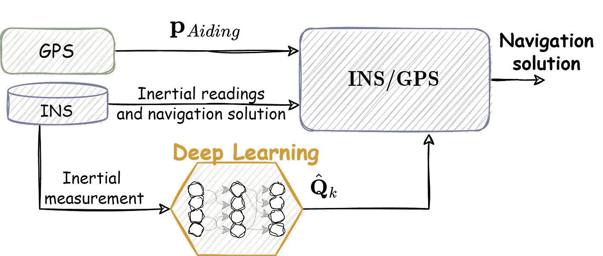

# 基于深度学习的惯性导航:一种混合导航滤波器

> 原文：<https://towardsdatascience.com/deep-learning-based-inertial-navigation-a-hybrid-navigation-filter-ecabd547456b>

## 惯性导航领域被认为是一个非常经典的领域。它旨在利用(低级)惯性传感器和精确(低频)传感器，如 GPS 接收器，为我们提供导航解决方案(位置、速度和方向)。一个问题出现了，强大的深度学习工具可以如何推动这个经典领域。

# 个人动机介绍:我为什么要开始？

三年前，我开始问自己，将机器学习和深度学习(DL)结合起来是否有价值，特别是在经典的[惯性导航系统](/dead-reckoning-is-still-alive-8d8264f7bdee) (INS)中。在这个行业工作了 3 年后，我在海法大学开始了我的博士研究，包括为高通和 Autotalks 工作。在这些站点中，我思考了 DL 加速的许多迷人的解决方案。例如，我研究过高通的指纹传感器，这种传感器目前存在于许多智能手机设备中。

作为这场革命的一部分，我对自己以前的教育进行了反思:我毕业于以色列理工学院，获得了 3 个学位:航空航天工程硕士学位和学士学位，以及经济和管理学士学位(成绩优异)。我过去主要关注实时导航和跟踪目的的最优控制和估计。留在这个领域，把 DL 整合成我博士的一部分，题目是“基于机器学习的惯性导航”，似乎是很自然的事情。

# 背景

经典的 [INS](/dead-reckoning-is-still-alive-8d8264f7bdee) 将[加速度计和陀螺仪](/what-is-imu-9565e55b44c)的测量值组合成运动学方程。最终实现导航解算。但是，这两个传感器噪声很大，使得解决方案很差，并且会出现快速发散。因此，最有可能将经典的 [INS](/dead-reckoning-is-still-alive-8d8264f7bdee) 与精确的传感器融合。例如全球定位系统(GPS)接收器。这种融合方案被称为 INS/GPS。最大的问题是，“如何将所有传感器集成在一起，以实现最精确的导航解决方案？”答案涉及到著名的信号处理算法，[卡尔曼滤波器](/kalman-filter-celebrates-60-years-an-intro-bb508ee116ff) (KF)。KF 是惯性导航传感器融合任务中最著名的算法。大多数时候，由于导航方程涉及非线性，所以使用扩展的 KF (EKF)版本。

我提出了一个问题和一个解决方案——那么 DL 组合在哪里呢？答案很简单。导航滤波器，或通常任何 EKF，必须有自己的参数，以最佳工作。

# **卡尔曼滤波器真的是最优滤波器吗？**

在大多数估算书中，你可能会发现 [KF](/kalman-filter-celebrates-60-years-an-intro-bb508ee116ff) 是一个最佳滤波器，它可以最小化状态和这些状态的预测之间的平方根误差(MSE )(状态是一个可以由 15 个状态组成的向量:3 维的位置和速度加上身体方向角(另外 3 个)。加速度计和陀螺仪偏置还有另外六种状态。但是我们希望最小化**真实状态**向量和预测状态向量之间的误差。在现实生活中，除非使用非常精确的设备(即实时运动设备)，否则我们无法获得这种真实状态。

作为负责整个导航场景的动态模型的过滤器设计者，他可能在状态及其方程(转移矩阵)上出错。记住，这只是一个[运动学**模型**](/tuning-q-matrix-for-cv-and-ca-models-in-kalman-filter-67084185d08c) 而不是真正的**运动学本身！为了达到最优，设计者必须设计一个精确的动态模型(稍后，我们还将讨论测量模型)。由于没有人知道未来，伟大的 KF 允许我们在建模阶段为我们的不确定性增加一些权重。在系统模型噪声协方差矩阵中考虑了这种不确定性。对于每个状态，我们可以将一些代表高斯白噪声方差的值放入[以帮助 KF 处理它将在实时导航期间遇到的一些动态](/tuning-q-matrix-for-cv-and-ca-models-in-kalman-filter-67084185d08c)。**

因此，KF 在模型状态和估计状态之间的 MSE 意义上是最优的。就真实状态和估计状态之间的 MSE 而言，KF 并不是最优的……我们需要根据我们所处的环境，继续实时调整其参数。

> K **F 在模型状态和估计状态之间的 MSE 意义上是最优的**。**就真实状态和估计状态之间的 MSE 而言，KF 不是最佳的**…我们需要**在实时设置中不断调整其参数**。

# 混合方法

所以，这是 DL 参与的部分。让我们看看下图:基于 EKF 的导航滤波器由 GPS 和 INS 输入(分别为绿色和紫色)提供，并最终提供精确的导航解决方案。DL 用于从惯性测量([加速度计和陀螺仪](/what-is-imu-9565e55b44c))中学习 EKF 的调谐参数。这些测量是在实时设置中提供的，因此 DL 模型也以实时方式调整这些参数。例如，在 INS 的动态模型中存在一定程度的不确定性。这种不确定性是由[加速计和陀螺仪](/what-is-imu-9565e55b44c)中的噪声、干扰和附加因素造成的。这些因素在车辆导航过程中会发生变化，并导致导航性能下降。为了解决这个问题，需要相应地调整动态模型的不确定性。

一种方法是调整动态模型(Q)的噪声协方差矩阵。矩阵值会影响我们注入到模型中的高斯白噪声的大小。因此，随着值的增加，设计者的不确定性增加，反之亦然。有许多经典的自适应方法，考虑 EKF 的实体(如创新属性)来调整它。在这个建议的**混合方法**中，我们依赖于来自模拟数据集的训练模型，该数据集具有许多噪声信号及其相关方差(标签)的例子。

INS/GPS 的混合模型(图片由作者提供)

一旦设计了这样的混合导航滤波器模型，就需要考虑关于 DL 模型的许多技术细节。部分列表包括信号的长度(示例)、决定是否包括某些特征工程、更新调谐参数的频率。在我们最近的论文“基于混合模型和学习的自适应导航滤波器”中，我们考虑了这些细节，该论文由 Barak Or 和 Itzik Klein 撰写，发表在[IEEE Transactions on Instrumentation and Measurement](https://ieeexplore.ieee.org/abstract/document/9855832)(预印本可在[这里](https://www.researchgate.net/publication/362251883_A_Hybrid_Model_and_Learning-Based_Adaptive_Navigation_Filter)获得)。

# 摘要

这项工作是混合导航模型中的第一项工作，除了深度学习模型之外，还考虑了经典的[卡尔曼滤波器](/kalman-filter-celebrates-60-years-an-intro-bb508ee116ff)，用于调整滤波器参数。在我们测试的一些案例研究中，这种组合产生了很大的改进。其中一个包括四轴飞行器导航，我们的混合方法使定位精度提高了 27%。

# 参考

*如果想看原文，可以在 IEEE* [*网站*](https://ieeexplore.ieee.org/document/9855832) *:*

[【1】](https://ieeexplore.ieee.org/document/9855832)Or，Barak，和 Itzik Klein。"一种基于混合模型和学习的自适应导航滤波器." *IEEE 仪器与测量汇刊*71(2022):1–11。

*如果你想继续阅读关于识别噪声协方差参数的问题，你可以参考 IEEE* [*网站上的这篇文章*](https://ieeexplore.ieee.org/abstract/document/9044358) *:*

[【2】](https://ieeexplore.ieee.org/abstract/document/9044358)张、凌毅、David Sidoti、Adam Bienkowski、Krishna R. Pattipati、Yaakov Bar-Shalom 和 David L. Kleinman。"关于噪声协方差和自适应卡尔曼滤波的识别:一个 50 年老问题的新观点."IEEE 访问权限 8(2020):59362–59388。

*如果你想继续阅读关于惯性传感器的深度学习，我推荐我在 Medium* *:* 上的前一篇文章<http://Deep Learning for Inertial Navigation A short review of cutting edge deep learning-based solutions for inertial navigation.>

*巴拉或。“惯性导航的深度学习:对惯性导航基于深度学习的前沿解决方案的简短回顾。”2020.*

# *关于作者*

*巴拉克是人工智能和传感器融合领域的研究人员。Barak 拥有多项专利，并在专业杂志上发表了多篇文章。他是 ALMA Tech 的创始人。一家人工智能和高级导航公司。他曾在高通 2019-2020 工作，主要研究 DSP 和机器学习算法。在此之前，他负责 Autotalks 的本地化项目。他获得了以色列理工学院 Technion 的航空航天工程硕士学位(2018 年)和理学学士学位(2016 年)，以及经济和管理学士学位(2016 年，成绩优异)。巴拉克目前正在以色列海法大学完成博士学位。*

*[www.Barakor.com](http://www.barakor.com/)|[https://www.linkedin.com/in/barakor/](https://www.linkedin.com/in/barakor/)*