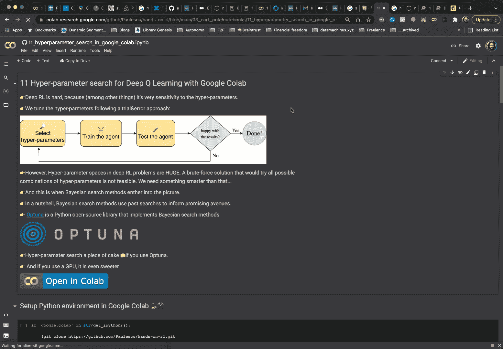
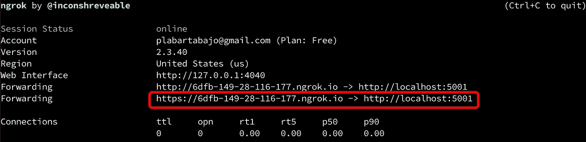

# 深度学习:更快、更好、免费，只需三个简单的步骤

> 原文：<https://towardsdatascience.com/deep-learning-faster-better-and-free-in-3-easy-steps-8ae2e1b932d5>

## 实践的 RL 课程间奏曲

厌倦了在你的笔记本电脑上以…一只乌龟的速度训练深度学习模型？[🐢](https://emojipedia.org/turtle/)

对购买昂贵的 GPU 或优化云服务账单不感兴趣？💸

希望有更好的方法来做这件事？

幸运的是，最后一个问题的答案是肯定的。这个珍贵的 GPU 会更快的训练你的深度学习模型。快多了。而且完全免费。

这篇文章既面向[动手 RL 课程](/hands-on-reinforcement-learning-course-part-1-269b50e39d08)的学生，也面向任何正在寻找更快训练循环的深度学习开发者。

让我们进入正题。


凯，海洋(图片由作者提供)

# 深度学习中的 GPU

GPU(图形处理单元)是深度学习取得巨大成功背后的关键硬件组件。GPU 加速神经网络训练循环，以适应合理的人类时间跨度。没有它们，深度学习是不可能的。

如果你想训练大型深度神经网络，你需要使用 GPU。但是，GPU 也**贵**💰。这意味着我们大多数人家里都没有。

当然，你可以使用像 GCP 或 AWS 这样的云服务来租用 GPU，但要冒着每月支付高额账单的风险。

那么问题是…

> 有没有办法让这个珍贵的 GPU…免费**得到**？

是的，有。让我告诉你怎么做。

# 解决方案:深度学习的谷歌实验室

Google Colab 是一项服务

👉🏽免费提供间隔时间长达 12 小时的 GPU，以及
👉🏽与 GitHub 库无缝集成。

考虑到这两个特性，我们可以用免费的 GPU 轻松地增强 GitHub 中任何 Jupyter 笔记本的性能。

我们将校准深度 Q 代理的超参数，这是一个相当昂贵的计算。

如果你想知道更多关于这个例子的细节，查看我的 [**强化学习课程**](http://datamachines.xyz/the-hands-on-reinforcement-learning-course/) 。这个笔记本是基于 课程的 [**第 6 部分，在这里我们训练一个深度 Q 智能体去解决来自 OpenAI 健身房的**](http://datamachines.xyz/2022/03/03/hyperparameters-in-deep-rl-hands-on-course/) **[**大车杆子**](https://gym.openai.com/envs/CartPole-v1/) 环境。**

[](/hyperparameters-in-deep-rl-f8a9cf264cd6)  

我们开始吧！

来吧，打开这个笔记本:

[👉🏽笔记本/11 _ hyperparameter _ search _ in _ Google _ colab . ipynb](https://github.com/Paulescu/hands-on-rl/blob/main/03_cart_pole/notebooks/11_hyperparameter_search_in_google_colab.ipynb)

并跟随这些 **3 个简单的步骤**。

## 第一步。在 Google Colab 中加载 Jupyter 笔记本

你可以从一个公共的 GitHub 库加载任何一个 Jupyter 笔记本到 Colab，只需点击一下。

*如何？*

一旦您提交并将笔记本推送到远程 GitHub 分支，您可以在如下 URL 下找到它:

> https://github.com/GITHUB_USER/REPO_NAME/path/to/file.ipynb

现在，如果你在浏览器上输入另一个网址

> https://colab . research . Google . com/GITHUB/GITHUB _ USER/REPO _ NAME/path/to/file . ipynb

你将会神奇地在这个 Jupyter 上安装 Google Colab。

手动键入 URL 不是最好的用户体验。但是，我们可以通过在我们最初的 Jupyter 笔记本上添加一个链接来轻松解决这个问题。

点击 [**此处**](https://github.com/Paulescu/hands-on-rl/blob/main/03_cart_pole/notebooks/11_hyperparameter_search_in_google_colab.ipynb) 打开 GitHub 中的笔记本。

如果你向下滚动一点，你会看到我添加了一个这样的按钮

[](https://colab.research.google.com/github/Paulescu/hands-on-rl/blob/main/03_cart_pole/notebooks/11_hyperparameter_search_in_google_colab.ipynb)

点击这里在 Google Colab 中打开笔记本(图片由作者提供)

点击它。链接的网址是我刚刚告诉你的格式，☝🏽。

将会打开一个浏览器选项卡，您将会看到一个与您的本地 Jupyter 服务器非常相似的界面。这是谷歌 Colab。实际上是前端应用。在后端，你连接到谷歌服务器上的一个运行时，让你执行 Python 代码。

现在，默认情况下，Google Colab 运行时只使用 CPU，而不使用 GPU。但是你可以很容易地改变它。让我们开始吧。

## 第二步。启用免费 GPU 加速

转到运行时>>更改运行时类型> > GPU。瞧啊。



将运行时改为 GPU(图片由作者提供)

您的运行时现在使用 GPU。甜食🍭。

## 第三步。安装 Python 依赖项

Google Colab 运行时安装了一些流行的 Python 包，如 PyTorch 或 TensorFlow。然而，要运行您的代码，您需要确保安装了所有正确的依赖项。

在笔记本顶部添加一个单元格，以便在 Colab 的环境中安装所有必需的包。

这就是这个设置的样子。

我们从 GitHub 获取代码，并从我们的文件中安装依赖关系。在这一步之后，Google Colab 可能会要求我们重新启动运行时。我们只需进入顶部菜单> >运行时> >重启运行时。

运行这个并重新启动运行时

然后执行第二个单元，将我们的本地文件夹`src`添加为本地 Python 包。

然后运行这个

就是这样。您有一个免费的 GPU 供您使用！

随意运行整个笔记本，并(可能)解决你的第一个深度强化学习问题😎。

# 奖金黑客集成 MLflow 与 Colab 🥷

这个主要是给我的学生看的，因为我们在 RL 实践课程中使用 MLflow 来跟踪所有的实验结果，但是请随意阅读。你永远不知道它什么时候能派上用场。

当我训练深度学习模型时，我喜欢使用开源的 [**MLflow**](https://www.mlflow.org/) 来跟踪所有的实验结果。但是，如果我在 Colab 上运行笔记本，如何登录到我的本地 MLflow 服务器？

有一个窍门。相当粗糙，但我喜欢它❤️.

它的名字是 [**ngrok**](https://ngrok.com/) **，**一个让你以一种安全的方式将你的本地电脑暴露给外部互联网的工具。

首先，从命令行本地启动 MLflow 跟踪服务器(如果已经使用了 5000，请调整端口号)

```
$ (venv) mlflow server --backend-store-uri sqlite:///mlflow.db --default-artifact-root ./artifacts --host 0.0.0.0 --port 5000
```

然后，安装 **pyngrok** ，这是一个用于 **ngrok** 的方便的 Python 包装器。

```
$ (venv) pip install pyngrok
```

并安全地公开 MLflow 服务器端口，我们在同一个端口上运行 MLflow 服务器

```
$ (venv) ngrok http 5000
```

将出现一个屏幕，显示 ngrok 为您的隧道生成的 URL。复制 URL 地址。



复制你在屏幕上看到的网址(图片由作者提供)

现在，如果你去 Colab 的笔记本，你可以把这个 URL 粘贴到那里:

运行笔记本的其余部分。

看到 MLflow 仪表盘再次接收实验数据，你会很惊讶。

# 下一步是什么？❤️

在下一讲中，我们将介绍一个新的深度 RL 算法家族，我们将解决一个新的环境。

敬请关注。

爱

# 想支持我吗？

你喜欢阅读和学习关于 ML、AI 和数据科学的知识吗？

无限制地访问我在 Medium 上发布的所有内容，并支持我的写作。

👉🏽今天使用我的 [**推荐链接**](https://pau-labarta-bajo.medium.com/membership) 成为会员。

[](https://pau-labarta-bajo.medium.com/membership)  

👉🏽订阅 [***datamachines* 简讯**](https://datamachines.xyz/subscribe/) **。**

👉🏽 [**跟着我**](https://medium.com/@pau-labarta-bajo) 上媒。

祝你愉快🤗

避寒胜地