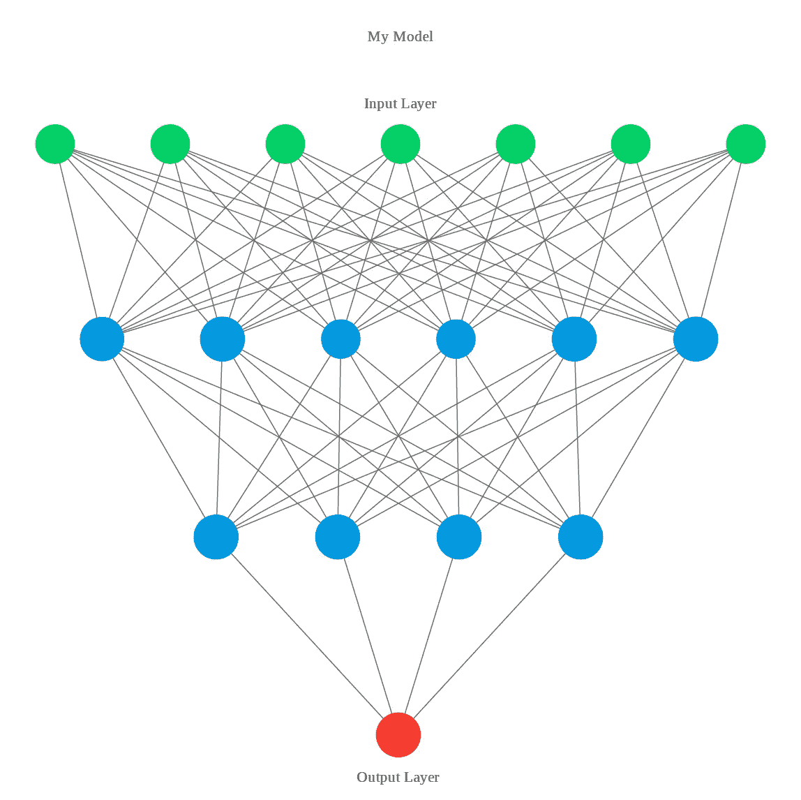
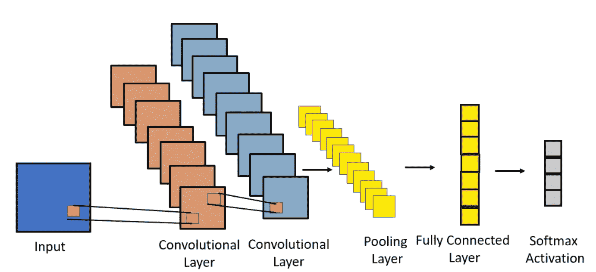
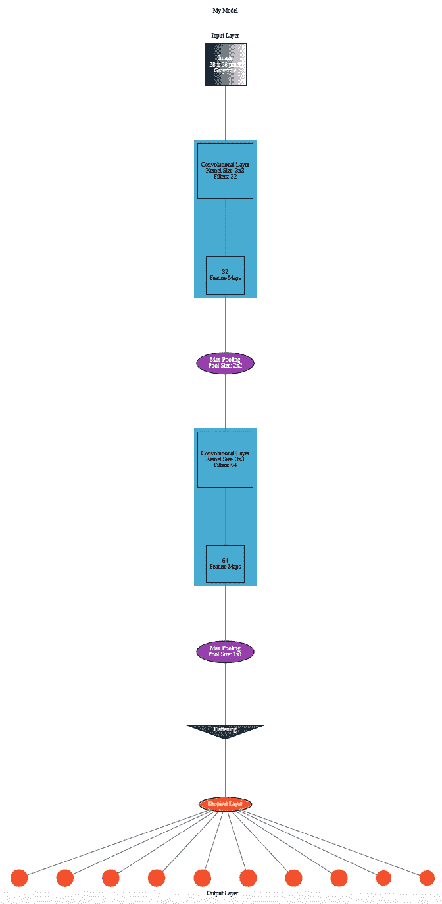
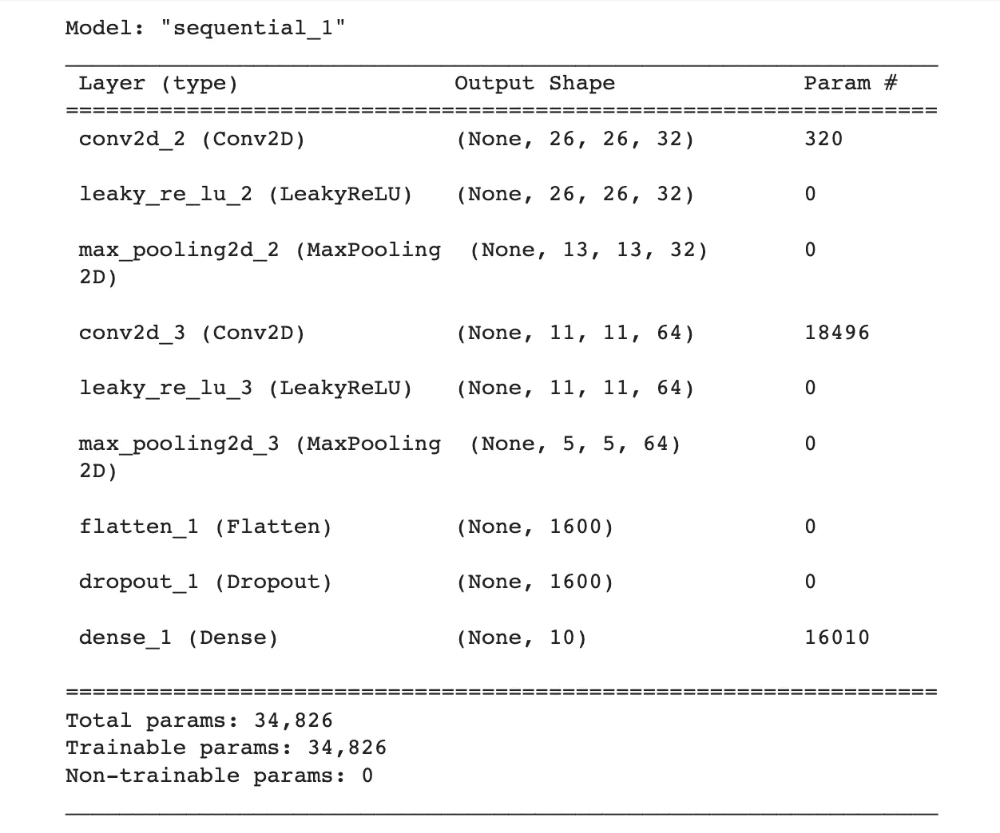
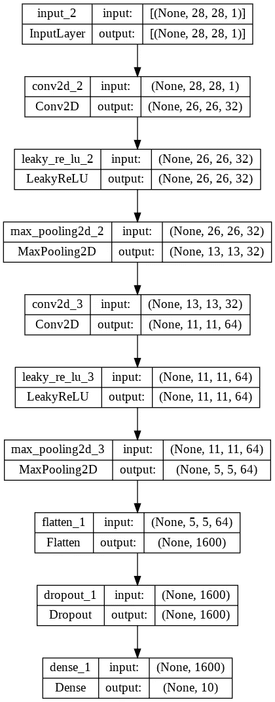
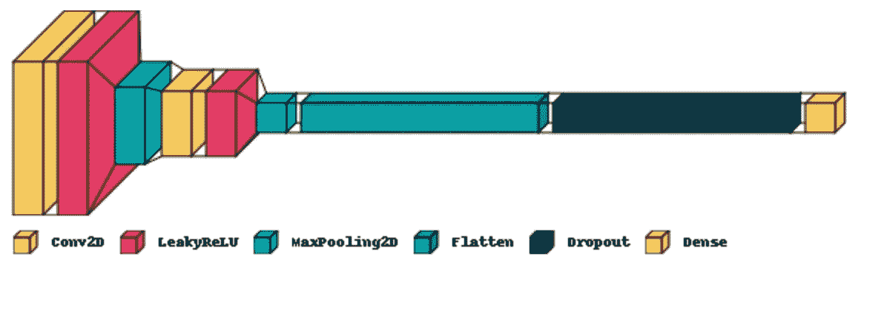

# 深度学习模型可视化工具:哪个最好？

> 原文：<https://towardsdatascience.com/deep-learning-model-visualization-tools-which-is-best-83ecbe14fa7>

## 为您的数据科学项目可视化您的下一个深度学习模型的不同方式。

* *注意:我与今天讨论的公司或 API 没有任何关系。*



图片来自作者

# 介绍

可视化很重要，原因有很多。它们有助于支持和巩固正文中的信息。你知道吗，人类不仅通过阅读和讲课来学习，他们还通过观察来学习。深度学习模型，即。神经网络很难用语言来描述。生成您创建的神经网络的可视化可以帮助读者完全理解和检查开发的模型。

我们今天要看的可视化深度学习模型的 5 个工具是:

1.  Microsoft Powerpoint
2.  人工神经网络可视化工具
3.  喀拉斯*。*总结()【方法
4.  Keras Utils 模型绘图功能
5.  Keras 视觉

# Microsoft Powerpoint

是的，第一个可视化深度学习模型的工具是微软 Powerpoint。我认为 Powerpoint 是创建深度学习模型可视化的一种选择，因为它的*可访问性、易用性、*和*灵活性*便于用户操纵和控制视觉效果。



在 PowerPoint 中创建的可视化效果(图片来自作者)

## 赞成的意见

如前所述，微软 Powerpoint 的优点在于其*可访问性、易用性、*和*灵活性。*

1.  **可访问性** -任何在电脑上运行微软产品的人都可以访问 Powerpoint。
2.  **易用性** -该应用程序也非常“尖尖的”。基本上，要创建可视化效果，您需要做的就是添加形状和文本框。在那里，你可以定义它们的物理特性，制作出独一无二的最终产品。这与 Powerpoint 的灵活性紧密相关。
3.  **灵活性**-Powerpoint 中有如此多不同的特性，允许你创建你想要的模型的几乎任何表示。

# 骗局

1.  创建一个非常详细的可视化效果可能需要很长时间。
2.  Powerpoint 仍然受限于你想要创建的可视化的抽象程度。
3.  Powerpoint 不像我们今天看到的其他包那样与 Python 中创建的模型交互。

# 人工神经网络可视化工具

下一个可视化工具是 ANN Visualizer API。这个工具你需要做的就是*运行一行代码*来打印你的模型，然后你就可以访问它创建的图像了。

```
# !pip install graphviz
import graphviz
model = Sequential()
model.add(layers.Convolution2D(32,3,3,input_shape=(28,28,1),activation= layers.LeakyReLU()))
model.add(layers.MaxPooling2D(pool_size=(2, 2)))
model.add(layers.Convolution2D(64,3,3,activation=layers.LeakyReLU()))
model.add(layers.MaxPooling2D(pool_size=(1, 1)))
model.add(layers.Flatten())
model.add(layers.Dropout(0.5))
model.add(Dense(units=10, activation='softmax'))

ann_viz(model , view=True, title= 'My Model', filename = 'output.gv')
```

运行这段代码后，API 输出下图供您个人使用。



人工神经网络 API 图像(图像来自作者)

## 赞成的意见

1.  创建模型的高分辨率图像。
2.  构建图形结构的模型，使用户很容易看到所有不同的连接。
3.  易于理解的视觉效果。
4.  提供深度学习模型每一层的参数数量。

## 骗局

1.  我不得不将我的模型的格式更改为 blocked layers(它不接受我在所有其他示例中使用的其他格式)
2.  不容易访问(在 Colab 中),它将文件保存为. gv 文件

# 喀拉斯。summary()方法

如果你在 Keras 中创建一个模型，你可以使用*。summary()* 方法打印出您的模型，并获得它所包含内容的概要。

```
model = keras.Sequential(
    [
        keras.Input(shape=input_shape),
        layers.Conv2D(32, kernel_size=(3, 3)),
        layers.LeakyReLU(),
        layers.MaxPooling2D(pool_size=(2, 2)),
        layers.Conv2D(64, kernel_size=(3, 3)),
        layers.LeakyReLU(),
        layers.MaxPooling2D(pool_size=(2, 2)),
        layers.Flatten(),
        layers.Dropout(0.5),
        layers.Dense(num_classes, activation="softmax"),
    ]
)

model.summary()
```



喀拉斯。summary()方法(图片来自作者)

## 赞成的意见

1.  如果您正在 Keras 中创建模型，将为您提供一个快速摘要。
2.  明确显示每个模型层中不同数量的参数。(甚至列出了可训练参数的总数)。
3.  清楚地定义了每一层。

## 骗局

1.  仅适用于使用 Keras 开发的车型。
2.  对于书面报告来说，不会产生视觉上吸引人的输出。
3.  输出中没有交互组件。
4.  没有颜色。

# Keras Utils 模型绘图功能

Keras Utils 模型绘图功能比*高了一步。*方法总结()。它用一行代码*创建了一个更具视觉吸引力的模型概述。*

```
from keras.utils.vis_utils import plot_model

#Your Model code here use the Keras Sequential Architecture

plot_model(model, to_file='model_plot.png', show_shapes=True, show_layer_names=True)
```



Keras Util 模型绘图功能(图片来自作者)

## 赞成的意见

1.  比 Keras *更视觉化。*总结()方法。
2.  清楚地说明输入和输出尺寸大小。
3.  可以在一行代码中完成。

## 骗局

1.  不能产生最具视觉吸引力的图像(没有颜色！).
2.  必须用于 Keras 模型。

# 视觉角膜

在今天讨论的三种不同的 Keras 方法中，可视化 Keras 方法在视觉上是最吸引人的！就像其他方法一样，这可以在一行代码中完成。

```
model = keras.Sequential(
    [
        keras.Input(shape=input_shape),
        layers.Conv2D(32, kernel_size=(3, 3)),
        layers.LeakyReLU(),
        layers.MaxPooling2D(pool_size=(2, 2)),
        layers.Conv2D(64, kernel_size=(3, 3)),
        layers.LeakyReLU(),
        layers.MaxPooling2D(pool_size=(2, 2)),
        layers.Flatten(),
        layers.Dropout(0.5),
        layers.Dense(num_classes, activation="softmax"),
    ]
)

visualkeras.layered_view(model, legend=True,to_file = '/content/gdrive/MyDrive/output.png').show()
```

如果您不想要下图所示的图例，也可以说 *legend=False* 。



视觉 Keras 模型(图片来自作者)

## 赞成的意见

1.  为 Keras 模型创建视觉上吸引人的图像。API 详细描述了每个层，并根据它们在模型中的大小以不同的长度显示它们。
2.  与其他两个 Keras 函数不同，该 API 为视觉效果添加了颜色。

## 骗局

1.  仅适用于 Keras 车型。
2.  没有给出与每层相关的各种超参数(即每层的输入和输出尺寸)。
3.  它使不同类型的层颜色相同，这可能是非常混乱的(卷积层与上面图像中的致密层颜色相同)。

# 结论

哪种可视化工具最好的最终结论是…？

**看情况！**

如果你想*控制可视化效果的所有方面*，就用*微软的 PowerPoint* 。代价是你将花费更多的时间和精力来创建可视化。 *ANN Visualizer* 是一个伟大的工具，用于*显示深度学习模型*的流程，同时使图形视觉上具有娱乐性。我在 visualizer API 上遇到的最大问题是，我必须在 Keras 中更改我的神经网络的设置。

如果深度学习模型是用 Keras 和*开发的，你想快速总结一下模型*，就用 *Keras。*方法总结()。这个工具的缺点是摘要在视觉上没有吸引力，也不是书面报告的最佳选择。 *Keras 的 utils 模型绘图功能*可能比*更优。summary()* 方法，但请记住，它仍然不是一个直观的图像，也没有列出可训练的参数。

如果您想用 Keras 创建一个读者更容易注意到的图像，请使用 Visual Keras。V *isual Keras 为深度学习模型增加了大小和颜色，这将获得用户的注意，并清楚地定义了模型的架构。*一个警告是，Visual Keras 没有列出与深度学习模型的每一层相关联的值。

如果你喜欢今天的阅读，请关注我，让我知道你是否还有其他想让我探讨的话题！如果你还没有介质账号，就通过我的链接 [**这里**](https://ben-mccloskey20.medium.com/membership) **报名吧！另外，在**[**LinkedIn**](https://www.linkedin.com/in/benjamin-mccloskey-169975a8/)**上加我，或者随时联系！感谢阅读！**