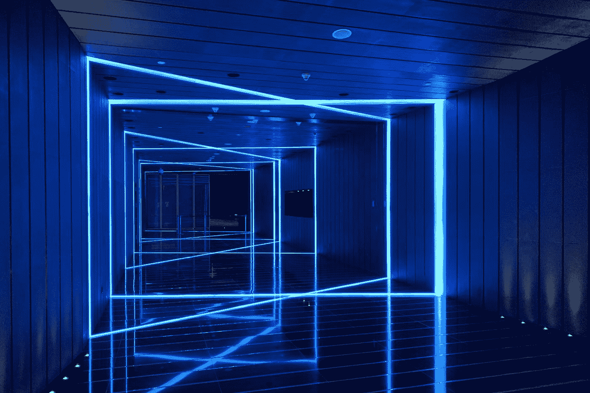
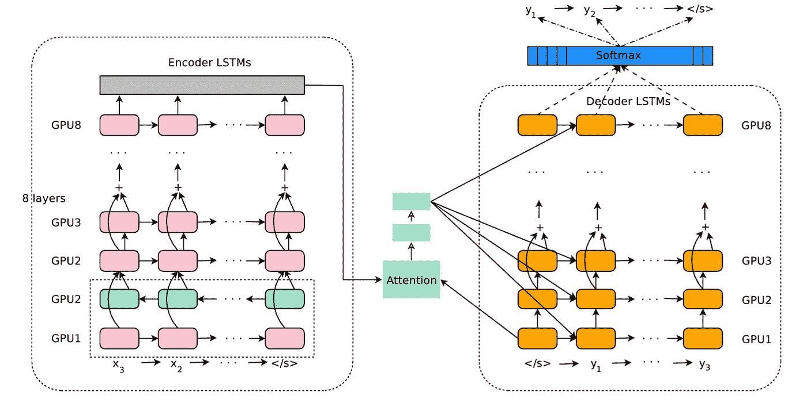
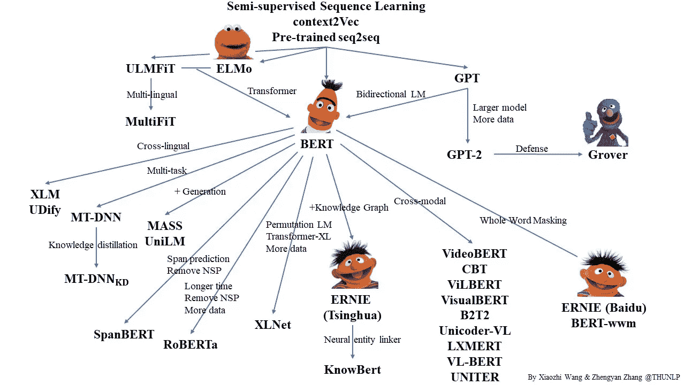
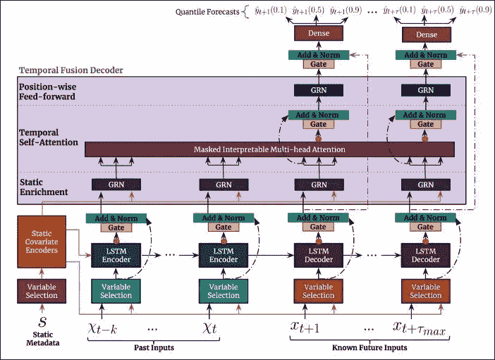
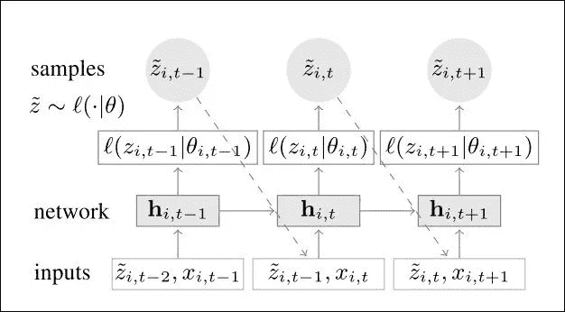
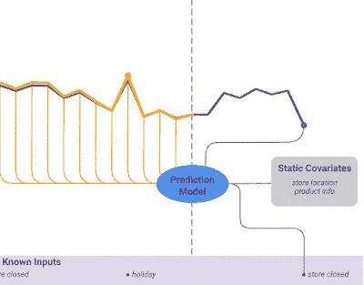
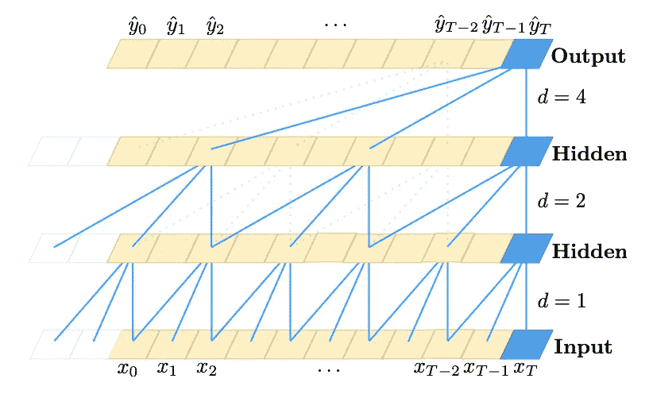
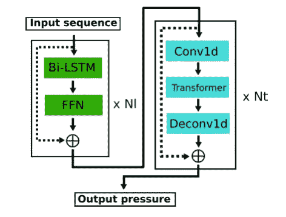

# 深度学习:不，LSTMs 没有死！

> 原文：<https://towardsdatascience.com/deep-learning-no-lstms-are-not-dead-20217553b87a>

## 如果他们都死了，为什么他们还能赢得 Kaggle 比赛？

里卡多·L 在 [Unsplash](https://unsplash.com?utm_source=medium&utm_medium=referral) 上的照片

**在过去十年中，谁一直在密切关注机器学习领域？**

这样做的人见证了前所未有的科学的革命性进步。这就像 20 世纪初，爱因斯坦的论文成为量子力学的基础。只是这一次，是 [AlexNet 论文](https://proceedings.neurips.cc/paper/2012/file/c399862d3b9d6b76c8436e924a68c45b-Paper.pdf)【1】，一个挑战计算机视觉的架构，重新点燃了人们对机器学习(后来转化为深度学习)的兴趣。

这种无情增长的警告是**很难正确评估每一个突破**:在一个新功能被引入并开始普及之前，另一个功能会出现——更强大、更快或更便宜。巨大的增长带来了太多的宣传，吸引了许多新来者，他们往往热情高涨，但经验不足。

深度学习领域中一个被误解的突破是**递归神经网络**家族。如果你在谷歌上搜索诸如**“lstm 死了”**和**“RNNs 已经死了”**这样的短语，你会发现大量的结果，其中大部分都是[不正确的](/the-fall-of-rnn-lstm-2d1594c74ce0)或者[没有给出完整的画面](https://www.youtube.com/watch?v=S27pHKBEp30)。本文将向您展示递归网络仍然是相关的，并在许多实际场景中找到用途。

> 但是首先，我会给你历史背景来理解为什么大多数人相信相反的事情。还有，这篇文章并不是只说*lstm*和*变形金刚*。您还将学习如何不带偏见地评估数据科学中的一个概念。

# **输入 LSTMs**

> 每个大型科技公司都采用 LSTMs 没有 LSTMs 就没有 NLP 研究。

[*长短期记忆网络*—lst ms](http://www.bioinf.jku.at/publications/older/2604.pdf)【2】于 2014 年开始起飞，尽管它们早在 1997 年就被引入。它们属于 [*递归神经网络家族——RNNs【3】*](https://apps.dtic.mil/dtic/tr/fulltext/u2/a164453.pdf)，以及[门控递归单元——GRU](https://arxiv.org/abs/1409.1259)【4】。

随着 GPU 的可访问性和第一个深度学习框架的出现， *LSTMs* 成为主导 *NLP* 领域的最先进模型。2013 年**单词嵌入**的发现也有助于建立**迁移学习的机制**。事实上，当时几乎任何一个 *NLP* 任务的标准组件都是:a) *预训练单词嵌入*，b)*lstm*和 c)[*序列到序列*架构](https://arxiv.org/abs/1409.3215)【5】。

那个时期的每个数据科学家都会同意**lstm 统治了 NLP 领域**:它们被用于语音识别、文本到语音合成、语言建模和机器翻译。每一家大型科技公司都欣然接受了它们；没有*lstm*就没有 NLP。

谷歌为**机器翻译**创造的最佳模型之一如图**图 1** 所示:

**图 1** :谷歌神经机器翻译——GNMT 架构([来源](https://arxiv.org/pdf/1609.08144.pdf))

这个在[6]中引入的复杂模型是谷歌翻译服务的幕后推手。**与之前的产品相比，它减少了 60%的翻译错误。**如你所见，它大量使用了*lstm*，形成了著名的*编码器-解码器*拓扑(包括一个*双向 LSTM* )。

这种实现还利用了***的机制，允许模型根据需要关注输入序列的相关部分。这显示在图 1 的**中，**其中使用**注意力分数**对编码器的顶部向量进行加权。换句话说，每个时间步的每个单词都用一个可学习的分数加权，以最小化错误。更多信息，请查看这篇[文章](https://smerity.com/articles/2016/google_nmt_arch.html)，或者更好地阅读[原文](https://arxiv.org/abs/1609.08144)【5】。***

***然而，LSTMs 有两个主要缺点。它们在训练期间不容易并行化。
2。由于它们的循环性质，它们可以模拟的序列长度是有限的。***

***但稍后会详细介绍。***

# ***输入变压器***

> ***rnn 是顺序模型，这意味着单词是按顺序处理的。但是转换器并行处理所有的单词。***

***2017 年，谷歌推出了[*Transformer*](https://arxiv.org/abs/1706.03762)【7】**架构，这是 NLP 生态系统的一个里程碑。这款新机型通过提出**多头注意力**机制，对*注意力*进行了更深入的研究，该机制:*****

*   *****充分利用**的自我关注**，从而实现**优越的性能**。*****
*   *****采用模块化结构，使繁重的矩阵运算更加并行化。也就是说，**运行速度更快，可扩展性更好。*******

*****然而，在*转换后的*模型中没有使用*lstm*。即使在上下文信息很重要的第一层(并且*lstm*可能有用)， *Transformer* 论文提出了一种不同的机制，称为**位置编码**。这也揭示了两类模型的主要区别:***rnn*是顺序模型**，意思是单词按顺序处理。但是 ***变压器*并行处理所有字**。这大大减少了培训时间。*****

*****从那以后， *Transformer 的*核心理念一直是语言处理进一步研究的基础，催生了新的变种。这些如**图 2 所示。*******

**********

*******图 2** :开源变压器家族([来源](https://github.com/thunlp/PLMpapers)*****

# *****别忘了时间序列！*****

******lstm*和*变形金刚*都非常擅长模拟序列信息。因此，它们也可以应用于**时间序列预测**的情况。*****

> ******如果你对时间序列预测感兴趣，可以查看我的* [*最佳深度学习预测模型列表*](/@nikoskafritsas/list/timeseries-deep-learning-ultimate-collection-3955c636a768) *。******

## *******传统统计赢得第一轮*******

*****然而，实验结果表明，在准确性方面，他们并不能决定性地胜过传统的统计方法(如 *ARIMA* )。另一方面，**统计方法和基于 rnn 的方法的结合更加有效**。一个这样的例子是由**优步**建造的 [ES-RNN](https://eng.uber.com/m4-forecasting-competition/) 模型，它最终赢得了 M4 竞赛:它是一个混合模型，在*扩张 LSTM 的基础上使用*指数平滑*。******

*****自然地，变压器*受到了考验。对于时间序列预测，最常见的方法如下:使用原始的*转换器*，并用 [Time2vec 层](https://arxiv.org/pdf/1907.05321.pdf)替换*位置编码层*。**但是*变压器*模型都无法超越统计方法**。******

*****此外，我想澄清几件事:*****

*   *****这并不意味着统计方法总是更好。例如，如果有大量数据，LSTMs 可能会比 ARIMA 表现得更好。*****
*   *****统计方法需要更多的数据预处理:这可能包括使时间序列平稳(如果不是)，消除季节性，波动性，等等。 *LSTMs* 可以更容易地捕捉到序列的自然特征，至少是通过使用更简单的技术。*****
*   *****此外，统计方法不太通用:例如，自回归方法不能处理未来未知的额外特征。*****

*****底线是 **ML 方法在预测能力方面并不总是比统计方法**更好。*****

## *****深度学习赢得第二轮*****

*****直到 2018-2019 年，研究才有了回报，深度学习模型开始在时间序列预测任务中变得更具竞争力。关于时间序列预测和深度学习的更全面的分析，请查看这篇[文章](/the-best-deep-learning-models-for-time-series-forecasting-690767bc63f0):*****

*****图 3**和图 4**中显示了两种最先进的模型。分别描绘了 [**谷歌的** *时态融合变压器*](https://arxiv.org/pdf/1912.09363.pdf) 和[**亚马逊的** *DeepAR*](https://arxiv.org/pdf/1704.04110.pdf) 的架构。注意到什么有趣的事了吗？*****

*****

**图 3:** 颞融合变压器([来源](https://arxiv.org/pdf/1912.09363.pdf))***** **********

*******图 4:** DeepAR 模型架构([来源](https://arxiv.org/pdf/1704.04110.pdf))*****

*****嗯，这些模型有很多有趣的地方，但最重要的一点是**与文章主题**产生共鸣的是:*****

*******两种型号都采用了 LSTMs！但是怎么做呢？*******

******DeepAR* 是一个结合了自回归和深度学习特性的复杂时间序列模型。**图 4** 显示的`h_i,t`向量实际上是 *LSTM* 单元的隐藏状态。这些隐藏状态然后被用于计算高斯分布的`μ`和`σ`参数。从该分布中，选择`n`个样本，其中值代表预测值。*****

******时间融合转换器——TFT*是一个多层的、纯深度学习的时间序列模型。这个模型既有一个 ***LSTM* 编码器-解码器**也有一个**新颖的注意力机制**提供可解释的预测。我们不会在这里深究这个模型的细节——查看这篇[惊人的文章](/the-best-deep-learning-models-for-time-series-forecasting-690767bc63f0)，它提供了一个彻底的解释。*****

*****底线是，这两种深度学习模型都优于传统的统计方法。此外，这两种模型都更加通用，因为它们可以处理多个时间序列，并接受更丰富的功能集(TFT 略胜一筹)。*****

## *****复发和注意力是如何相关的*****

*****为了说明这一点，我们将强调 TFT 白皮书中的一段摘录:*****

> *****为了学习不同尺度下的时间关系，TFT 使用**递归层进行本地处理**，使用可解释的**自我关注层进行长期依赖**。*****

*****考虑到目前为止我们所知道的，以及上面的摘录，我们现在可以将这些点联系起来:*****

> *****递归网络擅长捕捉序列的局部时间特征，而注意力更擅长学习长期动态。*****

*****这不是一个武断的结论。 *TFT* 论文的作者通过执行所谓的**消融分析来证明这一点:**在这种类型的分析中，我们移除或替换复杂机器学习系统的某些组件，以了解每个组件的贡献。*****

******TFT* 的作者测试了 *LSTM 编码器-解码器*层，以及其他组件:他们通过用原始*变压器*的标准*位置编码层*来替换它。他们发现了两件事:*****

1.  *******利用*序列到序列*层有助于模型的性能。*******
2.  *******在执行基准测试的 5 个数据集的 4 个中， *LSTM* 层实现了更高的性能。*******

*****因此，我们可以有把握地得出结论， *LSTM* 层仍然是时间序列深度学习模型中非常宝贵的组件。而且，**它们不会对抗*注意力*机制**。相反，它们仍然可以与基于注意力的组件相结合，以进一步提高模型的效率。*****

## *******lst ms 的隐藏宝石:条件输出*******

*****这是 *LSTMs* 最容易被忽视的优点之一，许多数据科学从业者仍然没有意识到这一点。*****

*****如果您一直在使用普通的递归网络，您会知道这种类型的网络只能处理时态数据——这些数据被表示为相互之间有各种依赖关系的序列。但是，它们不能直接对静态元数据或时不变数据建模。*****

*******在自然语言处理中，静态元数据是不相关的。**相反，NLP 模型专注于单词的词汇表，其中每个单词都由一个嵌入表示，这是整个模型中的一个统一概念。每个单词来自哪种类型的文档并不重要，只要 NLP 模型能够学习每个单词的正确的**上下文感知表示** **。记住，一个特定的单词可以有不同的嵌入，这取决于它的意思和它在句子中的位置。*******

*****然而，在时间序列模型中，时不变数据具有更大的影响。例如，假设我们有一个涉及商店产品的销售预测场景。产品的销售量可以建模为时间序列，但它也会受到节假日等外部因素的影响。**所以，一个好的预测模型也应该考虑那些变量。**这就是 *TFT* 的作用(见**图 5** )。但是 *TFT* 是如何实现的呢？*****

*****

**图 5:** 外部静态变量对预测的影响([来源](https://blogger.googleusercontent.com/img/a/AVvXsEjn-GEpuwiBa4Od21FBnTST8-z2jAgyw3rq68AYtrBosFLBgIaFnLC2NV8hwlj8xiuU4Bc5ZKNHrDPldINdgkr8Y2TmekuDp0oLKq9yYCrpooZfwpwKT9MVwQ11LGsXqBckgiPAxoWRdvxAE3RoRn4BHxVhJmnQkZT-w6DdYXEA3yP0xUSdbYDITSgOjQ=s1138))***** 

*****TFT 被专业地设计来集成静态元数据。它使用了各种技术，在原始文件中有描述。然而，最重要的一点与 LSTMs 有关。*****

******LSTMs* 可以无缝地执行这项任务，使用的是【11】中首次介绍的技巧:不是将初始`h_0`隐藏状态和 *LSTM* 的单元格状态`c_0`设置为 0(或随机)，而是用我们选择的指定向量/嵌入来初始化它们。或者我们可以在拟合期间使这些向量可训练(实际上， *TFT* 就是这么做的)。以这种方式，**LSTM 单元的输出适当地取决于外部变量**，而不影响其时间相关性。*****

*******LSTMs vs TCNS*******

*****在*关注*和*变形金刚*出现之前，又出现了一个承诺改变风景的新颖模型。这些就是所谓的**时间卷积网络——TCN。*******

> ******TCN*使用扩张卷积，在不同长度的输入序列上应用填充——使它们能够检测不仅彼此接近而且位置完全不同的项目之间的依赖关系。*****

******TCNs* 于 2016 年[12]首次推出，并于 2018 年[13]正式化，利用卷积网络对基于序列的数据进行建模。自然，他们也是时间序列预测任务的理想候选人。*****

**********

*******图 6:** 滤波器大小 k = 3，膨胀因子 d = 1，2，4 的膨胀卷积。感受野可以覆盖来自输入序列的所有数据点`x_0...x_T`。([来源](https://arxiv.org/pdf/1803.01271.pdf))*****

******TCNs* 的“秘密武器”就是**膨胀卷积**，如图**6 所示。**标准 CNN 使用固定大小的核/过滤器，因此它们只能覆盖紧邻的数据元素。相比之下，***TCN*使用扩展卷积，在不同长度的输入序列上应用填充**——使它们能够检测不仅彼此接近而且位置完全不同的项目之间的依赖关系。*****

*****除此之外，他们还使用其他技术，如*剩余连接*，这现在是深度网络的标准。同样，我们不会深究细节(在一篇新文章中会有更多的内容)。相反，我们将关注与*lstm*的不同之处:*****

*   *******速度:**一般来说，*TCN*比*lstm*快，因为它们使用卷积，可以并行完成。在实践中，通过使用大量的扩展，并考虑到剩余连接， *TCNs* 可能会变得更慢。*****
*   *******输入长度:**两个*TCN*和*lstm*都能够接受可变长度的输入。*****
*   *******内存:**平均而言，TCN 比 *LSTMs* 需要更多内存，因为每个序列都由多个扩展层处理。同样，这取决于定义每个模型复杂程度的超参数。*****
*   *******性能:**最初的论文显示 *TCNs* 优于 *LSTMs* 。然而，在实践中，情况并非总是如此。[13]中更详尽的研究表明，在某些任务中*TCN*更好，而在其他任务中*lstm*更有效。*****

*******换句话说，这里没有明确的赢家**。两种模式各有利弊。最好的方法是对两者进行评估，看看哪一个最适合你的情况。*****

*****但是请注意，这种方法现在已经过时了。除非你的案例非常琐碎，否则你不会通过应用单一的 *TCN* 或 *LSTM* 模型来实现最先进的性能。现代案例考虑了更多的外部参数，这需要一种更具挑战性的方法。这又意味着必须使用不止一个组件/模型。这将在下一节更好地解释。*****

*******深度学习和 Kaggle 中的时间序列*******

*****到目前为止，我们一直从学术的角度来评估单个模型。然而，如果我们要形成一个更详细的观点，就不能忽视实际方面。*****

*****一个很好的评估基础是 **Kaggle** ，它间接提供了关于数据科学领域状态的经验证据。我们将关注最近的一场 Kaggle 比赛， [**呼吸机压力预测**](https://www.kaggle.com/c/ventilator-pressure-prediction) **。**任务是在给定控制输入序列的情况下，预测机械肺内的压力序列。每个训练实例可以被认为是一个自己的时间序列，因此使任务成为一个多时间序列的问题。*****

*****本次比赛极具挑战性，原因有三:*****

1.  *****竞争问题可以表述为回归和分类任务。*****
2.  *****数据集为创造性特征工程敞开了大门。*****
3.  *****鉴于每个受试者/数据点由不同的序列表示，利用统计模型是不可行的。*****

*****现在，对于这篇文章的主题，关于这个完成有 2 件有趣的事情:*****

*   *******前三名团队以及许多其他团队在其最终解决方案**中至少使用了一个*LSTM*组件(例如*堆叠 lstm*、*双向 lstm*)。*****
*   *******获胜团队提交了一个** [**多级深度架构**](https://www.kaggle.com/shujun717/1-solution-lstm-cnn-transformer-1-fold) **，其中包括一个 *LSTM* 网络和一个*变压器*模块。**该架构如图**图 7:** 所示*****

**********

*******图 7:** 第一名解决方案的架构([来源](https://github.com/Shujun-He/Google-Brain-Ventilator))*****

*****当然，这支队伍运用了许多其他的技巧来帮助他们获胜。这里重要的是，非平凡数据集可以从许多不同的方面进行分析，因此需要更复杂的解决方案。由于每个模型都有其独特的优势和劣势，您不能将自己局限于单一模型或单一方法。*****

# *****卷积神经网络的命运*****

*****我希望这篇文章对 *LSTMs* 的价值做了很好的论证。然而，毫无疑问，《变形金刚》是机器学习领域的一个惊人突破。这种程度的成功必然会导致将来更高的采用水平。*****

*****2020 年，变形金刚被改编为计算机视觉，诞生了 [***【视觉变形金刚(ViT)***](https://arxiv.org/abs/2010.11929) 。那篇论文引发了进一步的研究，最终这个经过额外修改的新模型能够在许多图像分类任务中胜过 CNN。更好的是，研究人员发现将两种成分结合起来会有更好的效果。此外，我们将来会看到更多的 ViTs。*****

*****所以，我希望这一次我们避免诸如“**CNN**之死”或者“**CNN**之陨落”之类的豪言壮语的快感。*****

# *****结束语*****

*****简而言之，本案例研究讨论了以下几点:*****

*   *****要正确评估机器学习领域的突破所带来的影响几乎是不可能的。*****
*   ******变形金刚*的出现重塑了景观:*lstm*，尤其是在 NLP 不再是关注的焦点。*****
*   *****关于时间序列，lstm 更有用。它们的好处是相当可观的。*****
*   *****数据科学中的现代(且有趣)挑战涉及多个领域，例如音频、文本、图形等。这反过来需要结合各种方法/模式来应对这些挑战。*****

*******感谢您的阅读！*******

# *****参考*****

1.  *****Alex 等人，“[使用深度卷积神经网络的 ImageNet 分类](https://proceedings.neurips.cc/paper/2012/file/c399862d3b9d6b76c8436e924a68c45b-Paper.pdf)”(NIPS，2012 年)*****
2.  *****Hochreiter 等人，“[长短期记忆](http://www.bioinf.jku.at/publications/older/2604.pdf)”(《神经计算》，1997)*****
3.  *****Rumelhart 等人[通过错误传播学习内部表征](https://apps.dtic.mil/dtic/tr/fulltext/u2/a164453.pdf)(1985 年 9 月)*****
4.  *****Kyunghyun 等人[关于神经机器翻译的性质:编码器-解码器方法](https://arxiv.org/abs/1409.1259)*****
5.  *****Sutskever 等人 2014 年，[用神经网络进行序列对序列学习](https://arxiv.org/abs/1409.3215) (2014 年)*****
6.  *****吴永辉等[谷歌的神经机器翻译系统:弥合人与机器翻译的鸿沟](https://arxiv.org/abs/1609.08144) (2016)*****
7.  *****A.瓦斯瓦尼等人[关注是你所需要的全部](https://arxiv.org/abs/1706.03762)，2017 年 6 月*****
8.  *****赛义德·迈赫兰·卡泽米等人 [*Time2Vec:学习时间的一种矢量表示*](https://arxiv.org/pdf/1907.05321.pdf) *，*2019 年 7 月*****
9.  *****Bryan Lim 等人，[用于可解释的多时域时间序列预测的时间融合转换器](https://arxiv.org/pdf/1912.09363.pdf)(国际预测杂志，2021 年 12 月)*****
10.  *****D.Salinas 等人， [DeepAR:用自回归递归网络进行概率预测](https://arxiv.org/pdf/1704.04110.pdf)，国际预测杂志(2019)。*****
11.  *****安德烈·卡帕西，李菲菲，[用于生成图像描述的深度视觉语义对齐](https://arxiv.org/abs/1412.2306)*****
12.  *****Lea 等 [*用于动作分割和检测的时态卷积网络*](https://arxiv.org/pdf/1611.05267.pdf) ( *CVPR* 2017)*****
13.  *****白等， [*序列建模通用卷积和递归网络的实证评估*](https://arxiv.org/pdf/1803.01271.pdf) *(2018)******
14.  *****Dosovitskiy 等著， [*一幅图像抵得上 16x16 个字:变形金刚在尺度上的图像识别*](https://arxiv.org/abs/2010.11929) *(2020)******