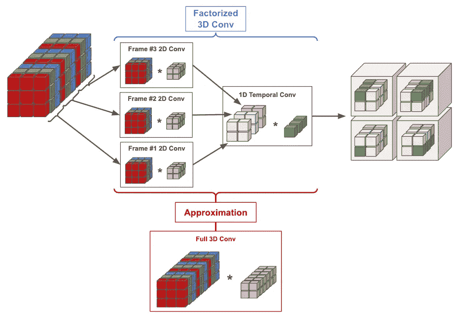
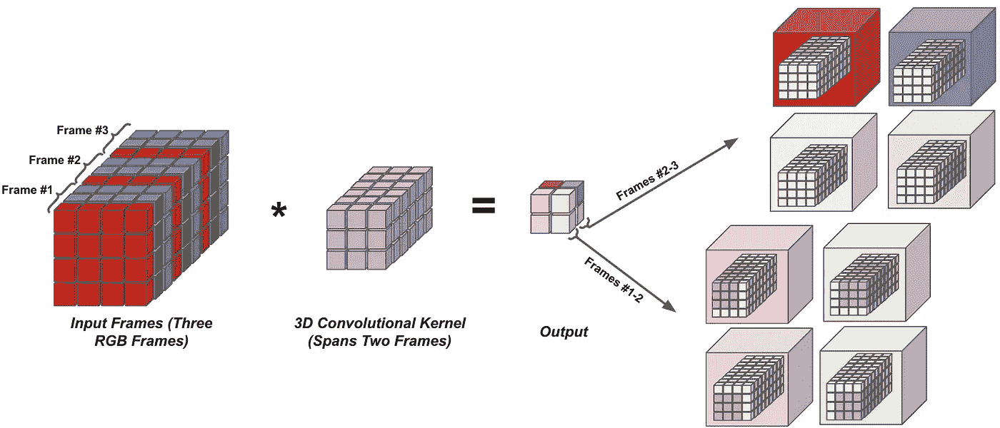
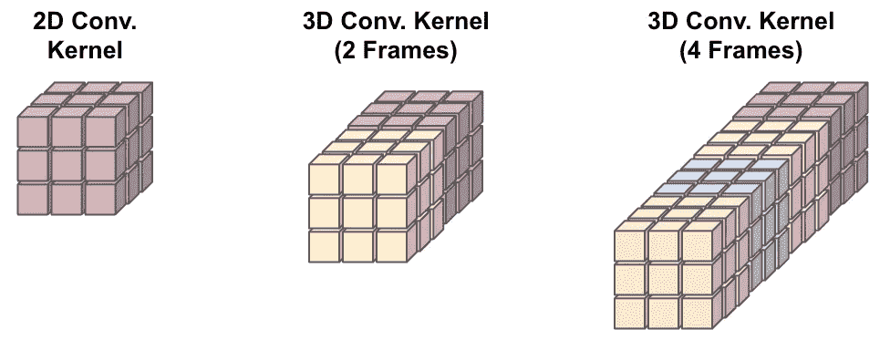
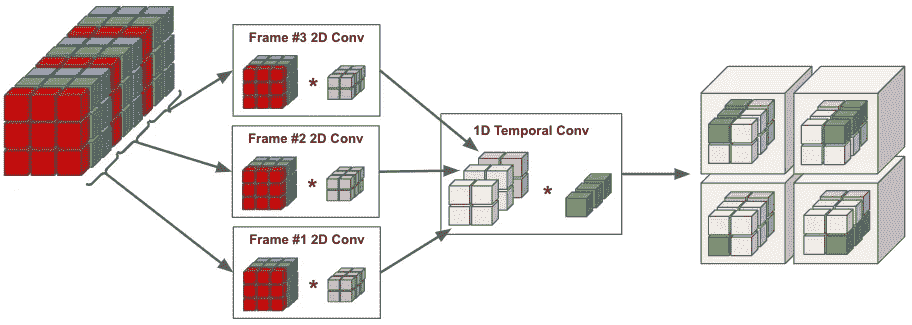
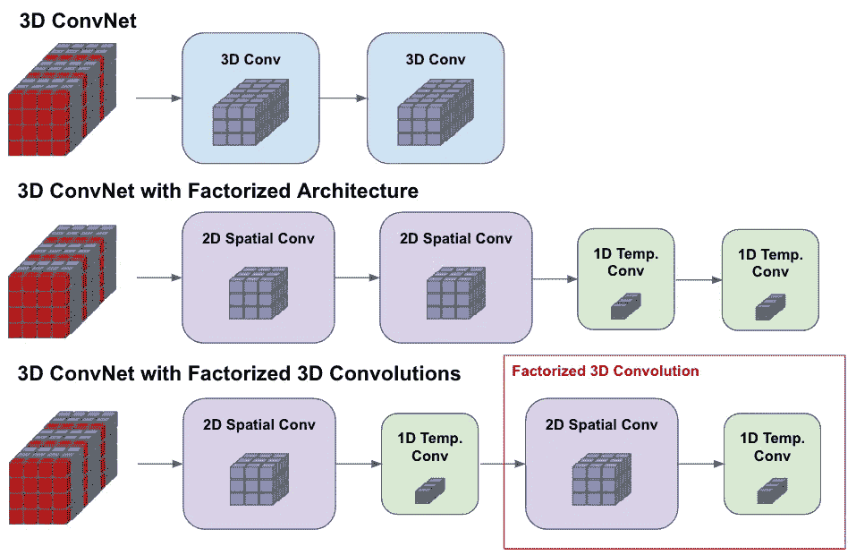
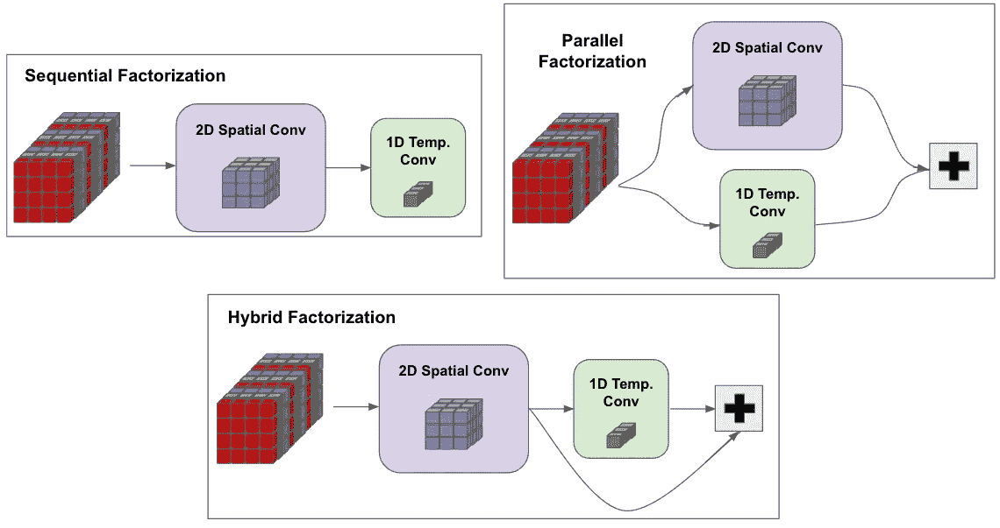
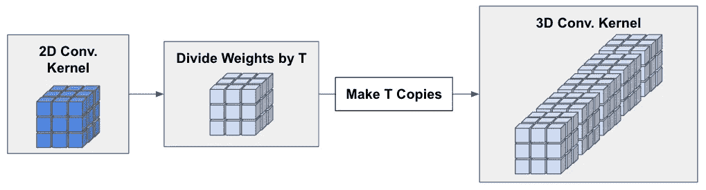

# 视频深度学习(第三部分):深入研究 3D CNNs

> 原文：<https://towardsdatascience.com/deep-learning-on-video-part-three-diving-deeper-into-3d-cnns-cb3c0daa471e>

分解的 3D 卷积运算(由作者创建)

这篇文章是我的视频深度学习方法系列的第三篇，是我在 Alegion 作为一名研究科学家的工作的一部分。这一系列博客文章的目标是概述视频深度学习的历史，并为希望涉足该领域的研究人员或从业人员提供相关背景。鉴于视频数据在实际场景中的大规模增长(如物联网视频、自动驾驶汽车和社交媒体应用)，分析具有时间结构的视觉数据(如视频)变得越来越重要——简单地从单个图像或帧中提取有用的信息往往是不够的[1]。

在本系列的前两篇文章中，我概述了[最初基于深度学习处理视频数据的努力](/deep-learning-on-video-part-one-the-early-days-8a3632ed47d4)，以及广泛使用的[双流网络架构](/deep-learning-on-video-part-two-the-rise-of-two-stream-architectures-f830d5c655d0)，它彻底改变了视频深度学习的使用。在这篇文章中，我将进一步深入 3D 卷积神经网络(CNN)——基于图像的 2D CNN 在视频领域的直接延伸。这些网络最初未能引起研究界的兴趣，因为与之前概述的双流网络相比，它们的性能很差。然而，随后的研究大大提高了他们的数据效率(即网络需要多少数据才能良好运行)和整体性能，使他们更值得考虑。

这篇文章将从一些初步信息开始，这些信息激发了这篇文章中概述的改进 3D CNNs 的各种想法。在建立了必要的背景之后，我将概述与改进 3D CNNs 性能相关的主要研究进展，包括分解的 3D 卷积、膨胀的 3D 卷积和增加的时间范围。这些想法中的每一个都在缓解一些主要问题方面发挥了关键作用，这些问题阻碍了 3D CNNs 实现最先进的性能，这将在本文中进行更详细的解释。

# 预赛

正如在[的上一篇文章](/deep-learning-on-video-part-two-the-rise-of-two-stream-architectures-f830d5c655d0)中所概述的，双流网络架构【2】是首批基于 CNN 的视频架构之一，与手工制作的基于视频的学习任务技术相比，其性能得到了持续改善。双流方法在社区中被广泛使用，并在随后几年的几个体系结构变体的开发中被利用[3，4]，导致替代体系结构方法的探索较少。因此，双流网络架构主导了几年，但仍然存在需要解决的问题，最终导致了对 3D CNNs 等替代深度学习方法的探索。

## 什么是 3D 卷积？

3D CNN 是一种深度学习架构，由几个连续的 3D 卷积层组成。正如本系列的[初始帖子](/deep-learning-on-video-part-one-the-early-days-8a3632ed47d4)中所述，3D 卷积通过在空间和时间上对四维数据输入上的四维内核进行卷积来进行操作。数据输入和内核的这四个维度来自两个空间维度、通道维度(例如，RGB 图像具有三个通道)和时间维度(即，视频帧的数量)。有关基本描述，请参见下图。

连续帧体积上的 3D 卷积(由作者创建)

上述卷积运算采用一个`2x3x3x3`卷积核(即，跨越两个连续帧、三个通道，并且具有空间维度`3x3`)并且在三个连续 RGB 帧上卷积该核以产生输出表示。这里，应该注意的是，在给定足够的存储容量的情况下，内核的时间维度(在这种情况下为 2)可以增加到跨越任意数量的连续帧。这样，3D 卷积的输出表示本质上是时空的(即，捕捉每个帧内的空间信息和相邻帧之间的时间信息)。

## 没有 AlexNet 时刻…

随着视频深度学习新方法的开发，研究人员不断将深度学习多年前对图像处理的巨大影响进行类比。也就是说，2012 年开发的用于图像分类的 AlexNet 架构[5]比基于手工制作的特征的方法产生了巨大的改进(即，5–10%的绝对改进)。因此，尽管常见视频架构(如双流架构)的性能很强，但其影响无法与图像处理中深度学习引起的范式转变相提并论[1，6]，导致研究人员想知道如何才能在视频领域产生这样的“AlexNet 时刻”。

## 是什么阻碍了更好的性能？

深度学习在视频领域取得更有限成功的原因通常归因于两个主要问题:

*   缺乏大规模、带注释的视频数据
*   基于视频的深度学习架构的高度复杂性

与图像数据相比，密集注释的视频数据更难找到和/或产生。因此，用于人体动作识别(HAR)(即，最常见的基于视频的学习任务之一)的许多数据集在相当长的时间内都很小(例如， [HMDB51](https://serre-lab.clps.brown.edu/resource/hmdb-a-large-human-motion-database/) 和 [UCF101](https://www.crcv.ucf.edu/data/UCF101.php) )。

在这些小数据集上训练的模型的性能是有限的，许多研究人员假设，创建更大规模的数据集可以帮助催化基于视频的学习方法的 AlexNet 级别的性能改善[5，6]。因此，随后开发了许多更大规模的基于视频的数据集(例如，[动力学](https://deepmind.com/research/open-source/kinetics)、[活动网络](http://activity-net.org/)、[动态场景](https://vision.eecs.yorku.ca/research/dynamic-scenes/)等)。)，从而在未来几年缓解与视频数据集的局限性相关的问题。

除了缺乏大规模数据集，天真地将常见的深度学习模型扩展到视频领域会导致计算和参数复杂性的惊人增加。例如，与基于图像的 CNN 相比，3D CNNs 有更多的参数，因为每个卷积核都增加了额外的时间维度。即，每个卷积运算在计算其输出时同时考虑多个视频帧(与考虑单个帧/图像的 2D 卷积相反)，并且卷积参数的数量与所考虑的帧的数量成线性比例；见下文的描述。

3D 卷积参数相对于所考虑的帧数的缩放(由作者创建)

这种增加的时间维度导致 3D CNNs 具有更高的计算成本和更重的数据要求，以实现可接受的训练和泛化性能。因此，3D CNNs 最初优于更简单、低参数的架构，可以用有限的数据学习有意义的表示。

## 我们怎样才能前进？

“AlexNet 时刻”的缺乏表明，更简单的架构(例如，双流网络)不再足以用于视频深度学习——需要更强大的东西。与这些更简单的架构相比，3D CNNs 具有更高的表示能力——它们包含许多参数，并且能够将时间推理纳入其卷积运算中[1]。因此，如果 3D CNNss 的有限数据和高参数复杂性问题能够得到缓解，3D CNN 有可能表现良好。

收集了更大的基于视频的数据集，从而缓解了与缺乏足够数据相关的性能问题。然而，与图像识别数据集相比，高质量的视频数据仍然有限。此外，视频深度学习社区普遍认为，与图像识别相关的数据稀缺将是一个挥之不去的问题，因为与单个帧或图像相比，视频数据基本上更难注释。因此，为了补充大规模训练数据集的开发，研究人员开始研究更有效的 3D CNN 变体，尽管数据有限，但它们仍能实现更好的性能。

## 缓解 3D 卷积的问题

研究人员研究了几种以更高效和更合理的方式利用 3D 卷积的方法。两种主要方法包括:

*   仅在少量网络层中使用 3D 卷积，并允许其余层执行 2D 卷积运算[9，10]。
*   将 3D 卷积分解成单独的 2D 空间和 1D 时间卷积运算，并按顺序应用[8，9，10]。

虽然仅在部分网络层中使用 3D 卷积是一个简单的概念，但是分解 3D 卷积可能需要更多的解释。考虑具有大小为`Fx3x3x3`的内核的 3D 卷积，其代表在`F`个连续帧上的标准大小的内核。因式分解的 3D 卷积背后的主要论点是，这一单个操作可以分成按顺序执行的两个卷积操作:分别应用于每一帧的空间卷积和聚合每一帧的输出特征的时间卷积。在实践中，这种分解卷积运算被实现为大小为`1x3x3x3`和`Fx1x1x1`的两个 3D 卷积，从而将可训练参数的数量从`Fx3x3x3`减少到`F + 3x3x3`；有关示意图，请参见下图。

分解的 3D 卷积的描述(由作者创建)

这里，我们使用空间分辨率`2x2`来节省空间，但是`3x3`卷积在实践中是标准的。与全 3D 卷积相比，这种分解方法有几个好处。首先，它大大减少了卷积运算中的参数数量——这是一种对其标准对应物的低阶近似。尽管这意味着所得到的网络具有更少的表示能力(即，它可以学习的变换的数量更有限)，但是训练所需的数据更少(即，由于参数的减少)，并且计算开销减少。

除了减少可训练参数的数量，这种方法增加了网络内应用的非线性的数量(即，可以在每个卷积分量之后而不是在整个 3D 卷积之后应用元素式非线性)，这对整个网络的性能有积极的好处[10]。此外，因子分解卷积的 2D 分量现在可以用预训练的图像分类权重(例如，来自 ImageNet)来初始化，从而使得能够利用更大规模的图像识别数据集来获得视频深度学习的改进性能。

# 利用 3D CNNs 改善视频理解

通过探索更有效的架构变体，研究人员能够大幅提高 3D CNNs 的性能，并超越其他流行的架构(如双流网络)。这种改进的性能通常是通过利用因式分解的 3D 卷积、仔细选择使用 3D 卷积(与 2D 卷积相反)的层、以及开发利用大型图像识别数据集来改进视频理解的方法来实现的。

在这一部分中，我将首先总结一些基于视频的学习任务的分解式 3D 卷积的早期工作，这些工作是使用较旧、功能较弱的视频深度学习架构执行的。然后，我将概述最近的 3D CNN 架构，这些架构重新利用预训练的 3D CNN 来实现性能的显著提高。最后，我将解释这种高性能的最新架构是如何与高效的 3D CNN 架构相结合的，从而使 3D CNN(当与一些用于改进训练的通用技巧相结合时)能够以更简单的架构超越之前观察到的性能。

## 因式分解法

**分解的时空 CNN。**分解 3D 卷积的想法最初是在【5】中探索的。在这项工作中，作者声称 3D CNNs 的成功是有限的，因为 *i)* 大规模的监督视频数据不可用， *ii)* 3D 卷积需要大量的训练数据才能很好地执行，因为它们包含许多参数。因此，必须开发一些方法来减少 3D 卷积使用的可训练参数的数量，并能够在有限的数据范围内学习高质量的时空特征。

这种被称为 FstCN 的方法将整个网络体系结构分为独立的空间和时间部分。特别地，网络的初始层仅包含学习单帧表示的 2D 空间卷积。然后，后面的网络层包含 1D 时间卷积，它捕获相邻帧之间的关系。这种方法类似于前面讨论的 3D 卷积的因式分解，但是因式分解操作的空间和时间分量不是以交替的方式应用，而是被分成不同的网络区域(即，首先应用所有空间卷积层，然后应用所有时间卷积层)。

这种方法偏离了前一节所述的基本思想，即 3D 卷积可以用顺序应用的独立空间和时间卷积来近似。下面描述了这两种方法之间的区别，其中[5]中采用的方法被称为“分解式架构”。

3D CNN 的不同因子分解(由作者创建)

有趣的是,[5]中的方法是由将 3D 卷积分解成一系列空间和时间卷积的想法激发的。然而，最终的架构没有遵循这种方法，而是选择在网络的不同区域应用空间和时间卷积。因为作者没有为这一选择提供具体的推理，所以后来的工作研究了更类似于先前讨论的原始因式分解的架构。

**伪 3D ResNets。**在【8】中探索了将每个 3D 卷积层分解为按顺序应用的单独的空间和时间卷积的想法。与之前的工作类似，作者认为 3D CNN 架构(如 C3D [11])性能不佳，因为卷积运算扩展到多个帧时会产生大量参数。尽管这种 3D 卷积具有很高的表示能力(即，从数据中学习许多不同特征的能力)，但是没有足够的训练数据可用于学习有用的表示，并且执行完全 3D 卷积的计算成本很高。

幸运的是，3D 卷积的分解方法可以降低计算复杂度和可训练参数的数量。在[8]中，作者从 3D ResNet 架构[13]开始，用一对 2D 空间(即，与`1x3x3x3`内核的卷积)和 1D 时间(即，与`Fx1x1x1`内核的卷积，其中`F`是所考虑的相邻帧的总数)卷积替换所有 3D 卷积运算。除了顺序应用这些操作之外，作者还试图以并行和混合并行/顺序的方式应用它们；请参见下图，了解所考虑选项的描述。

顺序、并行和混合因子分解 3D 卷积的描述(由作者创建)

在研究了这些变化之后，作者发现最高性能的架构在整个网络中使用这些不同的分解卷积的混合，声称这种变化有助于网络性能。通过采用这种改进的因式分解架构，并利用若干最新进展来改进神经网络训练(例如，批量标准化、残差连接等)。)，这个网络能够胜过以前的 3D CNN 变体(例如，C3D [11])和其他最先进的方法(例如，双流网络[2])。甚至在更大、更高级的数据集(如 ActivityNet 和 Dynamic Scene)上也观察到了这样的改进。然而，该网络因其复杂性而受到批评，因为使用了各种不同的卷积类型，产生了有点奇特的非同质架构。

## 重新规划 2D 有线电视新闻网

**膨胀的 2D 网络。**如前所述，有效利用 3D CNNs 的最大问题之一是缺乏足够的训练数据。在图像识别领域，这种大规模数据集(如 ImageNet)随处可见，使 2D CNN 的性能远远超过了替代方法(如手工制作或基于机器学习的方法)。因此，人们可能开始想知道在这种基于图像的数据集上学习的表示是否可以转移到视频领域。这个问题在[6]中得到了回答，其中开发了双流膨胀 3D CNN 架构(I3D)。

I3D 架构背后的主要思想是从预先训练的图像识别架构开始，并随着时间的推移“膨胀”其参数。实际上，这是通过采用预先训练的大小为`3x3x3`的 2D 卷积核，并在时间上将其复制`F`次来创建大小为`Fx3x3x3`的 3D 卷积核来实现的，该 3D 卷积核考虑了`F`个相邻帧。然后，该 3D 内核中的权重除以`F`，以确保卷积输出的预期幅度被保留(即，新内核的输出值不应比之前大`F`倍)。膨胀 2D 卷积核的想法描述如下。

2D 卷积核被膨胀成 3D 卷积核(由作者创建)

利用这种想法，[6]的作者可以采用高性能的图像识别架构(即，在这种情况下使用 inception v1 架构[12])，膨胀卷积核，并将所得架构应用于基于视频的学习任务。这种方法非常有效，因为它允许在学习有用的视频表示时利用大型图像数据集(即，因为网络参数是用来自图像识别任务的预训练权重初始化的)。因此，缺乏大规模视频数据集变得不那么有害，因为人们可以用现有的大规模图像数据集来补充视频数据。

在提出 I3D 架构后，作者进一步探索了仅膨胀网络中的某些层，发现并非所有网络层都必须是 3D 的——仅通过在需要的地方利用 3D 卷积可以实现计算节省。此外，作者发现，利用双流方法(即，训练在 RGB 和光流输入上训练的两个单独的模型，然后在测试时合并它们的预测)可以提高人类动作识别性能。这一发现在后来的工作中得到巩固，导致双流方法甚至在后来的 3D CNN 架构中仍然被大量使用。发现[6]中的最终方案(即，具有两个单独的光流和 RGB 流的 I3D 架构)表现非常好，远远超过之前常见架构的性能(例如，3D CNN、因式分解的 3D CNN、普通双流架构等)。).

分解膨胀的网络。I3D 建筑因其令人印象深刻的表现而在后期作品中被大量使用。然而，值得注意的是，这种架构使用了全 3D 卷积，如前所述，计算量很大，并且包含许多参数。因此，人们有理由怀疑分解的 3D 卷积是否能提高 I3D 体系结构的性能和效率。这种想法在两部几乎同时出版的独立著作中被同时探讨[9，10]。

在[9]中，作者从 I3D 网络体系结构开始，探索分解其每个 3D 卷积的不同可能性。特别是，作者研究了 *i)* 哪些网络层应该具有 3D 与 2D 卷积，以及 *ii)* 这些 3D 卷积应该如何实现。在探索不同选项的过程中，作者发现在网络的早期层中使用分解的 3D 卷积，在后期层中使用 2D 卷积(即“底部重型”架构)会产生最佳性能，从而产生优于 2D 和全 3D 对应物的网络。这样的结果意味着运动建模(即，学习相邻帧之间的关系)是应该在网络的早期层内处理的低/中级操作。

同样,[10]的作者研究了 I3D 架构的可能变化，但是他们得出了完全不同的结果。也就是说，作者发现 3D 卷积仅在后面的网络层中需要。因此，他们提出的架构在早期网络层中使用 2D 卷积，随后在后期层中使用分解的 3D 卷积(即，“头重脚轻”的架构)。发现这种方法产生了更好的速度-精度折衷，因为 3D 卷积仅在特征图已经被下采样的后面的层中被利用。然而，与之前的工作类似,[10]的作者发现，给定这种改进的 I3D 架构，最好的性能仍然可以通过具有用于 RGB 和光流输入的独立网络流的双流方法来实现。

在高层次上,[9，10]中的建议表明，尽管 I3D 架构的性能令人印象深刻，但通过 I)仔细选择使用 3D 卷积的层和 ii)用具有更少参数的因子分解变量替换完整的 3D 卷积，可以实现更好的性能。这些变化进一步提高了 I3D 的性能，产生了一种 3D CNN 架构，其性能超过了当时用于人体动作识别(以及更复杂的定位任务，如人体动作检测)的众多先进方法。

## 长期三维卷积

除了因数分解和膨胀的 3D 卷积的建议之外，同时进行的工作还研究了 3D 卷积的一个可以用来提高其性能的最终属性:它们的时间范围。简而言之，3D 卷积的时间范围是卷积运算中考虑的帧数。如前所述，3D 卷积的核的大小为`Fx3x3x3`，其中`F`是在计算卷积的输出时考虑的时间范围或帧数。

虽然时间范围通常设置为固定值(通常约为 16 帧[2，5])，但[1]的作者广泛研究了 3D CNNs 的不同`F`设置，发现在 3D 卷积中考虑更多帧(例如，100 帧而不是 16 帧)可以显著提高网络性能。直觉上，这样的概念是有意义的，因为更复杂的基于视频的任务可能依赖于在某些视频中出现的长期时间关系。尽管这种方法会产生更高的计算成本(即，由于更大的 3D 卷积核)，但[1]的作者通过简单地降低输入视频的空间分辨率来缓解这种担忧，并发现由此产生的架构优于具有更短时间范围的可比架构。

[1]中的方法由于使用了过时的网络架构，其性能优于更简单的视频架构(例如，双流网络)。然而，在[9]中，作者再次研究了在因子分解 I3D 网络的环境中使用更长的时间范围，表明这种增加的时间范围再次提高了网络的性能。这一发现表明，使用较长的输入片段有助于更好地完成包含长期时间关系的学习任务。作者声称，对这种长期时间关系的正确理解在以前是避免的，因为早期的人类动作识别数据集可以通过从一个或几个相邻帧中提取的特征来解决。

# 结论

在这篇文章中，我们概述了 3D CNNs 的发展，这些发展使它们成为视频深度学习的可行架构。虽然早期的 3D CNN 变体由于缺乏足够的数据来训练它们的许多参数而表现不佳，但是通过 *i)* 开发具有更少参数的 3D 卷积的因子分解变体， *ii)* 仅在必要的层中使用 3D 卷积，以及 *iii)* 尽可能利用在 2D 图像识别数据集上训练的参数，它们的性能得到了改善。利用所有这些技巧的模型[9，10]明显优于之前的 2D、3D 和双流方法，尤其是当使用较长的剪辑作为输入时。

尽管它们很有效，但这些高效的 3D CNN 架构在学习大量视频数据时，仍然隐式地对称处理时间和空间。不幸的是，时间常常不应该被等同于空间对待——建模运动高度依赖于帧内对象的速度，对象更有可能移动缓慢或根本不移动。这种认识导致了视频深度学习的改进慢播网络的发展[14],这将在下一篇文章中讨论。

非常感谢你阅读这篇文章！希望对你有帮助。如果您有任何反馈或担忧，请随时对帖子发表评论或通过 [twitter](https://twitter.com/cwolferesearch) 联系我。如果你想关注我未来的工作，你可以在媒体上关注我，或者在我的个人网站上查看内容。这一系列的文章是我作为一名研究科学家在 Alegion 完成的背景研究的一部分。如果你喜欢这篇文章，请随时查看该公司和任何相关的空缺职位——我们总是希望与对深度学习相关主题感兴趣的积极个人进行讨论或雇用他们！

*参考书目*

[1][https://arxiv.org/abs/1604.04494](https://arxiv.org/abs/1604.04494)

[2]https://arxiv.org/abs/1406.2199

[2]https://arxiv.org/abs/1604.06573

[3][https://arxiv.org/abs/1611.02155](https://arxiv.org/abs/1611.02155)

[4][https://papers . nips . cc/paper/2012/hash/c 399862d 3 b 9d 6 b 76 c 8436 e 924 a 68 c 45 b-abstract . html](https://papers.nips.cc/paper/2012/hash/c399862d3b9d6b76c8436e924a68c45b-Abstract.html)

[https://arxiv.org/abs/1510.00562](https://arxiv.org/abs/1510.00562)

[6][https://arxiv.org/abs/1705.07750](https://arxiv.org/abs/1705.07750)

[https://ieeexplore.ieee.org/document/6165309](https://ieeexplore.ieee.org/document/6165309)

[https://arxiv.org/abs/1711.10305](https://arxiv.org/abs/1711.10305)

[https://arxiv.org/abs/1711.11248](https://arxiv.org/abs/1711.11248)

[https://arxiv.org/abs/1712.04851](https://arxiv.org/abs/1712.04851)

[https://arxiv.org/abs/1412.0767](https://arxiv.org/abs/1412.0767)

[12][https://www . cv-foundation . org/open access/content _ cvpr _ 2015/html/Szegedy _ Going _ Deeper _ With _ 2015 _ CVPR _ paper . html](https://www.cv-foundation.org/openaccess/content_cvpr_2015/html/Szegedy_Going_Deeper_With_2015_CVPR_paper.html)

[https://arxiv.org/abs/1611.02155](https://arxiv.org/abs/1611.02155)

[https://arxiv.org/abs/1812.03982](https://arxiv.org/abs/1812.03982)