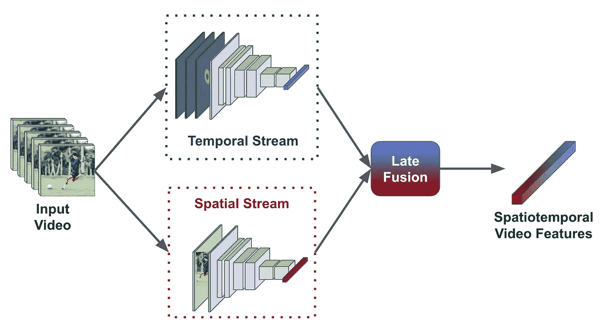
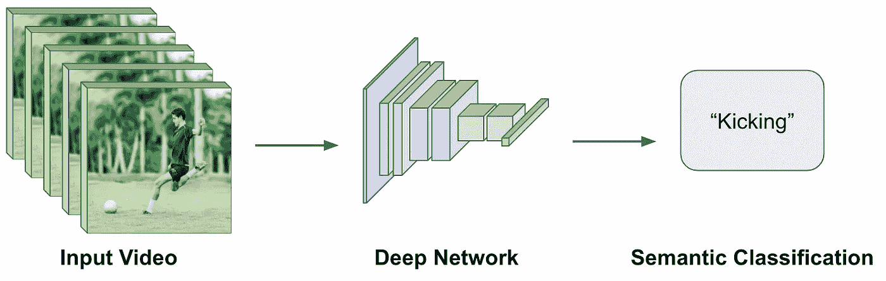
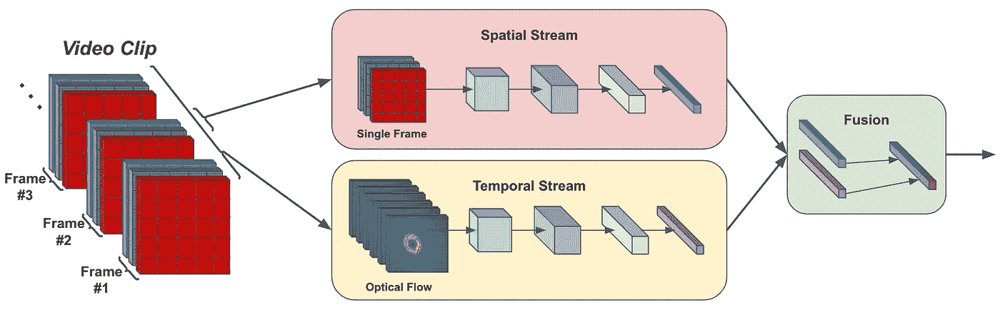
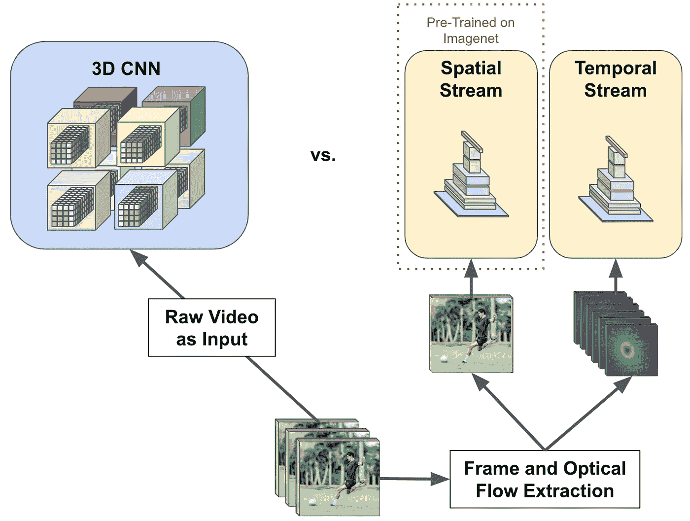
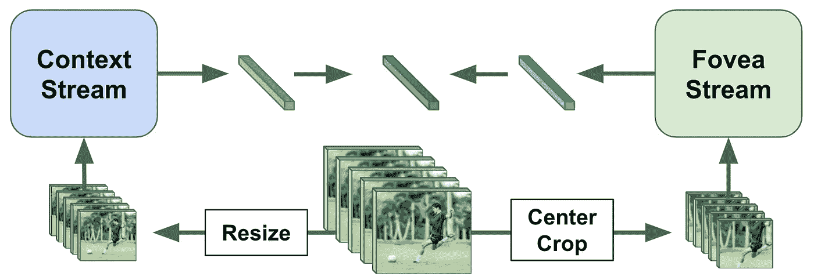
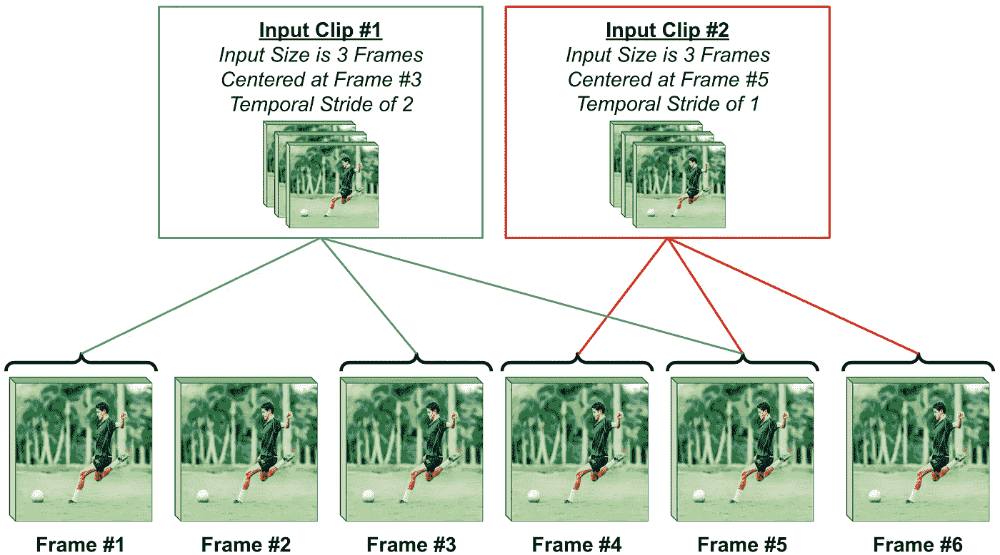

# 视频深度学习(下):双流架构的兴起

> 原文：<https://towardsdatascience.com/deep-learning-on-video-part-two-the-rise-of-two-stream-architectures-f830d5c655d0>

# 视频深度学习(下):双流架构的兴起

用于视频理解的双流架构(图片由作者提供)

本文是探索视频数据深度学习主题的系列博客文章中的第二篇。这一系列博客文章的目标是概述视频深度学习的历史，并为希望涉足该领域的研究人员或从业人员提供相关背景。在本系列的第一篇文章中，我回顾了关于使用 3D 卷积从视频中提取可学习特征的主题的最早出版物。

在这篇文章中，我将概述视频深度学习的下一个主要阶段:双流网络架构的引入和普及。视频识别的双流架构由两个独立的卷积神经网络(CNN)组成，一个处理空间特征，一个处理时间/运动特征。这些单独的 CNN 通常被称为双流架构中的“空间”和“时间”网络，并且这些单独的网络组件的输出可以被组合在一起以形成时空视频表示。双流架构极大地提高了视频动作识别的性能，使它们在一段时间内成为视频深度学习的标准方法。

本文将首先概述相关的初步信息，例如双流架构的定义/公式以及以前工作的局限性。然后，我将概述关于双流网络架构的文献，包括最初提出该架构的论文以及后来更复杂的变体。在帖子的最后，我将讨论在此期间提出的其他相关的视频理解方法，并概述双流网络的局限性，从而推动即将到来的改进。

# 预赛

在概述视频深度学习的双流方法之前，必须讨论几个初步概念。关于 2D/3D 卷积的公式、视频数据的结构以及双流架构之前视频深度学习的现有方法的所有细节，我请读者参考该系列的[第一篇](/deep-learning-on-video-part-one-the-early-days-8a3632ed47d4)。然而，鉴于对这些概念的理解，我试图以一种即使只有最少背景知识也能理解的方式概述相关信息。

## 我们试图解决什么问题？

人体动作识别问题描述(图片由作者提供)

这篇文章中概述的大多数方法都是研究基于视频的[人体动作识别](https://en.wikipedia.org/wiki/Activity_recognition) (HAR)的问题。HAR 数据集包含许多可变长度的视频，每个视频都与一个语义标签相关联，对应于视频中正在执行的动作。通常，数据集中的视频集中在执行所讨论的动作的单个实体上，并且视频不会在动作执行之前或之后延伸很远。因此，底层模型的目标是在给定视频作为输入的情况下预测语义动作标签。到目前为止，HAR 是双流网络架构时代最常研究的视频理解问题。

## 为什么我们需要新的东西？

在本系列的第一篇文章中，我们概述了几种可能的视频深度学习方法。这些方法通常采用 3D CNN 模型(即，由非线性激活层分隔的 3D 卷积的几个连续层)，将原始视频或手工制作的视频特征(例如，[光流](https://en.wikipedia.org/wiki/Optical_flow)或[方向梯度](https://en.wikipedia.org/wiki/Image_gradient))作为这些模型的输入，并基于分配给每个视频的语义标签通过反向传播来执行监督训练。鉴于这些方法的存在，人们可能会开始怀疑为什么需要一种新的视频深度学习方法。

这个问题的答案很简单——现有的模型表现不佳。事实上，早期基于深度学习的 HAR 方法通常优于手工制作的启发式方法，并且与使用单个帧作为输入(即完全忽略视频的时间方面)的深度学习模型相当[1，2]。鉴于深度学习在图像识别领域的巨大成功，如此糟糕的表现令人震惊[3]。因此，研究界一直在思考如何让深度学习对视频更有用。

3D CNN 架构最初的不良性能主要归因于缺乏用于视频理解的大型监督数据集[1]。例如，当时 HAR 最常用的数据集 [UCF-101](https://www.crcv.ucf.edu/data/UCF101.php) 和 [HMDB-51](https://serre-lab.clps.brown.edu/resource/hmdb-a-large-human-motion-database/) ，每个数据集分别只包含 13320 和 7000 个带标签的视频剪辑。相比之下，ImageNet——一个广泛使用的图像分类基准——包含大约 130 万个训练样本。虽然为 HAR 提出了更大的数据集(例如，Sports1M [1])，但它们通常是自动收集的，并且相当嘈杂，导致更经常使用较小的精选数据集。因为与它们的 2D 对应物相比，3D CNNs 包含大量的参数，所以它们需要大量的数据来学习有意义的、有区别的表示。因此，当时的小规模数据集是不够的— *需要更多的数据或不同的学习范式来实现更好的性能*。

## 双流网络体系结构

双流架构朝着基于深度学习的方法迈出了第一步，超越了 HAR 的启发式和单帧方法的性能，催化了视频理解新时代的到来。简而言之，这种架构通过将运动信息直接编码到网络输入中，实现了高性能视频理解，尽管缺乏足够的监督数据。现在，我们将概述双流架构的基本细节，为本文其余部分概述的相关研究提供背景。

双流网络架构[2]是由生物学中人类视觉皮层的双流假设[4]激发的，该假设认为大脑具有识别物体和运动的独立路径。为了模仿这种结构，用于视频理解的双流网络架构利用两个独立的网络组件，分别专用于处理空间和运动信息。因此，双流架构将对象识别和运动理解的任务委托给单独的网络组件，形成空间和时间线索的不同路径。

双流架构的输入通常以输入视频中的单个帧为中心，该单个帧作为输入直接传递到网络的空间流中(即，不考虑相邻帧)。作为时间流的输入，选择`L`个连续帧(以作为空间流输入的帧为中心)。然后为该组中的每个相邻帧计算水平和垂直[光流](https://en.wikipedia.org/wiki/Optical_flow)场，形成大小为`H x W x 2L`的输入(即`H`和`W`只是原始图像的高度和宽度)。然后，这个光流场堆栈作为固定大小的输入传递到网络的时间流中。

从这里开始，空间和时间流使用具有相似结构的独立卷积网络来处理帧和光流输入——各个网络之间的唯一区别是时间流适于接受具有更大数量的信道(即，`2L`信道而不是 3 个信道)的输入。一旦计算出每个流的输出，流表示就被融合在一起以形成用于预测的单个时空表示。后来的两个流架构在两个流之间利用更复杂的融合策略，但是现在我们假设这个简单的“后期”融合策略。双流体系结构的公式如下所示。

一个基本的双流网络架构的图示(图片由作者提供)

如上所示，双流架构的输入仅包含空间流的单个帧和时间流的固定大小的光流图组。虽然有人可能会认为这种方法有局限性，因为它只查看视频中固定大小的不完整部分，但可以通过从底层视频中采样几个固定大小的剪辑并对其输出进行平均以产生最终预测来缓解这一问题。此外，用作两个流结构的输入的剪辑可以用步长采样(即，不是采样相邻的帧，而是以两个、三个、四个等的连续间隔采样那些帧)。使得网络考虑基础视频内更大的时间范围。

## 为什么会这样？

在提供了基本的双流网络架构的公式之后，人们可能会开始想为什么这样的架构会优于 3D CNN 之类的东西。毕竟，3D CNNs 具有非常高的表示能力(即大量参数)，因此它们应该能够学习良好的空间和时间特征，对吗？

然而，回想一下，在提出双流架构时，用于视频理解的监督数据量是有限的。因此，双流方法提供了一些主要优势，使其能够超越 3D CNNs 的性能。首先，光流作为输入被直接传递到时间流的事实允许更容易地学习基于运动的特征，因为与运动相关的信息(即，光流)作为输入被直接传递，而不是被学习。此外，因为空间流只是在单个帧上操作的 2D CNN，所以它可以在大型图像分类数据集(例如，ImageNet)上进行预训练，这提供了巨大的性能优势。双流架构和 3D CNNs 之间的这些区别点如下所示。

描述双流和 3D CNN 网络之间的差异(图片由作者提供)

虽然 3D CNNs 将空间和时间表示为等效的维度(即，这与生物学中的双流假设相矛盾)[1]，但双流架构能够实现更好的性能，因为 *i)* 运动信息直接编码在输入中(即，不再需要从数据中学习这一点)并且 *ii)* 大量的图像分类数据可以用来训练空间网络。在低数据状态下，这种基本的双流架构朝着超越最佳手工制作的启发式视频理解方法的性能迈出了一大步。

# 双流体系结构的演变

现在已经介绍了双流体系结构和其他初步信息，我将探讨双流体系结构的提议和开发背后的一些文献，以便理解视频。我将从探索这个主题的早期论文开始，然后是后来出现的更高级的架构变体——仍然遵循两个流的方法。

## 早期方法

**语境与视网膜中央凹流[1]。**双流架构的概念虽然在后来的一篇论文[2]中得到更正式的推广，但在[1]中却得到了松散的探索。在本文中，作者为输入数据创建了两个独立的处理流:上下文和视网膜中央凹流。这些单独的流中的每一个都共享相同的网络架构，并以相同数量的帧作为输入。

为了提高计算效率，在作为输入提供给每个流之前，帧被减小到其原始面积的 50%,但是上下文和视网膜中央凹流采用不同的方法来减小输入的大小。也就是说，上下文流中的帧只是被调整大小，而视网膜中央凹流中的帧被居中裁剪。简而言之，这种方法确保了上下文和视网膜中央凹流分别接收低分辨率和高分辨率的输入——一个网络在低分辨率下看到完整的帧，而另一个网络在全分辨率下只看到每个帧的中心。

请注意，与针对双流架构提供的原始描述不同，这种方法没有明确地尝试将运动和空间识别分离到单独的处理流中。相反，每个流被给予相同组的原始帧(与单个帧和光流堆栈相反)作为输入(即，只是不同地调整大小/裁剪)，并通过相同但独立的网络架构传递这些帧。然后，这两个流的输出在预测之前被组合。有关描述，请参见下图。

用于视频理解的上下文和视网膜中央凹流(图片由作者提供)

假设两个流都负责检测空间和时间特征，则必须确定如何最好地将时间信息结合到流中。我们不能只在每个流中采用 2D CNN，因为这将永远不会考虑相邻帧之间的关系。为了确定如何最好地融合空间和时间信息，作者测试了每个流的 CNN 架构的几种可能性:

*   *早期融合:*将每个流的第一个卷积层改为 3D 卷积。
*   *后期融合:*对每个流使用 2D CNN，在相距 15 帧的两个帧上计算它们的输出，然后合并每个流中两个帧的最终输出。
*   *慢速融合:*与早期融合相比，将每个流内的所有卷积层改变为具有更小时间范围(即，核大小在时间上更小)的 3D 卷积。

作者发现慢融合一贯表现最好。因此，最终的网络架构采用了两个流的方法(不严格)，其中每个流都是一个 3D CNN，将一组帧作为输入。这些流之间的唯一区别是它们的输入——帧在上下文流内被调整大小(即，较低的分辨率)并且在视网膜中央凹流内被居中裁剪(即，较高的分辨率)。虽然这种方法与以前的 3D CNNs 相比是有效的(即，由于减少了输入图像的维度)并且表现相当，但是它仅比 HAR 上的单帧 3D CNNs 表现稍好，并且通常优于手工制作的启发式方法。因此，这种方法必须得到扩展和改进。

**最初的双流架构[2]。**预备章节中描述的双流架构是在前一章节[1]中描述的架构之后不久提出的。该体系结构首次采用了通过将一帧或一堆光流图分别作为输入传递给空间和时间流，在每个流内分别处理空间和时间特征的方法。因此，双流架构是第一个明确致力于捕捉底层视频中的运动信息的架构。通过采用预备部分中描述的后期融合，空间和时间网络输出可以被组合以形成高度鲁棒的时空特征。

最初提出的双流架构是第一个基于深度学习的方法，在 HAR 基准测试中，与单框架和启发式基线方法相比，性能不断提高。因此，它成为视频理解的标准，在后来的工作中被大量研究、利用和扩展。双流体系结构依赖于手工制作的光流特征作为输入(以及体系结构设计的其他几个先前讨论的方面),在面对有限的数据时能够实现更好的性能，但是这种依赖于手工制作的特征(即光流)作为输入最终被视为体系结构设计的限制。

**最佳实践[5]。**除了最初提出和探索双流网络架构的主要论文之外，以下工作采用了该架构，并探索了实现最佳性能的最佳实践。特别是，[5]探索了原始双流架构的更深层次的变体，发现在架构的每个流中使用具有更多层的 CNN 主干(例如，VGG [6]和盗梦空间式网络[7])如果训练得当，可以产生显著的性能优势。作者声称，更深的双流架构的性能改善来自于底层网络的表示能力的增加，这对于像 HAR 这样的复杂任务是有益的。

为了产生最佳可能的性能，分别使用图像分类和光流数据(即，从图像识别数据集生成的)对空间流和时间流进行*预训练(即，与仅预训练空间流相反)。然后，该模型以低学习率和高水平的数据扩充和正则化来训练，产生的最终性能超过了先前在 HAR 上实现的双流架构。*

## *高级变体*

*在双流架构的最初提议之后，几个后续工作提出了该架构的变体(稍加修改),这些变体产生了大规模改进的性能。这些更高级的变体保持了相同的一般网络架构和输入模式，但是在网络中添加了补充模块或连接，以改进时间信息的表示。这些修改的动机是原始双流网络严重依赖于空间信息，不能很好地表示时间数据。*

***改进双流架构的融合[8]。**最初对双流架构的批评声称，现有的公式没有正确地合成空间和时间信息。也就是说，因为时间和空间特征仅在两个流的输出层融合，所以该模型没有学会正确地利用时间信息，并且主要依赖于空间信息来生成正确的分类。此外，两个流架构的时间“尺度”是有限的，因为它仅将固定大小的帧子集视为时间流的输入(即，与完整视频相对)。*

*为了改善双流架构中时间信息的融合，作者[8]探索了双流架构中空间和时间流的特征表示之间的多种融合方法。正如之前的工作[5]所推荐的，更深的 VGG 网络被采用作为每个流的主干。然后，作者考虑以下融合类型:和、最大、连接、卷积(即，连接特征图，然后与一组 1×1 滤波器卷积)，以及双线性(即，计算每个像素处的特征的矩阵外积和像素位置上的和，以输出单个向量)。在双流网络内的不同层测试了这些融合类型中的每一种之后，作者发现在 VGG 网络的最后一个卷积层之后(即 ReLU 之前)采用卷积式融合结合时间池操作产生了最佳性能。*

*除了在双流网络中开发更好的融合方法，作者还提出了一种采样方法，允许底层网络考虑整个视频中的帧。即，在整个视频中对几个不同的“剪辑”进行采样，每个剪辑具有不同的时间跨度；见下图。通过在视频中的许多不同位置对剪辑进行采样，并利用小步幅和大步幅，最终的方法能够考虑基础视频中的大量帧，尽管双流架构的输入是固定大小的。当这种采样方法与以前提出的架构改进相结合时，作者能够在 HAR 基准中设置一个新的最先进的性能。*

**

*从具有不同时间跨度的底层视频中进行剪辑采样(图片由作者提供)*

***剩余双流架构【9】。**在提出改进的融合技术后不久，双流架构被调整为在其每个流中使用 ResNet 风格的 CNN 架构。这种修改是由用于图像识别的 CNN 架构的 ResNet 系列取得的惊人成功[10]推动的，该系列架构至今仍被广泛使用。然而，除了 ResNet 架构的流行之外，还出现了许多利用 CNN 架构实现图像识别最佳性能的最佳实践(例如，批量标准化[11]、最大化感受野、避免信息瓶颈等)。)还没有在视频深度学习中使用。因此,[9]的作者试图将包括 ResNet 架构在内的众多改进引入双流网络。*

*[9]中用于空间和时间流的 ResNet 体系结构从其原始公式略有修改。也就是说，在空间和时间流之间添加了补充的残差连接【T2 I】(即，作者声称该连接有助于空间和时间信息的融合)以及在时间流中正在处理的相邻帧之间添加了补充的残差连接【T4 ii】(即，这是通过转换网络流内的大量卷积层以利用 3D 卷积来实现的)。作为这些补充剩余连接的结果，所得到的架构具有大的时空感受域(即，在空间和时间上都考虑了视频的全部范围)。*

*有趣的是，两个网络流的参数都是使用来自 ImageNet 的预训练权重来初始化的。然后，以这样的方式初始化 3D 卷积，该方式使用与中心帧的原始对应 2D 卷积相同的权重，但是在 3D 卷积的感受域内形成与每个相邻帧的时间上的剩余连接(即，仅仅是相同的操作)。这种残差、两个流的架构(即，包括流之间和贯穿时间的补充残差连接)被示为学习和提取更好地表示空间概念随时间的演变的特征，从而进一步改进了用于 HAR 的先前方法的性能。*

# *人们还尝试了什么？*

*尽管双流架构是视频深度学习的一个非常受欢迎的选择，但在此期间，并不是所有关于视频理解的研究都利用了这种方法。事实上，许多其他有趣的算法是与双流架构并行开发的，尽管使用了完全不同的方法，但它们能够在 HAR(或其他视频理解基准)上实现令人印象深刻的性能。*

***新的 3D CNN 变体【12】。**另一个流行的架构是 C3D 网络[12]，它采用完全由 3D 卷积(即每层中的`3x3x3`个内核)组成的卷积架构。特别是，该网络将一组固定长度的帧作为输入，并通过一系列卷积层和汇集层，然后是网络末端的两个全连接层。为了训练这个网络，作者使用 HAR 的大规模 Sports1M 数据集[1]，从而使网络能够在大数据集上学习区分特征(即，回想一下，由于缺乏足够的监督数据，以前在 3D CNNs 上的尝试表现不佳)。尽管如此，这种架构的表现优于更先进的双流变体，并因仅考虑视频内有限的时间窗口而受到批评。结果，C3D 没有双流建筑变体受欢迎。*

***连体网络【13】。**在不同的方面，视频识别的并行工作探索了使用暹罗网络来模拟视频中的动作[13]。更具体地说，这项工作声称*视频中的任何动作都可以由该动作给环境带来的变化来定义*。受这一想法的启发，作者开发了一种方法，将底层视频分为“前置条件”和“效果”状态，分别代表动作发生前后的视频部分。然后，这些帧组通过单独的 CNN 架构，以提取每个帧的特征表示。从这里，动作被建模为线性变换(即，矩阵乘法)，其将前置条件特征变换为效果特征(即，这可以用预测和实际效果特征向量之间的余弦距离来测量)。有趣的是，这整个暹罗网络架构(包括动作转换)可以使用[期望最大化](https://en.wikipedia.org/wiki/Expectation%E2%80%93maximization_algorithm)过程来训练，以在 HAR 基准上实现有竞争力的性能。*

***其他材料…** 一些关于视频理解的工作研究了更有效的 3D 卷积表示，发现可以通过将 3D 卷积分解为单独的 2D 空间和 1D 时间卷积来学习鲁棒的时空关系，这些卷积按顺序应用[14]。与相应的 3D CNN 架构相比，所得到的架构包含明显更少的参数，因此可以在有限的数据范围内实现更好的性能。此外，并行工作超出了 HAR 问题领域，并考虑了动作检测问题[15]，其中动作必须在底层视频中被识别/分类和定位。通过采用利用早期双流架构变体的区域提议和特征提取方法[1]，可以在动作检测基准上实现令人印象深刻的性能。*

# *结论和未来方向…*

*虽然同时探索了许多视频理解的方法，但是双流方法的令人印象深刻的性能导致了该技术的普及。尽管如此，双流架构仍然——在其核心——依赖于从底层视频中提取的手工制作的特征。特别是，它依赖于从底层视频中提取的光流图，并作为输入传递给时间流。尽管这些特征对基础视频做出了最小的假设(即，仅仅是平滑度和连续性假设)，但是这种对手工制作的光流特征的依赖将受到后续工作的批评，从而导致更复杂的架构变体的开发，这将在本系列的下一篇文章中讨论。*

*非常感谢你阅读这篇文章！希望对你有帮助。如果你有任何反馈或担忧，请随时评论帖子或通过 [twitter](https://twitter.com/cwolferesearch) 联系我。如果你想关注我未来的工作，你可以在媒体上关注我或者查看我的[个人网站](https://wolfecameron.github.io/)上的内容。这一系列的文章是我在 Alegion 做研究科学家时背景研究的一部分。如果你喜欢这篇文章，请随时查看该公司和任何相关的空缺职位——我们总是希望与对深度学习相关主题感兴趣的积极个人进行讨论或雇用他们！*

**参考书目**

*[1][https://static . Google user content . com/media/research . Google . com/en//pubs/archive/42455 . pdf](https://static.googleusercontent.com/media/research.google.com/en//pubs/archive/42455.pdf)*

*[2] [https://arxiv.org/abs/1406.2199](https://arxiv.org/abs/1406.2199)*

*[3] [https://arxiv.org/abs/1803.01164](https://arxiv.org/abs/1803.01164)*

*[4] [https://pubmed.ncbi.nlm.nih.gov/1374953/](https://pubmed.ncbi.nlm.nih.gov/1374953/)*

*[5] [https://arxiv.org/abs/1507.02159](https://arxiv.org/abs/1507.02159)*

*[6] [https://arxiv.org/abs/1409.1556](https://arxiv.org/abs/1409.1556)*

*[7] [https://arxiv.org/abs/1409.4842](https://arxiv.org/abs/1409.4842)*

*[8] [https://arxiv.org/abs/1604.06573](https://arxiv.org/abs/1604.06573)*

*[9] [https://arxiv.org/abs/1611.02155](https://arxiv.org/abs/1611.02155)*

*[10] [https://arxiv.org/abs/1512.03385](https://arxiv.org/abs/1512.03385)*

*[11] [https://arxiv.org/abs/1502.03167](https://arxiv.org/abs/1502.03167)*

*[12] [https://arxiv.org/abs/1412.0767](https://arxiv.org/abs/1412.0767)*

*[13] [https://arxiv.org/abs/1512.00795](https://arxiv.org/abs/1512.00795)*

*[14] [https://arxiv.org/abs/1510.00562](https://arxiv.org/abs/1510.00562)*

*[15] [https://arxiv.org/abs/1411.6031](https://arxiv.org/abs/1411.6031)*