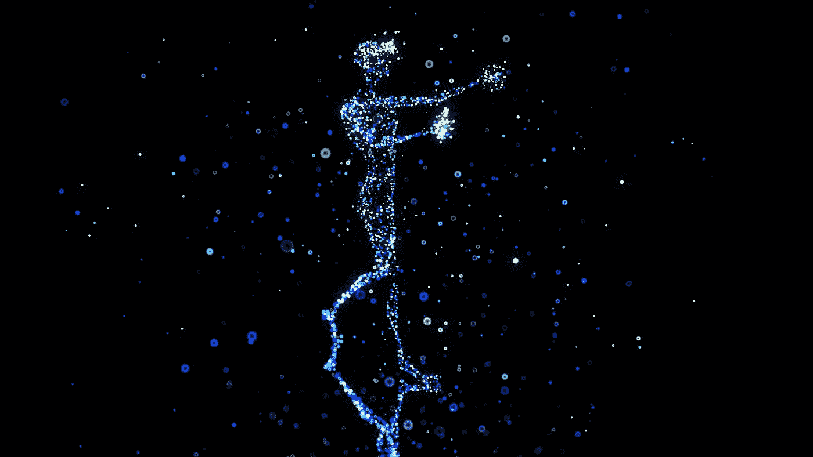
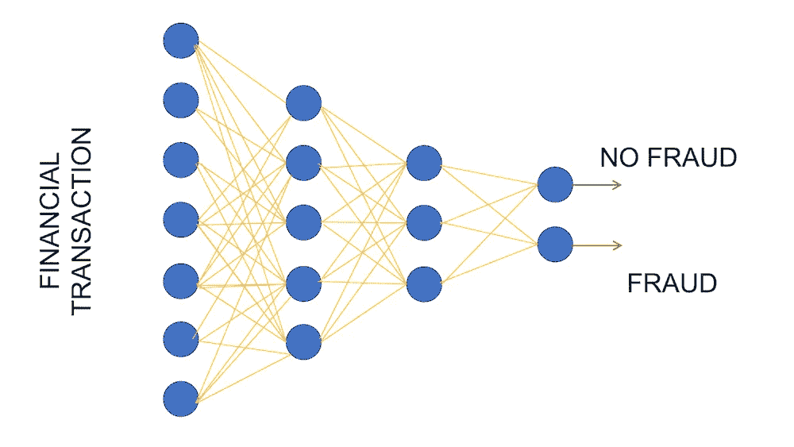
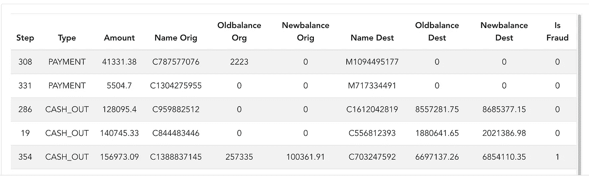
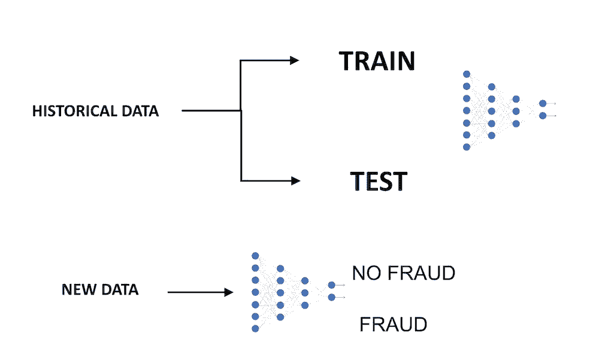
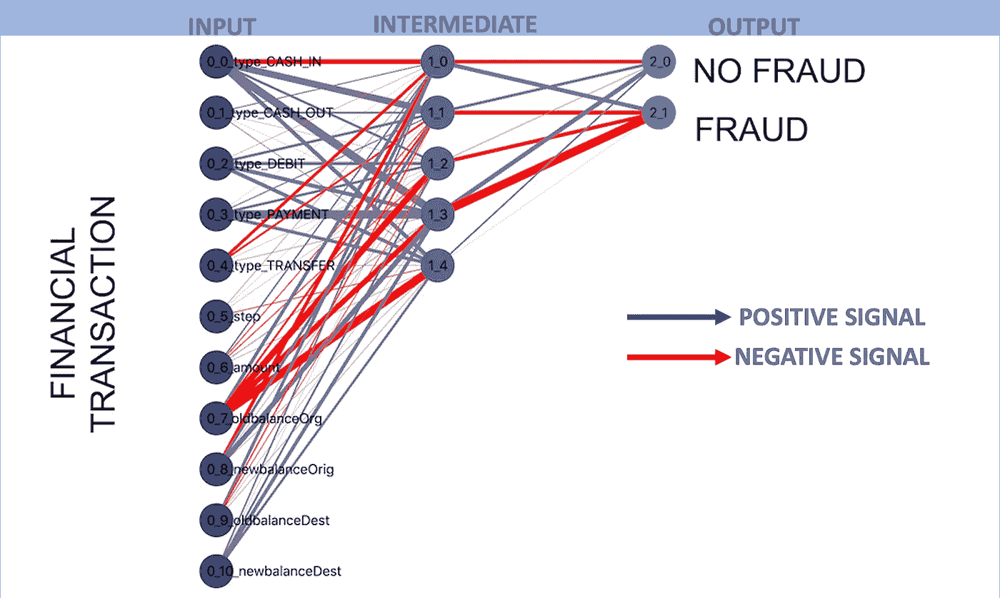
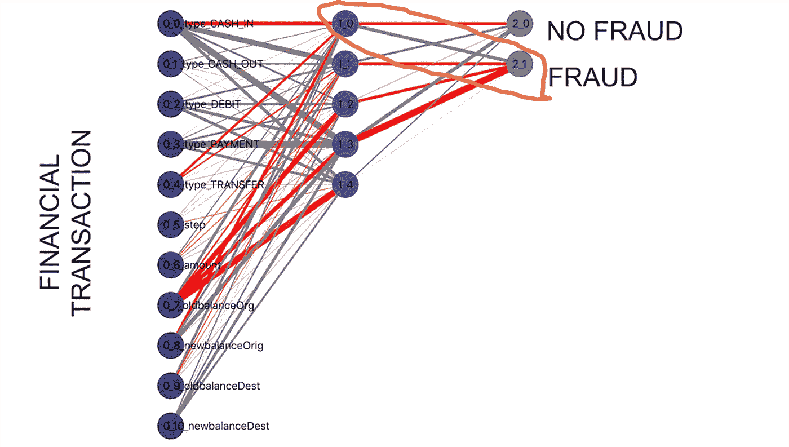
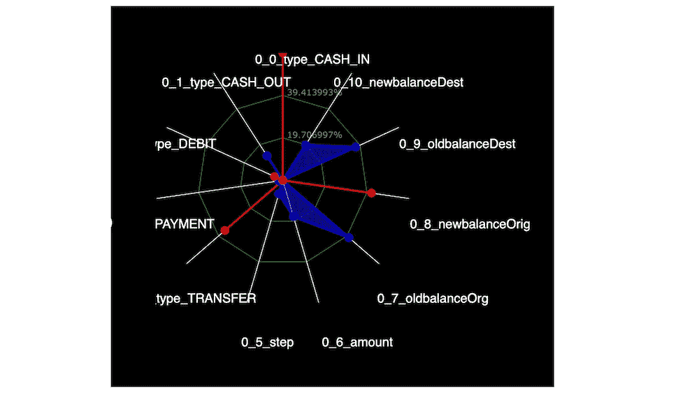
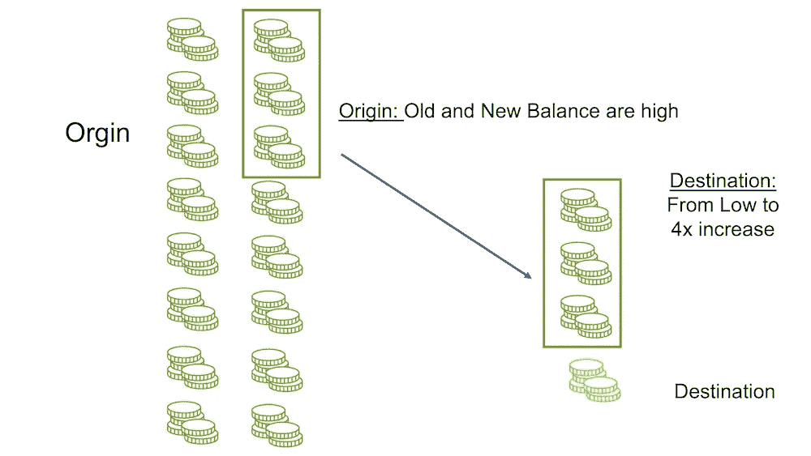
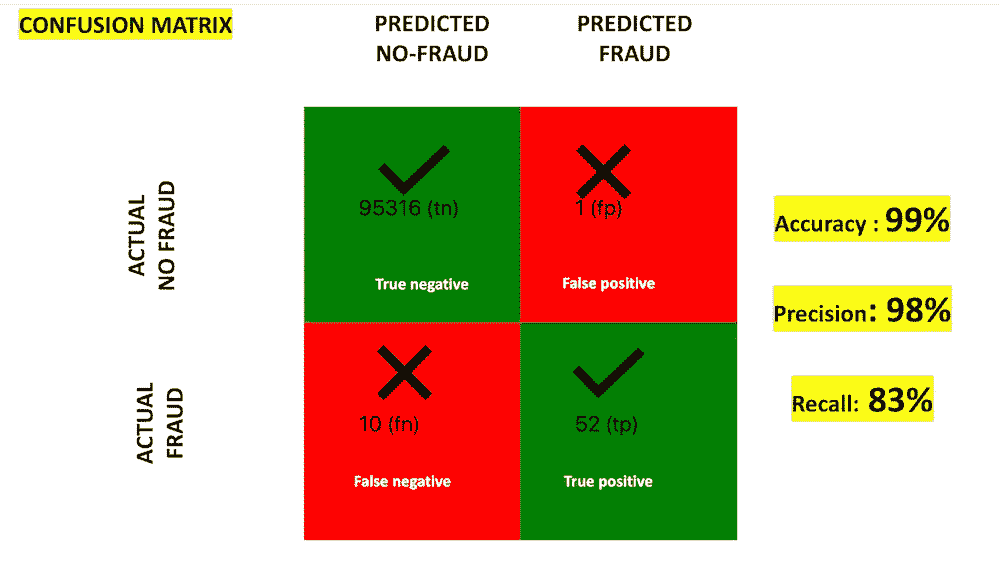

# 深度学习直观解释

> 原文：<https://towardsdatascience.com/deep-learning-visually-explained-a9fff874d280>

## 使用视觉示例理解深度学习

朱利安·特朗瑟在 [Unsplash](https://unsplash.com/s/photos/augmented-reality?utm_source=unsplash&utm_medium=referral&utm_content=creditCopyText) 拍摄的照片

深度学习是最强大的人工智能技术之一，然而，它可能很难理解。在这篇博客中，我将尝试使用视觉和例子来解释深度学习。

深度学习架构的灵感来自于我们大脑的工作方式。这是神经元的连接。深度学习模型可以有很多参数。参数的数量基于层和神经元的数量，对于复杂的体系结构，层和神经元的数量可以呈指数增长。

在这篇博客中，我将举一个金融欺诈检测的业务用例。欺诈检测的最大挑战之一是类别不平衡的问题，这意味着用于训练机器学习模型的数据很少有欺诈案例。

深度学习架构(图片由作者提供)

> 这就像训练一个机器学习模型大海捞针。欺诈检测是一个特殊的问题，这证明了采用深度学习架构等复杂方法的合理性。

# 数据

在这个例子中，我将从银行交易系统中获取数据。数据如下所示。该数据具有金融交易的类型、金额以及来源和目的地旧余额和新余额。还有一个标志表明交易是否是欺诈性的。

数据集的引用可以在博客的末尾找到。

欺诈检测数据(图片由作者提供)

数据分为训练数据和测试数据。深度学习模型是在训练集上开发的，然后在测试数据上进行验证。那么这个模型可以用来预测对看不见的数据的欺诈。

训练/测试分割(图片由作者提供)

# 深度学习模型

这里显示了欺诈预测的深度学习模型。输入神经元对应于事务数据。每个神经元对应于输入数据中的一列，例如交易类型、金额以及起点和终点的余额信息。

有一个中间层，然后是最后一层，它有两个神经元，一个预测非欺诈，另一个预测非欺诈。

这些线是在不同层之间传递的信号。绿线表示正信号，红线表示负信号

欺诈检测的深度学习模型(图片由作者提供)

# 观察神经元内部

我们看到神经元 1_0 正在向神经元欺诈传递一个积极的信号。

> 这意味着它已经深刻了解了欺诈性交易的样子！这太令人兴奋了！

神经元 1_0 正在向神经元 2_1 传递积极信号(欺诈)(图片由作者提供)

让我们来窥探一下神经元 1_0 的内部吧！

《神经元内部 1_0》(图片由作者提供)

雷达图代表了神经元对数据的了解。蓝线表示高值，红线表示低值。雷达图显示在原点有一个很高但几乎相似的新旧平衡。但是，在目的地新旧余额有非常大的差别。

这种情况表明存在欺诈。这种情况可以形象的展示在下面。

直观显示欺诈交易的样子(图片由作者提供)

# 使用混淆矩阵的模型精度

这里显示的是使用混淆矩阵的深度学习模型的准确性。

困惑矩阵(图片由作者提供)

总的来说，大约有 95000 笔交易，其中有 62 笔欺诈交易，这远远少于总交易。然而，深度学习模型做得很好，因为它能够正确地将 52 识别为欺诈，这也被称为真阳性(tp)

有 1 个误报(fp)，意味着它不是欺诈，但模型错误地将其标记为欺诈。所以精度，也就是 tp / (tp +fp)，等于 98%。

此外，还有 10 个假阴性(fn)，这意味着它们是欺诈性交易，但我们的模型无法预测它们。因此，测量召回率为 TP/(TP+fn)83%

# 结论

深度学习架构非常强大，因为它有助于解决欺诈检测等复杂问题。分析深度学习架构的可视化方法有助于理解该架构以及它如何解决问题

## 用于欺诈检测的合成金融数据集的数据源引用

用于欺诈检测的合成财务数据集可在此处获得:[https://www . ka ggle . com/competitions/space ship-titanic/overview](https://www.kaggle.com/datasets/ealaxi/paysim1)

如许可证部分所述，它拥有许可证 [CC BY-SA 4.0](https://creativecommons.org/licenses/by-sa/4.0/) 。

*   **分享** —以任何媒体或格式复制和再分发材料
*   **改编** —对材料进行重新混合、转换和构建，用于任何目的，甚至是商业目的。

请**用我的推荐链接加入 Medium** 。

  

请**订阅**每当我发布一个新的故事时，请保持通知。

  

# 额外资源

# 网站(全球资讯网的主机站)

你可以访问我的网站进行零编码分析。[**https://experiencedatascience.com**](https://experiencedatascience.com/)

**在网站上，您还可以参加即将举行的人工智能研讨会，体验有趣和创新的数据科学和人工智能。**

# **Youtube 频道**

**这是我的 YouTube 频道
[https://www.youtube.com/c/DataScienceDemonstrated](https://www.youtube.com/c/DataScienceDemonstrated)的链接**