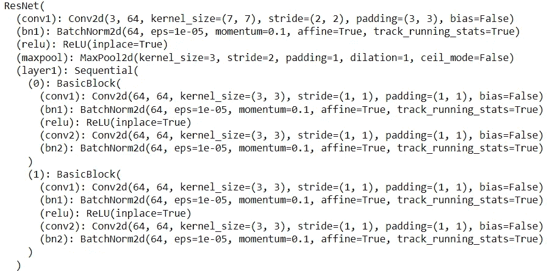
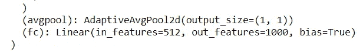
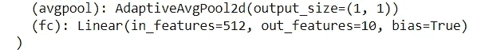
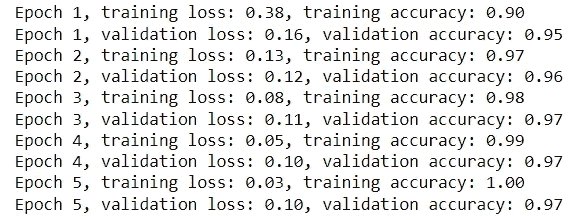
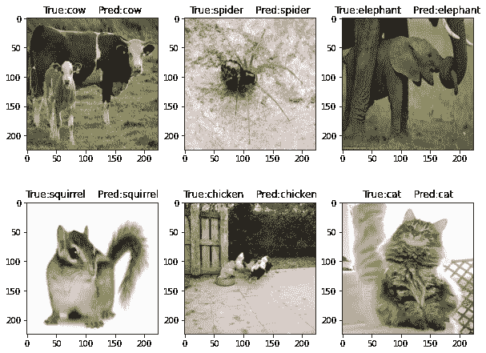

# PyTorch 中 Animals-10 数据集上的深度迁移学习

> 原文：<https://towardsdatascience.com/deep-transfer-learning-on-the-animals-10-dataset-in-pytorch-53c84b33ad39>

## 使用 Resnet-18 深度学习 CNN 实现 97%验证准确率的迁移学习教程


在 [Animals-10 数据集](https://www.kaggle.com/alessiocorrado99/animals10) |塞犍陀·维韦克上可视化深度迁移学习(使用 Resnet-18)标签

应用于图像预测任务的深度卷积神经网络非常受欢迎。似乎每隔几个月就有一个新的算法挑战 CNN 架构的极限。就在几年前，这些最先进的算法以及构建这些算法背后的知识只有少数专家可以获得。然而，由于越来越容易获得和低成本的计算资源，以及世界上任何地方的任何人都可以运行的开放代码，这种情况正在发生变化。有一些了不起的人愿意为了更大的利益分享他们的知识和专长。

在本教程中，我将使用脸书人工智能研究实验室开发的流行深度学习框架 PyTorch，通过一个这样的最先进的算法 Resnet-18 来预测 10 个类别的动物。我将展示迁移学习如何实现非常高的准确率(这里的 **97%，基于测试数据**)。

我将在本教程中完成以下步骤:

[**导入和格式化**](#d87f)[**加载和预处理数据**](#71a7) [**模型训练和可视化**](#33dc) [**可视化结果**](#7bd9)

# 导入和格式化

```
import os
import numpy as np
import torch
from torch import nn
from torch import optim 
from torch.autograd import Variable
import torch.utils.data as data
import torchvision
from torchvision import models
import pandas as pd
import matplotlib.pyplot as plt
from torch.utils.data import Dataset, DataLoader
from torchvision import transforms, utils
from torchvision.datasets import ImageFolder

res_18_model = models.resnet18(pretrained=True)
```

注意，最后我从 PyTorch 导入了 resnet18 模型，并选择 pretrained=True。这是因为对于迁移学习，我们通常使用深度学习算法在其他数据上学习的(一些或大部分)权重。然后，我们修改几层，以适用于我们的情况。

```
T = transforms.Compose([
     transforms.Resize((224,224)),
     transforms.ToTensor(),
     transforms.Normalize(mean=[0.485, 0.456, 0.406], std=[0.229, 0.224, 0.225]),
])
```

我们需要从 kaggle 下载图片并解压。接下来，我们使用 PyTorch 内置转换框架将数据集转换成标准化格式。这允许我们将图像调整为某种标准格式(在本例中为 224x224)，并进行其他预处理。对于迁移学习模型，重要的是标准化输入数据，以匹配原始模型的训练内容(尽可能)。否则，您可能会面临糟糕的性能风险(根据经验:)。对于 Resnet-18，PyTorch 官方文档建议进行转换。规格化([0.485，0.456，0.406]，[0.229，0.224，0.225])。由 3 个元素组成的第一个阵列对应于 3 个 RGB 通道的平均值。第二个数组也由 3 个元素组成，对应于相同 3 个通道的标准偏差。

# 加载和预处理数据

```
#download the dataset from here: https://www.kaggle.com/alessiocorrado99/animals10 

dataset = ImageFolder('./archive/raw-img/', transform=T)
train_set, val_set = torch.utils.data.random_split(dataset, [int(len(dataset)*.8), len(dataset)-int(len(dataset)*.8)])
train_loader = torch.utils.data.DataLoader(train_set, batch_size=64)
test_loader = torch.utils.data.DataLoader(val_set, batch_size=64)
```

接下来，我们从各自的图像文件夹中加载数据，应用转换，并随机分成 80%的训练和 20%的测试。现在我们准备训练(差不多！)但是有一个问题……如果你看 Resnet-18 架构，它看起来相当复杂——这只是最初的几层。总共有 18 层做各种事情(卷积，batchnorm，relu，maxpool 等。).



前几个 Resnet-18 层|塞犍陀·维韦克

然而，如果你看最后一层，它有 1000 个特征。这是因为 Resnet-18 模型最初被训练为对 1000 个类进行预测。这与我们有 10 个类的动物数据集不匹配。



最后的 Resnet-18 fc 层|塞犍陀·维韦克

所以我们至少需要改变这最后一层。结果非常简单，如下所示:

```
res_18_model.fc= nn.Linear(512, 10)
```

好了，现在我们可以开始训练了！



Resnet-18 将最后一层修改为具有 10 个对应于 10 个类别的特征|塞犍陀·维韦克

# 模型训练和评估

```
model=res_18_modelif(torch.cuda.is_available()==True):
    model=res_18_model.cuda()

optimiser=optim.SGD(model.parameters(),lr=1e-2)
loss=nn.CrossEntropyLoss()
```

我有一个 NVIDIA GPU，所以我把它用于相应的培训。这里的两个重要变量是优化器和损失函数。对于优化器，我使用 PyTorch 的随机梯度下降函数。我在这里使用交叉熵，因为它是多类预测的常用损失函数。

```
# My training and validation loops
nb_epochs = 5
acc_tot=np.zeros(nb_epochs)
for epoch in range(nb_epochs):
    losses = list()
    accuracies = list()
    model.train()     
    for batch in train_loader: 

        x,y = batch
        if(torch.cuda.is_available()==True):
            x=x.cuda()
            y=y.cuda()        

        # 1 forward
        l = model(x) # l: logits

        #2 compute the objective function
        J = loss(l,y)

        # 3 cleaning the gradients
        model.zero_grad()
        # optimiser.zero_grad()
        # params.grad.zero_()

        # 4 accumulate the partial derivatives of J wrt params
        J.backward()

        # 5 step in the opposite direction of the gradient
        optimiser.step()

        losses.append(J.item())
        accuracies.append(y.eq(l.detach().argmax(dim=1)).float().mean())

    print(f'Epoch {epoch + 1}', end=', ')
    print(f'training loss: {torch.tensor(losses).mean():.2f}', end=', ')
    print(f'training accuracy: {torch.tensor(accuracies).mean():.2f}')

    losses = list()
    accuracies = list() 
    model.eval()
    for batch in test_loader: 
        x,y = batch
        if(torch.cuda.is_available()==True):
            x=x.cuda()
            y=y.cuda()

        with torch.no_grad(): 
            l = model(x)

        #2 compute the objective function
        J = loss(l,y)

        losses.append(J.item())
        accuracies.append(y.eq(l.detach().argmax(dim=1)).float().mean())

    print(f'Epoch {epoch + 1}',end=', ')
    print(f'validation loss: {torch.tensor(losses).mean():.2f}', end=', ')
    print(f'validation accuracy: {torch.tensor(accuracies).mean():.2f}')
    acc_tot[epoch]=torch.tensor(accuracies).mean().numpy()
```



损失和准确性指标|塞犍陀·维维克

# 形象化

太好了！现在，我们如何将我们的神奇模型可视化呢？由于这是一个图像数据集，可视化的结果特别强大。首先，我定义了一个函数，用于在初始规范化后将图像转换为正确的格式。

```
def imformat(inp, title=None):
    """Imshow for Tensor."""
    inp = inp.numpy().transpose((1, 2, 0))
    mean = np.array([0.485, 0.456, 0.406])
    std = np.array([0.229, 0.224, 0.225])
    inp = std * inp + mean
    inp = np.clip(inp, 0, 1)
    return(inp)
```

数据附带了一个字典——我在下面使用它。原来这个数据集的标签不是英文的。为了便于理解标签，我们来转换一下。

```
class_names = dataset.classes
translate = {"cane": "dog", "cavallo": "horse", "elefante": "elephant", "farfalla": "butterfly", "gallina": "chicken", "gatto": "cat", "mucca": "cow", "pecora": "sheep", "scoiattolo": "squirrel", "dog": "cane", "cavallo": "horse", "elephant" : "elefante", "butterfly": "farfalla", "chicken": "gallina", "cat": "gatto", "cow": "mucca", "spider": "ragno", "squirrel": "scoiattolo"}
t_inv = {v: k for k, v in translate.items()}
```

最后，让我们把结果可视化！

```
train_loader2 = torch.utils.data.DataLoader(train_set, batch_size=9)

plt.figure(figsize=(15, 13))

inputs, classes = next(iter(train_loader2))
preds=model(inputs.cuda()).argmax(dim=1)

for i in range(0,9):
    ax = plt.subplot(3, 3, i + 1)
    img=imformat(inputs[i])

    plt.imshow((img))

    try:
        plt.title('True:'+str(t_inv[class_names[classes[i]]])+'    Pred:'+str(t_inv[class_names[preds[i]]]))
    except:
        plt.title('True:'+str(translate[class_names[classes[i]]])+'    Pred:'+str(translate[class_names[preds[i]]]))
    if(i==9):
        plt.axis("off")
```



深度迁移学习(使用 Resnet-18)标签在 [Animals-10 数据集](https://www.kaggle.com/alessiocorrado99/animals10) |塞犍陀·维韦克上的可视化

还有成功！将经过适当训练的算法的结果可视化是相当强大的！

***下面是***[***Github***](https://github.com/skandavivek/PyTorch-Transfer-Learning)***上的代码。快乐深度迁移学习！***

*来源:*

1.  https://www.youtube.com/watch?v=OMDn66kM9Qc&ab _ channel = PyTorchLightning
2.  [https://py torch . org/vision/main/generated/torch vision . transforms . normalize . html](https://pytorch.org/vision/main/generated/torchvision.transforms.Normalize.html)
3.  [https://www.kaggle.com/alessiocorrado99/animals10](https://www.kaggle.com/alessiocorrado99/animals10)([牌照 GPL2](https://www.gnu.org/licenses/old-licenses/gpl-2.0.en.html) )

*如果你还不是中会员，想支持我这样的作家，可以通过我的推荐链接随意报名:*[*https://skanda-vivek.medium.com/membership*](https://skanda-vivek.medium.com/membership)

[*关注我*](https://medium.com/@skanda.vivek) *如果你喜欢这篇文章——我经常在复杂系统、物理学、数据科学和社会的界面上写作。*

*获取每周数据透视* [*订阅此处*](https://skandavivek.substack.com/) *！*