# 深度视频修复

> 原文：<https://towardsdatascience.com/deep-video-inpainting-756e60ddcaaf>

## 用深度神经网络去除视频中不需要的对象。问题设置和最先进的审查。

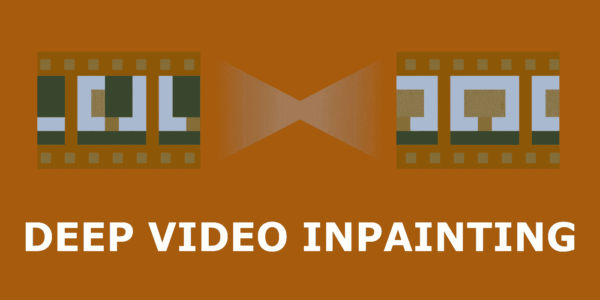

图片作者。

虽然抹去记忆的技术，如著名电影*[*【一尘不染的心灵的永恒阳光】*](https://www.imdb.com/title/tt0338013/)*(还)不存在，但我们在图像和视频方面取得了良好的进展。把这个拿着啤酒的陌生人从假日视频中移除，破坏了令人惊叹的日落，这不是很酷吗？**

**视频修复使我们能够屏蔽视频中不想要的部分。一段时间以前，这项工作需要动画师和图形设计师花费数百个小时来一帧一帧地手工编辑视频。**

**但是随着机器学习的出现，我们经常可以实现结果，如果不是更好，但肯定非常接近艺术家的能力——用无缝适合视频的内容替换不需要的对象。**

**随便看看下面的一个小片段，是不是印象深刻？**

**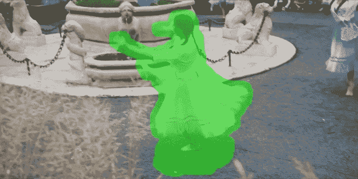**

**使用[流引导视频完成方法(FGVC)](http://chengao.vision/FGVC/) 制作的视频。GIF 由[高晨](http://chengao.vision/)制作。**

**对我来说，上面的动画看起来难以置信！注意，例如，跳舞女孩前景中的草的高频纹理是如何被保留下来的。为了了解我们是如何得到这些结果的，下面我设置了问题，讨论了可用的解决方案和基准。在最底部，我还包含了每个讨论过的方法的代码链接。说完这些，让我们开始吧！**

# **我们要解决什么？**

**从图像修复的例子开始更容易，目标是用背景替换场景的一部分，例如 Adobe Photoshop 为照片提供了这个选项。**

**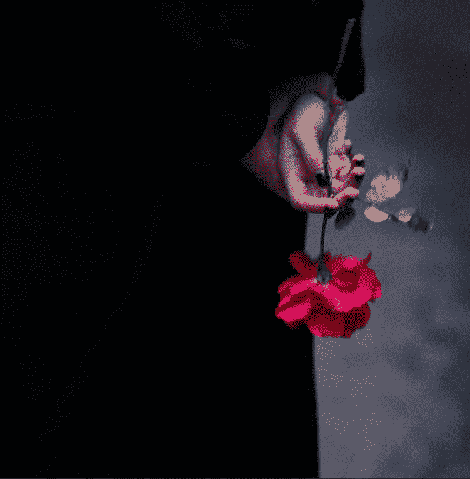****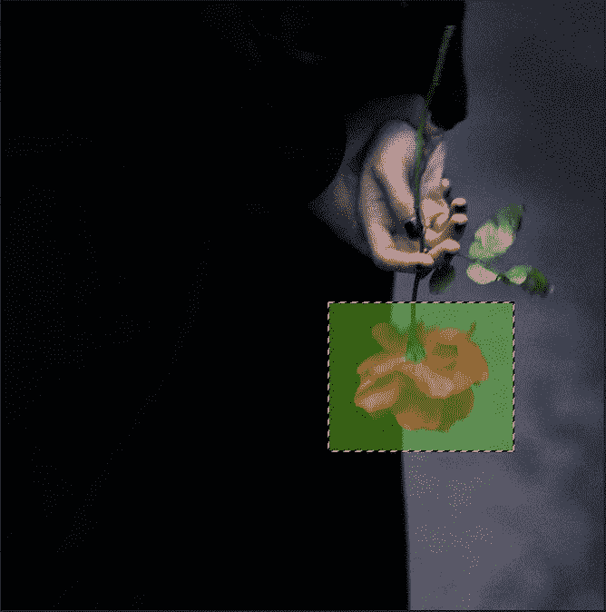****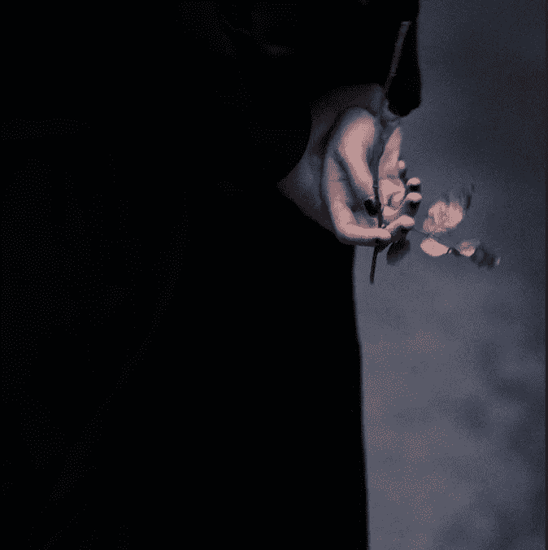**

**用 Adobe Photoshop 修复图像的例子。图像、选定区域、结果。图片作者。**

**在蒙版这个图像时，我指定了我想要修补的区域。Photoshop 使用“*内容感知填充*”将前景(所选区域)替换为背景纹理。**

**对于一个视频来说，这个过程会更加费力，因为我们需要标记物体出现的所有帧。**

**视频修补在概念上类似于图像修补，但是有一点复杂——需要满足整个视频的时间一致性。随着时间逐渐变化的视频不应该具有闪烁的伪像或者在修补区域中对象的颜色或形状的突然变化。并且有许多变量会影响实现时间一致性的难度——场景的复杂性、摄像机位置的改变、场景的改变或用于修补的选定区域的移动(例如移动的对象)。**

**虽然与图像修复相比，视频修复更具挑战性，但由于需要满足帧之间的时间一致性，它固有地具有更多线索，因为一帧中缺失区域的有效像素可能出现在其他帧中。**

# **可用的解决方案**

**通常可用的方法可以通过修补机制来区分。它们可以是*复制和粘贴*——在附近的帧中搜索丢失像素的信息，一旦找到就复制到指定的位置，或者是*生成*，使用某种形式的生成模型根据整个视频的内容在该区域中产生像素信息。**

**这两种方法各有利弊。复制和粘贴方法在可以通过视频跟踪像素的情况下工作良好，但在无法检索信息时显然会失败，例如删除了静止区域的静止视频。在这种情况下，创成式模型会更合适。与此同时，生成式方法在重建中可能不太准确，通常会产生模糊的、跨可能选项的平均解。**

**通常提出的解决方案采用[卷积神经网络(CNN)](/cnn-cheat-sheet-the-essential-summary-for-a-quick-start-58820a14d3b4?source=your_stories_page-------------------------------------)、视觉转换器或 3D CNNs。后者由于内存和时间的限制而不太受欢迎。**

## **复制并粘贴**

**为了从邻近的帧中复制丢失像素的内容，我们首先需要追踪该像素的位置。这通常通过[光流](https://nanonets.com/blog/optical-flow/)来完成。**

**光流提供了关于背景和物体跨帧位移的信息。如果计算的流量误差很小，我们可以从第一帧到最后一帧跟踪特定像素的精确位置。光流可以向前和向后，即从第一帧向前计算位移，或者以相反的顺序从最后一帧开始计算位移。**

**寻找光流是具有挑战性的，因为可能有多种可能的解决方案。这就是为什么后向流和前向流经常不匹配，并且经常两者都被计算，并且联合信息被用于改进估计。关于光流方法的快速解释，请查看这篇[文章](/understanding-optical-flow-raft-accb38132fba)。**

**如果我们不能借用内容来从附近的帧中恢复当前帧，则仍然未知的区域可以与单个帧的单个图像修补合成，然后传播到视频的其余部分。**

**下面我将按照时间顺序介绍复制和粘贴架构。由于用于流量估计的基于优化的方法的计算复杂性很高，下面描述的许多方法或者找到替代、简化或者近似它的机制。**

**[**深度视频修复**](https://arxiv.org/pdf/1905.01639.pdf) **，2019****

**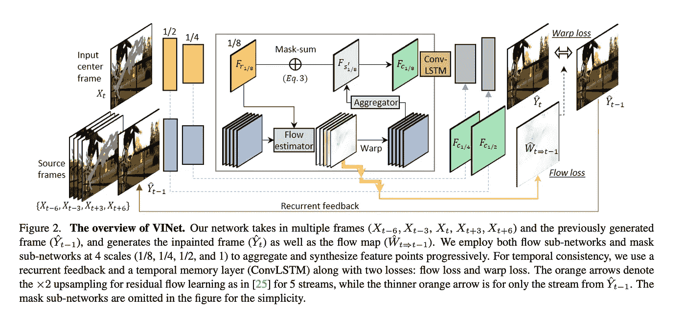**

**图片由[大婚金](https://arxiv.org/pdf/1905.01639.pdf)**

**该论文的叙述围绕确保修补视频的时间一致性的方法而构建。作者为第 t 帧的生成设置了三个要求。它应该与时空相邻帧 X(t+/-N)一致，其中 N 表示时间半径；先前生成的帧 yt1；以及之前的所有历史。**

**第一种机制是基于反馈上一步生成的帧以及当前步骤中的帧——循环反馈。在组合之前，源特征点和参考特征点是对齐的。这种策略有助于模型从相邻帧借用可追踪的特征。为了实现这一点，流量子网络被用来估计四个空间尺度(1/8、1/4、1/2 和 1)的特征图之间的流量。**

**第二种机制包括在具有[流网 2](https://arxiv.org/abs/1612.01925) 的两个连续帧之间的最细尺度的显式流监控。**

**虽然循环反馈连接了连续的帧，但填补大洞需要更多的长期知识。第三种机制基于时间记忆层，有助于长期连接不同时间步长的内部特征。这里，作者采用了卷积 LSTM ( [ConvLSTM](https://proceedings.neurips.cc/paper/2015/file/07563a3fe3bbe7e3ba84431ad9d055af-Paper.pdf) )层和翘曲损耗。**

**该模型用三种损失训练——重建损失(L1 + SSIM)、流量估计损失和扭曲损失。**

**[**复制粘贴网络进行深度视频修复**](https://arxiv.org/pdf/1908.11587.pdf) **，2019****

**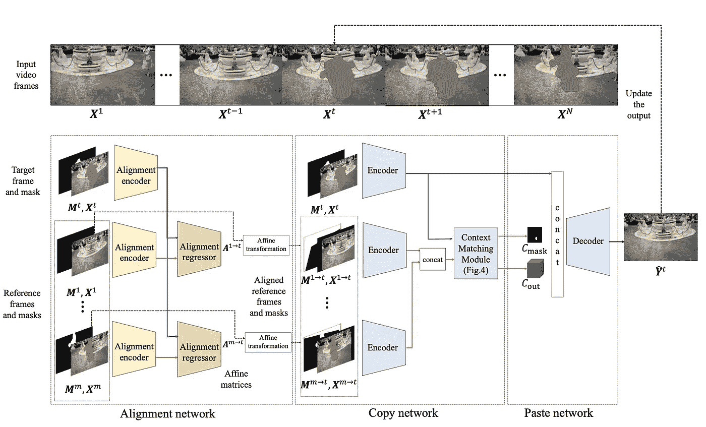**

**图片由李成浩提供。**

**该网络基于三个阶段—对齐、复制和粘贴。**

**在对齐步骤中，参考帧与测试帧对齐，以匹配像素之间的对应关系。**

**复制阶段由编码器和上下文匹配模块组成。在编码器模块中，对齐的帧及其掩码通过特征编码器。所得的嵌入然后被传递到上下文匹配模块——帧特征和它们的可见性图之间的余弦相似性的组合。这个步骤产生了每个像素对丢失区域的贡献的权重。**

**解码器(粘贴模块)获取权重和连接的帧特征，并输出结果图像。**

**用 L1、风格、感知和总变差损失的组合来训练整个网络。**

**[**深度流引导图像修复**](https://arxiv.org/pdf/1905.02884.pdf) **，2019 (DFC-Net)****

**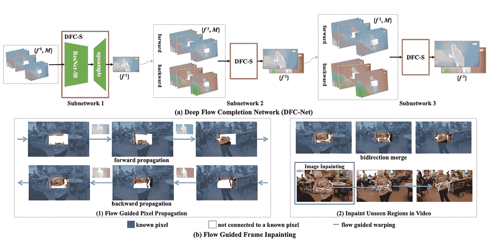**

**图片由[徐睿](https://arxiv.org/pdf/1905.02884.pdf)拍摄。**

**本文通过一个由粗到细的深度流完井网络(DFC-Net)解决了光流的高计算复杂度问题，该网络由三个小的子网(DFC-S)组成。这三个子网中的每一个都接受大小调整为原始大小的 1/2、2/3 和 1 的输入。**

**第一个 DFC-S 接受两种类型的输入:用 [FlowNet2](https://arxiv.org/abs/1612.01925) 估计的流图的串联，以及相关的二进制掩码序列，指示每个流图中缺失的区域。网络输出流量的精确估计。**

**估计的流场用于引导像素的传播以填充缺失的区域。具体而言，DFC-Net 遵循由粗到细的细化来完成流场，同时通过硬流示例挖掘来进一步提高其质量。**

**优化目标是最小化预测和地面真实流量之间的 L1 距离。然而，因为视频序列中的大部分流动区域是平滑的，所以使用 L1 损失直接导致在训练期间平滑区域占优势，而预测中的边界区域是模糊的。为了克服这一点，所有像素按照损失的降序排序。前 p 个百分比的像素被标记为硬样本。它们的损失被加权以迫使模型更多地关注那些区域。**

**[**【流边引导】视频完成**](https://arxiv.org/abs/2009.01835) **、2020 (FGVC)****

**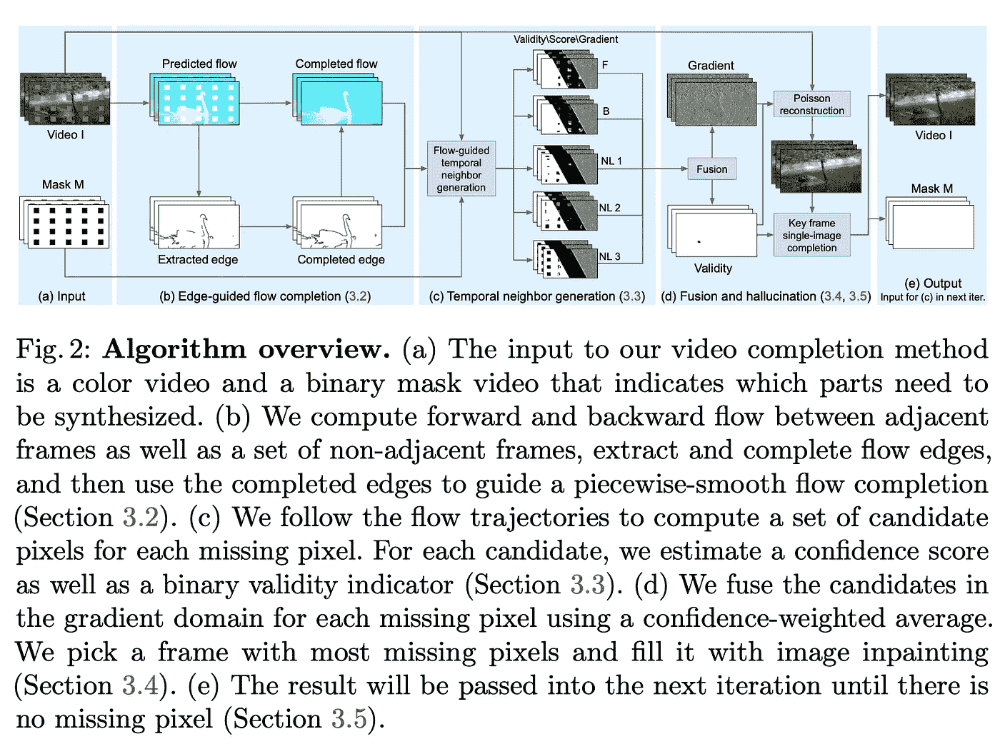**

**图片由[高晨](https://arxiv.org/pdf/2009.01835.pdf)提供。**

**流边缘引导的视频完成(FGVC)由流完成、时间传播和融合步骤组成。**

**在流完成步骤中，用流网 2 计算相邻和非相邻帧之间的反向和正向流。为了提供尽可能多的信息，该方法使用本地和非本地帧之间的流。由于流中的一些信息丢失(由于掩码),该方法首先使用 Canny 边缘检测器和 EdgeConnect 在流中找到边缘，以连接不相交的区域。基于边缘，执行边缘引导的流动补偿。对于非局部帧，使用单应变形来补偿大的运动。**

**在时间传播期间，遵循流动轨迹来传播每个缺失像素的一组候选像素。分配五个候选像素——两个来自前向和后向流动通道，三个来自远处的非局部帧。**

**在无缝融合步骤中，通过置信度加权平均来融合候选对象。在梯度域中执行融合，以避免可见的颜色接缝。最终融合是通过泊松优化获得的。**

******，2021 (VOIN)******

****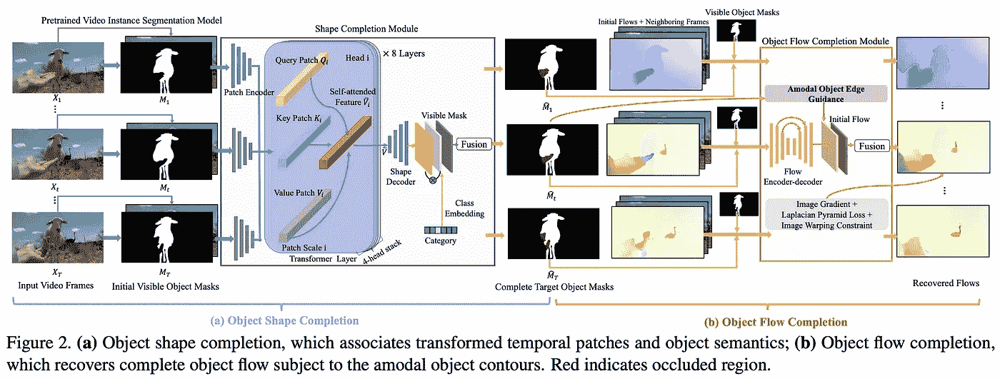********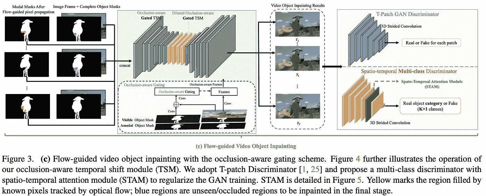****

****图片由[雷科](https://arxiv.org/abs/2108.06765)****

****VOIN 基于这样的假设，即关于被遮罩对象遮挡的形状的知识可以提高算法的性能。****

****该模型由三个模块组成——(I)基于变换器的形状完成模块，其学习从可见掩模区域推断完整的对象形状；(ii)遮挡感知流完成模块，用于通过加强流一致性来捕捉移动对象并跨甚至在时间上相距很远的帧传播内容；(iii)流动引导的视频对象修补****

****在形状完成模块中，对象轮廓引导流动预测过程。在整个对象区域内实施流动平滑(流动梯度通常很小，除非沿着不同的对象运动边界)。****

****为了填充剩余像素，作者训练了一个遮挡感知门控生成器来修复视频对象的遮挡区域。该模型采用残差时间移位模块(TSM)作为构建模块，将部分通道沿时间维度移位，进行联合时空特征学习。****

****该模型使用两个鉴别器进行训练——一个用于感知质量和时间一致性，另一个用于对象语义。为了调整流完成网络，采用了 L1 流损失、图像梯度损失、拉普拉斯金字塔损失和幻觉内容的扭曲损失。用二元交叉熵和[骰子](https://arxiv.org/pdf/1606.04797.pdf)损失来训练形状完成模块。****

****除了这些方法，作者还提供了一个新的数据集 YouTube-VOI-包含 5305 个视频，一个 65 类标签集，包括常见对象，如人、动物和车辆，以及超过 200 万个用于移动视频对象的遮挡和可见遮罩****

## ****生成模型****

****标准的图像生成模型，例如基于 2D CNN 的生成敌对网络(GANs ),尽管在图像修复方面取得了成功，但对于视频修复却不太适用。其主要原因是无法说明像素之间的时间关系。因此，使用 3D CNNs 或[视觉转换器](https://arxiv.org/pdf/2010.11929.pdf)。由于这种类型中表现最好的模型是基于变形金刚的，所以我把重点放在它们身上。作为视觉变形金刚的回顾，看看[的博客](https://ai.googleblog.com/2020/12/transformers-for-image-recognition-at.html)。****

****然而，变形金刚的一个大缺点是对注意力层的内存要求非常高，这限制了它们的输入大小。不同的模型以不同的方式处理这个问题。****

****[**学习联合时空变换进行视频修复**](https://arxiv.org/pdf/2007.10247.pdf) **，2020 (STTN)******

****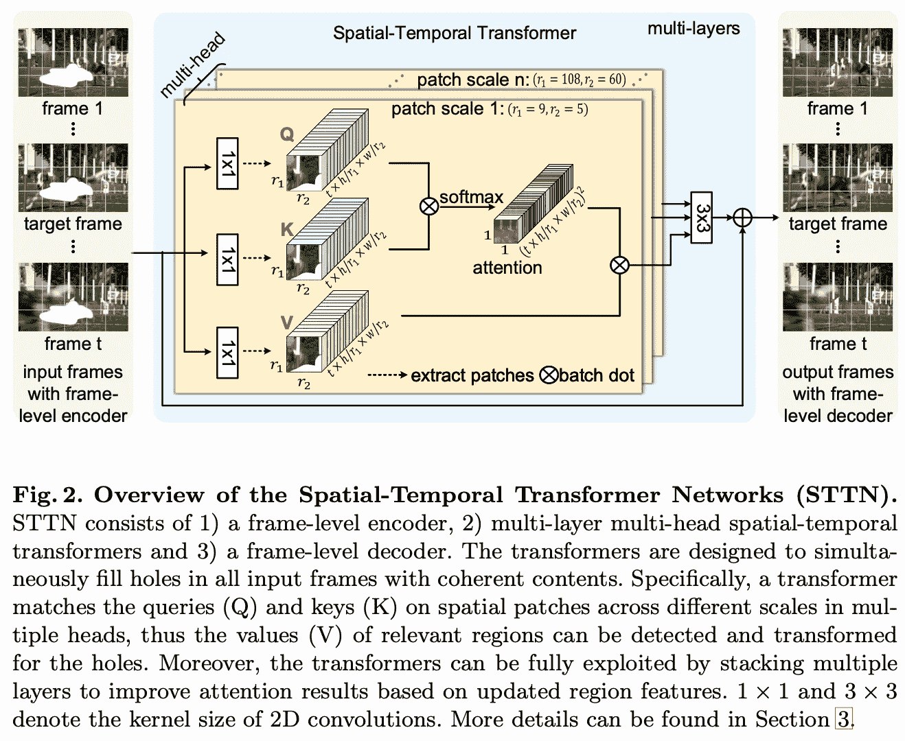****

****图片由[曾](https://arxiv.org/pdf/2007.10247.pdf)提供。****

****该模型的设计基于多尺度多头变压器。STTN 将以目标帧为中心的帧窗口和从视频的其余部分均匀采样的帧作为输入。该模型使用不同比例的小块，而不是处理完整的帧。****

****STTN 由三部分组成——帧级编码器、多层多头时空转换器和帧级解码器。帧级编码器是 CNN，它为每一帧编码深度特征。类似地，帧级解码器将特征解码回帧。****

****时空转换器是核心组件，学习所有缺失区域的联合时空转换。不同的变换头计算不同尺度的空间块的相似性。转换器运行“嵌入-匹配-参与”算法。在嵌入步骤中，用编码器或前层变换器提取的特征被映射到查询和存储器(键值)。在匹配步骤中，通过匹配从所有帧中提取的空间碎片中的查询和关键字来计算区域相似性。在关注步骤中，检测相关区域并对缺失区域进行变换，其输出通过对相关面片进行加权求和来计算。****

****该模型是用 L1 和对抗性损失训练的。****

****[**解耦空间变压器用于视频修复**](https://arxiv.org/pdf/2104.06637.pdf) **，2021 (DSTT)******

****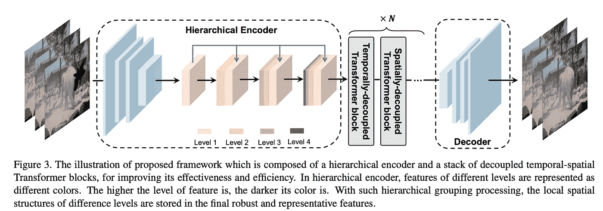****

****图片由[刘锐](https://arxiv.org/pdf/2109.02974.pdf)拍摄。****

****DSTT 是不同于 STTN 的建筑，因为它分别处理空间和时间特征。该方法基于几个架构模块——堆叠特征编码器([卷积神经网络](/cnn-cheat-sheet-the-essential-summary-for-a-quick-start-58820a14d3b4?source=your_stories_page-------------------------------------))、一个空间解耦和一个临时解耦的变换器以及一个解码器。****

****分层特征编码器是卷积层的堆叠，底层特征附加到更深的层，从而从一层到另一层传播低级细节。****

****然后，单个帧的聚集特征被分割成小块，并通过空间解耦的变换器。暂时解耦的变换器使用在相同空间位置的几个连续帧的特征片作为输入嵌入。然后，输出被汇总并通过解码器。****

****该模型是用 L1 和对抗性损失训练的。****

****[**FuseFormer:融合变形金刚中的细粒度信息进行视频修复**](https://arxiv.org/pdf/2109.02974.pdf) **，(2021)******

****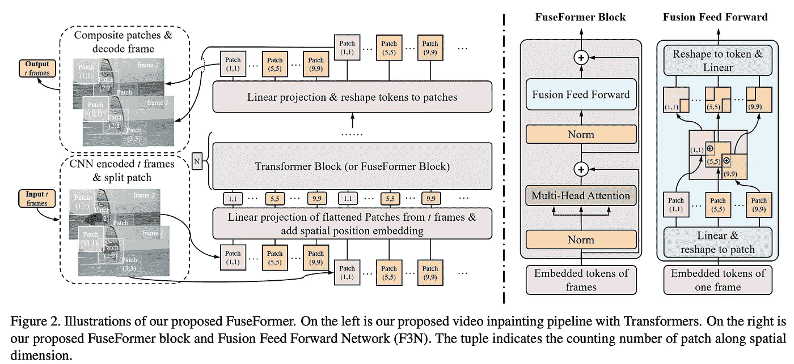****

****图片由[刘锐](https://arxiv.org/pdf/2109.02974.pdf)提供。****

****这篇论文是由研究 DSTT 的同一个小组提出的。然而，这部作品并没有提到 DSTT，只是将自己与 STTN 进行了对比。作者依赖于最初提出的[视觉变形器](https://arxiv.org/pdf/2010.11929.pdf) (ViT)的单一尺度架构，而不是在变形器之前引入基于不同尺度补丁的基于 CNN 的特征提取器。****

****新模型引入了对原始 ViT 的两个修改——贴片软分裂和软贴片组合，以及融合形成器块。正如这篇论文所说，所有这些都提高了基线模型的性能。****

****软分割模块将图像分割成具有重叠区域的小块，并且相应地，软合成将这些重叠的小块组合回图像。****

****融合前馈网络(F3N)取代了标准变压器模型中的两层 MLPs。在 F3N 中，在两个完全连接的层之间，每个 1D 令牌都以其原始的空间形状被整形回 2D 面片，然后被软合成为一幅完整的图像。重叠区域中像素的重叠特征将来自所有相邻块的对应值相加，用于进一步的细粒度特征融合。然后，面片被软分割和平坦化成 1D 向量，这些向量被馈送给第二个 MLP。****

****该模型是在 L1 和对抗性损失的组合上训练的。****

# ****基准测试—如何比较模型****

****评估视频生成模型的困难在于找到一个好的基准来测试:空间质量、时间一致性和真实性。视频修复是一项特别具有挑战性的评估任务，因为它取决于多种因素，如相机运动、对象运动和遮罩大小，并且在评估性能时应该跟踪所有这些因素。****

****这些方法性能的最佳评判者是人类观察者。然而，用人类参与者进行实验既昂贵又耗时。我在两篇文章中详细讨论了改进当前数据收集方法的挑战和方法:[深度图像质量评估](/deep-image-quality-assessment-30ad71641fac)和[用于成对比较的主动采样](/active-sampling-for-pairwise-comparisons-476c2dc18231)。****

****代替人类观察者的是客观的质量度量。最近的一篇论文有一个吸引人的名字:[魔鬼在细节中:视频修复的诊断评估基准](https://arxiv.org/pdf/2105.05332.pdf)在一个新的详尽的基准数据集上比较了最先进的方法，该数据集涵盖了视频修复的各种场景的过多组合:****

*   ****面具尺寸小/大****
*   ****掩模形状变化缓慢/快速****
*   ****掩模移动速度慢/快****
*   ****背景运动高/低****
*   ****摄像机运动高/低****

****该基准包括九个图像质量指标，包括典型的图像质量和逼真度 FID、LPIPS、PSNR 和 FSIM，以及考虑时间一致性的指标——VFID、PVCS 和扭曲误差。****

# ****摘要****

****创建一个功能齐全的视频修复应用程序是一个巨大的工程挑战。虽然有一些非常令人印象深刻的结果，但所有方法仍然会产生明显的伪像，而获得实时速度是一项巨大的工程工作。****

****另一个需要解决的现象是与修补对象相关联的帧部分，例如阴影或反射，它们有时很难被发现，但是仍然需要被去除。处理这类问题的方法之一是最近由谷歌、牛津和魏茨曼科学研究所发表的一篇 Omnimate 论文。****

****然而，和往常一样，巨大的进步伴随着技术的误用。视频修复最明显的例子之一就是深度赝品。这在以持续不断的信息流为基础的现代世界中可能会在更大范围内严重损害个人生活和社会。想象一下法庭上的伪造证据或社交媒体上的错误信息，这些信息的来源往往未经核实。这就是为什么有论文通过开发修复区域检测的方法来解决这个问题，就像[的那篇](https://www.bmvc2021-virtualconference.com/assets/papers/0398.pdf)。****

****在这篇文章中，我谈到了以下论文中的深度视频修复列表作品:****

******复制粘贴:** [深度视频修复](https://arxiv.org/pdf/1905.01639.pdf)，2019，( [*代码*](https://github.com/mcahny/Deep-Video-Inpainting))；[复制粘贴网络进行深度视频修复](https://arxiv.org/pdf/1908.11587.pdf)，2019，( [*代码*](https://github.com/shleecs/Copy-and-Paste-Networks-for-Deep-Video-Inpainting))；[深度流引导图像修复](https://arxiv.org/pdf/1905.02884.pdf) (DFC-Net)，2019，( [*代码*](https://github.com/nbei/Deep-Flow-Guided-Video-Inpainting))；[流边引导视频完成](https://arxiv.org/abs/2009.01835) (FGVC)，2020，( [*代号*](https://github.com/vt-vl-lab/FGVC))；[遮挡感知视频对象修复](https://arxiv.org/abs/2108.06765) (VOIN)，2021 ( [*项目-页面*](http://www.kelei.site/voin/) )。****

******生成式:** [学习联合时空变换进行视频修复](https://arxiv.org/pdf/2007.10247.pdf) (STTN)，2020，( [*代码*](https://github.com/researchmm/STTN))；[用于视频修复的解耦空间变换器](https://arxiv.org/pdf/2104.06637.pdf) (DSTT)，2021，( [*代码*](https://github.com/ruiliu-ai/DSTT))； [FuseFormer:融合变形金刚中的细粒度信息进行视频修复](https://arxiv.org/pdf/2109.02974.pdf)，2021，( [*代码*](https://github.com/ruiliu-ai/FuseFormer) )。****

****我希望你喜欢这篇文章，如果是的话，让我们一起关注这个领域——与朋友分享吧！****

****要*阅读更多关于机器学习和图像处理的**按订阅*！****

## ****喜欢作者？保持联系！****

****我错过了什么吗？不要犹豫，直接在 [LinkedIn](https://www.linkedin.com/in/aliakseimikhailiuk/) 或 [Twitter](https://twitter.com/mikhailiuka) 上给我留言、评论或发消息吧！****

****     ****