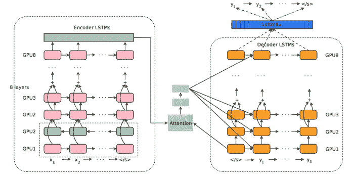
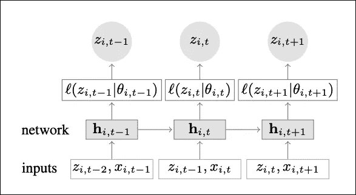
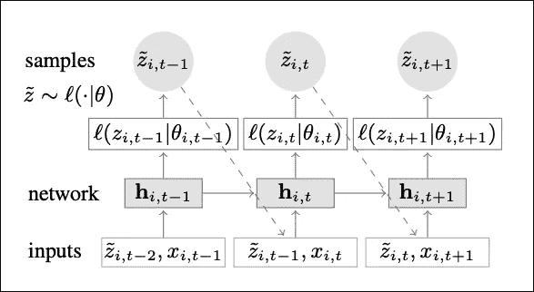
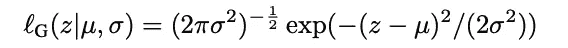
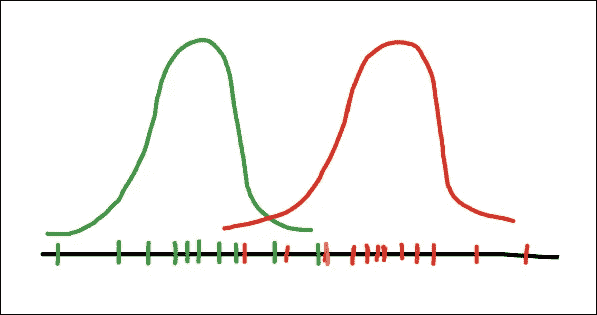
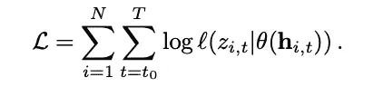
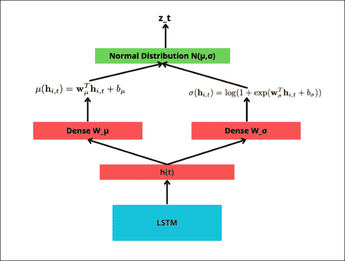
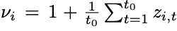

# DeepAR:通过深度学习掌握时间序列预测

> 原文：<https://towardsdatascience.com/deepar-mastering-time-series-forecasting-with-deep-learning-bc717771ce85>

## 亚马逊的自回归深度网络

创造了稳定的扩散[1]

**几年前，时间序列模型只能处理单一序列。**

因此，如果我们有多个时间序列，一种选择是为每个序列创建一个模型。或者，如果我们可以将我们的数据“列表化”,我们可以应用梯度增强的树模型——即使在今天也非常有效。

第一个可以本地处理多个时间序列的模型是**DeepAR【2】**，这是由**亚马逊**开发的*自回归递归网络*。

在本文中，我们将深入了解 *DeepAR* 如何工作，以及为什么它是时序社区的一个里程碑。

> 如果你想了解受 **DeepAR** 启发的其他深度学习模型，请查看这篇文章:

</the-best-deep-learning-models-for-time-series-forecasting-690767bc63f0>  

# 什么是 DeepAR

> DeepAR 是第一个将深度学习与传统概率预测相结合的成功模型。

让我们看看为什么 *DeepAR* 脱颖而出:

*   **多时间序列支持:**模型针对多个时间序列进行训练，学习进一步提高预测准确性的全局特征。
*   **额外协变量:** *DeepAR* 允许额外特性(协变量)。例如，如果你的任务是温度预报，你可以包括`humidity-level`、`air-pressure`等。
*   **概率输出:**该模型利用**分位数损失**来输出预测区间，而不是进行单一预测。
*   **“冷”预测:**通过从数以千计潜在共享一些相似性的时间序列中学习， *DeepAR* 可以为很少或根本没有历史的时间序列提供预测。

# DeepAR 的 LSTMs

DeepAR 使用 LSTM 网络来创建概率输出。

***长短期记忆网络*** *(* LSTMs)在众多的时间序列预测模型架构中使用:例如，我们可以使用:

*   普通 LSTMs
*   多层 LSTMs
*   带 CNN 的 LSTMs
*   带*时间 2 秒*的 LSTMs
*   编码器-解码器拓扑中的 LSTMs
*   带*注意***【3】**(**图 1** )的编码器-解码器拓扑中的 LSTMs

**图 1:** 谷歌神经机器翻译——GNMT 架构([来源](https://arxiv.org/pdf/1609.08144.pdf))

此外，虽然*变形金刚*确实在 NLP 领域占据主导地位，但在与时间序列相关的任务中，它们并没有决定性地胜过 LSTMs。主要原因是 LSTMs 更擅长处理本地时态数据。

关于**循环网络 vs 变压器的更多信息，**查看这篇[文章](/towards-data-science/deep-learning-no-lstms-are-not-dead-20217553b87a)。

# DeepAR —建筑

与之前的模型相反， *DeepAR* 使用 LSTMs 的方式有点不同:

DeepAR 没有使用 lstm 直接计算预测，而是利用 lstm 来参数化高斯似然函数。即估计高斯函数的`*θ = (μ, σ)*`参数(*表示*和*标准*偏差)。

**图 2** 和**图 3** 显示了 *DeepAR* 在*训练*和*推理*模式下的架构概况:

**图 2:** 训练期间 DeepAR 中的数学运算([来源](https://arxiv.org/pdf/1704.04110.pdf))

先说培训。假设我们在时间序列`i`的时间步`t`:

1.  首先，LSTM 单元将当前时间步`t`的协变量`x_i,t`和先前时间步`t-1`的目标变量`z_i,t-1`作为输入。此外，LSTM 接收前一时间步的隐藏状态`hi,t-1`。
2.  然后，LSTM 单元输出其隐藏状态`hi,t`，该隐藏状态被馈送到下一步骤。
3.  `*μ*` 和`*σ*` 值是从`hi,t`间接计算出来的，并且“成为”高斯似然函数 `*p(y_i|θ_i)= l(*z_i,t|Θι,t*)*`的参数。论文用希腊字母 theta `*θ = (μ, σ)*` *定义了这些参数。如果你不理解这部分，不要担心，我们稍后会更详细地解释。*
4.  换句话说，该模型试图回答这个问题:构造高斯分布的最佳参数`*μ*`**`*σ*`*是什么，该高斯分布输出尽可能接近目标变量`z_i,t`的预测？***
5.  ***训练步骤`t`到此结束。当前目标值`z_i`和隐藏状态`hi,t`被传递到下一个时间步骤，并且训练过程继续。由于 *DeepAR* 每次训练(和预测)单个数据点，该模型被称为**自回归。*****

****

****图 3:**DeepAR 训练推理中的数学运算([来源](https://arxiv.org/pdf/1704.04110.pdf))**

**推理的步骤几乎是一样的。**

**不过有一点改变了:现在，在每个推理步骤`t`，我们使用在之前的时间步骤`t-1`中采样的预测变量`ž_i,t-1`来计算新的预测`ž_i,t`。**

**记住，`ž_i,t`现在是从我们的模型在训练期间学习的高斯分布中采样的。但是，我们的模型并没有直接学习参数`*μ*` 和`*σ*` 。**

**我们将在下一节看到这些参数是如何计算的。**

# **高斯似然**

**在深入研究 DeepAR 的自回归特性如何工作之前，理解似然函数如何工作是很重要的。如果你熟悉这个概念，你可以跳过这一节。**

> **最大似然估计的目标是找到更好地解释样本数据的最佳分布参数。**

**让我们假设我们的数据遵循高斯(正态)分布。每个高斯分布由平均值`*μ*` 和标准偏差`*σ*` *、*即`*θ = (μ, σ)*` *参数化。*于是，高斯似然ℓ给出了`*θ = (μ, σ)*` 的定义为:**

****

**现在，看一下**图 4** :**

****

****图 4:**2 个高斯分布的最大似然估计(图片由作者提供)**

**我们有绿色和橙色的数据点，每一个都遵循不同的高斯分布。让我们假设给你这些数据点，你的目标是估计它们的两个高斯分布。**

**更正式地说，任务是在两个分布中找到最佳的`*μ*` *和* `*σ*`来最佳地拟合那些数据( *DeepAR* 假设只有一个分布)。在统计学中，这个任务也被称为最大化**高斯对数似然函数**:**

****

**对于所有时间步长`t` ⋹ `[t…τmax]`和`i` ⋹ `[1…N]`，函数被最大化，其中`N`是我们数据集中时间序列的总数。**

# **参数估计**

**在统计学中，参数`*μ*` *和* `*σ*` 通常是使用**mle 公式**(**m**maximum**l**og-likelihood**e**stimulator s)来估计的，这些公式是通过对似然函数进行微分而得到的。**

**我们这里不这么做。**

**相反，我们让 LSTM 和 2 个**密集层**基于模型的输入导出那些参数。这个过程如图**图 5:** 所示**

****

****图 5:`μ` 和 `σ` 的**参数计算(图片由作者提供)**

**估算`*μ*` 和`*σ*` 的过程很简单:**

*   **首先， **LSTM** 计算其隐藏状态`hi,t`。**
*   **然后，`hi,t`经过密集层`W_μ`计算平均值`*μ*` *。***
*   **同样，相同的`hi,t`通过第二个密集层`W_σ`并计算平均值`*σ*` *。***
*   **现在我们有了`*μ*`*`*σ*`*。*模型使用这些参数创建高斯分布，并采集样本。然后，模型检查该样本与实际观察值的接近程度`z_i,t`。***
*   **时间步长`t`的训练到此结束。LSTM 权重和两个密集层`W_μ`和`W_σ`在反向传播期间被训练。**

**换句话说， *DeepAR* 通过`hi,t,` `W_μ` 和`W_σ`间接计算`*μ*` *和* `*σ*` 。这样做是为了通过反向传播使他们的计算成为可能。**

**在推理过程中，我们没有目标变量`z_i,t`进行比较。 *DeepAR* 已经学习了所有的神经网络权重，并使用它们来创建预测`ž_i,t`。**

**就是这样！我们现在已经看到了 DeepAR 如何端到端地工作。**

**在接下来的章节中，我们将解释更多关于 *DeepAR* 的机制。**

> ****注:**估计的均值和标准差参数在统计学中正式用`μ hat`和`σ hat`符号化。**

# **自动缩放**

**处理多种不同的时间序列是棘手的。**

**想象一个**产品销售预测场景**:一个产品可能有几百个订单的销售额，而一个不同的产品可能有几百万个订单的销售额。**

**不同数量级的时间序列之间的这种巨大差异可能会混淆模型。为了克服这个问题， *DeepAR* 引入了一个**自动缩放机制。**更具体地说，该模型计算一个依赖于项目的`ν_ι`来重新调整自回归输入`z_i,t`。这由以下公式给出:**

****

**因此，在每个时间步`t`，来自前一步的自回归输入`z_i,t`首先被该因子缩放。**

> ****注意:**DeepAR 的自动缩放机制非常好用。然而，在实践中，最好首先手动标准化我们的时间序列。这样做将增强我们模型的性能。**

# **时序景观中的 DeepAR**

**在本节中，我们将讨论 *DeepAR* 如何与其他型号竞争，以及它的局限性。**

## **统计模型**

**作者表明 *DeepAR* 优于传统的统计方法，如 **ARIMA** 。此外， *DeepAR* 相对于那些模型的巨大优势是它不需要额外的特征预处理(例如，首先使时间序列平稳)。**

**亚马逊后来发布了一个更新版本，名为 **DeepVAR[4]** ，显著提高了性能。我们将在以后的文章中描述这个模型。**

## **深度学习模型**

**自从 *DeepAR* 发布以来，研究界已经发布了无数用于时间序列预测的深度学习模型。**

**并不是所有的都可以和 *DeepAR* 直接比较，因为他们的工作方式不同。据我所知，我能想到的最接近的是**时间融合变压器(TFT) [5]。****

**让我们来讨论一下 *DeepAR* 和 TFT 之间的两个显著区别:**

****1。多个时间序列** *DeepAR* 为每个时间序列计算一个单独的嵌入。这种嵌入被用作 LSTM 的一个特征，帮助 DeepAR 区分不同的时间序列。**

**TFT 也利用 LSTMs，工作方式类似。然而，TFT 使用这些嵌入来配置 LSTM 的初始隐藏状态`h_0`。这种方法好得多，因为 TFT 在每个时间序列上适当地调节 LSTM 单元，而不改变时间动态。**

****2。预测类型** TFT 不是*自回归*模型——它被归类为 ***多时段预测模型*** 。两种类型的模型都可以输出多步预测。然而，多时段预测模型一次生成预测，而不是像自回归模型那样逐个提供预测。**

**这种方法的优势在于，多时段预测模型可以为其协变量没有任何值的时间步长创建预测。TFT 在这方面表现出色，因为它是功能多样性最丰富的型号之一。**

# **结束语**

**DeepAR 是一个卓越的深度学习模型，是时间序列社区的一个里程碑。**

**此外，这种模型在生产中很普遍:它是亚马逊用于时间序列预测的 **GluonTS [6]** 工具包的一部分，可以在亚马逊 SageMaker 上进行训练。**

**在下一篇文章中，我们将使用 *DeepAR* 来创建一个端到端的项目。
敬请期待！**

# **感谢您的阅读！**

**我每个月写一篇有影响力的 AI 论文的深度分析。
**保持连接！****

*   **订阅我的[简讯](/subscribe/@nikoskafritsas)！**
*   **在 [Linkedin](https://www.linkedin.com/in/nikos-kafritsas-b3699180/) 上关注我！**

# **参考**

**[1]用稳定扩散创建，CreativeML Open RAIL-M license。文字提示:“穿越太空的星云，数码艺术，插画”**

**[2] D. Salinas 等 [*DeepAR:用自回归递归网络进行概率预测*](https://arxiv.org/pdf/1704.04110.pdf) *，*《国际预测杂志》(2019)。**

**[3]吴永辉等[谷歌的神经机器翻译系统:弥合人与机器翻译的鸿沟](https://arxiv.org/abs/1609.08144) (2016)**

**[4] D. Salinas 等 [*低秩高斯 Copula 过程的高维多元预测*](https://arxiv.org/pdf/1910.03002.pdf) *，*国际预测杂志(2019)。**

**[5] Bryan Lim 等人 [*用于可解释的多时间范围时间序列预测的时间融合变换器*](https://arxiv.org/pdf/1912.09363.pdf) (国际预测杂志，2021 年 12 月)**

**[6]亚马逊的 GluonTS 包，[https://ts . gluon . ai/stable/API/Glu onts/Glu onts . model . deepar . html](https://ts.gluon.ai/stable/api/gluonts/gluonts.model.deepar.html)**