# DeepMind 的 AlphaCode 解释道:你需要知道的一切

> 原文：<https://towardsdatascience.com/deepminds-alphacode-explained-everything-you-need-to-know-5a86a15e1ab4>

## 第一个在编程比赛中达到竞技水平的人工智能


弗洛里安·奥利佛在 [Unsplash](https://unsplash.com?utm_source=medium&utm_medium=referral) 上拍摄的照片

很长一段时间以来，编程一直是一项高地位、高需求的技能。

各行各业的公司和企业在非常基础的层面上依赖于人类开发人员的能力:编写和理解计算机语言的人。最近，随着大型语言模型的出现，AI 公司开始探索可以学习编码的系统的可能性。 [OpenAI 的 Codex](/heres-how-openai-codex-will-revolutionize-programming-and-the-world-e8432aafc5f7)——嵌入 GitHub Copilot——是第一个显著的例子。Codex 可以读取简单的自然语言命令和指令，并编写符合用户意图的代码。

然而，编写小程序和解决简单的任务“远非真实世界编程的全部复杂性。”像 Codex 这样的人工智能模型缺乏大多数程序员在日常工作中所依赖的解决问题的技能。这就是 DeepMind 想要用 [AlphaCode](https://www.deepmind.com/blog/article/Competitive-programming-with-AlphaCode) 填补的空白，AlphaCode 是一个经过训练的人工智能系统，可以“理解”自然语言，设计算法来解决问题，然后将它们实现为代码。

AlphaCode 展示了自然语言理解和解决问题能力的独特技能组合，结合了大型语言模型的统计能力特征。该系统在流行的竞争性编程平台 [Codeforces](https://codeforces.com/) 上与人类程序员进行了测试。AlphaCode 在 10 场竞赛中的平均排名为 54.3%，这使得它成为第一个在竞争性编程竞赛中达到人类程序员水平的人工智能。

我已经研究了 [AlphaCode 论文](https://storage.googleapis.com/deepmind-media/AlphaCode/competition_level_code_generation_with_alphacode.pdf)以理解 AlphaCode 是什么和不是什么，这些令人印象深刻的结果意味着什么，意味着什么，以及人工智能和人类开发者的未来。我还研究了人工智能专家和有竞争力的程序员对 AlphaCode 的看法，所以你有不同的独立观点来形成你自己的观点。

本文是一篇全面的综述，分为 6 个部分(及其各自的小节)。为清晰起见，我遵循本文的结构:

```
**1\. Setup: Competitive programming**
  1.1 What is competitive programming?
  1.2 The backspace problem
  1.3 Evaluating AlphaCode
**2\. AlphaCode: What it is and what it does**
  2.1 A brief overview of AlphaCode
  2.2 Model architecture
  2.3 Datasets: Pre-training (GitHub) and fine-tuning (CodeContests)
  2.4 Sampling, filtering, and clustering
**3\. Results**
  3.1 Codeforces competitions against humans
  3.2 CodeContests: Detailed performance analysis
  3.3 APPS: How AlphaCode compares to previous AI coding systems
  3.4 Qualitative results
**4\. Broader impact**
  4.1 Applications
  4.2 Potential risks and benefits
**5\. Reception and criticism**
  5.1 Looking at statistics from another perspective
  5.2 Human level is still light-years away
  5.3 Narrow AI vs broad humans
  5.4 Monkeys typing Hamlet
**6\. Conclusion**
```

我将在整篇文章中加入评论，以更深入地探讨一些问题、想法和结果。拥抱你自己，因为这是一篇很长的文章，但是一旦你读了它，你就会知道关于 AlphaCode 的一切，并且能够更好地理解未来的 AI 编码系统。

(如果你已经读过这篇论文，你可以跳到第 4-6 部分。)

# 1.设置:竞争性编程

## 1.1 什么是竞争性编程？

这是一项运动。全世界的程序员在互联网上相遇，并试图在一定的约束条件下解决问题，比如时间或语言。这些比赛，像 ICPC T1 和 T2 IOI T3，越来越受欢迎，每年都吸引成千上万的参与者。

一些比赛可以持续几周，而另一些则持续几个小时。这就是 DeepMind 测试 AlphaCode 能力的每周竞赛 Codeforces 的情况。参与者有 5-10 个问题描述(带有一些测试案例和相应的解释)，他们必须在大约 3 个小时内提交尽可能多的解决方案。根据正确提交的数量对他们进行评估——根据隐藏的测试用例进行测试——并对不正确的提交进行处罚。

竞争性编程需要一套非常特殊的技能，即使对人类来说也极具挑战性，而且它广受欢迎——这是测试 AlphaCode 能力的完美舞台。

## 1.2 退格问题

为了让你对解决竞争性问题有一个实际的感觉，让我们想想退格问题(1500 分的中等难度)。在退格问题中，你从两串英文字母“s”和“t”开始。这个想法是试图用退格键将 s 转换成 t。您必须键入 s，但您可以随时决定按退格键来删除前一个字母，而不是键入一个字母。你必须确定你是否能通过这个过程从 s 得到 t。

例如，如果 s=ababa，t=aba，答案是“是”您键入 s 的前四个字母(abab ),然后按 backspace 而不是最后一个字母，得到 aba。有些情况很简单，就像这个例子，但是对于复杂的测试例子来说就很棘手了。

这种性质的问题需要求解者经历一系列的步骤。首先，你需要了解问题的内容和限制(例如，按退格键只能在输入字母的*而不是*时完成，不能在字母之后)。第二，你必须想出一个有效的算法来满足需求并正确地覆盖所有的测试用例(至少，因为还有隐藏的用例)。第三，你必须用编程语言在代码上实现它，比如 Python。

AlphaCode 成功解决了退格问题，展示了与以前依赖显式指令的人工智能编码系统相比的改进程度。

为了理解这个过程有多微妙，以及 AlphaCode 的能力必须有多精确，让我们考虑一下问题描述中的“替代”一词。如果问题允许你在输入一个字符后按退格键*，那么问题、算法和程序就需要完全不同。这个细微的细节很容易被人忽略。然而，AlphaCode 设法解决了这个问题和许多其他类似的问题。*

## 1.3 评估字母代码

DeepMind 在 Codeforces 上测试了 AlphaCode，以将其与人类程序员进行比较。然而，Codeforces 的评估系统对于那些想在这些发现的基础上发展的人来说并不是一个容易复制的基准。这就是为什么 DeepMind 提出了一个通用的度量标准:n@k。

该指标被定义为“每个问题使用 k 个样本中的 n 个提交解决的问题的百分比”，它与 Codeforces 评估提交的方式非常相似。AlphaCode 允许生成 k 个样本(最大范围为 100K-1M ),从这些样本中，系统可以提交 n 个解决方案(n≤k)进行评估。如果 n 次提交中至少有一次解决了问题，AlphaCode 就成功了。

DeepMind 的研究人员使用 10@k 来评估 Codeforces 上的 AlphaCode，模拟不正确提交的惩罚条件。他们使用 pass@k 对系统进行了进一步评估——提交所有样本进行评估。它衡量潜在的最大成功率(并允许与以前的系统如 Codex 进行比较)。

# 2.字母代码:它是什么和它做什么

## 2.1 字母代码的简要概述

1.  预训练:AlphaCode 是一个基于 transformer 的大型语言模型，最初在 GitHub 代码库中进行训练(与 Codex 的方式类似)。
2.  微调:DeepMind 创建了一个名为 CodeContests 的竞争性编程数据集，以微调和专门化 AlphaCode。它弥补了竞争性编程问题的公开例子数量少的不足。
3.  生成:对于每个 Codeforces 问题，AlphaCode 会生成多达一百万个样本(k)。
4.  过滤和聚类:通过在可见的测试用例上评估来过滤样本。在丢弃了那些没有通过测试的样本之后，它们根据它们对定制测试用例的输出对剩余的样本进行聚类(参见第 2.4 节)。然后，他们选择候选人进行评估(n)。

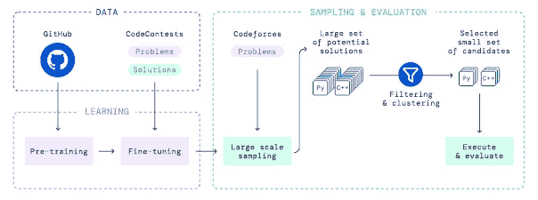

图 AlphaCode 概述

## 2.2 模型架构

DeepMind 创建了五种尺寸的 AlphaCode 模型:300M、1B、3B、9B 和 41B 参数。所有这些都被命名为 AlphaCode，但该公司在他们的通信中提到的一个(它产生了最好的结果)是 9B 和 41B 模型与聚类相结合的集合。他们建立了不同规模的模型，以比较规模、训练时间和计算效率等因素的影响(见第 3.2 节)。

## 2.3 数据集:预训练(GitHub)和微调(CodeContests)

所有模型都在一个包含大约 700 GB GitHub 开源代码的数据集上进行了预训练。这使得 AlphaCode 能够学习代码表示，并解决简单的显式任务，就像以前的 AI 编码系统一样。

这些模型随后在 CodeContests 上进行了微调，CodeContests 是 DeepMind 设计的一个定制竞争编程数据集。这一步不包括 DeepMind 的过程，并允许 AlphaCode“适应目标竞争编程领域”。CodeContests 是来自 Codeforces、Description2Code 和 CodeNet 的问题、解决方案、测试案例和元数据(难度等级和类型标签)的汇编。

代码竞赛最初有一个主要问题:误报。因为测试数据很少，AlphaCode 可以产生被标记为正确的解决方案——因为它们解决了可见的测试用例——但实际上是不正确的。一个相关的问题是“慢阳性”。正确但算法效率低下的解决方案。这个问题在以前的人工智能编码数据集如 APPS 和 HumanEval 中普遍存在，误报率为 30–60%。

DeepMind 的研究人员找到了一个解决方案。他们通过改变现有的测试用例生成了额外的测试用例:“随机增加或减少整数，交换和改变字符串中的字符。”然后用正确的解决方案验证这些测试。结果令人印象深刻，将假阳性率降低到了 4%。

## 2.4 采样、过滤和聚类

一旦模型被完全训练，他们必须生成样本。为了获得最佳性能，他们对每个问题取样多达一百万个解决方案。为了使如此大量的样本多样化，他们混合了 Python 和 C++解决方案，使用了高温、随机标签和评级。

为了从庞大的样本库中进行选择，并模拟竞争性编程竞赛的条件，他们应用了过滤和聚类，将数十万个样本减少到 10 个提交。消除坏样本的直接方法是在可见的测试用例上过滤它们，并移除不正确的解决方案。

对可见测试进行过滤会移除绝大多数样本。似乎对数十万个错误的解决方案进行采样对于 AlphaCode 取得如此令人印象深刻的结果至关重要。这与人类通过几次尝试就能找出正确解决方案的能力形成对比。这让我想起了有监督的深度学习系统在分类任务中看到成千上万个例子才能区分它们的必要性，而人类几乎不需要几个例子。

过滤去除了+99%的样本，但仍留下数千个潜在的提交。为了进一步将样本数量减少到 10 个，DeepMind 的研究人员想出了一个聪明的过程。他们从样本中提取聚类，将语义上(而非句法上)等价的解决方案分组。

为此，他们在相同的 GitHub 数据集上使用与主模型相同的架构预训练了一个测试输入生成模型。想法是让模型为问题生成新的测试输入。AlphaCode 的样本可以通过这些新的测试进行评估——不一定有效或正确，但不管怎样都是有用的。然后，被评估的样本根据他们对新测试给出的答案进行分组——错误的答案比正确的答案提供了更多的信息。

为了选择 10 个提交样本，他们发现从最大到最小的每个集群中选择一个样本可以获得最佳性能。

# 3.结果

## 3.1 Codeforces 与人类的竞赛

在 Codeforces 上评估 AlphaCode 有两个独特的特性。首先，它防止系统利用数据集的弱点，如误报。第二，它将 AlphaCode 与“这项任务中表现最好的人类竞争者”进行了比较。在人类 ELO 等级中排列 AlphaCode 让我们对这些系统的技术水平和真正能力有一个清晰的认识。

DeepMind 的研究人员模拟运行 AlphaCode live，并向 Codeforces 平台提交了每次比赛的 10 个解决方案。结果是 10 场比赛的平均值。取得最佳成绩的 41B+9B 字母代码组合获得了 54.3%的估计平均排名(表 1)，这相当于 1238 的 ELO 评级——在过去 6 个月中至少参加过一次比赛的参与者中排名前 28%(图 2)。

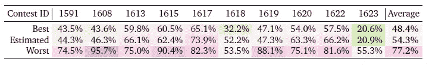

表 Codeforces 上的 AlphaCode 结果。每次竞赛的最佳、预计和最差排名。平均估计排名为 54.3%，将 AlphaCode 置于人类竞争性程序员的水平。

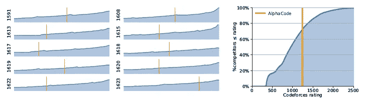

图 Codeforces 上的 AlphaCode 结果。ELO 评分为 1238，在过去 6 个月内至少参加过一次比赛的所有参与者中排名前 28%。

作者表示，“据我们所知，这是计算机系统首次在编程竞赛中与人类参与者竞争。”Codeforces 创始人 Mike Mirzayanov 表达了他的敬畏和兴奋:“我可以有把握地说，AlphaCode 的结果超出了我的预期。我对此持怀疑态度，因为即使在简单的竞赛问题中，也经常需要不仅实现算法，而且(这是最困难的部分)发明算法。AlphaCode 的表现达到了一个有前途的新竞争对手的水平。我迫不及待地想知道前方会发生什么！”

为了正确看待这些结果，我想提出两个条件。

首先，人类顶级表演者达到 90%左右的收视率。AlphaCode 的成就令人印象深刻——该系统本身，包括训练过程和采样选择程序，是人工智能编码的一次飞跃——但将其与人类进行比较很容易被夸大。竞争性编程需要一套 AlphaCode 所缺乏的能力，并通过采样数十万个解决方案来弥补。

其次，DeepMind 又重复了三次评估过程，以评估 10 次提交和无限制提交设置的差异和性能。他们发现，在模型的不同运行中，一些比赛的排名可能会有 30%的差异。例如，在竞赛#1618 中，对于 10 次提交的设置，AlphaCode 得分为 62.3%、32.1%和 62.3%。

估计评级中 30%的变化揭示了 AlphaCode 可能不够健壮而不可靠。然而，在无限制提交的设置中，AlphaCode 表现出了更稳定的性能——这进一步强调了 AlphaCode 对提交许多样本解决方案的依赖，这使得它几乎无法与人类相提并论。

有趣的是，由于计算能力的限制，研究人员没有对模型进行重新采样。他们在所有的评估中使用相同的样本，但以不同的顺序绘制，并用不同的种子进行聚类。据推测，重新训练和重新采样模型会产生更高的方差。

## 3.2 代码竞赛:详细的性能分析

除了评估 Codeforces 上的 AlphaCode，DeepMind 还评估了 CodeContests 数据集上的模型。Codeforces 的结果允许研究人员与人类参与者进行比较，CodeContests 的结果允许他们对 AlphaCode 的行为和表现进行深入分析。

与 Codeforces 的比赛一样，他们使用了我已经提到的两个版本的度量标准 n @ k:10 @ k 和 pass@k。第一个评估了当他们需要从更大的样本集中缩减提交集时模型的表现——过滤和聚类过程有多好。第二个评估样本生成过程 AlphaCode 在创建可以解决竞争问题的代码方面有多好。

41B 模型结合聚类给出了 10@k 度量的最佳结果。使用 100 万个样本，它在验证集中实现了 34.2%的解决率(表 2)。

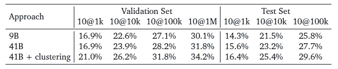

表 2:代码竞赛的 AlphaCode 结果。41B 模型总是比 9B 模型好，聚类在所有情况下都改善了结果。

**3.2.1 对求解速度的影响:参数、数据集、样本和计算**

DeepMind 的研究人员进一步研究了一系列特征对解决率的影响:模型的大小(参数数量)、数据集的大小、样本预算和计算预算。

正如预期的那样，解决率随着**参数计数**的增加而增加，在所有条件相同的情况下，9B 和 41B 型号大大超过了其他型号。

他们还改变了 1B 模型微调数据集中的问题和解决方案的数量，并发现了另一个预期结果:增加**数据集大小**提高了样本预算所有范围内的解决率(图 3)。

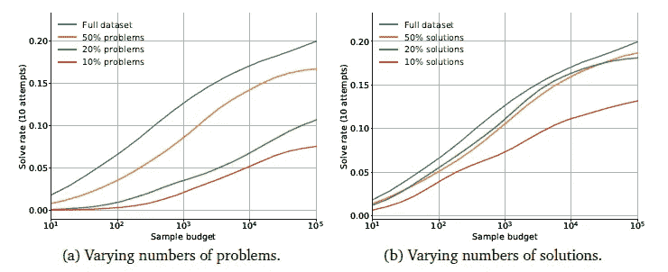

图 3:从 10 到 10K 的样本预算中，解决率随着数据集规模的增加而增加(增加了问题和解决方案的数量)。

在 10@k 和 pass@k 指标中，当增加样本的**数量**时，求解速率呈对数线性变化(图 4)。这两个图的差异突出了样本选择的重要性(pass@k 测量上限，即过滤和聚类完美完成的情况)。

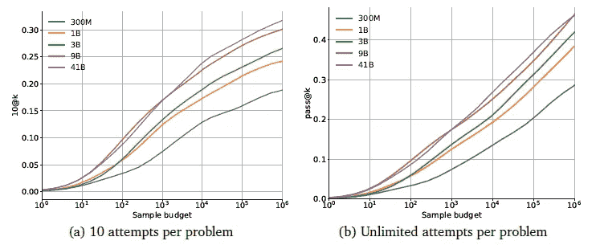

图 4:在 10@k 和 pass@k 两种情况下，当增加样本预算时，模型大小的求解率都有所提高。

有趣的是，在 10@k 的情况下，尽管提交的数量保持不变，但更多的采样改善了结果。充分搜索解决方案空间与充分选择提交内容同样重要。然而，DeepMind 的研究人员提到，由于采样成本，试图通过这种方式提高性能变得非常困难。

此外，在给定样本预算的情况下，较大的模型性能更好，并且随着样本预算的增加，它们的性能会进一步提高。从经济角度来说，如果我们想提高性能，增加模型的大小比样本预算更可取。

用**训练计算**求解比例(图 5a)。它还与**采样计算**成比例(图 5b)。我们可以看到，较大的模型需要更多的计算能力来生成样本，但最终，随着计算能力的提高，最佳模型大小也会增加。这意味着，如果我们有更大的计算机，我们可以更好地利用更大的模型，并充分利用它们的能力来产生更好的样本。

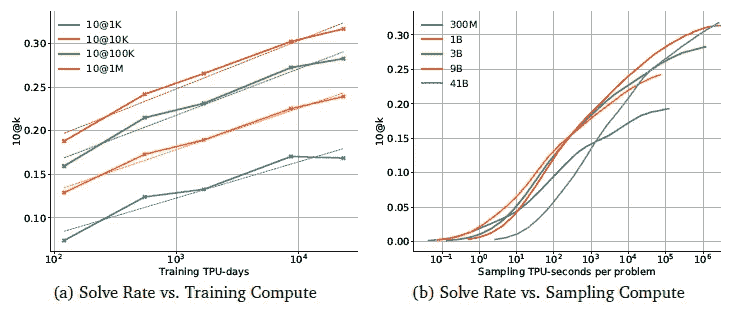

图 5:解决率随着训练计算(较大的模型性能更好)和采样计算(较大的模型需要更多的计算能力，但性能更好)而增加。

**3.2.2 对求解率的影响:过滤和聚类**

研究人员发现，过滤过程移除了模型大小中 99%的样本(表 3)。随着模型变得越来越大，他们也越来越擅长产生通过示例测试的样本。在 100K 个样本中，所有模型至少有一个样本通过了+80%问题的示例案例(41B 模型为+90%)(表 3)。(请记住，通过示例测试的样本不一定是正确的。)

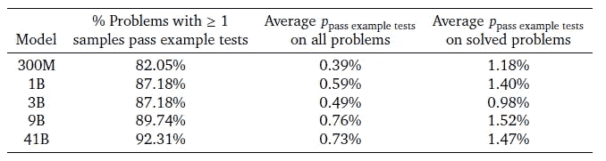

表 3:过滤过程去除了+99%的样本。模型很可能找到至少一个通过示例测试的样本(+80%)。

研究人员还研究了过滤和聚类对解决率的影响。他们比较了四种情况(图 6):随机提交 10 个样本(没有过滤，没有聚类)。过滤后随机提交 10 个样本(无聚类)，提交 10 个具有完整过滤-聚类过程的样本，提交所有样本进行评估(pass@k)。

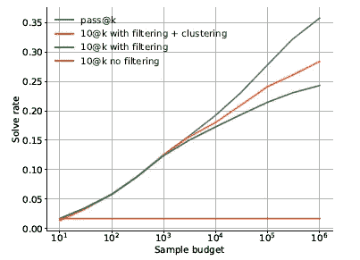

图 6:过滤和聚类对解决率的影响:两者都有帮助，但仍远未达到理论上的最大值。

他们发现过滤和聚类提高了解决率(在大样本预算下更是如此，因为选择的影响越来越大)。尽管如此，即使将这两种技术结合起来，结果也远未达到理论上限。这意味着选择是至关重要的，但也是可以改善的。

## 3.3 应用程序:AlphaCode 与以前的人工智能编码系统相比如何

为了与以前的模型如 Codex 和 GPT-尼奥进行比较，他们在 GitHub 上预先训练了 1B 模型，并在应用程序上对其进行了微调(没有聚类)，其中包括 10，000 个竞争性编程问题。

他们发现，在 1B，AlphaCode 已经在三项任务(介绍、面试和竞争)上超过了 GPT-尼欧，在面试和竞争方面超过了 Codex(表 4)。

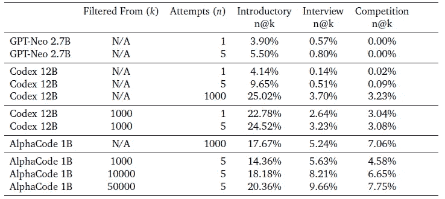

表 4: AlphaCode 1B、Codex 12B 和 GPT-Neo 2.7B 在应用程序上的比较。AlphaCode 总体上更好，除了对 Codex 的介绍性任务。

这些结果无疑将最好的 AlphaCode 模型放在了人工智能编码系统的第一位，并将 DeepMind 授予了人工智能树另一个分支的宝座——与国际象棋和围棋的 AlphaZero、电子竞技的 AlphaStar、生物学的 AlphaFold 和 NLP 的 Gopher 一起。

## 3.4 定性结果

**3.4.1 从训练数据复制**

AlphaCode 的一个可能的限制，上面的分析很难发现，是一种假设的倾向，即记忆来自训练集的代码块，以解决验证集和现实世界中的看不见的问题。

为了测试 AlphaCode 是否参与这些行为，研究人员分析了它的编程模式。他们将它与人类进行了比较，看两者在多大程度上倾向于逐字使用训练中的代码。他们发现他们的分布非常相似——他们几乎不使用直接从数据集提取的大块代码(图 7)。

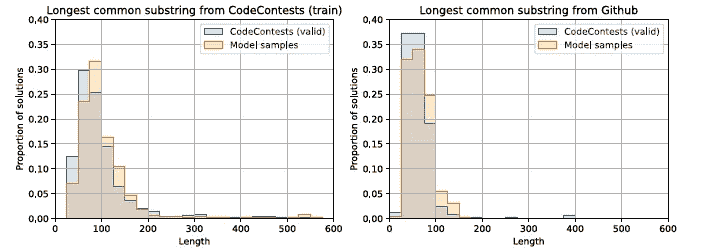

图 7: AlphaCode(橙色)和 human(蓝色)在解决方案和训练数据之间有相似的公共代码字符串分布。

这表明 AlphaCode 和人类都不是通过复制代码来解决问题，而是通过正确处理问题描述。

**3.4.2 模型解特征**

AlphaCode 倾向于在 Python 上更好地编程(C++语法更难)，它产生的死代码(编写的代码，但不提供解决方案)数量与人类相似。随着模型变得越来越大，它们总是能更好地解决跨类型标签的问题。模型也更擅长解决难度评级较低的问题。

**3.4.3 对问题描述和元数据的敏感性**

测试这些参数对于抛弃 AlphaCode 通过尝试每种问题类型的许多不同可能性来解决问题的可能性是至关重要的，只要它处理一个关键字(例如，如果单词“prime”出现在描述中，则尝试与质数相关的所有类型的程序)。

他们发现，当信息模糊时，解决率会下降。特别是，当模型被给出相关但不同的问题时，以及当描述中的部分被删除或文字被删除时，解决率大大恶化。有趣的是，当描述简化时，解决率会增加——这进一步加强了 AlphaCode 对其显著但有限的语言理解技能的依赖。

模型也会受到元数据变化的影响。研究人员发现，在样本之间随机分配标签更好，因为它使模型能够尝试更多样化的解决方案。

# **4。更广泛的影响**

人工智能编码模型和其他大型语言模型一样，对社会非常有益。熟练的模型可以集成到不同的应用程序中，方便人类程序员的日常工作，降低非程序员的准入门槛。

但是它们也会造成伤害。DeepMind 的研究人员研究了这些模型总是伴随着的潜在风险——从偏见和毒性到环境影响，再到未来的文明水平威胁。

## 4.1 应用

人工智能程序员的一个直接现实应用是成为人类的配对程序员。在大型语言模型出现之前，开发人员使用代码生成器。它解决了时间问题，有助于专注于非重复性、高认知性的任务。人工智能系统可以显著改善这种共生关系。它们可以生成更好的代码，完成更复杂的任务，甚至可以缓解沟通上的限制。

在未来，这纯粹是猜测，人工智能编码系统可能会继续让人类远离计算机语言的趋势。首先，我们用机器语言编程，然后用汇编语言编程，然后我们设计更高级的编程语言。人们可能很快就会用我们更熟练的语言与人工智能系统交流；自然语言。

快速工程和无代码迁移是朝着这个方向迈出的第一步。如果我们可以简单地用英语与人工智能交谈——就像我们现在与 Codex 交谈一样，但更好——并获得有用的建议和解决方案，会怎么样？人类程序员可以专注于他们觉得更有成就感的任务(想象一下钢铁侠和贾维斯的关系)。

人工智能编码系统也可以消除非程序员的进入壁垒。不是让编程工作变得无关紧要，而是解决简单的任务，这些任务对开发人员来说微不足道，但对非技术人员来说却意义重大(例如，在银行、管理、金融、销售等领域)。)

## 4.2 潜在风险和收益

4.2.1 可解释性:为什么 AlphaCode 做它要做的事情？

神经网络中一个众所周知的问题是它的“黑箱”性质，这个问题在大型语言模型中会变得更糟。神经网络为什么以及如何做它所做的事情是我们通常没有答案的问题。其固有的随机性和统计性使得投入产出关系很难追踪。

作者解释说，编码模型更容易研究，因为生成的算法可以正常测试。"代码生成模型输出的代码是人类可读的，可以用传统方法分析."然而，输入一个问题描述和得到一个程序作为输出之间的过程仍然是不可理解的。

一旦代码生成了，我们可以很容易地分析它，但是如果代码是错误的呢？调试它和调试任何其他类型的神经网络一样困难。

**4.2.2 概括——而不是外推**

对非分布数据的性能是神经网络的一个弱点。DeepMind 的研究人员表示，对于人工智能编码系统来说，这个问题并不存在:“通过足够多的测试会使代码更有可能通过甚至是非分布测试。”但是他们混淆了概括和推断。一般化不足以解决非分布情况，这只有在模型具有外推能力的情况下才有可能。

如果一个神经网络被训练来识别猫，并且它主要在房子里看到猫，它可能识别野生的猫(泛化)，但不能将学习过程外推至房子或人。编码模型也是如此。竞争问题描述有一个非常特殊的风格和格式。如果我们在足够不同的输入上测试 AlphaCode，它不会表现出这么好的性能。神经网络在训练范围内非常擅长概括，但在训练范围之外却不行。

外推不同于一般化，[对于任何类型的神经网络都是有问题的](https://medium.com/analytics-vidhya/you-dont-understand-neural-networks-until-you-understand-the-universal-approximation-theorem-85b3e7677126)。这就是缺货的原因。正如我在[之前的一篇文章](/what-they-dont-tell-you-4-ways-humans-still-vastly-outperform-ai-ba640aae0d4)中所写的:“机器学习系统无法执行这个过程，很大程度上是因为‘独立同分布(iid)’假设。它声称真实世界的数据和训练数据具有相同的分布，这是错误的。”

**4.2.3 偏见、公平和代表性**

像其他神经网络一样，编码系统将重现训练数据中存在的偏差。这些偏见包括对边缘化少数群体的歧视，通过定型观念的延续，以及使用过时的库，这可能导致性能和安全问题。

这个问题在大型语言模型(编码模型是其中的一种特殊类型)中普遍存在，只要我们继续从互联网上提取数据，这个问题就会一直存在。

**4.2.4 安全**

除了与过时代码相关的问题，人工智能编码系统可能会帮助恶意行为者以更高的速度生成更高级的恶意软件。

**4.2.5 环境影响**

大型语言模型消耗大量的计算能力。据估计，训练 GPT 3 号产生的碳足迹大约相当于[驾驶一辆新车往返月球](https://www.theregister.com/2020/11/04/gpt3_carbon_footprint_estimate/)。

在过去十年中，用于训练神经网络的计算资源急剧增加。从 2012 年到 2018 年，消费金额增长了 30 万倍。这相当于每 3.4 个月翻一番。

编码模型有一个额外的计算开销来源:采样。AlphaCode 要求每个问题有几十万个样本才能达到人类的平均表现。研究人员强调，尽管采样显著提高了解决率——在其他条件相同的情况下——但试图通过这种方式获得更好的结果很快就变得“令人望而却步”

与其他类型的神经网络相比，编码系统的主要优势在于，一旦生成了成功的程序，就可以在常规计算机上轻松、廉价地运行。此外，谷歌关于环境影响的政策的一个特殊性是，该公司购买“与消耗量相等的可再生能源”。

**4.2.6 知识产权**

知识产权仍然是 GitHub 和微软发布 GitHub Copilot 时提出的一个重要问题。人们过去(现在也是)担心生成的代码侵犯了合法性。

一位用户[向](https://news.ycombinator.com/item?id=27676939) GitHub 首席执行官 Nat Friedman 询问 Copilot 生成的代码属于哪种许可——如果代码违反了法律，谁该负责。弗里德曼回答说，“在公共数据上培训 ML 系统是合理使用”，这是只有法官有权声称的事情。即使以前的类似系统是真的，这个问题仍然是开放的。

Flask 的创造者阿明·罗纳彻[向](https://twitter.com/mitsuhiko/status/1410886329924194309)展示了 Copilot 如何在版权所有的许可下生成代码，比如 GPL(衍生作品在法律上必须在同一许可下)。这使得在商业项目中使用 Copilot 很危险，因为商业项目可能希望获得闭源许可。

DeepMind 的研究人员指出，AlphaCode 的训练数据已经根据许可证进行了仔细过滤。尽管如此，使用在开源许可下授权的代码需要适当地归功于作者——否则，它被认为是剽窃。这只是知识产权和开源许可合规性这个经常模糊的世界中的一个例子。

**4.2.7 自动化**

对于技术和人工智能，尤其是代码生成系统，一个常见的担忧来源是它们取代人类工人的潜力。自从技术存在以来，它就一直在夺走人类的工作——尽管最终，它创造的工作岗位会比它耗费的多，但受益者很少是最初在职业上受到伤害的人。

随着深度学习系统的出现，人工智能现在能够完成许多狭窄的任务。曾在苹果、微软和谷歌担任高管的人工智能专家李开复认为 [40%的工作可能在未来 15 年](https://www.cbsnews.com/news/60-minutes-ai-facial-and-emotional-recognition-how-one-man-is-advancing-artificial-intelligence/)(他在 2019 年说过这话)。

OpenAI 的首席执行官 Sam Altman 在去年六月做了一个非常规的预测:

他指的是大型语言模型的总体效果。人工智能编码系统没有什么不同。他们可以促进程序员的工作，直到他们变得足够好，以减少人类员工的比例。在供应增加的同时，对人类程序员的需求可能会减少，这将造成供应过剩的局面，压低工资和就业机会。

一个常见的反对理由是，正如 ide 和编译器所发生的那样，程序员的工作可以简单地转向只有人类才能完成的更复杂的任务。我同意这种可能性，但如果我们从技术的历史中学到了什么，那就是总有一些人跟不上快速的进步。我们不应该忘记他们，否则就太晚了。政府必须提供安全网，并建立其他更具雄心的措施，如普遍基本收入，以保护人们免受自动化世界即将到来的现实的影响。

**4.2.8 高级人工智能风险**

DeepMind 研究人员关于这种风险的说法让我产生了奇异的共鸣:“从长远来看，代码生成可能会导致高级人工智能风险。编码能力可能会导致能够递归编写和自我改进的系统，从而迅速导致越来越先进的系统。”

自该领域诞生以来，专家们一直在警告人工智能推翻人类的可能性。目前还不清楚这是否会发生或何时发生。乐观的人说，再过一二十年，机器的智能可能会超过我们。其他人对这个问题持怀疑态度，因为现实世界中的规划、决策或常识推理等能力发展缓慢。

然而，无论它永远不会发生，还是在遥远的未来，或者我们即将进入一个通往超级智能的不归路，我们都应该为这种可能性做好准备。这就是为什么该领域的一些专家认为这是人工智能提出的最重要的问题。我们如何才能建立一个人工智能，以便一旦它比我们更聪明，它的内部机制——我们希望人工智能的重新设计技能仍然无法达到——保持它与我们的价值观和福祉一致？

这个问题不仅从科学的角度来看很难——将“价值”或“福祉”的概念转化为人工智能的数学本质是极其困难的——而且从伦理的角度来看也是如此。我们如何定义价值观，才能不让一个人掉队？有没有可能定义一套我们共有的普世价值，在一个由机器主宰的世界里确保最低限度的福祉？

我可以就这个话题写几篇文章。结论应该是，如果更先进的人工智能系统真的有可能自我改进，那么我们应该在构建未来的人工智能编码系统时考虑这一点(而不仅仅是作为论文结尾“风险”部分的一个注释)。否则，当我们争论这种可能性的存在时，系统将会自我复制。

# 5.接受与批评

到目前为止，我已经审查并评论了 DeepMind 的 AlphaCode 论文(除了一些高度技术性或不太有趣的部分)。本部分旨在包括和浓缩竞争性编程和人工智能领域专家的观点、见解和思考。

这个想法是将 AlphaCode(第 1-4 节)的结果和意义的客观分析与一些主观的外部分析结合起来。它将让你更好地了解什么是 AlphaCode，它有什么功能，以及它的局限性，还有人们对它的看法，以及他们如何看待它在更广泛的社会背景下的影响。

## 5.1 从另一个角度看统计数据

Horace He 重新审视了 AlphaCode 的结果，并对其进行了透视。我们知道统计数据很容易被修饰，这取决于你如何看待它们——他对 AlphaCode 结果进行了去修饰。

为了评估何的说法，我检查了三个 DeepMind 账户( [SelectorUnlimited](https://codeforces.com/submissions/SelectorUnlimited) 、 [WaggleCollide](https://codeforces.com/submissions/WaggleCollide) 和 [AngularNumeric](https://codeforces.com/submissions/AngularNumeric) )上每场比赛的 AlphaCode 提交内容。

我发现他基本上是对的。

以下是综合三个帐户提交的结果(div#表示问题的难度，div 1 最难，然后是 div 2，依此类推):

*   竞赛 1591:已解决 2/6 —估计排名:44.3%(第 2 部分)
*   竞赛 1608:解决了 1/7 —估计排名:46.3%(第 1 部分+第 2 部分)
*   竞赛 1613:已解决 3/6-估计排名:66.1%(第 2 部分)
*   大赛 1615:解决了 3/8 —估计排名:62.4% (-)。
*   竞赛 1617:解决了 1/6 —估计排名:73.9%(第 2 部分)
*   竞赛 1618:解决了 4/7 —估计排名:52.2%(第 3 部分)
*   竞赛 1619:解决了 3/8-估计排名:47.3%(第 3 区)
*   竞赛 1620:已解决 2/7 —估计排名:63.3%(第 2 部分)
*   竞赛 1622:已解决 2/6 —估计排名:66.2%(第 2 部分)
*   竞赛 1623:已解决 2/5 —估计排名:20.9%(第 2 部分)

AlphaCode 总共解决了 66 个问题中的 23 个。这是 34.8%的解决率，与 DeepMind 强调的 54.3%的结果形成鲜明对比。

排名百分比(AlphaCode 以上的参与者数量)对解决率说明不了什么。关键隐藏变量不会反映在排名值上(例如，问题有多难，或者解决了多少字母代码)。解决 7 个中的 1 个(竞赛 1608)使其处于参赛者的上半部分(46.3%)，而解决 6 个中的 3 个(竞赛 1613)仅使其达到 66%的百分位数。

此外，问题按难度排序，对于每场比赛，AlphaCode 几乎总是解决最简单的问题(即，如果 AlphaCode 解决了三个问题，它们是 A、B 和 C)。

在查看统计数据时，重要的是从不同的角度来全面了解正在发生的事情。与以前最先进的模型相比，AlphaCode 的结果是疯狂的。该系统本身是代码生成系统的巨大飞跃。然而，它可能没有 54.3%的平均排名所暗示的那么好。

## 5.2 人类水平还差几光年

魁北克人工智能研究所 Mila 的成员 Dzmitry Bahdanau 和代码力量专家 T1(约 2200 ELO)在关于字母代码能力的讨论中发表了自己的意见。他客观地肯定了 AlphaCode 处于普通人类程序员的水平——我们已经在许多[科技](https://www.genbeta.com/desarrollo/google-crea-alphacode-ia-que-afirman-que-buena-programando-como-desarrollador-promedio) [新闻](https://www.theverge.com/2022/2/2/22914085/alphacode-ai-coding-program-automatic-deepmind-codeforce) [媒体](https://techmonitor.ai/technology/ai-and-automation/deepmind-alphacode-ai-software-developer)的标题中看到了这一点。

Bahdanau 指出，“许多参与者是高中生或大学生，他们正在磨练解决问题的技能。”这可以解释一些比赛中高排名和低解决率之间的差距——如果大多数参与者都在学习，预计 AlphaCode 会超过他们，即使它整体上做得不是很好。

他提到时间限制是这些比赛中的一个“关键难点”。人类有 3 个小时来解决 5-8 个问题，而 AlphaCode 利用其超人的计算能力来克服这一限制。AlphaCode 被限制只能提交 10 个样本，以模仿编程竞赛的特质，但这并不妨碍该系统抽取多达 100 万个样本。人类参与者在解决问题时感受到的时间压力，或者与意外错误相关的问题对于 AlphaCode 来说并不存在。

他还提到，竞争性编程通常不太依赖创造力。“从我的经验来看，这确实需要写很多样板代码，”他说。"许多问题涉及标准算法的部署."尽管 DeepMind 得出结论，AlphaCode 不会从训练数据中复制(至少不会比人类复制更多)，但 Bahdanau 认为，更改变量名称将不再是复制。他建议更彻底地研究这个潜在的问题，例如使用“使用神经表征找到的最近邻解决方案”

他总结说，AlphaCode“在击败人类方面不是 AlphaGo，在彻底改变整个科学领域方面也不是 AlphaFold。”

## 5.3 狭义人工智能对广义人类

科技博客 TechTalks 的作者本·迪克森(Ben Dickson)在他的文章“[什么是 DeepMind 的 AlphaCode，什么不是](https://bdtechtalks.com/2022/02/07/deepmind-alphacode-competitive-programming/)”中分析了 AlphaCode 的能力。他强调的一个关键观点是，我们可能会无意识地将“AlphaCode 在编程比赛中达到了具有竞争力的性能水平”这句话与一个更广泛、更雄心勃勃的说法等同起来:“AlphaCode 与普通人类程序员一样好。”

他说，谬误在于我们“将狭隘的人工智能与人类解决问题的一般能力相比较。”例如，一个伟大的棋手很可能发展了其他相关的能力，比如“计划和策略”相反，alpha zero——目前最好的人工智能棋手——只知道下棋。它永远无法像人类那样将这些技能推广到其他真实世界的场景中。

> “竞争性编程也是如此。一个在编码挑战中达到竞争水平的人类程序员已经花了数年时间学习。他们可以抽象地思考问题，解决更简单的挑战，编写简单的程序，并表现出许多其他被认为是理所当然的技能，这些技能在编程竞赛中不会得到评估。”

纽约大学人工智能教授加里·马库斯(Gary Marcus)与这些思考不谋而合。他告诉[美国消费者新闻与商业频道](https://www.cnbc.com/2022/02/08/deepmind-openai-machines-better-at-writing-their-own-code.html#:~:text=%E2%80%9CYou%20should%20think,away%20from%20that.%E2%80%9D)“你应该把[AlphaCode]看作是程序员的助手，就像计算器曾经帮助会计一样……它不会取代真正的人类程序员。我们还需要几十年的时间。”

如果一名人类开发人员申请一份工作，评估将围绕硬编程技能——人工智能编码系统最有可能擅长的技能。但这只是因为我们人类拥有的所有其他能力，尤其是从事开发人员工作所需的能力，都被认为是理所当然的。这些是人类程序员的基线，但不是像 AlphaCode 这样的系统。

如果一个人类程序员有一个问题，并且已经尝试了他们手中的一切来解决它，它可以简单地说“嘿，你能帮我吗？”给队友。这是一个人技能组合中的终极工具，AlphaCode 无法与之竞争。

## 5.4 猴子打哈姆雷特

纽约大学计算机科学教授 Ernest Davis 在《脸书邮报》上评论了 AlphaCode。他说，这是“令人印象深刻的成就”。“AlphaCode 生成的代码通常有 20 行长，错综复杂，非常聪明，绝不是千篇一律的。英语规范和代码特征之间的关系是相当间接的。”这加强了字母代码语言理解和编码能力是一流的结论。

像他的同事加里·马库斯一样，他不同意“[AlphaCode]和普通人类程序员一样好”的论断 AlphaCode 为每个问题生成了多达一百万个样本，而且几乎没有一个通过测试，即使是输入了问题描述的示例测试。“这里有相当多的猴子在模仿哈姆雷特。AlphaCode 已经在很大程度上成功地训练了猴子，但它们仍然需要大量的猴子。正如他指出的，这种方法没有什么“不公平”，但是“它有两个后果。”

第一个结果是，可以合理地预期，随着程序的长度，所需的样本数按指数规律增加，尽管在实验测试之前，人们不能肯定这一点这是有道理的，如果 AlphaCode 尝试许多组合，其中+99%是错误的，它将需要越来越多的样本来编写线性更长的程序。

假设 AlphaCode 使用 100K 个样本解决了问题 A，其中只有 1000 个(1%)通过了示例案例。假设这 1000 个程序的平均长度为 20 行。现在，让我们说 AlphaCode 必须解决问题 B，它更复杂，需要大约 40 行程序。要找到 1000 个 40 行的正确解，需要找到 100K 个直到第 20 行都是正确的样本！求解 b 需要产生 1000 万个样本。

当然，其他变量使这一分析更加复杂，但正如戴维斯所建议的，这是一个足够合理的近似值。

“第二个结果是，AlphaCode 的成功完全依赖于提供特定的输入和输出，它可以使用这些输入和输出进行过滤。”这是一个类似迪克森的论点。人类有更广泛的智力，并且知道如何克服没有示例测试的限制。“相比之下，”戴维斯说，“如果没有提供具体的例子，AlphaCode 会完全不知所措；成功率会下降大约 100 倍。”

# 6.结论

DeepMind 又做到了。与 AlphaFold、AlphaZero 和 Gopher 一样，AlphaCode 在人工智能领域达到了一个新的最高水平。这是唯一一个在编程竞赛中达到竞争水平的代码生成器系统。与类似的条件相比，它优于以前的系统。

AlphaCode 可以支持多种应用，这些应用既有好处也有风险。在生产中部署类似 AlphaCode 的系统之前，对这些进行充分的评估是至关重要的。此外，尽管在性能和工程方面都有惊人的突破，但我们应该在正确的视角下将其与人类进行比较。AlphaCode 不具备人类级别的编程技能，因为它还是一个狭义的智能。

随着系统的不断改进，AI 和人类在编码环境中的差距将会缩小。我将继续为您带来像这篇文章一样的经过消化的文章，这样您就可以了解我们的现状以及您对未来的期望。

如果你已经读到这里，可以考虑订阅我的免费双周刊 [***【明天的思想】***](https://mindsoftomorrow.ck.page/) *！每两周一次关于人工智能和技术的新闻、研究和见解！*

*您也可以直接支持我的工作，使用我的推荐链接* [***这里***](https://albertoromgar.medium.com/membership) *成为中级会员，获得无限权限！:)*