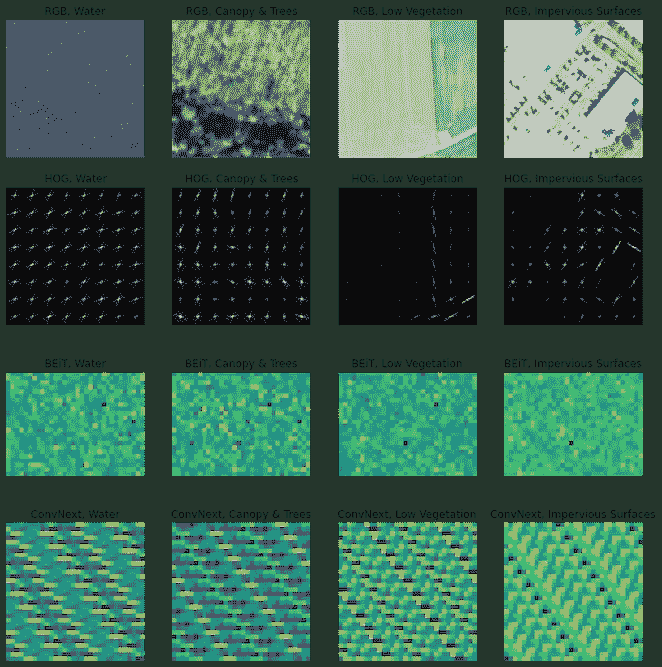
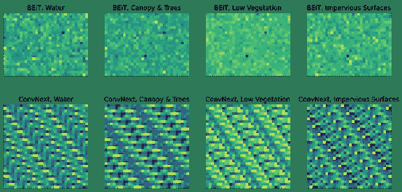
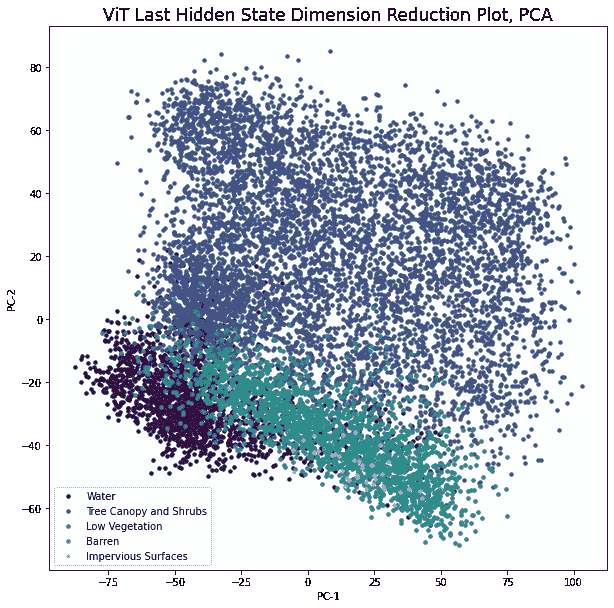
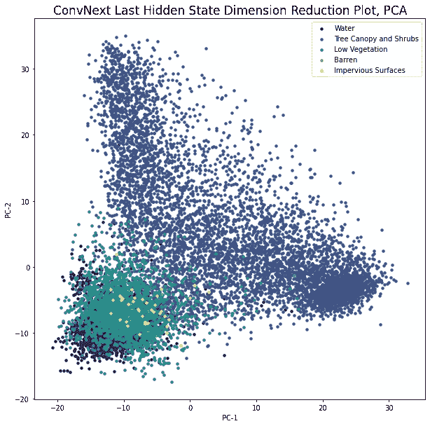
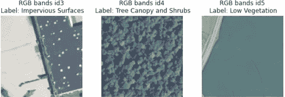
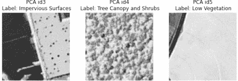
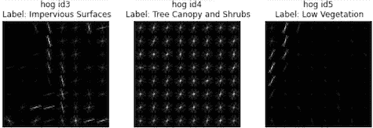

# 默认的拥抱脸模型可能就是“普通”图像分类所需要的全部

> 原文：<https://towardsdatascience.com/default-hugging-face-models-are-probably-all-you-need-for-vanilla-image-classification-9d0ee19c85fa>

## 在土地覆盖分类任务中探索作为特征提取器和转移学习器的拥抱面部中枢上的预训练图像模型

>代码回购:[ [链接](https://github.com/daniel-furman/CV-feature-eng-experiments)，笔记本:[ [链接](http://bit.ly/3O0QkD7)



**图一。**来自著名的切萨皮克保护区土地覆盖数据集的卫星图像(NAIP 卫星)的四种表示法。

# 介绍

在这篇文章中，我将探索表征学习中的一种常见做法——使用预训练的神经网络作为学习的特征提取器。具体来说，我感兴趣的是检查在这些提取的神经网络特征上训练的简单模型的性能如何与通过迁移学习启动的微调神经网络进行比较。目标受众包括其核心的数据科学家，以及更普遍的对地球观测、计算机视觉和机器学习感兴趣的任何人。

*向前跳一点…* 下面的结果表明，在提取的神经网络特征上训练的 scikit-learn 模型产生的性能与在相同的预训练权重下微调的完整网络几乎相当(平衡精度下降-3%到-6%)。

# 背景

今天，全世界的微软每年都会发布数千个预先训练好的神经网络。而且，这些模型变得越来越有性能和可访问性。有了这么多开源的模型检查点，神经网络作为 AI/ML 的中心焦点的演变就不太令人惊讶了。考虑到各地的人们都听说过[达尔-E-2](https://cdn.openai.com/papers/dall-e-2.pdf) 和[稳定扩散](https://arxiv.org/abs/2112.10752)——可以将文本提示转化为图像/艺术的神经网络，据报道，稳定扩散已经被超过 1000 万用户下载**。**许多人不知道的是，这些技术今天的存在在很大程度上归功于被称为**表征学习**的统计学子领域的进步。

> “21 世纪 20 年代看起来像是在 ML 中实现表征学习承诺的时代。有了在特定领域(有监督或无监督)训练的模型，我们可以在处理输入时使用它们的后期激活作为它们输入的表示。表征可以以多种方式使用，最常见的是用作下游模型的直接输入，或者用作与多种类型的模型(文本和视觉、GNN 和文本等)共同训练共享潜在空间的目标。)." *—凯尔·克拉宁**【1】*

让我们来检验一下这些说法…

# 数据集详细信息

下面使用的图像数据集来自 2013/2014 年切萨皮克保护区[土地覆盖项目](https://lila.science/datasets/chesapeakelandcover)【2】。它由国家农业图像计划(NAIP)卫星图像组成，具有 4 个波段的信息，分辨率为 1 平方米(红色、绿色、蓝色和近红外)。原始地理空间数据最初跨越 6 个州的 100，000 平方英里:弗吉尼亚、西弗吉尼亚、马里兰、特拉华、宾夕法尼亚和纽约。首先对其进行二次抽样，以获得 *n* =15，809 个大小为 128 x 128 像素的独特斑块和尽可能多的土地覆被标签*。当检查示例补丁(见图 1)时，1 平方米的分辨率显得相当精细，因为图像中的结构和对象可以以较高的清晰度进行解释。

> ***旁注:**原始切萨皮克保护区土地覆盖数据集包括标注掩膜，用于分割而非分类。为了改变这一点，我只保存了在采样地理空间数据时单个类出现频率至少为 85%的补丁。然后，过度表示的类被记录为该补丁的唯一标签，导致简化的 5 路分类问题。

实验中使用的 5 种土地覆盖类型定义为…

1.  **水域**:开阔水域，包括池塘、河流和湖泊
2.  **树冠和灌木**:木本植被，包括乔木和灌木
3.  **低植被**:高度小于 2 米的植物材料，包括草坪
4.  **不毛之地**:没有植被的天然土质区域
5.  **不透水表面**:人造表面

经过检查，数据集似乎具有许多有趣的特征，包括季节变化(例如，树叶)、噪声(例如，偶尔的云层覆盖)以及跨 6 个州的分布变化。少量的“自然”噪声有助于使这个有些简化的分类任务变得更加困难，这是有益的，因为我们不希望监督的任务过于琐碎。

使用美国各州作为拆分机制来生成训练集、验证集和测试集。来自宾夕法尼亚州的补丁被选择用于测试集( *n* = 2，586，16.4%的数据)，来自特拉华州的补丁被选择用于验证集( *n* = 2，088，13.2%的数据)，其余的被用于训练集( *n* = 11，135，70.4%的数据)。

最后，作为一个整体，数据集在一定程度上存在明显的类别不平衡:贫瘠(49/15，809)和不透水表面(124/15，809)严重不足，而树冠和灌木(9，514/15，809)严重过量。低植被(3，672/15，809)和水(2，450/15，809)相比之下更加平衡。由于这种标签的不平衡，我们在下面的实验中使用平衡的精确度。该指标采用每个类别的个体准确性的平均值，从而平等地加权每个类别，而不考虑大小。

```
see: torchgeo.datasets
```

# 习得特征

一般来说，学习到的特征可以被定义为那些源自黑盒算法的特征。通过提取图像表示的学习特征，你经常委托 CV 社区中其他人的工作——最初训练黑盒的团队。例如，人们可以从神经网络中提取学习到的特征，这些神经网络在预训练(如 ImageNet)中使用 keras、pytorch 和 transformers 等包看到了大型基准数据集。无论是无人监督还是有人监督，学习到的特征通常是下游任务的优秀表现。所做的假设是模型的权重以稳健的方式被预先训练。幸运的是，你可以委托谷歌/微软/脸书来做这件事。

> 在某些情况下，原始图像在输入神经网络时会经历几层连续的变换，其中每个隐藏状态层都会从原始图像中提取新信息。将图像输入网络后，可以直接提取隐藏状态或嵌入作为特征。通常的做法是使用最后一个隐藏状态嵌入作为提取的特征，即监督任务头之前的层。

在这个项目中，我们将研究两个预训练模型:微软的双向编码器图像转换器(BEiT) [3]和脸书的 ConvNext 模型[4]。BEiT-base 和 ConvNext-base 是拥抱人脸图像分类中最受欢迎的两个检查点，在初始测试中与其他选项相比表现良好。由于提取的隐藏状态通常具有比 1 x *n* 更高的维度，通常的做法是沿着较小的维度取平均值，以每幅图像 1 x *n* 的嵌入结束。下面，我们从基本 BEiT 得到 1 x 768 大小的嵌入，从基本 ConvNext 得到 1 x 1024 维度的嵌入。为了可视化，嵌入物被任意调整大小为矩形，这揭示了其中的一些不同模式。



**图二。**数据集中四个随机示例的两个已学习特征表示。顶行对应 BEiT Vision Transformer 嵌入件，底行对应 ConvNext 模型嵌入件。这四个斑块分别来自水体(左)、树冠和灌木(中左)、低矮植被(中右)和不透水表面(右)。请注意，这些是从原始的 1 x n 嵌入调整的，以便将它们可视化为矩形面片。

让我们看看数据是如何在已学习的特征空间中可视化呈现的。为此，我们将对 *n* 个图像嵌入的集合执行 PCA，以将它们转换到二维空间。然后用分类标签着色绘制。



**图三。**BEiT Vision Transformer 嵌入的前两个主要组件，将数据很好地聚类到不同的组中。请注意水、低矮的植被和树冠之间的强烈分隔。虽然看起来有点困难，但较浅的绿色点和黄色点(贫瘠和不透水的表面)与地块下部中心的低植被重叠。理想情况下，这些应该与狼群的其他部分分开。因此，在下面的模型中，我们预计这些类的性能会比其他类差。



**图 4。**conv next 嵌入的前两个主要组成部分，它对数据的聚类几乎与上面的 BEiT Vision Transformer 嵌入一样好。请注意低矮的植被和树冠之间的强烈分离。然而，与图 3 相比，这里的水类差别更小。

```
see: transformers.BeitModel/ConvNextModel
```

# **建模**

如果你去看 Kaggle 竞赛笔记本，你会发现今天图像分类最常见的做法是使用预先训练好的神经网络进行迁移学习和微调。在此设置中，首先将权重加载到网络中(迁移学习)，然后在感兴趣的新数据集上更新它(微调)。后一步通常运行几个时期，并且具有小的学习权重，以便不会偏离原始权重太远。然而，与使用相同的模型作为特征提取器相比，迁移学习和微调过程通常涉及更多的时间和更多的计算。

下面的前半部分模型是用学习功能和 scikit-learn 模型训练的。我使用了以下软件包来促进整个流程:从特征提取(transformers)到模型训练(sklearn)再到超参数优化(optuna)。对于超参数优化，我搜索了各种逻辑回归和前向神经网络(FFNN ),进行了 10 次随机试验，结果表明，一个隐藏状态的维数为 175-200 的 FFNN 通常是最佳选择。

然后训练迁移学习和微调的神经网络，以便与这些学习的特征模型进行比较，这些特征模型包括模型的第二部分。我使用 transformers 包来微调 BEiT 和 ConvNext 基本模型，检查点与上面的完全相同。使用相同的预训练权重，以便在实验中更接近地比较“苹果与苹果”。

> >见[此处](https://colab.research.google.com/github/nateraw/huggingface-hub-examples/blob/main/vit_image_classification_explained.ipynb)抱抱脸关于图像分类的优秀教程。

```
see: optuna, sklearn, transformers
```

# 模型评估

对于模型评估，我选择在保留的测试集上检查平衡精度、单个类精度和混淆矩阵。混淆矩阵显示了模型出错的地方，有助于解释。每行代表已知存在于给定类中的示例(基本事实)，而每列代表由模型分类的示例(预测)。行加起来是事实的数量，列加起来是预测的数量。

—x — x — x—

**模型 1，**拜特嵌入+ sklearn FFNN:

平衡精度… **79.6%**

```
+============+=======+========+============+========+=========+
|            | Water | Trees  | Vegetation | Barren | Manmade |
+============+=======+========+============+========+=========+
| Water      |   ** 64** |      0 |          2 |      0 |       0 |
+------------+-------+--------+------------+--------+---------+
| Trees      |     1 |   **1987** |          3 |      1 |       0 |
+------------+-------+--------+------------+--------+---------+
| Vegetation |     1 |      3 |        **457** |      0 |       0 |
+------------+-------+--------+------------+--------+---------+
| Barren     |     2 |      0 |         14 |      **5** |       3 |
+------------+-------+--------+------------+--------+---------+
| Manmade    |     0 |      0 |          6 |      2 |      **35** |
+------------+-------+--------+------------+--------+---------+
```

分类精度…水:97.0%，树冠和树木:99.7%，低植被:99.1%，贫瘠:20.8%，不透水表面:81.4%。

> > Beit embeddings 模型总体表现**第三好**。

— x — x — x —

**模型 2** ，ConvNext 嵌入+ sklearn FFNN:

平衡精度… **78.1%**

```
+============+=======+========+============+========+=========+
|            | Water | Trees  | Vegetation | Barren | Manmade |
+============+=======+========+============+========+=========+
| Water      |    **62** |      0 |          4 |      0 |       0 |
+------------+-------+--------+------------+--------+---------+
| Trees      |     2 |   **1982** |          6 |      2 |       0 |
+------------+-------+--------+------------+--------+---------+
| Vegetation |     1 |      3 |        **457** |      0 |       0 |
+------------+-------+--------+------------+--------+---------+
| Barren     |     1 |      1 |         17 |      **4** |       1 |
+------------+-------+--------+------------+--------+---------+
| Manmade    |     0 |      0 |          8 |      0 |      **35** |
+------------+-------+--------+------------+--------+---------+
```

分类精度…水:93.9%，树冠和树木:99.5%，低植被:99.1%，贫瘠:16.6%，不透水表面:81.4%。

> > ConvNext 嵌入模型总体表现**最差**

— x — x — x —

[**模型**](https://huggingface.co/dfurman/BEiT-base-chesapeake-land-cover-v0) **3** ，微调 BEiT 神经网络:

平衡准确度… **82.9%**

```
+============+=======+========+============+========+=========+
|            | Water | Trees  | Vegetation | Barren | Manmade |
+============+=======+========+============+========+=========+
| Water      |    **64** |      0 |          2 |      0 |       0 |
+------------+-------+--------+------------+--------+---------+
| Trees      |     0 |   **1986** |          5 |      1 |       0 |
+------------+-------+--------+------------+--------+---------+
| Vegetation |     2 |      3 |        **455** |      0 |       1 |
+------------+-------+--------+------------+--------+---------+
| Barren     |     0 |      0 |         13 |      **9** |       2 |
+------------+-------+--------+------------+--------+---------+
| Manmade    |     1 |      0 |          6 |      1 |      **35** |
+------------+-------+--------+------------+--------+---------+
```

分类精度…水:97.0%，树冠和树木:99.7%，低植被:98.7%，贫瘠:37.5%，不透水表面:81.4%。

> >经过微调的 BEiT 型号总体表现**次优**

— x — x — x —

[**模型 4**](https://huggingface.co/dfurman/ConvNext-base-chesapeake-land-cover-v0) ，微调的 ConvNext 神经网络:

*   平衡精度… **84.4%**

```
+============+=======+========+============+========+=========+
|            | Water | Trees  | Vegetation | Barren | Manmade |
+============+=======+========+============+========+=========+
| Water      |    **65** |      0 |          1 |      0 |       0 |
+------------+-------+--------+------------+--------+---------+
| Trees      |     0 |   **1978** |         12 |      2 |       0 |
+------------+-------+--------+------------+--------+---------+
| Vegetation |     1 |      2 |        **457** |      0 |       1 |
+------------+-------+--------+------------+--------+---------+
| Barren     |     0 |      0 |         13 |     **11** |       0 |
+------------+-------+--------+------------+--------+---------+
| Manmade    |     0 |      0 |          7 |      2 |      **34** |
+------------+-------+--------+------------+--------+---------+
```

分类精度…水:98.5%，树冠和树木:99.3%，低植被:99.1%，贫瘠:45.8%，不透水表面:79.1%。

> >微调后的 ConvNext 型号总体表现**最佳***🚀🤖*

— x — x — x —

# 建模流程/限制的改进

建模管道可以在许多方面得到改进，包括接下来讨论的那些。模型在贫瘠的例子的分类中遭受最大的痛苦，所以如果我能做一个改变的话，我会从增加更多这种类型的类开始。实际上，模型更像 4 路分类器，因为空类的性能很差。另一个改进可能是在超参数优化中使用交叉验证；然而，交叉验证将需要更长的时间来运行，并且对于这个实验来说感觉是多余的。

输出模型的一般化限制包括对其他类别类型、其他分辨率和其他条件(新对象、新结构、新类别等)的影像的分类性能恶化。).我已经将经过微调的 [ConvNext](https://huggingface.co/dfurman/ConvNext-base-chesapeake-land-cover-v0) 和 [BEiT](https://huggingface.co/dfurman/BEiT-base-chesapeake-land-cover-v0) 推送到拥抱脸进行托管推理，在这里，人们可以通过加载图像和/或运行每个图像中配置的默认设置来测试模型的可推广性。

# 项目学习

1.  Python 包领域的知识至关重要。请参见下面的灰色块，了解这里使用的各种库。
2.  可视化图像特征之间的变化有助于更深入地理解数据集中的信号。
3.  预训练的嵌入与更简单的模型配对可以表现得几乎和微调的神经网络一样好。
4.  拥抱脸不仅对自然语言处理很棒，对计算机视觉也很神奇！

# 结论

这些结果和学习对于今天 CV 中神经网络的状态暗示了什么？让我们倒回去。2017 年，特斯拉自动驾驶部门的前总监 Andrej Karpath 写了一篇[现在很有名的博文](https://karpathy.medium.com/software-2-0-a64152b37c35)，内容是关于从旧学校工程到新学校深度学习的转变，他将其称为“软件 2.0”【5】。从这个角度来看，神经网络不是“你机器学习工具箱中的另一个工具”。相反，它们代表了我们开发软件方式的转变。我相信今天的软件 2.0 和五年前一样重要。只要看看 NLP、CV 中可用的开源神经网络的数量，以及来自 AI/ML 顶级研究实验室的数量。对于从业者来说，这是令人兴奋的事情…

# 引文

[1] K. Kranen (2022 年)，[21 世纪 20 年代看起来像是在 ML](https://www.linkedin.com/posts/kyle-kranen_dall-e-2pdf-activity-6996212633284530176-uNHs?utm_source=share&utm_medium=member_desktop) 、LinkedIn 中实现的表征学习承诺的时代。

[2]切萨皮克湾项目办公室(2022)。2017/18 年切萨皮克湾流域 1 米分辨率土地覆盖数据集。由佛蒙特大学空间分析实验室、切萨皮克保护区和美国地质调查局开发。[2022 年 11 月 15 日]，[ [网址](https://lila.science/datasets/chesapeakelandcover)，

*   数据集许可:此处使用的数据集对所有人公开，没有限制。更多信息见[这里](https://cicwebresources.blob.core.windows.net/docs/LU_Classification_Methods_2017_2018.pdf)和[这里](https://resources.data.gov/schemas/dcat-us/v1.1/#accessLevel)。

[3]鲍，董，李，魏等(2021).贝特:图像转换器的预训练。更正，abs/2106.08254。[https://arxiv.org/abs/2106.08254](https://arxiv.org/abs/2106.08254)

[4]刘，赵，毛，h，吴春英，费希滕霍费尔，t .达雷尔，谢，S. (2022)。21 世纪 20 年代的 ConvNet。更正，abs/2201.03545。[https://arxiv.org/abs/2201.03545](https://arxiv.org/abs/2201.03545)

[5] A. Karpath (2017)，[软件 2.0](https://karpathy.medium.com/software-2-0-a64152b37c35) ，中等。

[6]南尼，l .，吉多尼，s .，&布拉纳姆，S. (2017)。用于计算机视觉分类的手工与非手工特征。*模式识别*， *71* ，158–172。[doi:10.1016/j . pat cog . 2017 . 05 . 025](https://www.sciencedirect.com/science/article/abs/pii/S0031320317302224)

— x — x — x —

# 附录

# 非习得特征

CV 中的非学习特征可以被认为是那些由图像手工制作的特征[6]。给定问题的最佳非学习特征通常依赖于区分信号在数据集中位置的知识。在提取非学习特征之前，让我们先在 RGB 空间中绘制一些随机补丁。



**图 6。**数据集中三个斑块的可见光谱 RGB 特征:不透水表面 id 3(左)、树冠和灌木 id 4(中)和低植被 id 5(右)。

我们将研究主成分分析(PCA)作为第一个非学习特征。PCA 是一种降维技术——在这里，我们使用它从 128 x 128 x 4 的图像移动到 1 x *n* 的向量。PCA 变换数据集的大小 *n* 是用户指定的，并且可以是比数据的原始维度小的任何数字。在幕后，该算法使用特征向量(数据中的传播方向)和特征值(方向的相对重要性)来寻找与原始图像保持最大差异的一组基。一旦计算完成，PCA 可以用来将新图像转换到低维空间和/或在二维或三维空间中可视化图像(见图 3 和图 4)。

在下面的例子中，保持 *n* =3000 维的 PCA 导致 95%的维数节省，同时保留了来自原始图像的几乎所有信号。为了使 PCA 可视化，我颠倒了操作，并将示例绘制成 128 x 128 像素的图像。



**图 7。**数据集中三个斑块的 PCA 特征(保留 3000 个维度):不透水表面 id3(左)、树冠和灌木 id4(中)和低植被 id 5(右)。

让我们看看另一个老派的特征:梯度直方图(猪)。为了计算 HOG，首先计算图像的梯度(变化强度)和方向。然后，图像被分割成多个单元，其中方向被分层成直方图仓。然后，在一个单元中的每个像素处，我们查找它的方向，在直方图中找到相应的 bin，并将给定的值加到它上面。然后在图像的各个单元上重复这个过程。然后，*瞧*。

看看 HOG 在这里做的很酷的事情:



**图 8。**数据集中三个斑块的 HOG 特征:不透水表面 id 3(左)、树冠和灌木 id 4(中)和低植被 id 5(右)。

虽然这些手工制作的特征作为数据集的第一遍可视化进行检查是有趣的，但事实证明它们对于我们的监督建模目的来说并不太好。这里，最初的测试表明，从 HOG 和 PCA 特征构建的模型相对于从下面探索的学习特征训练的模型在平衡准确性方面发生了显著下降(PCA 下降 35%，HOG 下降 50%)。

```
see: skimage.feature.hog, sklearn.decomposition.PCA
```