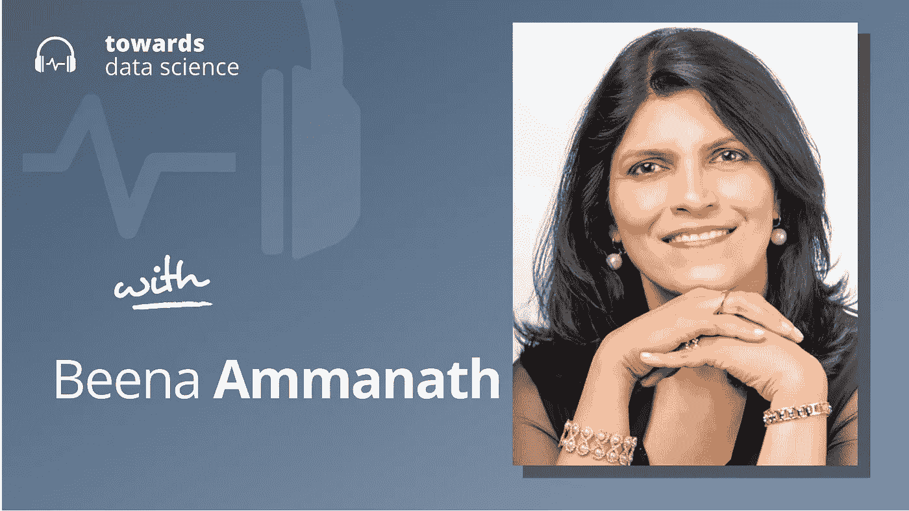

# 定义可信的人工智能

> 原文：<https://towardsdatascience.com/defining-trustworthy-ai-234a97c39035>

## [播客](https://towardsdatascience.com/tagged/tds-podcast)

## Beena Ammanath 谈到公司可以采取哪些步骤来建立更可靠的系统

[苹果](https://podcasts.apple.com/ca/podcast/towards-data-science/id1470952338?mt=2) | [谷歌](https://www.google.com/podcasts?feed=aHR0cHM6Ly9hbmNob3IuZm0vcy8zNmI0ODQ0L3BvZGNhc3QvcnNz) | [SPOTIFY](https://open.spotify.com/show/63diy2DtpHzQfeNVxAPZgU) | [其他](https://anchor.fm/towardsdatascience)

*编者按:TDS 播客由杰雷米·哈里斯主持，他是人工智能安全初创公司墨丘利的联合创始人。每周，Jeremie 都会与该领域前沿的研究人员和商业领袖聊天，以解开围绕数据科学、机器学习和人工智能的最紧迫问题。*

值得信赖的人工智能是当今最流行的流行语之一。但是，尽管每个人似乎都同意我们希望人工智能是值得信任的，但值得信任的定义往往是模糊的或不充分的。也许这不应该令人惊讶:很难提出一套标准来衡量“可信度”，并像自动驾驶汽车一样适用于网飞电影推荐。

因此，也许值得信赖的人工智能需要以一种更微妙的方式来思考——一种反映个体人工智能用例复杂性的方式。如果这是真的，那么新的问题就来了:谁来定义可信度，当缺乏可信度导致像人工智能事故或不良偏见这样的伤害时，谁来承担责任？

从这个角度来看，可信度不仅是算法的问题，也是组织的问题。这正是 Beena Ammanath 在她即将出版的新书 *Trustworthy AI* 中提出的情况，该书从实用的角度探索了人工智能的可信度，研究了公司可以采取哪些具体步骤来使他们的内部人工智能工作得更安全、更好、更可靠。在这一集的 TDS 播客中，Beena 和我一起谈论了人工智能中的可信度、可解释性和鲁棒性的定义，以及人工智能监管和自我监管的未来。

以下是我在对话中最喜欢的一些观点:

*   对 Beena 来说，人工智能的可信度意味着避免不必要的副作用。这些可能包括对用户的身体伤害，如人工智能事故，或者更无形的问题，如偏见。这是一个总括术语，它综合了许多其他概念，每个概念都需要以自己的方式处理，有些概念对一个应用程序或公司来说比另一个更重要。
*   Beena 认为可信度不是人工智能系统的属性，而是一个组织(可能包括人工智能系统)的属性。她的思想的一个重要方面是，只有当组织内的人类行为者被分配了对各种人工智能相关风险的明确所有权和责任时，可信性才是可能的。如果一辆自动驾驶汽车撞死了一名行人，谁负责？这辆车的主人？开发其视觉或决策算法的工程师？他们的经理或董事——或者公司的首席执行官呢？管理一个可信的人工智能过程意味着澄清那种所有权。
*   在 Beena 看来，没有一套定义可信人工智能的程序。但所有公司都应该坚持一些原则:例如，公司应该有明确的程序，鼓励对人工智能开发的风险进行思考。像模型车或算法影响评估这样的工具在这里可以有所帮助，像红队这样的练习也可以，在红队中，参与人工智能系统开发的员工积极地试图让他们更好地了解自己的弱点。
*   Beena 担心，随着人工智能能力继续加速，监管机构可能难以跟上。因此，企业似乎有可能不得不认真对待自我监管的过程，以避免造成大规模伤害，这有可能导致品牌损害或过度的监管膝跳反应，从而使行业倒退。
*   Beena 的书《值得信赖的 AI》现在已经出版，在各地的网上书店都可以买到:)

你可以[在 Twitter 上关注 Beena 这里](https://twitter.com/beena_ammanath)，或者 [me 这里](https://twitter.com/jeremiecharris)。

## 章节:

*   0:00 介绍
*   1:55 背景和值得信赖的人工智能
*   7:30 激励员工努力提高能力
*   13:40 应用领域级别的法规
*   16:45 弥合差距
*   23:30 认知水平转移到人工智能
*   25:45 什么是值得信赖的 AI？
*   34:00 鲁棒性故障示例
*   36:45 团队多元化
*   40:15 较小的公司
*   最佳做法的应用
*   46:30 总结