# 使用 AWS 和 Python 在云上创建 SQL 数据库的权威指南

> 原文：<https://towardsdatascience.com/definitive-guide-to-create-an-sql-database-on-cloud-with-aws-and-python-c818c7270af2>

## 关于使用 Amazon RDS、MySQL Workbench 和 PyMySQL 在云中为 Python 应用程序构建和部署数据库的简单易懂的综合指南


照片由[卢卡斯劳](https://unsplash.com/@lucaslaw__?utm_source=medium&utm_medium=referral)在 [Unsplash](https://unsplash.com?utm_source=medium&utm_medium=referral)

我们经常会从我们在数据科学工作或个人项目中构建的 Python 应用程序中生成和收集有价值的数据。

因此，拥有一个可伸缩且高性能的附带数据库是至关重要的，这样就可以有效地存储、组织和查询数据。

幸运的是，现代云服务让我们可以轻松地在云上创建经济高效、可调整大小和完全托管的数据库。

这个简单的分步指南解释了如何集成**亚马逊 RDS** 、 **MySQL Workbench、**和 **PyMySQL** 来开始免费构建和部署云数据库**。**

## **内容**

> *****(1)***[*工具概述*](#1b90)***(2)***[*设置亚马逊 RDS*](#c46c)***(3)***[*设置 MySQL 服务器*](#dc20)[*创建数据库模式和表*](#854d)*[*设置 PyMySQL*](#8db2)***【7】***[*使用 PyMySQL 读*](#d08a)***

****所有图片和截图均由作者提供，除非另有说明****

# ***(1)工具概述***

## ***(一)MySQL***

***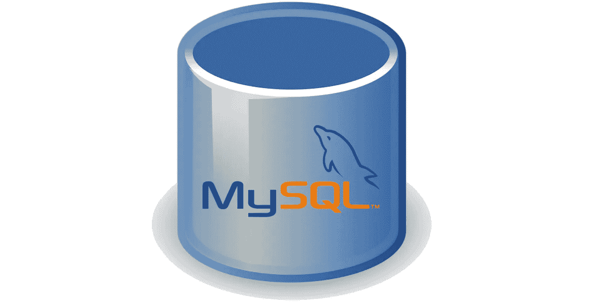***

***MySQL 徽标|根据[知识共享](https://en.wikipedia.org/wiki/en:Creative_Commons) [署名-共享 3.0](https://creativecommons.org/licenses/by-sa/3.0/deed.en) 许可使用的图像***

***[**MySQL**](https://www.mysql.com/) 是基于 SQL 的开源关系数据库管理系统(RDBMS)，被广泛认为是世界上最流行的 RDBMS。***

***它允许我们轻松地创建、存储、访问和修改数据库中的关系数据。***

## ***(二)亚马逊 RDS***

******

***AWS 标志| AWS 标志是 Amazon.com 公司或其附属公司在美国和其他国家的商标，来源: [AWS 联合营销](https://aws.amazon.com/co-marketing/)***

***[**亚马逊关系数据库服务(RDS)**](https://aws.amazon.com/rds/) 是一种云服务，可以轻松在云端设置、操作和扩展关系数据库。***

***使用 Amazon RDS 的好处包括:***

*   ***经济高效且可扩展的硬件容量***
*   ***自动化耗时的数据库任务，如扩展、监控和软件修补***
*   ***出色的功能，如快速性能、高可用性、兼容性和安全性。***
*   ***只需点击几下鼠标，即可在几分钟内快速部署服务器***

***Amazon RDS 支持六个数据库引擎，我们将使用一个用于 [**MySQL**](https://aws.amazon.com/rds/mysql/) 。***

## ***(三)PyMySQL***

***[**PyMySQL**](https://github.com/PyMySQL/PyMySQL) 是一个纯 Python 的 MySQL 客户端库，允许我们访问和修改 MySQL 数据库(例如 [CRUD](https://en.wikipedia.org/wiki/Create,_read,_update_and_delete) 操作)。***

***这个包是 Python 应用程序和 MySQL 数据库之间的重要链接。***

# ***(2)设置亚马逊 RDS***

## ***步骤 1 —创建数据库***

***登录 [AWS 管理控制台](https://aws.amazon.com/console/)后，在顶部搜索栏输入' ***rds*** '，点击第一个显示 **RDS** 的搜索结果。***

***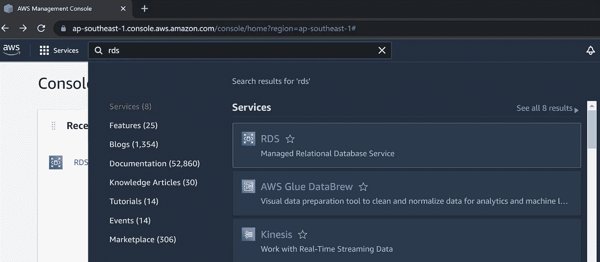***

***点击**数据库**进入左侧菜单栏中的数据库部分。从那里，点击橙色按钮' **Create database** '来创建我们在 AWS 上的第一个关系数据库。***

***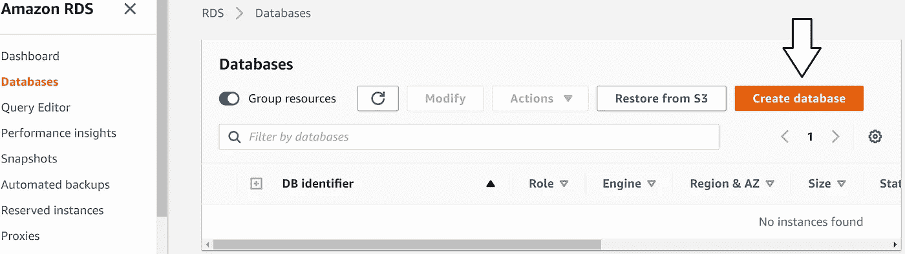***

## ***步骤 2-修改实例设置***

***从现在开始，我们将修改数据库实例的设置。首先，我们选择 MySQL 作为我们的数据库引擎。***

***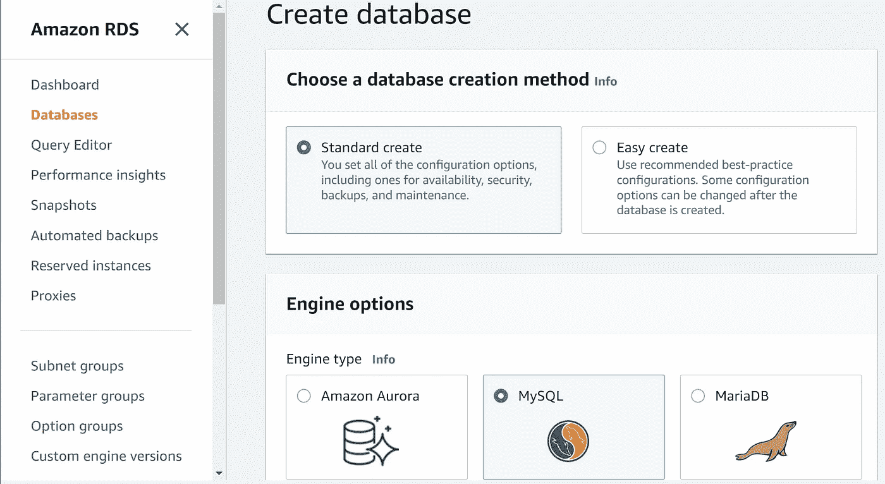***

***我们选择“**自由层”**模板选项，开始为[RDS 自由层](https://aws.amazon.com/rds/free/)上的**自由层**提供托管云数据库服务。***

***此外，决定数据库实例的名称(在 **DB 实例标识符**下)。我将它命名为'*客户端数据库*'，但是我们总是可以定制它。***

***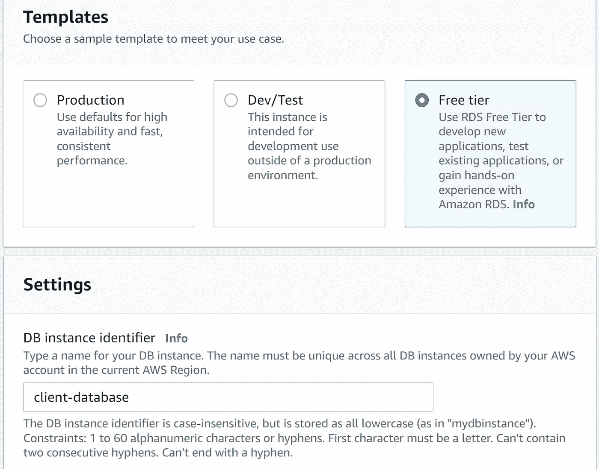***

***由于我们是从本地机器开始这个项目，我们想通过公共互联网连接到数据库。因此，我们为**公共访问选择了**是**。*****

*****因此，对于 ***生产*** *实例来说，保持谨慎是至关重要的，在这些实例中，我们可能希望在没有公共访问的情况下限制与锁定 VPC 的连接。******

***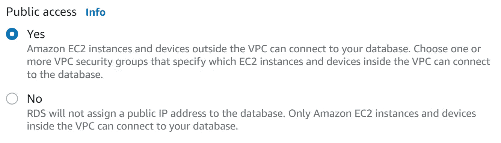***

***对于上面没有提到的其他设置，我们可以保留**的默认**值。***

***对于**凭证** **设置**，选择一个安全易记的**用户名和密码**。这一部分非常重要，因为稍后需要凭证来建立到数据库的认证连接。***

***完成所有必要的更改后，滚动到底部并单击橙色的“**创建数据库**按钮。***

***在我们的实例出现在**数据库**部分之前，数据库创建需要几分钟时间。***

***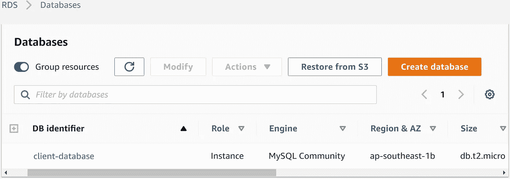***

## ***步骤 3 —编辑安全组配置***

***为了确保成功连接到数据库，我们必须修改我们的[虚拟私有云(VPC)](https://aws.amazon.com/vpc/) 上的**安全** **组配置**，以允许公共互联网访问。***

***通过首先单击我们刚刚创建的数据库链接(即 DB identifier 下的`**client-database**` )来完成修改。在随后的页面中，点击 **VPC 安全组**下的`**default**` 链接。***

***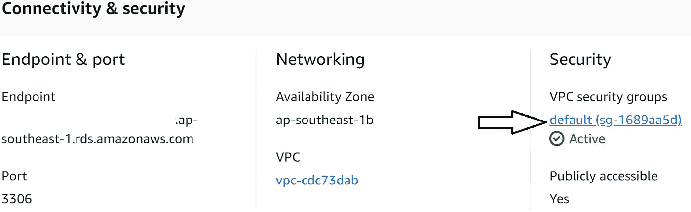***

***接下来，选择**入站**子选项卡，并单击右下角的“**编辑入站规则”**按钮。***

***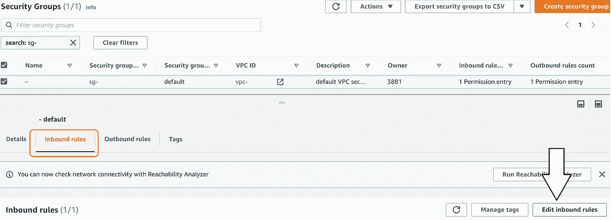***

***我们单击“ **Add rule** ”添加一个新的入站规则，允许我们在任何地方访问数据库，只要我们有正确的密码验证。***

***新规则应该具有'**的**类型**所有流量**，以及' **Anywhere-IPv4** 的**源**。最后，点击橙色的'**保存规则'**按钮保存新规则。***

******

***完成以上工作后，我们已经成功地在 AWS RDS 上建立了第一个 MySQL **数据库** **实例**。***

# ***3)设置 MySQL 服务器***

## ***步骤 1 —下载和安装***

***在使用 MySQL 之前，我们先在本地机器上安装两个 MySQL 软件——MySQL**社区服务器**和 MySQL **工作台**。***

> ******(I)****MySQL****社区服务器*** *是免费使用的 RDBMS 服务器，支持 MySQL 的查询和连接功能。我们可以把它想象成安装在本地机器上的 MySQL 数据库引擎。****
> 
> ******【ii】****MySQL****work bench****是使用 MySQL 服务器和数据库的统一图形工具。这个可视化软件使得设计、建模、生成和管理我们的数据库变得容易。****

***我们可以在 [**MySQL 下载**](https://dev.mysql.com/downloads/) 页面找到安装程序链接，下面圈出了两个工具的正确链接。***

***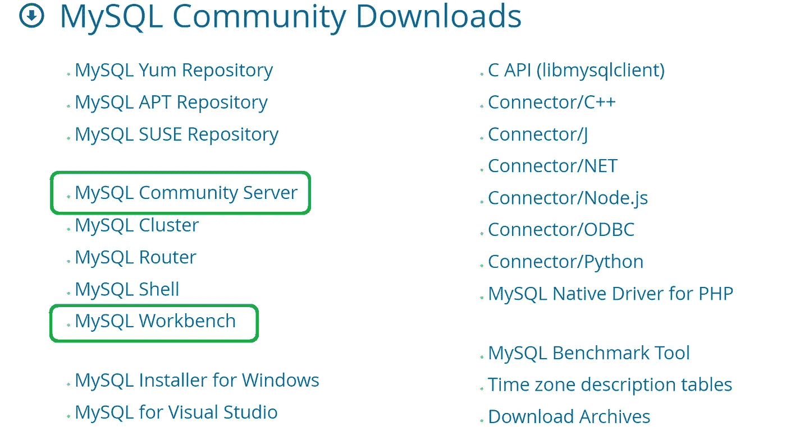***

***单击该链接后，它会提示我们根据我们的操作系统(OS)选择特定的安装程序。***

***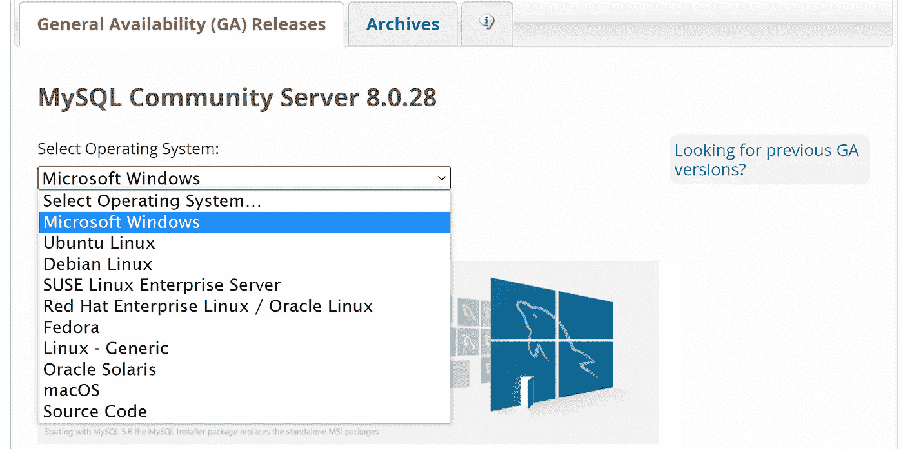***

*****不需要**为安装创建 Oracle Web 帐户，所以我们可以直接点击“**不，谢谢，开始下载吧**”***

***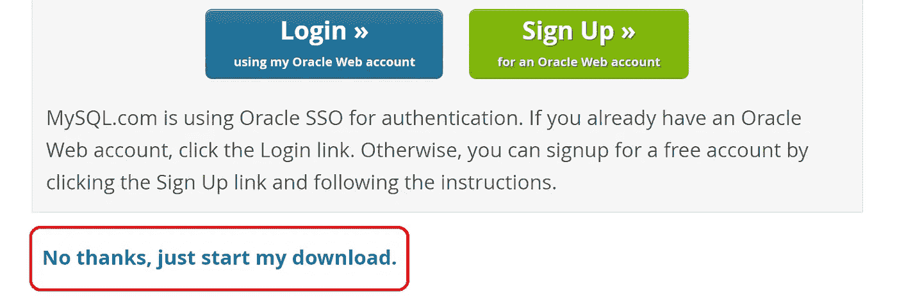***

*****注:**如果你用的是 **Windows OS** ，我**强烈推荐**下载[**MySQL Installer for Windows**](https://dev.mysql.com/downloads/installer/)(如*推荐下载*下的横幅所示当你选择*微软 Windows* )。然后我们可以使用 MySQL 安装程序来下载 MySQL 社区服务器和 MySQL 工作台。***

***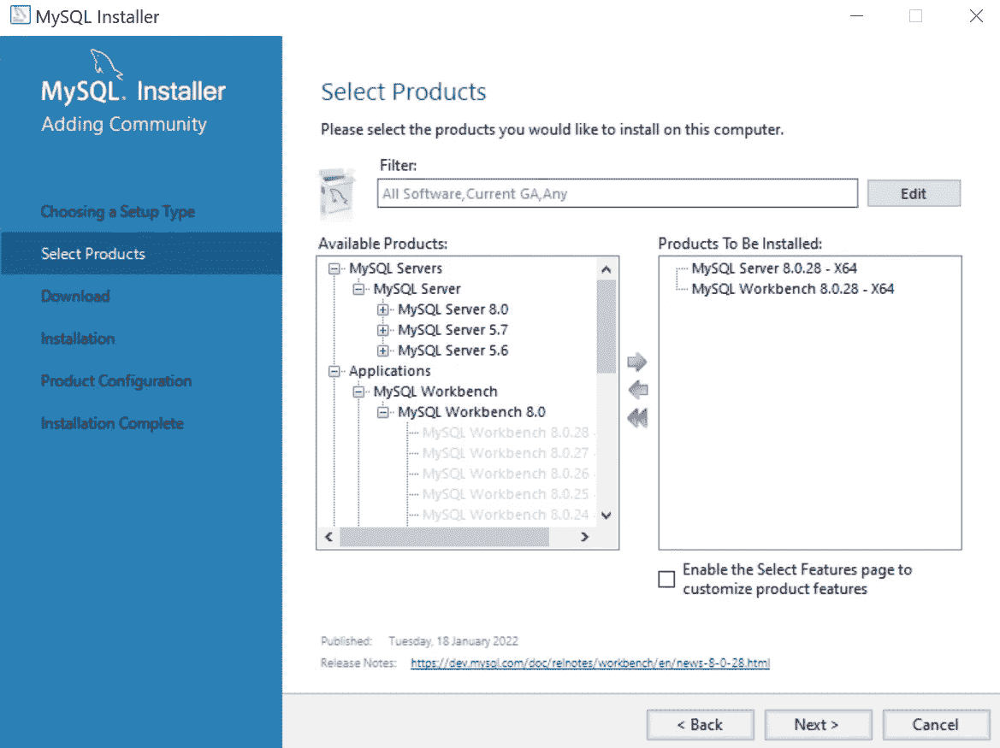***

## ***步骤 2—运行安装***

***下载安装程序后，我们运行它们并遵循后续的安装步骤。***

***在安装 MySQL 服务器时，我们会遇到多种服务器配置选项。好消息是我们可以保留所有的默认值。***

***关键的配置步骤是设置(并记住)一个强 MySQL **根密码**。***

# ***(4) *将 RDS 数据库实例连接到 MySQL 工作台****

***到目前为止，安装非常成功！我们现在准备连接到第 3 节中创建的 RDS 数据库实例。***

***我们首先启动 **MySQL Workbench** ，在那里我们会看到欢迎页面。要建立一个新的**MySQL 连接，点击 MySQL 连接标题旁边的 **⊕** 按钮。*****

***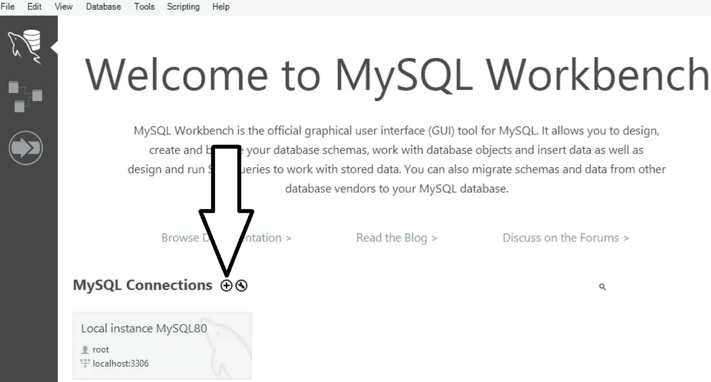***

***在弹出的对话框中，我们需要修改几个连接参数。***

*****注意**:以下参数的值可以在 RDS 控制台的[数据库部分的数据库实例(即`**client-database**`)中找到(参见第 3 节)。](https://ap-southeast-1.console.aws.amazon.com/rds/home#databases:)***

*   *****连接名称**:输入连接的自定义名称，如`**rds_connection_1**`。***
*   *****主机名:**输入 RDS 端点。该信息可在*连接和安全*选项卡中找到。***

***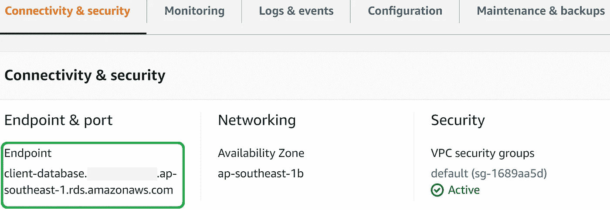***

*   *****端口**:输入端口号(默认值应该已经是 *3360* )。该信息可在*连接和安全*选项卡中找到。***
*   *****用户名**:输入主用户名。该信息可在*配置*选项卡中找到。***

***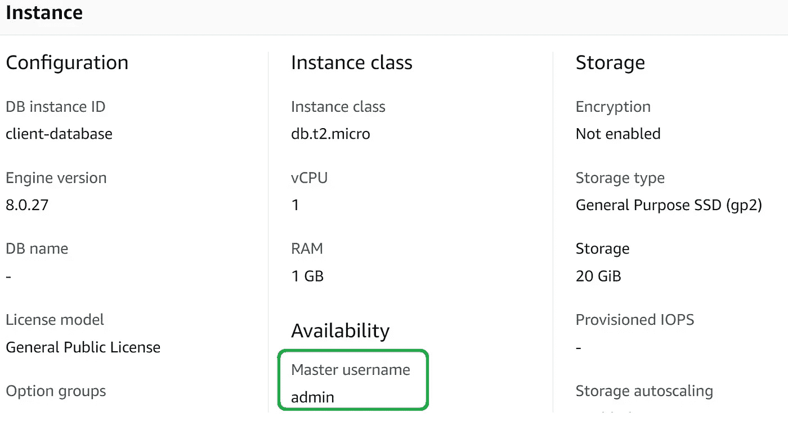***

*   *****密码**:点击**存储到金库**，输入 RDS 实例**凭证**设置的密码(参见第 2 节的[步骤 2)。](#c366)***

***完成的参数如下所示:***

***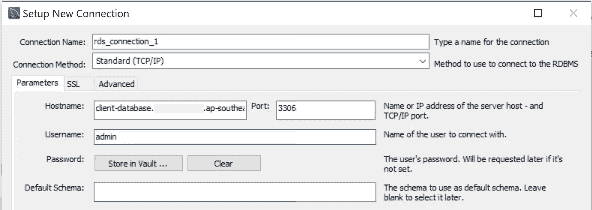***

***接下来，点击'**测试连接'**验证配置。如果我们正确执行了这些步骤，我们应该会看到一个弹出窗口，指示连接成功:***

***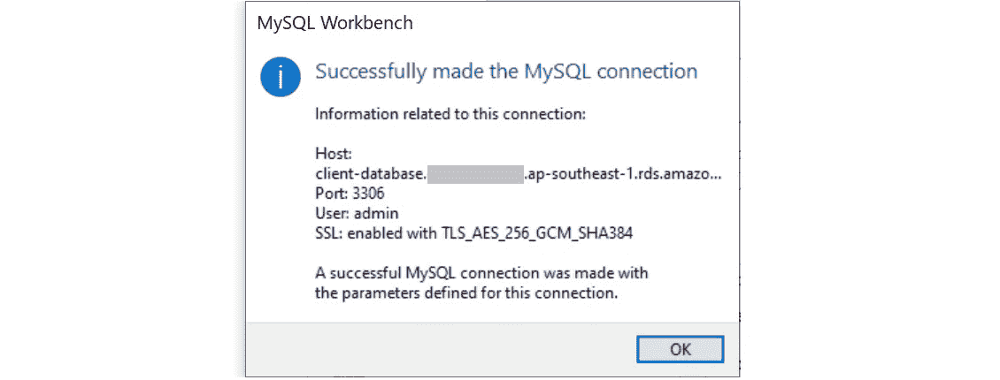***

***最后，从**设置新连接**窗口点击**确定**保存连接。***

# ***(5)创建数据库模式和表***

## ***步骤 1 —创建模式***

***在第 4 节之后，我们应该在工作台欢迎页面上看到新的连接。***

******

***点击新建框(即 **rds_connection_1** )以**打开**连接并访问数据库。***

***在创建新表之前，我们首先定义一个**模式**。单击顶部菜单中的'**创建新模式'**按钮(下面用绿色圈出)，并为模式命名(如`**schema1**`)。***

******

***然后，我们在随后的屏幕上单击“**应用**按钮，我们将看到我们的新模式出现在左侧菜单的**模式**中。***

***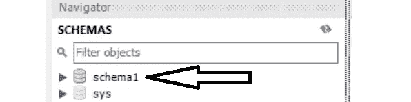***

## ***步骤 2 —创建表格***

***要创建一个新表，单击新模式旁边的箭头展开子菜单，右键单击**表**选项，并选择“**创建表**”。***

***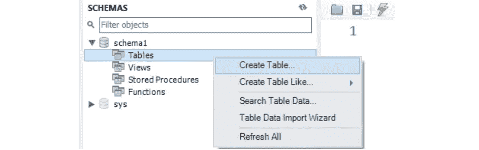***

***假设我们要创建一个表，在以下列中存储站点访问信息:***

***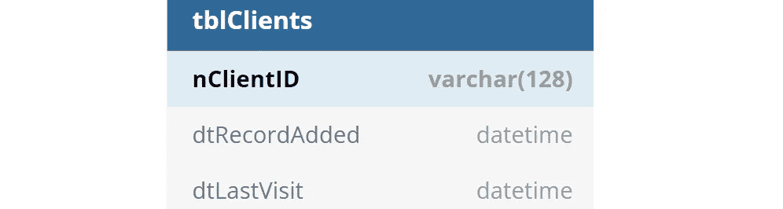***

***我们可以**添加**列并设置相应的选项来构建一个新的表(我们可以相应地命名它，例如 ***tblClients*** )。***

***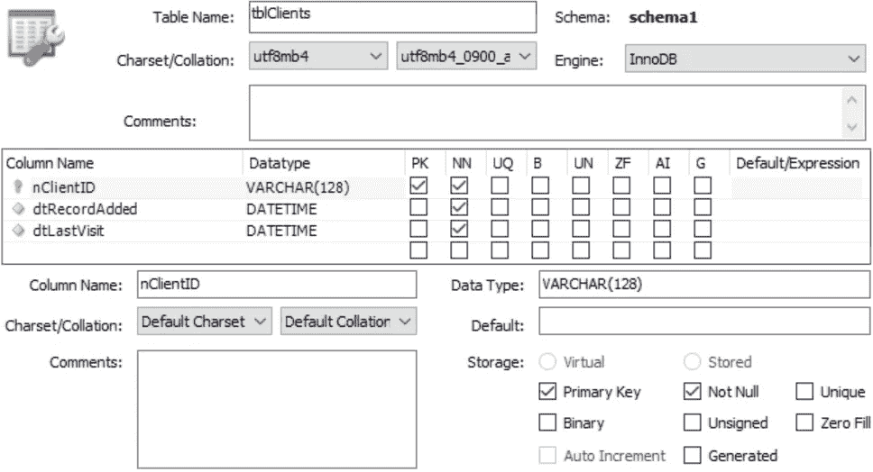***

***在接下来的几个屏幕中单击' **Apply** ，执行创建表的 SQL 命令，我们的新表将出现在 **SCHEMAS** 菜单中。***

***我们还可以运行一个简单的 SQL 查询来确认成功创建。***

***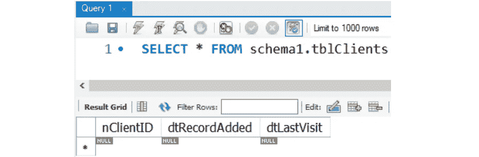***

# ***(6)设置 PyMySQL***

***为了将 RDS MySQL 实例链接到后续的 Python 脚本，我们可以使用 PyMySQL。我们可以用 pip 安装它:***

```
*pip install PyMySQL*
```

# ***(7)使用 PyMySQL 对数据库进行读写***

***我们已经到了最后一个阶段，开始使用 Python 访问 MySQL 数据库中的数据。***

## ***步骤 1 —下载 SSL 证书包***

***为了加密在本地客户机和 RDS 数据库实例之间移动的数据，我们需要实现一个[安全套接字层(SSL)连接](https://docs.aws.amazon.com/AmazonRDS/latest/UserGuide/UsingWithRDS.SSL.html)。***

***我们可以从:[**https://S3 . Amazon AWS . com/rds-downloads/rds-combined-ca-bundle . PEM**](https://s3.amazonaws.com/rds-downloads/rds-combined-ca-bundle.pem)下载 SSL 证书，然后放置下载的。 *pem* 在指定的项目文件夹中捆绑文件，例如`**ssl/**rds-combined-ca-bundle.pem`***

## ***步骤 2-设置连接参数***

***然后我们创建一个 **config.py** 文件来存储数据库连接的参数。***

***大多数参数都可以在 Amazon RDS 控制台中找到，我们现在应该很熟悉了。***

****SSL_CA* 变量应该指向我们的 SSL 证书包的路径，并且 *CURSORCLASS* 变量应该设置为`pymysql.cursors.DictCursor`。***

*****重要**:安全地存储密码凭证**和**永远不要**让它们在公共 Python 文件中打开。*****

## *****步骤 3—启动 RDS 连接*****

*****我们用包含 PyMySQL 的 Python 代码启动到 RDS 数据库实例的连接。*****

## *****步骤 4 —运行 CRUD 操作*****

*****一旦建立了连接，我们就可以编写函数来执行 CRUD(即创建、读取、更新、删除)SQL 操作。*****

*****例如，下面的函数**将单个记录**插入到我们之前创建的表`tblClients`中。*****

*******提示:**我们甚至可以通过 PyMySQL 而不是 MySQL Workbench 直接创建表格。更多信息参见此[示例](https://pypi.org/project/PyMySQL/#example)。*****

## *****步骤 5 —验证数据库更改*****

*****有两种方法可以检查所执行的 SQL 操作是否在数据库中成功注册。*****

*******(i)** 直接在 **MySQL Workbench** 中运行 SQL 查询*****

*****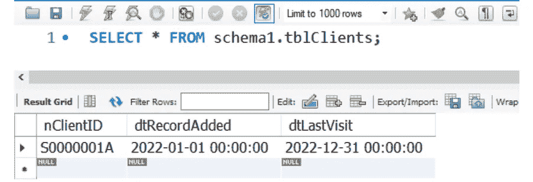*****

*******(ii)** 通过 **PyMySQL** 在 Python 中运行 SQL 查询*****

*****输出将显示我们刚刚插入到表中的记录:*****

*****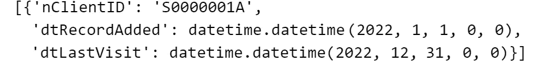*****

# *****包装它*****

*****至此，我们已经完成了在云中使用 AWS RDS 和 PyMySQL 创建 MySQL 数据库的演练。*****

*****你可以在这个 [**GitHub repo**](https://github.com/kennethleungty/AWS-RDS-MySQL-Python) 中找到样例代码和配置文件。*****

# *****在你走之前*****

*****欢迎您**加入我的数据科学学习之旅！**点击此[媒体](https://kennethleungty.medium.com/)页面，查看我的 [GitHub](https://github.com/kennethleungty) ，了解更多精彩的教育数据科学内容。同时，享受在云上创建 SQL 数据库的乐趣吧！*****