# 使用 Pandas drop()从数据帧中删除行和列

> 原文：<https://towardsdatascience.com/delete-rows-and-columns-from-a-dataframe-using-pandas-drop-d2533cf7b4bd>

## 掌握熊猫滴 9 招()加速你的数据分析


照片由[伯纳德·赫尔曼](https://unsplash.com/@bernardhermant?utm_source=unsplash&utm_medium=referral&utm_content=creditCopyText)在 [Unsplash](https://unsplash.com/s/photos/remove-keyboard?utm_source=unsplash&utm_medium=referral&utm_content=creditCopyText) 上拍摄

> 数据操作指的是调整数据以使其有组织且更易于阅读的过程。通常，有些数据是不可用的，会干扰重要的数据。应该清理和删除不必要或不准确的数据。
> 
> 来源于 solvexia.com[1]

从 Pandas 数据帧中删除一个或多个行/列可以通过多种方式实现。其中，最常见的就是`drop()`法。这种方法似乎很容易使用，但是仍然有一些技巧你应该知道，以加快你的数据分析。

在本文中，您将学习熊猫`drop()`处理以下用例的技巧:

1.  删除单行
2.  删除多行
3.  基于行位置和自定义范围删除行
4.  删除单个列
5.  删除多列
6.  基于列位置和自定义范围删除列
7.  使用多索引数据框架
8.  用`inplace=True`做操作到位
9.  用`error='ignore'`抑制错误

> 请查看[笔记本](https://github.com/BindiChen/machine-learning/blob/master/data-analysis/063-pandas-drop/pandas-drop.ipynb)获取源代码。更多教程可从 [Github Repo](https://github.com/BindiChen/machine-learning) 获得。

# 1.删除单行

默认情况下，熊猫`drop()`会根据它们的**索引值**删除该行。通常，每行的索引值是一个从 0 开始的整数值。指定行索引会删除它，例如删除索引值为`1`的行。：

```
df.**drop(1)**# It's equivalent to
df.**drop(labels=1)**
```

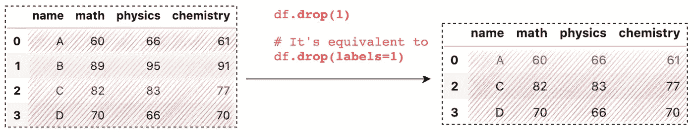

使用 Pandas drop()删除一行(图片由作者提供)

注意，删除行必须将参数`axis`设置为`0`(在 Pandas `drop()`中，`axis`默认为`0`，所以可以省略)。如果指定了`axis=1`，它将删除列。

或者，从 DataFrame 中删除一行的更直观的方法是使用`index`参数。

```
# A more intuitive way
df.drop(**index=1**)
```

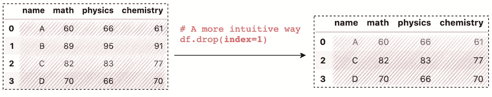

使用 Pandas drop()删除一行(图片由作者提供)

# 2.删除多行

熊猫`drop()`可以带列表删除多行:

```
df.drop(**[1,2]**)# It's equivalent to
df.drop(**labels=[1,2]**)
```

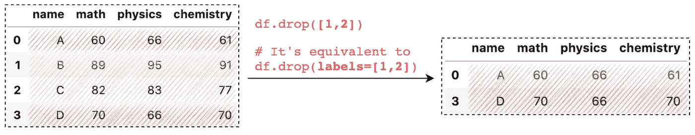

使用 Pandas drop()删除多行(图片由作者提供)

类似地，删除多行的更直观的方法是将一个列表传递给`index`参数:

```
# A more intuitive way
df.drop(**index=[1,2]**)
```

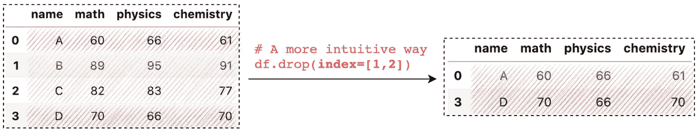

使用 Pandas drop()删除多行(图片由作者提供)

# 3.基于行位置和自定义范围删除行

数据帧索引值可能不是升序，有时它们可以是任何其他值，例如日期时间或字符串标签。对于这些情况，我们可以根据行的位置删除行，例如，删除第二行，我们可以调用`df.index[**1**]`并将其传递给`index`参数:

```
df.drop(index=**df.index[1]**)
```

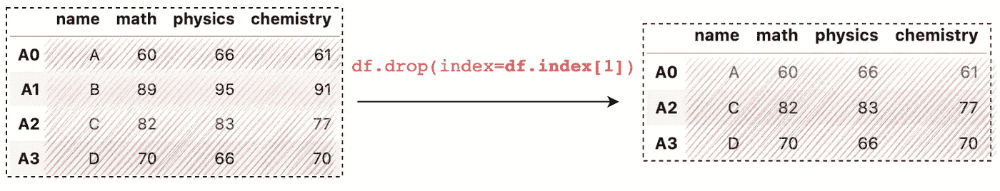

根据行位置删除行(作者图片)

要删除最后一行，我们可以使用快捷方式，如标识最后一个索引的`-1`:

```
df.drop(index=**df.index[-1]**)
```

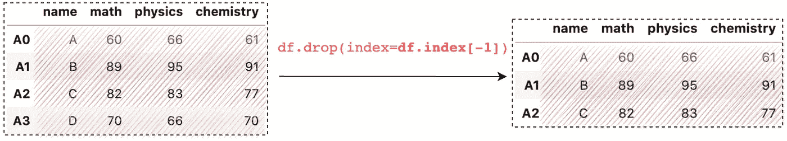

根据行位置删除行(作者图片)

例如，我们还可以使用切片技术来选择一系列行

*   删除最后 2 行`df.drop(index=df.index[**-2:**])`
*   删除每隔一行`df.drop(index=df.index[**::2**])`


根据行位置删除行(作者图片)

如果您想了解关于切片技术以及如何使用行索引来选择数据的更多信息，可以查看本文:

[](/how-to-use-loc-and-iloc-for-selecting-data-in-pandas-bd09cb4c3d79)  

# 4.删除单个列

类似于删除行，Pandas `drop()`可以通过将`axis`参数指定给`1`来删除列:

```
df.drop(**'math', axis=1**)# It's equivalent to
df.drop(**labels='math', axis=1**)
```

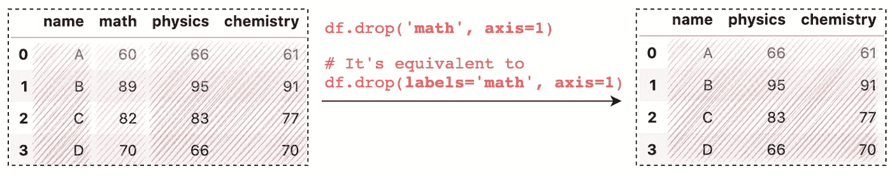

使用 Pandas drop()删除单个列(图片由作者提供)

从 DataFrame 中删除列的更直观的方法是使用`columns`参数。

```
# A more intuitive way
df.drop(**columns='math'**)
```

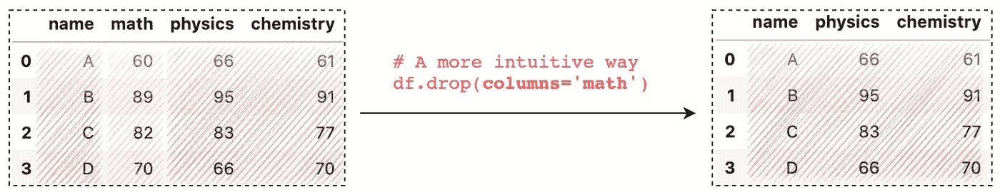

使用 Pandas drop()删除单个列(图片由作者提供)

# 5.删除多列

类似地，我们可以通过一个列表来删除多个列:

```
df.drop(**['math', 'physics']**, **axis=1**)# It's equivalent to
df.drop(**labels=['math', 'physics']**, **axis=1**)
```

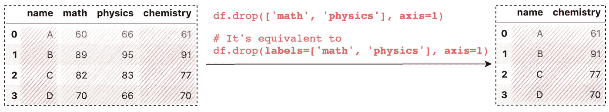

使用 Pandas drop()删除多个列(图片由作者提供)

删除多列的一个更直观的方法是将一个列表传递给`columns`参数:

```
# A more intuitive way
df.drop(**columns=['math', 'physics']**)
```

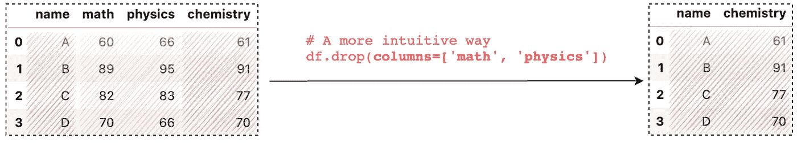

使用 Pandas drop()删除多个列(图片由作者提供)

# 6.基于列位置和自定义范围删除列

我们可以根据列的位置删除一列，例如，删除第二列，我们可以调用`df.**column**[**1**]`并将其传递给`columns`参数:

```
df.drop(**columns=df.columns[1]**)
```

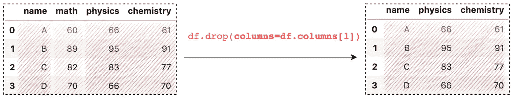

根据列的位置删除列(图片由作者提供)

要删除最后一列，我们可以使用快捷方式，如标识最后一个索引的`-1`:

```
df.drop(columns=**df.columns[-1]**)
```

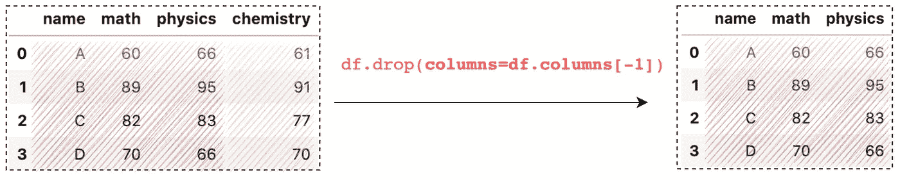

根据列的位置删除列(图片由作者提供)

类似地，我们也可以使用切片技术来选择一系列列，例如

*   删除最后 2 列`df.drop(columns=df.columns[**-2:**])`
*   删除每隔一栏`df.drop(columns=df.columns[**::2**])`

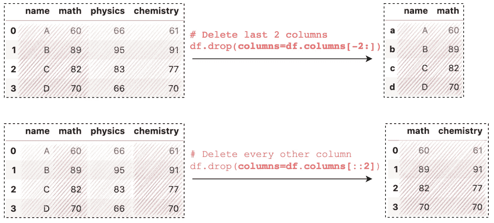

根据列的位置删除列(图片由作者提供)

# 7.使用多索引

一个 **MultiIndex** (也称为层次索引)数据帧允许我们将多列作为一个行标识符，将多行作为一个标题标识符:


(图片由作者提供)

当在多索引数据帧上调用 Pandas `drop()`时，默认情况下，它将删除 0 级索引和列。

```
# Delete all Oxford rows
df.drop(index='Oxford')# Delete all Day columns
df.drop(columns='Day')
```

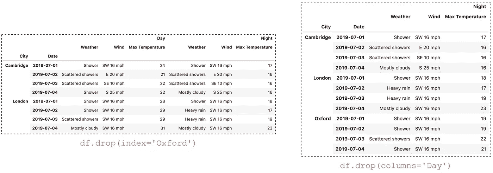

多指数中的熊猫下降()

要指定要删除的级别，我们可以设置`level`参数:

```
# remove all 2019-07-04 row at level 1
df.drop(index='2019-07-04', **level=1**)# Drop all Weather column at level 1
df.drop(columns='Weather', **level=1**)
```

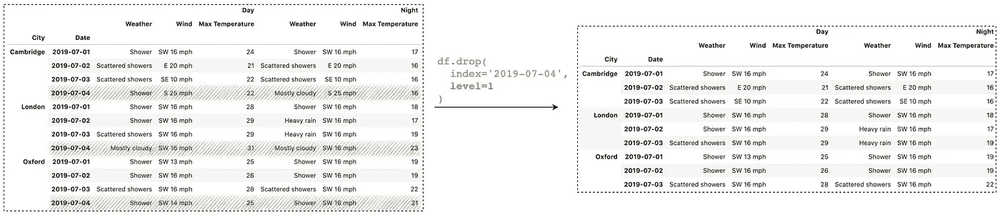

多指数中的熊猫下降()

在某些情况下，我们希望删除特定的索引或列组合。为此，我们可以将一个元组传递给`index`或`columns`参数:

```
# drop the index combination 'Oxford' and '2019-07-04'
df.drop(**index=('Oxford', '2019-07-04')**)# drop the column combination 'Day' and 'Weather'
df.drop(**columns=('Day', 'Weather')**)
```

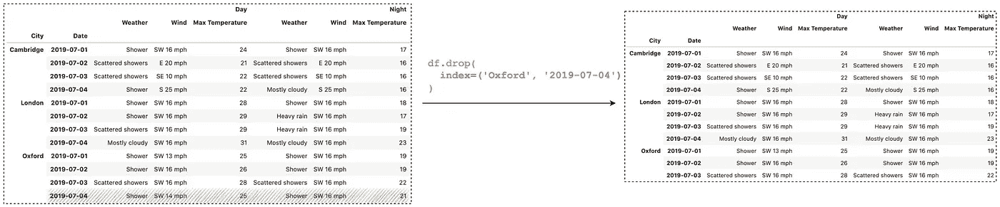

多指数中的熊猫下降()

如果您想了解更多关于在多索引数据框架中访问数据的信息，请查阅本文:

[](/accessing-data-in-a-multiindex-dataframe-in-pandas-569e8767201d) [## 在熊猫的多索引数据框架中访问数据

towardsdatascience.com](/accessing-data-in-a-multiindex-dataframe-in-pandas-569e8767201d) 

# 8.用`inplace=True`进行就地操作

默认情况下，Pandas `drop()`返回结果的副本，而不会影响给定的数据帧。我们可以设置参数`inplace=True`来就地执行操作，以避免额外的重新分配并减少内存使用。

# 9.用`error='ignore'`抑制错误

您可能会注意到，当给定的行或列不存在时，熊猫`drop()`会抛出一个错误。我们可以设置参数`error='ignore'`来抑制错误。

# 结论

在本文中，我们介绍了 9 个使用熊猫`drop()`删除行和列的用例。该方法本身使用起来非常简单，是数据预处理中操作数据的最受欢迎的方法之一。

感谢阅读。请查看[笔记本](https://github.com/BindiChen/machine-learning/blob/master/data-analysis/063-pandas-drop/pandas-drop.ipynb)获取源代码，如果您对机器学习的实用方面感兴趣，请继续关注。更多教程可从 [Github Repo](https://github.com/BindiChen/machine-learning) 获得。

# 参考

[1] [数据操作的 5 个技巧](https://www.solvexia.com/blog/5-top-tips-for-data-manipulation)