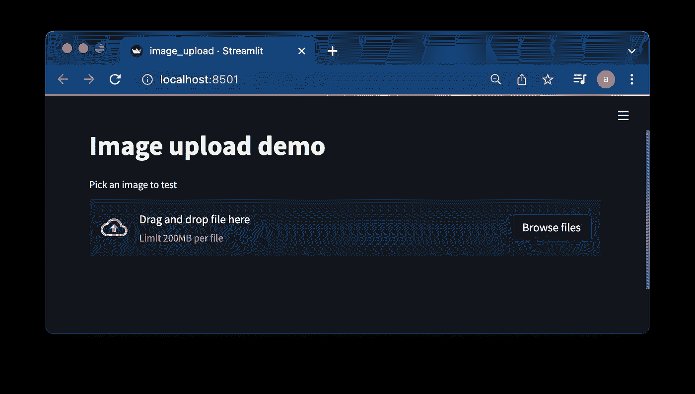
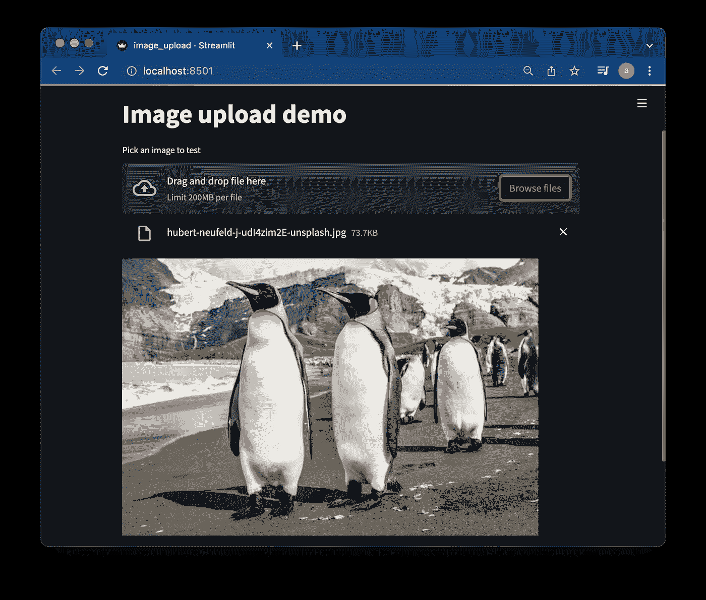
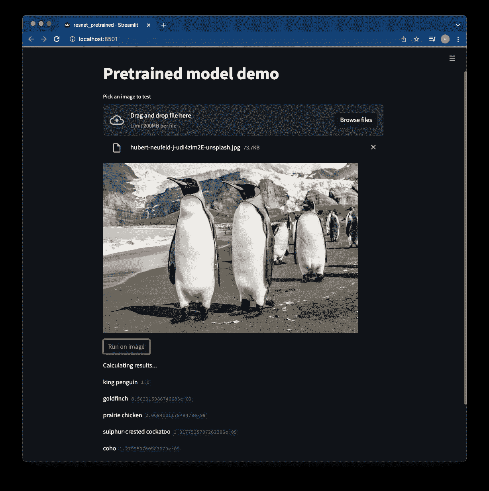
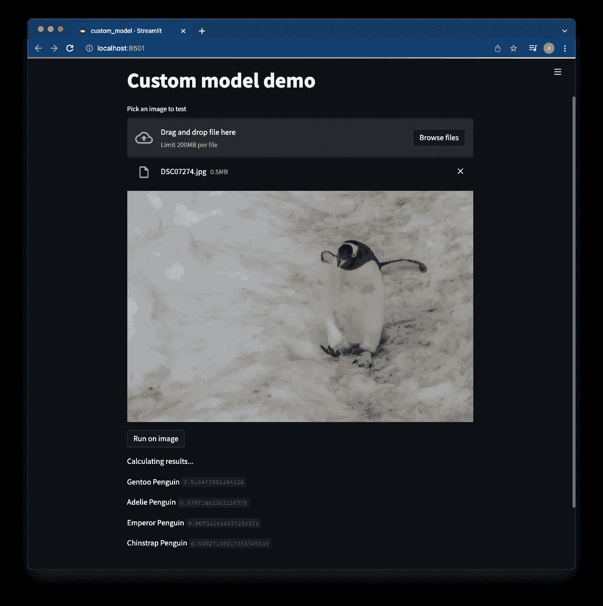

# 使用 Streamlit 演示您的模型

> 原文：<https://towardsdatascience.com/demo-your-model-with-streamlit-a76011467dfb>

## 如何在没有任何后端或前端知识的情况下快速部署您的计算机视觉模型


蒂姆·高在 [Unsplash](https://unsplash.com?utm_source=medium&utm_medium=referral) 上拍摄的照片

# 任务

假设你需要展示你在开发一个很酷的计算机视觉模型上取得的进展。您正在处理的模型还没有准备好，因此将它部署到适当的开发或生产环境中需要时间和大量的工作。另一方面，开发一个特定的 web 界面来与您的模型进行交互可能是一项单调乏味的任务，并且需要一套对于数据科学家来说并不常见的技能。

# 营救

[Streamlit](https://streamlit.io/) ，是一个开源的 Python 库，它使得创建和共享用于机器学习和数据科学的 web 应用变得容易。在向你的团队展示项目进展、获得并与你的经理分享见解，甚至从客户那里获得反馈时，它会非常有用。

它不能取代需要监控、日志记录等的适当的生产部署。然而，它能让你在几个小时内创建“有用的东西”,而不需要任何 web 开发的先验知识，甚至不知道如何使用 [flask](https://flask.palletsprojects.com/en/2.0.x/) 或 [Django](https://www.djangoproject.com/) 作为后端。

让我们看看这个魔术是如何运作的。

# 装置

要安装 Streamlit run:

```
pip install streamlit
```

如果你使用的是[诗歌](https://python-poetry.org/)那么改为运行:

```
poetry add streamlit
```

要验证所有的工作是否正常，您可以运行这一行并查看一些解释和演示:

```
streamlit hello
```

# 您的第一款应用——上传图片

让我们从从本地存储加载一个图像并显示它开始:

要运行该应用程序，只需输入:

```
streamlit run image_upload.py
```

然后它会在你的浏览器中打开应用程序。它应该是这样的:



图片上传演示应用，图片作者

你可以浏览你的电脑，上传任何你喜欢的图片。我选择上传一些可爱企鹅的图片。



图片上传演示应用。作者提供的应用程序图片， [Paul Carroll](https://unsplash.com/@mudmanuk?utm_source=unsplash&utm_medium=referral&utm_content=creditCopyText) 在 [Unsplash](https://unsplash.com/s/photos/king-penguin?utm_source=unsplash&utm_medium=referral&utm_content=creditCopyText) 上传的照片

# 部署预先训练的模型

有时，为了有一个好的基线，查看预训练模型如何工作是有用的。现在，您将在一个 Streamlit 应用程序中部署其中一个模型，在本例中为 ResNet18。

要使用 PyTorch 做到这一点，您需要加载模型并下载 ImageNet 标签:

为了在图像上运行模型，应该修改您之前使用的 load_image 函数来返回图像。您需要将 image_data 转换为 PIL 图像对象，以便将其输入到模型中:

下面的代码是对 [PyTorch ResNet 教程](https://pytorch.org/hub/pytorch_vision_resnet/)的修改版本，它运行一个模型预测并呈现图像的前 5 个类别:

当然，这也需要相应地修改主函数:

首先需要改的是标题。然后，您将加载模型、标签和图像。您还应该添加一个按钮，在加载的图像上触发模型推理。

这是应用程序在我之前加载的图像上运行时的样子:



带有示例输出的预训练 ResNet18 模型应用程序。作者提供的应用程序图片，[保罗·卡罗尔](https://unsplash.com/@mudmanuk?utm_source=unsplash&utm_medium=referral&utm_content=creditCopyText)在 [Unsplash](https://unsplash.com/s/photos/king-penguin?utm_source=unsplash&utm_medium=referral&utm_content=creditCopyText) 上传的照片

该模型以 1.0 的概率将图像分类为“国王企鹅”。其他 4 个顶级类的概率可以忽略不计。

这个例子的完整代码在 [Github](https://github.com/asyaf/fun_mini_projects/blob/master/streamlit_examples/resnet_pretrained.py) 中。

# 部署自定义影像分类模型

现在您已经准备好部署一个定制模型了。您将使用 PyTorch 模型，该模型根据企鹅类型对图像进行分类。创建使用自定义模型的 web 应用程序的过程与涉及预训练模型的过程非常相似，只是有一些修改。代码可以在[这里](https://github.com/asyaf/fun_mini_projects/blob/master/streamlit_examples/custom_model.py)找到。

## 关于模型

通常，预先训练的模型不足以满足我们的需求，因为手头的任务更加具体，并且不在此类模型的覆盖范围内。例如，ImageNet 有一个“国王企鹅”类，但实际上还有更多企鹅类型。因此，为了根据企鹅类型对图像进行分类，我必须训练自己的模型。我用[这个笔记本](https://github.com/asyaf/fun_mini_projects/blob/master/penguin_classification/transfer_learning_penguin.ipynb)进行训练。

如果你想了解更多关于这个模型是如何建立的，你可以在我之前的文章中阅读。

## 获取模型

为模型相关文件创建一个目录:

```
mkdir custom_model
```

要直接下载模型文件，您可以使用[链接](https://drive.google.com/file/d/1yTxSAWNnq4az36-FHGqeR-HBdwDnHRvH/view?usp=sharing)。将其复制到新目录。

将此常量定义添加到代码中:

```
MODEL_PATH = 'custom_model/model.pt'
```

## 创建标签文件

用分类类别的名称创建一个文本文件，每个类别一行。确保课程的顺序与培训中使用的顺序相匹配。

例如，要发现 penguin 数据集的顺序，您可以在培训笔记本中查找以下行，并在其后添加一张图片:

```
class_names = image_datasets['train'].classesprint(class_names)
```

这将为您提供输出:

```
[‘Adelie Penguin’, ‘Chinstrap Penguin’, ‘Emperor Penguin’, ‘Gentoo Penguin’]
```

因此，您应该将以下类名复制到名为 model_classes.txt 的文件中，并将其放在 custom_model 目录中:

```
Adelie Penguin
Chinstrap Penguin
Emperor Penguin
Gentoo Penguin
```

将新标签文件作为常量添加到代码中:

```
LABELS_PATH = 'custom_model/model_classes.txt
```

## 加载模型和标签

模型和标签加载变得更简单，因为它们现在是本地的:

## 更多的修复

与具有许多标签的 ResNet18 不同，该定制模型只有 4 个标签。因此，您应该修改预测代码以输出所有现有类的概率:

更改主函数，使应用程序具有不同的标题，并传递模型和标签的本地路径:

最后，应用程序应该是这样的:



自定义影像分类模型结果。作者上传的应用程序图片和照片

为了测试这款应用，我上传了一张巴布亚企鹅的图片。该模型以 0.91 的概率将该图像分类为巴布亚企鹅的图像。其他企鹅类型的概率要低得多。随着应用程序运行良好的确认，我得到了模型正确性的另一个证明。很可爱，对吧？

# 结论

开发一个运行良好的计算机视觉模型需要花费大量的时间和精力。在这个过程中，您可能需要部署您的模型，并向您的经理、队友和客户展示它的能力。Streamlit 是一个强大且易于使用的工具，即使您没有适当的内部工具或前端知识，也可以让您实现这一目标。

我展示了 Streamlit 在图像分类中的潜在用途。然而，它可以用于其他类型的计算机视觉任务，以及可视化，数据分析等等。我鼓励你浏览一下 [Streamlit 网站](https://streamlit.io/gallery)上的例子，亲自试用一下这个工具，看看它是如何融入你的日常工作的。