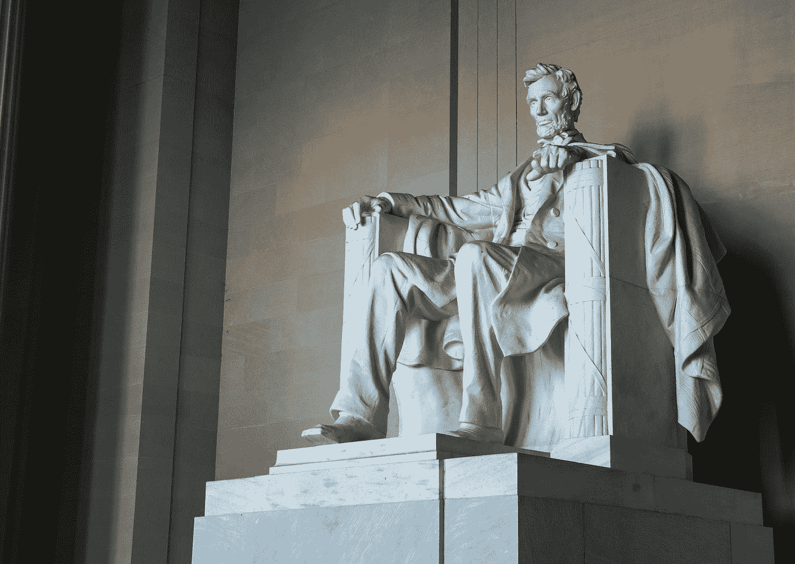
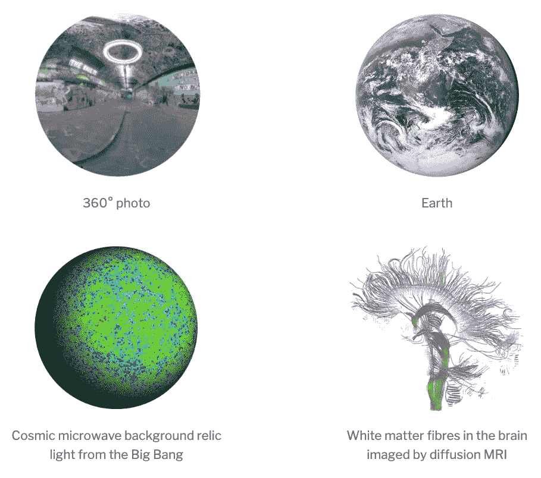
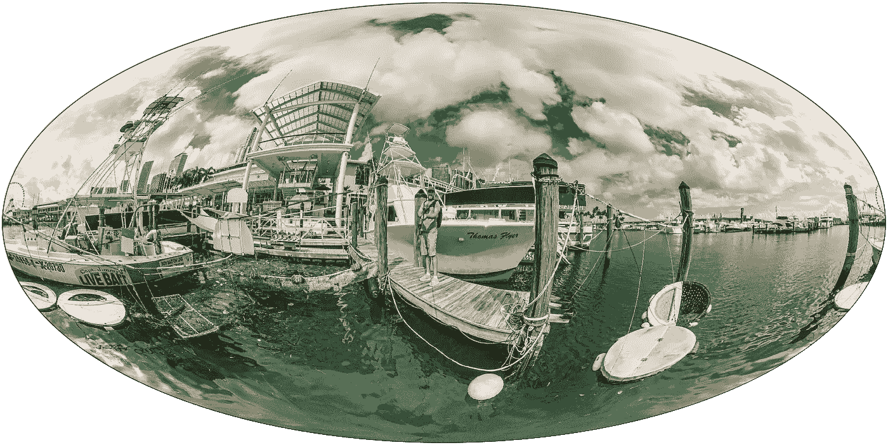

# 360°球面数据的民主化几何人工智能

> 原文：<https://towardsdatascience.com/democratizing-geometric-ai-for-360-spherical-data-eec9a53606b6>

## 360°球形数据解锁 AI



Josue Aguazia 在 [Unsplash](https://unsplash.com?utm_source=medium&utm_medium=referral) 上拍摄的照片

虽然人工智能现在对于标准类型的数据来说很常见，如结构化、序列和图像数据，但人工智能在其他更复杂形式的数据中的应用受到了严重限制。这些更复杂的数据集通常表现出非同寻常的几何特征。

几何人工智能(geometric AI)或几何深度学习(geometric deep learning)的领域已经出现，将人工智能的显著优势扩展到这些更复杂的几何数据集[1](关于几何人工智能的简要介绍，请参见我们最近的文章)。然而，几何人工智能技术的使用仍处于初级阶段，因为构建和部署几何人工智能模型仍然很困难。

# 民主化几何人工智能

一些优秀的几何人工智能库和框架已经存在，主要用于图形几何人工智能技术(如本文中[所讨论的)。然而，这些库相对来说是低级的，在部署到生产环境之前，需要具有几何人工智能专业知识的专家机器学习工程师来构建和训练模型。对于其他形式的几何人工智能，许多进展是在尖端研究领域，在这些领域还没有通用的库。](/lets-talk-about-graph-neural-network-python-libraries-a0b23ec983b0)

我们正在用[哥白尼](https://www.kagenova.com/products/copernicAI/)为几何人工智能开发一个[低代码](https://en.wikipedia.org/wiki/Low-code_development_platform)平台，这样非专家也可以很容易地用几何人工智能方法解决他们自己的问题。我们在这个方向上的第一步是使 360°球形数据的几何人工智能模型可用。

# 360°球面数据的几何人工智能

球形数据实际上非常普遍，出现在许多领域。例如，当在球面上的每个点进行观测时，例如在地球的地形图上，会产生球面数据。然而，当在方向上进行观察时也会出现这种情况，例如 360°摄像机拍摄的全景照片和视频，例如用于虚拟现实、监控或自动驾驶汽车。其他应用包括宇宙学中的大爆炸残余光分析或医学中的扩散磁共振成像，以及许多其他应用。



球形数据的例子。【作者创作的 360 照片；CMB 图像[来源](https://map.gsfc.nasa.gov/)；地球图片来源于[维基百科](https://en.wikipedia.org/wiki/Earth#/media/File:The_Blue_Marble_(remastered).jpg)；dMRI 图片来源于[维基百科](https://en.wikipedia.org/wiki/Diffusion_MRI#/media/File:DTI-sagittal-fibers.jpg)。]

在 [Kagenova](http://www.kagenova.com/) 我们正在努力解开深度学习在这些问题和其他涉及复杂几何数据(如球体)方面的巨大成功。对于 360 球形数据，标准人工智能技术是无效的，我们需要专门为数据的球形几何设计的几何人工智能。

在开发球形人工智能技术以解锁这些应用方面已经取得了很多进展(正如我们以前的文章[这里](/geometric-deep-learning-for-spherical-data-55612742d05f)和[这里](/efficient-generalized-spherical-cnns-1493426362ca)中所讨论的)。一个重大的挑战是开发计算效率高并且能够处理高分辨率数据(如高分辨率 360°图像)的技术。

在我们的研究中，我们在这方面取得了很大进展，首先开发了通用高效组件[2]，然后引入了支持高分辨率输入数据的方法[3]。虽然对高分辨率输入数据的支持开启了许多应用程序，例如分类问题，但在许多设置中，必须支持高分辨率输出数据。我们目前正在致力于支持高分辨率输出数据，并将很快发布一篇相关论文，这将在 360°图像理解方面开辟一系列新的应用，如语义[分割](https://en.wikipedia.org/wiki/Image_segmentation)。

现在，我们用于球形数据的几何人工智能技术正在成熟，我们计划将我们的方法和模型公开给任何人使用。

# 图像分类的概念 360

虽然我们的[哥白尼](https://www.kagenova.com/products/copernicAI/)平台的工作仍在进行中，但在此期间，我们计划通过 [AWS 人工智能市场](https://aws.amazon.com/marketplace/solutions/machine-learning)推出一些球形人工智能模型。

我们刚刚发布了我们的第一个模型，用于 360°图像的分类。

这是一个简单的模型，使用基于 inception 的架构[4]来执行 [ImageNet](https://www.image-net.org/) 分类，即使用 1，000 个 ImageNet 类对 360 个图像进行分类。ImageNet 可能无法为 360°分类提供最佳类别标签集，因为 360°图像比标准 2D 平面图像捕获更多内容；然而，它提供了一组熟悉的类标签来开始。在这个模型中，我们没有利用我们最新的研发成果，而是提供了一个非常简单的模型，让任何人都可以立即开始 360°图像分类。

你可以在 AWS AI Marketplace [这里](https://aws.amazon.com/marketplace/pp/prodview-qyfvznus6yzow)找到免费*的 Inception360。演示如何使用 Inception360 的笔记本可在[此处](https://gitlab.com/kagenova/copernicai/aws-marketplace-tutorial/-/blob/main/inception360/inception360.ipynb)获得。*

下面我们举例说明在(样本外)360°图像上的 360°概念分类。考虑下面一个码头和帆船的 360 度图像。



由 Inception360 分类的示例(样本外)图像。返回以下排序的前 5 个分类:`dock, boathouse, gondola, schooner, yawl. [Original image [source](https://pixexid.com/image/oif1n7u-360-image-fishing).]`

Inception360 返回该图像的以下(排序前 5 名)分类，这些分类与该图像非常匹配:

```
dock, boathouse, gondola, schooner, yawl
```

# 未来(更多型号即将推出！)

虽然几何人工智能技术可以释放人工智能对于复杂几何数据的巨大潜力，但由于当前在构建、训练和应用几何人工智能模型方面的困难，它们尚未得到广泛利用。

有了哥白尼的平台，我们打算将几何人工智能大众化，以广泛应用于解决现有人工智能技术不适用的许多问题。我们在这个方向上的第一步是在 AWS AI Marketplace 上发布球形 360°数据的几何 AI 模型，从 Inception360 开始对 360°图像进行分类。请关注此空间，因为我们计划很快发布更多型号！

# 参考

[1]布朗斯坦，布鲁纳，科恩，维利科维奇，*几何深度学习:网格，群，图，测地线，和量规* (2021)， [arXix:2104.13478](https://arxiv.org/abs/2104.13478)

[2]科布，沃利斯，马沃-帕克，马利涅尔，普莱斯，达韦扎克，麦克尤恩，*高效广义球形 CNN*，ICLR (2021)， [arXiv:2010.11661](https://arxiv.org/abs/2010.11661#)

[3] McEwen，Wallis，Mavor-Parker，*可扩展和旋转等变球形 CNN 的球上散射网络*，ICLR (2022)， [arXiv:2102.02828](https://arxiv.org/abs/2102.02828)

[4] Szegedy 等人，深入研究卷积，IEEE CCVPR(2015)[arXiv:1409.4842](https://arxiv.org/abs/1409.4842)