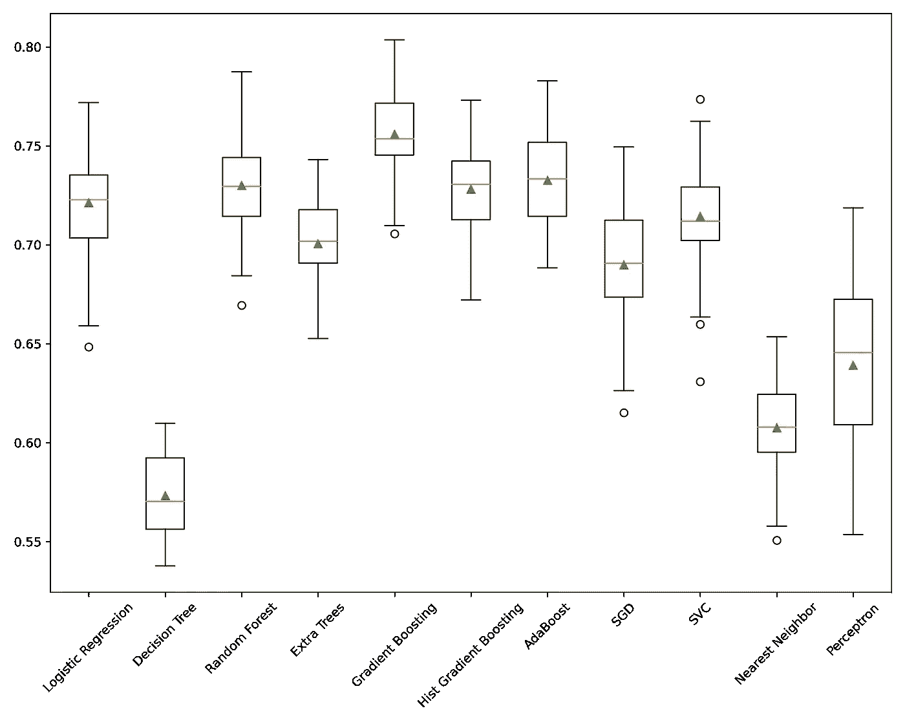

# 揭开机器学习模型选择的神秘面纱，逐步指南

> 原文：<https://towardsdatascience.com/demystify-machine-learning-model-selection-e3f913bab7e7>

## 利用交叉验证、性能指标和总运行时间来确定最适合您的数据的模型


弗拉季斯拉夫·巴比延科在 [Unsplash](https://unsplash.com?utm_source=medium&utm_medium=referral) 上的照片

# 什么是选型？

机器学习中的模型选择就是为你的数据选择最好的模型。不同的模型在不同的数据集上会有不同的表现，而且差距可能很大。如今，梯度增强树是表格数据的[最佳执行模型](https://www.quora.com/Why-is-XGBoost-among-most-used-machine-learning-method-on-Kaggle)，例如 [XGBoost](/https-medium-com-vishalmorde-xgboost-algorithm-long-she-may-rein-edd9f99be63d) ，或者 SciKit Learn 中的实现，这是很常见的。但是，不要总是默认使用 XGBoost 之类的模型，重要的是要评估不同算法的性能，看看哪种算法最适合您。

此外，不同的模型也有一些优势。例如，**逻辑回归**可以告诉你模型的**系数**，让你解释每个特征对最终预测的影响。像 **RandomForest** 这样的袋装树模型可以告诉你模型中每一列的**特征重要性**，类似于 Logistic 回归的系数。

让我们来看看如何在您选择的评分标准和训练速度之间选择最佳模型。

# 入门指南

对于我们今天的演示，我们将使用**银行营销 UCI** 数据集，您可以在 [Kaggle](https://www.kaggle.com/c/bank-marketing-uci) 上找到该数据集。该数据集包含有关营销活动中银行客户的信息，并且包含一个可以在分类模型中使用的目标变量。该数据集在 CC0: public domain 下的 Public Domain 中，可以使用。

有关构建分类模型的更多信息，请查看:[构建令人惊叹的二进制分类器所需要知道的一切](/everything-you-need-to-know-to-build-an-amazing-binary-classifier-590de3482aad)和[超越了具有多类和多标签模型的二进制分类](/go-beyond-binary-classification-with-multi-class-and-multi-label-models-6ce91ca08264)。

我们将从导入必要的库和加载数据开始。我们今天将利用 Scikit-Learn 进行分析。

```
import numpy as np
import pandas as pd
import seaborn as sns
import matplotlib.pyplot as plt
from timeit import timeit

import warnings
warnings.filterwarnings('ignore')

from sklearn.model_selection import cross_val_score
from sklearn.model_selection import RepeatedStratifiedKFold
from sklearn.preprocessing import OneHotEncoder, LabelEncoder
from sklearn.preprocessing import MinMaxScaler
from sklearn.compose import ColumnTransformer

from sklearn.linear_model import LogisticRegression
from sklearn.linear_model import Perceptron
from sklearn.linear_model import SGDClassifier
from sklearn.tree import DecisionTreeClassifier
from sklearn.ensemble import RandomForestClassifier
from sklearn.ensemble import GradientBoostingClassifier
from sklearn.ensemble import HistGradientBoostingClassifier
from sklearn.ensemble import AdaBoostClassifier
from sklearn.ensemble import ExtraTreesClassifier
from sklearn.neighbors import KNeighborsClassifier
from sklearn.svm import SVC

from sklearn.compose import make_column_selector as selector
from sklearn.pipeline import Pipeline
```

接下来，我们将数据加载到一个**熊猫数据帧**中，并观察它的形状。

```
df = pd.read_csv("bank.csv", delimiter=";")
df.shape
```

```
(4521, 17)
```

# 数据清理

我们有**4500 行**17 列的数据，包括目标变量。在执行我们的模型选择之前，我们将对数据进行一些简单的清理，首先寻找**空值**，实际上没有空值，并删除任何重复的**。**

```
# check for nan/null
df.isnull().values.any()
# drop duplicates
len(df.drop_duplicates())
```

**接下来，在这个特定的数据集中，我们需要删除**持续时间**列。如文件中所述，该列对目标变量的结果有很大影响，因此，应从培训中排除。**

> ****持续时间**:最后一次联系的持续时间，单位为秒(数字)。重要注意事项:该属性对输出目标有很大影响(例如，如果 duration=0，则 y='no ')。然而，在执行呼叫之前，持续时间是未知的。还有，结束通话后 y 显然是已知的。因此，该输入应仅用于基准测试目的，如果目的是获得现实的预测模型，则应丢弃。**

```
df.drop(columns='duration', inplace=True)
```

# **数据准备**

**接下来，让我们利用简单的 python 切片将数据分成`X`和`y`两个集合。因为我们的目标变量是最后一列，所以我们可以只取最后一列作为我们的`X`数据，只取最后一列作为我们的`y`数据。**

```
X = df.iloc[:, :-1]
y = df.iloc[:,-1]
```

**我们的`y`列是带有`yes`和`no`值的二进制列。最好利用 Skikit-Learn 中的`LabelEncoder`将这些编码到`1`和`0`中。**

```
enc = LabelEncoder()
enc.fit(y)
y = enc.transform(y)
```

**接下来，我们将利用**列转换器**将我们的数据转换成机器学习可接受的格式。每当我为可重复性构建模型时，我更喜欢使用管道。关于它们的更多信息，请查看我的文章:[停止一步一步地构建你的模型。利用管道实现流程自动化！](/using-pipelines-in-sci-kit-learn-516aa431dcc5)。**

**对于我们的转换，我们为数字特征选择了`MinMaxScaler`，为分类特征选择了`OneHotEncode` (OHE)。OHE 将分类数据转换为二进制表示形式，防止模型预测序数值之间的值。更多关于 OHE 的信息，请查看:[一个热门编码](https://scikit-learn.org/stable/modules/generated/sklearn.preprocessing.OneHotEncoder.html)。**

```
column_trans = ColumnTransformer(transformers=
        [('num', MinMaxScaler(), selector(dtype_exclude="object")),
        ('cat', OneHotEncoder(), selector(dtype_include="object"))],
        remainder='drop')
```

# **为模型选择创建模型列表**

**现在我们要用我们不同的模型建立一个字典。字典中的每个条目由作为**键**的**型号名称**和作为**值**的**管道**组成。**

**模型选择的想法是挑选性能最佳的模型，而不是调整模型以获得最佳性能。这就是所谓的超参数调整，您可以在这里了解更多信息:【HalvingGridSearch 使超参数调整速度提高了 5 到 10 倍。**

**因此，我们将用默认参数实例化每个模型。一个例外是，我总是倾向于使用可用的`class_weight='balanced'`参数。这是一种简单的方法来抵消不平衡数据带来的问题。在这里阅读更多关于处理不平衡数据的内容:[在构建你的 ML 模型的时候不要陷入不平衡数据的陷阱](/working-with-imbalanced-data-efbd96b3e655)。**

```
def get_models():
    models = dict()

    models['Logistic Regression'] = Pipeline([('prep', column_trans), 
        ('model', LogisticRegression(random_state=42, max_iter=1000, class_weight='balanced'))])

    models['Decision Tree'] = Pipeline([('prep', column_trans), 
        ('model', DecisionTreeClassifier(random_state=42, class_weight='balanced'))])

    models['Random Forest'] = Pipeline([('prep', column_trans), 
        ('model', RandomForestClassifier(random_state=42, class_weight='balanced'))])

    models['Extra Trees'] = Pipeline([('prep', column_trans), 
        ('model', ExtraTreesClassifier(random_state=42, class_weight='balanced'))])

    models['Gradient Boosting'] = Pipeline([('prep', column_trans), 
        ('model', GradientBoostingClassifier(random_state=42))])

    models['Hist Gradient Boosting'] = Pipeline([('prep', column_trans), 
        ('model', HistGradientBoostingClassifier(random_state=42))])

    models['AdaBoost'] = Pipeline([('prep', column_trans), 
        ('model', AdaBoostClassifier(random_state=42))]) 

    models['SGD'] = Pipeline([('prep', column_trans), 
        ('model', SGDClassifier(random_state=42, class_weight='balanced'))])

    models['SVC'] = Pipeline([('prep', column_trans), 
        ('model', SVC(class_weight='balanced', random_state=42))])

    models['Nearest Neighbor'] = Pipeline([('prep', column_trans), 
        ('model', KNeighborsClassifier(3))])

    models['Perceptron'] = Pipeline([('prep', column_trans), 
        ('model', Perceptron(random_state=42))])

    return models
```

# **交叉验证**

**在训练模型时，不要让模型过度适应您的数据或允许它一次看到所有数据，这一点很重要。通常你会对你的数据进行**训练测试分割**；然而，在这种情况下，我们将使用**交叉验证**方法，利用`RepeatedStratifiedKFold`方法找到最佳模型，以处理将数据划分到多个训练和测试集。**

****分层**采样确保相对类别频率在每个训练和验证折叠中大致保持不变，对于不平衡数据至关重要。关于这种方法的更多信息，请查看:[交叉验证:评估评估者的表现](https://scikit-learn.org/stable/modules/cross_validation.html)。**

**我们将构建一个可重用的函数，允许我们测试存储在字典中的不同模型。根据数据集的大小，这里有几个参数可以使用。您可以确定**分割**和**重复**的次数。如果您有一个像本例这样的较小数据集，请尽量不要多次分割数据，否则您将没有足够的样本来进行训练和测试。**

**此外，您需要指定想要使用的评分标准。Scikit-Learn 支持许多不同的工具，您可以在他们的[文档](https://scikit-learn.org/stable/modules/model_evaluation.html)中看到如何引用它们。对于这个例子，我选择了 **ROC-AUC** 作为我的指标。有关选择最佳度量的更多信息，请查看:[停止使用准确性来评估您的分类模型](/evaluating-ml-models-with-a-confusion-matrix-3fd9c3ab07dd)。**

```
# evaluate a give model using cross-validation
def evaluate_model(model, X, y):
    cv = RepeatedStratifiedKFold(n_splits=5, 
                                 n_repeats=10, 
                                 random_state=1)
    scores = cross_val_score(model, X, y, 
                             scoring='roc_auc', 
                             cv=cv, n_jobs=-1)
    return scores
```

# **评估模型**

**现在我们可以进行评估了。我们将调用`evaluate_model`函数遍历字典，并将结果存储在一个列表中。我们将对模型的名称做同样的处理，以便于我们绘图。**

**每次评估模型时，我们还会使用神奇的命令`%time`检查模型的速度，它会打印出评估模型所花费的时间，帮助我们进行选择。我们还打印出十次重复的**平均分数**和**标准偏差**分数。**

**最后，我们将利用分数的**盒须图**在单个图上绘制结果。**

```
# get the models to evaluate
models = get_models()

# evaluate the models and store results
results, names = list(), list()
for name, model in models.items():
    %time scores = evaluate_model(model, X, y)
    results.append(scores)
    names.append(name)
    print('* %s Score = %.3f StdDev = (%.3f)' % (name, np.mean(scores), np.std(scores)), '\n')

# plot model performance for comparison
plt.figure(figsize=(10,8))
plt.boxplot(results, labels=names, showmeans=True)
plt.xticks(rotation=45)
```

```
290 ms ± 0 ns per loop (mean ± std. dev. of 1 run, 1 loop each)
* Logistic Regression Score = 0.721 StdDev = (0.025) 

204 ms ± 0 ns per loop (mean ± std. dev. of 1 run, 1 loop each)
* Decision Tree Score = 0.573 StdDev = (0.021) 

1.61 s ± 0 ns per loop (mean ± std. dev. of 1 run, 1 loop each)
* Random Forest Score = 0.730 StdDev = (0.024) 

1.68 s ± 0 ns per loop (mean ± std. dev. of 1 run, 1 loop each)
* Extra Trees Score = 0.701 StdDev = (0.021) 

2.75 s ± 0 ns per loop (mean ± std. dev. of 1 run, 1 loop each)
* Gradient Boosting Score = 0.756 StdDev = (0.021) 

2.04 s ± 0 ns per loop (mean ± std. dev. of 1 run, 1 loop each)
* Hist Gradient Boosting Score = 0.728 StdDev = (0.021) 

886 ms ± 0 ns per loop (mean ± std. dev. of 1 run, 1 loop each)
* AdaBoost Score = 0.733 StdDev = (0.023) 

212 ms ± 0 ns per loop (mean ± std. dev. of 1 run, 1 loop each)
* SGD Score = 0.690 StdDev = (0.031) 

4.01 s ± 0 ns per loop (mean ± std. dev. of 1 run, 1 loop each)
* SVC Score = 0.715 StdDev = (0.027) 

660 ms ± 0 ns per loop (mean ± std. dev. of 1 run, 1 loop each)
* Nearest Neighbor Score = 0.608 StdDev = (0.022) 

127 ms ± 0 ns per loop (mean ± std. dev. of 1 run, 1 loop each)
* Perceptron Score = 0.639 StdDev = (0.043)
```

****

**作者图片**

**在这里，我们可以很好地看到每个型号的性能。某些算法表现不佳，我们可以在这个用例中丢弃它们，例如简单的**决策树**、最近邻分类器**和**感知器**分类器。这些都是列表中一些比较简单的模型，它们的表现比其他的差并不奇怪。**梯度提升树**是表现最好的分类器，ROC-AUC 得分为`0.756`，名副其实。AdaBoost** 和 **RandomForest** 紧随其后，分别获得`0.733`和`0.730`的分数。**

**我们还可以看看运行所用的时间。在这些模型中，**梯度增强树**在`2.75`秒时表现最慢，而 **AdaBoost** 在`886`毫秒时表现最好。看**逻辑回归**；然而，它在`0.721`时表现相当好，但在`290`毫秒时非常快，这可能会影响我们的选择过程。通过利用其系数，逻辑回归具有**高解释能力**的优点，并且在梯度增强树的大约 10%的时间内执行。**

**最终的选择取决于你，但是这些方法应该给你一个强大的基线来为你的用例选择最好的模型！**

**本文的所有代码都可以在 [GitHub](https://github.com/broepke/ModelSelection) 上获得**

# **结论**

****模型选择**是你建立机器学习模型的关键一步。选择正确的模型会极大地影响机器学习模型的性能，而选择错误的模型会给你留下无法接受的结果。我们通过利用**管道**来实现一致性，完成了**准备数据**的过程。然后，我们建立了一个模型列表，我们希望**评估他们的表现**。我们使用交叉验证在各种数据切片上测试每个模型，并最终绘制出结果。利用这一过程是为您的应用选择正确型号的快速而有效的方法！**

**如果你喜欢阅读这样的故事，并想支持我成为一名作家，考虑注册成为一名媒体成员。一个月 5 美元，让你可以无限制地访问成千上万篇文章。如果您使用我的链接 *注册，我会为您赚取一小笔佣金，无需额外费用。***