# 揭开高效自我关注的神秘面纱

> 原文：<https://towardsdatascience.com/demystifying-efficient-self-attention-b3de61b9b0fb>

## 实用概述

图片作者。人工智能-使用[达尔-E-2](https://openai.com/dall-e-2/) 生成

# 介绍

Transformer 架构[1]对于近年来深度学习领域的一些最大突破至关重要。特别是在自然语言处理(NLP)领域，预训练的自动编码模型(如 BERT [2])和自回归模型(如 GPT-3 [3])一直在努力超越最先进的技术，并达到类似人类的文本生成水平。Transformer 最重要的创新之一是使用关注层作为路由信息的主要方式。

顾名思义，注意力的目标是让模型关注输入的重要部分。从人类的角度来看，这是有意义的:当我们看一个输入(例如，一个图像或一个文本)时，有些部分对我们的理解来说比其他部分更重要。我们可以将输入的某些部分相互联系起来，并理解长期的背景。这些对于我们的理解都是必不可少的，注意力机制允许变形金刚模型以类似的方式学习。虽然这已被证明是非常有效的，但注意机制有一个实际问题:它们与输入长度成二次方关系。幸运的是，有很多研究致力于提高注意力的效率。

这篇博文旨在通过直观的解释，对不同类型的高效注意力提供一个全面的概述。这并不是对已经撰写的每篇论文的完整概述，而是对底层方法和技术的覆盖，并带有深入的示例。

# 注意力入门

在深入研究具体方法之前，让我们先回顾一下自我关注机制的基础知识，并定义一些将在这篇博文中重复使用的术语。

自我关注是一种特殊类型的关注。常规注意和自我注意的区别在于，自我注意关注的是一个单一的序列，而不是将输入与输出序列联系起来。它允许模型让序列学习关于它自己的信息。举个例子，就拿“那个人走到河边，他吃了一个三明治”这句话来说吧。与以前的嵌入方法(如 TF-IDF 和 word2vec [4])相比，自我关注允许模型学习“河岸”不同于“金融银行”(上下文相关)。此外，它允许模型学习“他”指的是“那个人”(可以学习依赖性)。

自我关注可以解释如下。假设我们有一个长度为 n 的序列 x，x 中的每个元素都用一个 d 维向量表示。在 NLP 的情况下，x 将是句子的单词嵌入。x 通过三个(训练的)权重矩阵 WQ、WK 和 WV 被投影，输出三个矩阵:Q、K 和 V，所有维度都是 n*d。自我关注可以被定义为下面的一般公式:

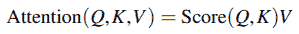

**方程式 1:** 广义注意力

最常用的得分函数是 softmax。如[2]所述，取 softmax 并应用一个比例因子会导致比例点积注意(SDP):

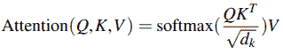

**方程式 2:** 缩放-点积注意

在这里，输入 x 的关注度是通过将 Q 乘以 KT(将每个项目与每个其他项目相关联)、应用缩放因子、获取逐行 softmax(归一化每个行)、将 V 中的每个值乘以其计算出的关注度来计算的，因此我们的输出再次是 n*d。因此，Q 和 K 用于将每个元素与每个其他元素相关联，而 V 用于将 softmax 的输出分配回每个单独的元素。

作者认为，对于较大的 d_k 值，点积变得非常大，这反过来将 softmax 函数推到梯度非常小的区域。因此，点积通过除以√(d_k)来缩放。请注意，这对计算的复杂性没有影响，因为这是由 softmax(QK)计算决定的。由于这个原因，它将被排除在一般公式之外。

正如你可能已经看到的，这个公式有一个问题:Q 和 K 相乘得到一个 n*n 矩阵。取 n*n 矩阵的行方式 softmax 具有 O(n)的复杂度。这对于运行时和内存使用都是有问题的，因为 n 可能非常大。对于多页文档，很快就变得无法计算完整输入的自我关注，这意味着输入必须被截断或分块。这两种方法都去除了自我关注的一个主要好处:长期背景。这种类型的注意力，其中每个项目都与其他项目相乘，被称为“整体注意力”，可以形象化如下:

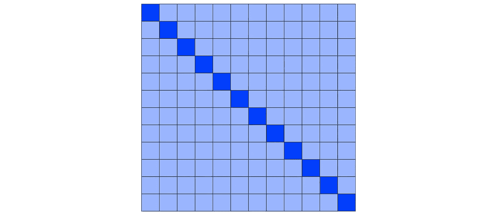

**图一:**全球瞩目。图片作者。

在这里，对角线中的每个项目(深蓝色)查看其行和列中的所有其他项目(以浅蓝色突出显示)。

为简单起见，以下定义将在下文中使用:

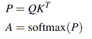

**等式 3:** P 和 A 的定义

在这里，P 指的是 Q 和 K 相乘的结果 n*n 矩阵，A(自我关注矩阵)指的是 P 的 softmax，注意大多数论文使用自己的定义，这可能会有点混乱。

关于注意力的更详细的解释，我鼓励你去读读[插图变压器](https://jalammar.github.io/illustrated-transformer/)。

# 可供选择的事物

降低 SDP 复杂性的主要假设是，并非输入的所有部分都同等重要，并且一些记号不需要关注其他特定记号。

为了避免计算全球注意力，有几种选择:

*   **稀疏注意力:**稀疏注意力方法稀疏化全局注意力矩阵，以减少必须相互关注的标记的数量
*   **矩阵分解**:矩阵分解方法的工作原理是注意力矩阵是低秩的，可以用低秩矩阵进行分解和近似，而不会丢失太多信息。
*   **位置敏感哈希:**位置敏感哈希提供了一种快速计算最近邻搜索的方法。这可以直接应用于关注矩阵，以选择哪些令牌应该相互关注。
*   **内核关注:**内核关注方法将 softmax 函数解释为内核，并使用它来更有效地计算自我关注矩阵。

所有这些选择都以牺牲一些性能为代价，降低了计算复杂度。注意，所有这些方法都试图降低序列长度 n 的复杂度。为此，所有复杂度都降低到依赖于 n 的部分。

## 稀疏的注意力

稀疏注意力方法通过仅考虑 n*n 自我注意力矩阵 p 中的计算子集来降低复杂性。其思想是记号不需要注意每一个其他记号，而是可以关注更重要的记号而忽略其他记号。那么问题就变成了:我们如何挑选要关注的令牌？

**局部注意** O(n*W)

局部注意，也称为窗口式 **/** 滑动注意，是一种简单而有效的稀疏化自我注意矩阵的方法。在局部注意中，标记只关注它们的局部邻域或窗口 w。因此，不再计算全局注意。通过只考虑 W 中的令牌，它将复杂度从 n*n 降低到 n*W，这可以如图 2 所示。

**随机注意** O(n*R)

在随机注意中，标记只注意随机的其他标记。复杂度取决于所选随机记号的数量(R)，它是所有记号的比率。这可以从图 2 中看到。

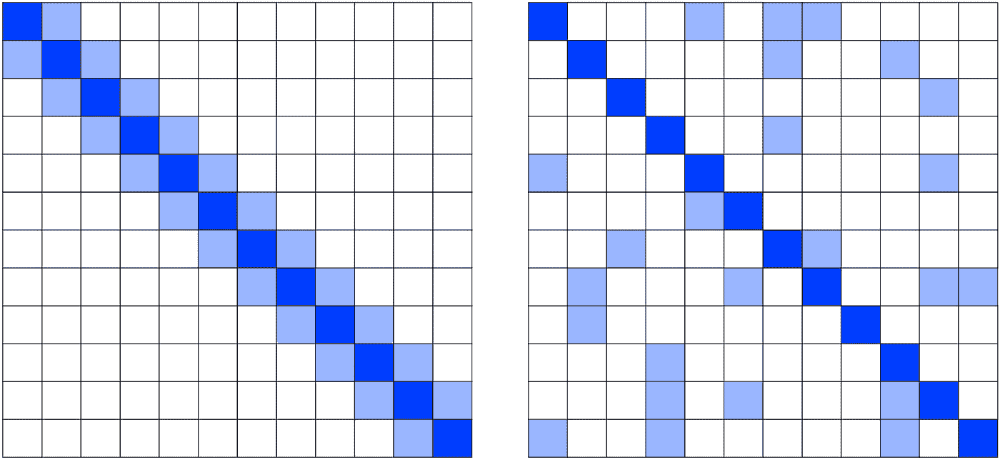

**图 2** :局部注意(左)和随机注意(右)。图片作者。

**稀疏变压器** O(n√n)

稀疏变压器[5]是减少自我关注复杂性的第一个尝试。作者提出了两种稀疏注意模式:步进注意和固定注意，这两种模式都将复杂度降低到 O(n√n)。他们的两种注意力类型可以使用以下函数来定义:

*   跨步注意:如果
    *(i+s) > j > ( i-s)或(i-j) mod s = 0* ，则第 I 个位置可以关注第 j 个位置
*   固定注意:如果 *floor(j/s) = floor(i/s)或(j mod s) ≥ (s-c)* ，第 I 个位置可以注意到第 j 个位置

其中 s 是步幅(设置为√n ), c 是超参数。这些算法的复杂性为 O(n*s)，当 s 设置为√n 时，这导致 O(n√n)。跨步注意力类似于具有跨步的局部注意力，作者认为这对于从具有周期性结构的数据(如图像或音乐)中学习非常重要。但是，对于没有周期性结构的数据(如文本)，这种模式可能无法将信息路由到远处的项目。固定注意力是解决这个问题的方法。它让一些项目关注整个列，并创建一个“摘要”传播给其他项目。两种不同模式的可视化如图 3 所示。

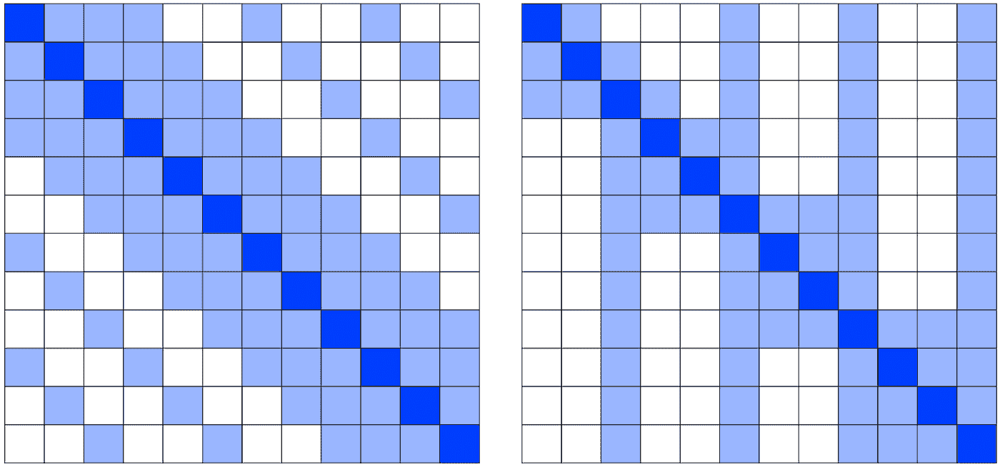

**图 3** :跨步注意(左)和固定注意(右)。图片作者。

**龙前** O(n)

Longformer [6]使用了滑动(或局部)、扩张滑动和全局注意的组合。扩张滑动注意是基于扩张 CNN 的想法。扩大滑动注意的目标是逐渐增加每一层的感受野。作者提出在较低层使用局部注意，窗口 W 较小(可以看作是间隙 d 为 0 的扩张滑动窗口注意)，在较高层增加 W 和 d。

仅针对特定令牌添加全局注意。将哪些令牌设为全局的选择由用户决定。分类的一个合理选择是使[CLS]标记全局化，而对于 QA 任务，所有问号标记都可以全局化。他们算法的复杂度是(n*W + s*n)，它与序列长度 n 成线性比例，因此简化为 O(n)。

请注意，Longformer 的实现需要一个定制的 CUDA 内核，因为现代 GPU 针对密集矩阵乘法进行了优化。作者提供了一个定制的 CUDA 内核，允许在 PyTorch 和 Tensorflow 中的 GPU 上有效计算他们提出的稀疏矩阵乘法。

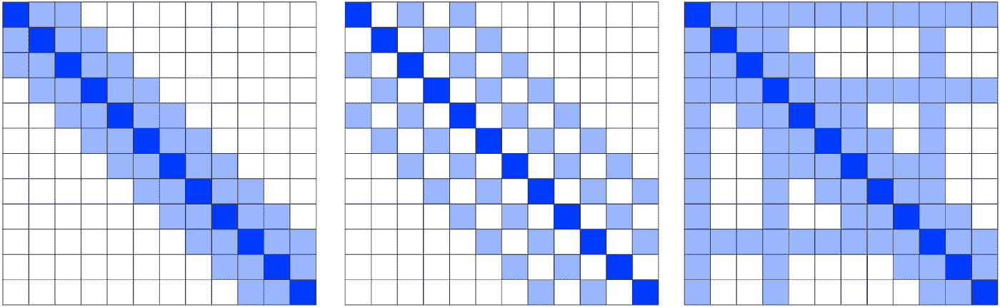

**图 3** :局部注意(左)、扩张滑动注意(中)、全局注意(右)。图片作者。

## 矩阵分解

在矩阵分解(或分解)方法中，矩阵 P 被假定为低秩的，这意味着矩阵中的所有项并不是彼此独立的。所以可以用更小的矩阵来分解和近似。这样，n*n 矩阵可以简化为 n*k(其中 k< n), which allows us to compute A (the result of the softmax) much more efficiently.

**l 前一个** O(n)

Linformer [7]的作者提出使用注意力矩阵的低秩分解来达到 O(n)的复杂度。作者首先从经验上表明，当应用奇异值分解(SVD)时，A 可以从它的前几个最大奇异值中恢复，这表明它是低秩的。然后，他们使用约翰逊-林登斯特劳斯引理(JL)证明 A 可以近似为低秩矩阵γ，误差非常小，该引理表示:

> 高维空间中的一组点可以被投影到低维空间中，同时(几乎)保持点之间的距离。

作者指出，计算每个自我关注矩阵的奇异值分解增加了额外的复杂性。相反，作者在 V 和 K 之后添加了两个线性投影矩阵，这有效地将原始(n*d)矩阵投影到更低(k*d)维矩阵，其中 K 是降低的维度。这可以被形象化，如图 4 所示:

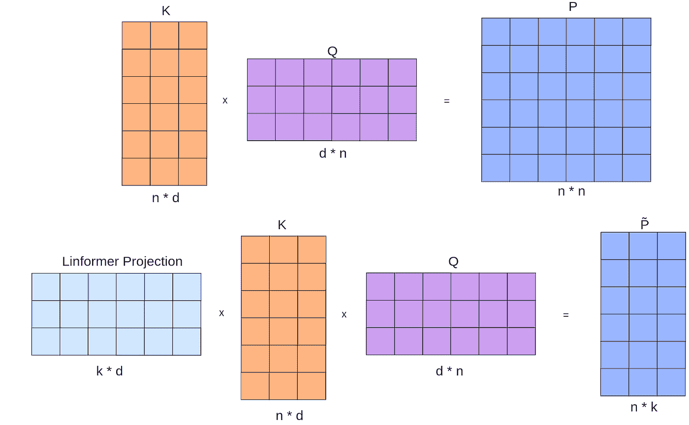

**图 4** :标准立正(上)和非标准立正(下)。图片作者。

他们提出的新的注意力公式如等式 3 所示:

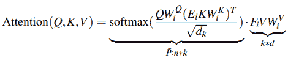

**等式 3:** 前注意函数

这里，Ei 和 Fi 是两个线性投影矩阵。请注意，要将 A 从 n*n 减少到°( n * K ),只需将 K 投影到维度 K。由于 V 仍然是 n*d，因此 V 也被投影到维度 K，以确保最终的输出矩阵是 n*d(这是下一层的预期维度)。

这实际上是通过线性投影减少了序列长度 n。这对于 NLP 是有意义的，因为一个句子中的所有单词并不是(同等地)相关的。

最后一步是选择 k 的值。作者表明 dlog(d)的值对于 k 是足够的，这导致 O(nk)的复杂度。因为 d 相对于输入长度 n 不增加，所以自我注意机制的复杂度变为 O(n)。

纽约变压器

ny strm former[8]使用 ny strm 方法来近似自我注意矩阵。想法是将矩阵 P 重写为一个由四部分组成的矩阵:B 是 m*m，其中 m 是某个数字< n), C, D, and E. This is shown on the left in Figure 5:

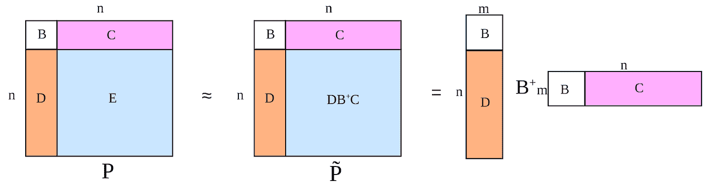

**图 5** :矩阵近似的 Nystrom 方法解释。图片作者。

根据 nyströ方法，p 可以近似为 P̃，方法是用 DB⁺C 代替 e(其中 B⁺是 b 的摩尔-彭罗斯伪逆)，然后可以进一步简化，如图 5 所示。原始的 n*n 矩阵现在被分解为两个 n*m 矩阵和一个 m*m 矩阵的乘积。这极大地减少了计算量，因为只有选定的 K 行和 Q 列需要相乘来创建这个分解(而不是所有的行和列)。

为了更好地理解这是如何工作的，让我们使用 nyströ方法近似子矩阵 e 中的单个元素 eᵢ,ⱼ。假设 P 是一个 5*5 的矩阵，我们选择 B 作为我们的第一个单元格(1，1)，C 作为第一行(2，1 到 5，1)，D 作为第一列(1，2 到 1，5)。这可以被形象化，如图 6 所示。假设我们想知道 e₃,₃的值，它是 c₃,₃和 d₃,₃的乘积(在 SDP 中，这将是 q 和 k 中单个值的乘积)。在 P̃，我们不再有 c₃,₃和 d₃,₃的实际乘积，但是我们知道 c₃,₁and d₁,₃(as 的值，这些值在我们选择的行和列中。为了逼近 e₃,₃，我们将 c₃,₁and d₁,₃的值乘以 b 的倒数。正如您所看到的，我们可以用 q 中的一行和 k 中的一列的结果来逼近 e 中的任何值

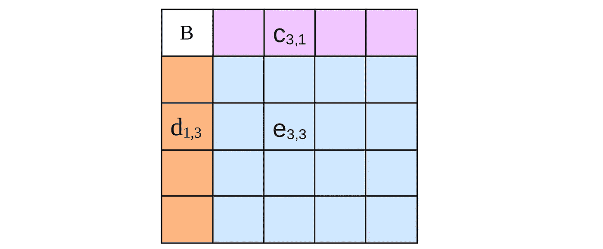

**图 6** :矩阵近似的 Nyströ方法示例。图片作者。

虽然本例中选择了 Q 和 K 的第一行和第一列，但也可以对多行和多列进行采样，称为“界标”，本文中就是这么做的。使用分段平均值选择这些界标，这类似于局部平均池(将输入分成段并取每个段的平均值)。

然而，仍然存在一个问题:为了计算关注矩阵 a，需要首先计算 p，因为 softmax 运算通过取 p 中整行的内容来归一化 a 的元素。由于目标是避免计算 p，所以作者提出了一个变通方法:他们对 P̃的三个子矩阵进行 softmax 运算，并将它们相乘，如等式 3 所示:

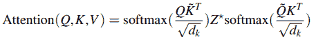

**方程 3:** 纽斯特罗姆注意力函数

这里，Z*是 B⁺.的近似值

虽然这在技术上是不允许的，因为 softmax 是一个非线性操作，但作者表明，这种方法提供的近似仍然是足够的。

## 局部敏感散列法

位置敏感哈希(LSH)是一种可用于高效近似最近邻搜索的技术。LSH 的思想是可以选择哈希函数，使得对于高维空间 p 和 q 中的任意两点，如果 p 接近 q，那么 hash(p) == hash(q)。使用该属性，所有点都可以被划分到散列桶中。这使得更有效地找到任何点的最近邻居成为可能，因为只需要计算到相同散列桶中的点的距离。在自我关注的情况下，这可以用于通过对 Q 和 K 应用 LSH 来加速 P 的计算，并且在应用 LSH 之后仅将彼此接近的项相乘，而不是执行完整的计算 QK。

**重整器** O(nlog(n))

《改革家》[9]的作者是第一个提出利用 LSH 进行有效的自我关注的人。他们注意到，由于 softmax 由最大的元素支配，所以对于 Q 中的每个查询 qi，qi 只需要关注 K 中最接近 qi 的键(或者在相同的散列桶中)。

为了更好地理解这是如何工作的，我们来看一个例子。假设我们有一个包含许多点的二维空间，如图 7 左侧所示。在自我关注的情况下，这些点就是 p 中的项目。颜色代表靠近在一起的点。为了将项目划分到散列桶中，通过原点绘制了许多随机超平面，如图 7 中的右侧所示。在这种情况下，绘制了两个超平面，称为 H1 和 H2。任何超平面都有一个正边(1)和一个负边(0)。然后，根据项目出现在每个超平面的哪一侧，将它们放入散列桶(在本例中为 4 个)。因此，哈希桶的数量由绘制的超平面的数量来定义。在这样做之后，项目只需要计算到它们自己的散列桶内的项目的距离(或者，在自我关注的上下文中，关注相同散列桶内的项目)。

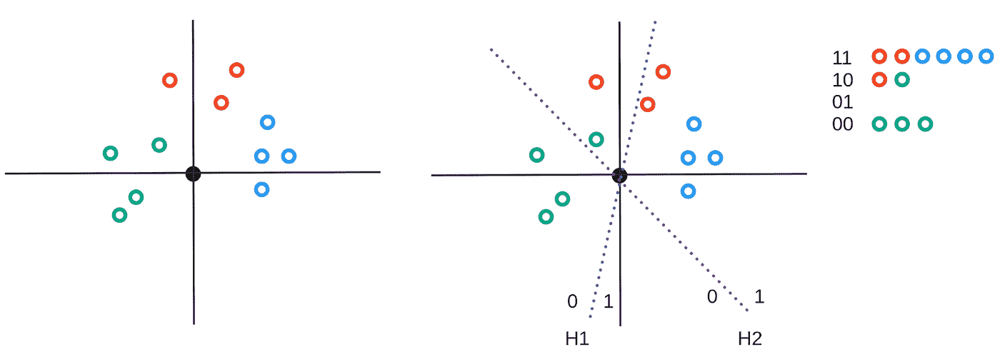

**图 7**:LSH 的例子。图片作者。

正如在图 7 右侧的结果散列桶中可以看到的那样，很接近的项目可能仍然在不同的散列桶中结束。为了减轻这种情况，可以执行多轮散列，并将每个值分配给最常出现的散列。然而，这确实增加了算法的复杂性。作者表明，通过 8 轮散列，该模型达到了类似于全局注意力模型的性能。

作者使用了一种称为角度 LSH [10]的变体，它使用余弦距离来计算任意两点之间的距离。它们表明，两个非常接近的点很有可能会在同一个桶中结束。

将点分成桶后，按桶对点进行排序。但是，有些桶可能比其他桶大。最大的存储桶仍将主导内存需求，这是一个问题。出于这个原因，作者将桶分成固定的块，因此内存需求取决于块的大小。请注意，项目可能不会与桶中的其他项目在同一个块中结束。这些项目可以处理它们应该结束的块中的所有项目，但是不能处理它们自己(这给复杂性增加了一个小的恒定成本)，如图 7 的最后一行所示:

**图 7**:LSH 注意事项说明。图片来源:[9]。

这有效地将复杂度降低到 O(n log n)。需要注意的重要一点是，由于不依赖于 n 而从复杂度中去除了 8 轮散列，因此引入了较大的 12⁸常数，这实际上导致重整器仅在输入序列非常长(> 2048)时变得更高效。

## 核心注意力

核是这样一种函数，它以某个低维空间中的两个向量 x 和 y 的点积作为输入，并返回某个高维空间中点积的结果。这可以概括为一个函数 K(x，y) =φ(x)ᵀφ(y)，其中 k 是核函数，φ是从低维到高维空间的映射。在机器学习的背景下，支持向量机(SVM)是一个众所周知的例子。特别是对于有效的自我关注，内核方法的工作原理是 Softmax 可以被解释为内核并被重写，这样我们就可以避免显式计算关注矩阵 a。

**表演者** O(n)

执行者[11]是基于一种叫做*的机制，通过正正交随机特征*(或 FAVOR+)。这个想法是，我们可以使用核方法来近似 softmax 函数。

通常，当应用核方法时，我们希望在高维空间中计算点积。这可以通过使用适当的核函数 K 来实现(例如我们在核 SVM 中所做的)。然而，执行者做相反的事情:我们已经知道我们的函数 k 是什么(非线性的 softmax)，我们想要找到φ，以便我们可以计算φ(x)ᵀφ(y(它是线性的)。我们可以将它形象化，如图 8 所示。在左手边，我们看到我们的 L*L 矩阵 A 乘以 V(注意，这只是公式 softmax(QKT)*V)，作者将序列长度称为 L 而不是 n)。相反，所提出的方法使用φ来直接计算φ(Q)= Q’和φ(K)= K’，这允许我们首先将 K 和 V 相乘，并且避免了矩阵 a 的高成本计算

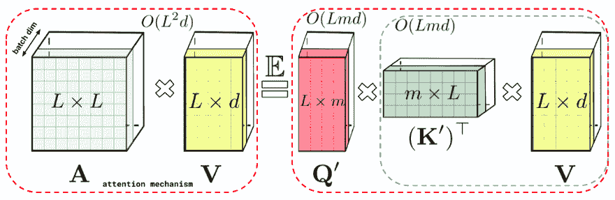

**图 8** :好感+关注的说明。图片来源:[11]。

主要的研究问题变成:我们如何找到φ？这个想法是基于随机傅立叶特征[12]。作者指出，大多数内核可以使用通用函数建模，如等式 4 所示:

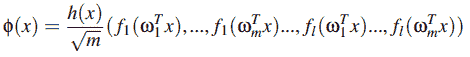

**等式 4:** 用于内核建模的通用函数

这里，h 是 x 的某个函数，m 是定义近似精度的参数，ω₁…ωₘ是从某个分布 d 中抽取的随机向量(因此随机部分更倾向于+)，而 f₁…fₗ是确定性函数。m 越高，近似值越好，因为它定义了绘制的ω数。

作者证明了 Softmax 核可以通过选择等式 5 中所示的值来近似:

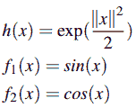

**等式 5:** 用于逼近 Softmax 的函数

现在，我们可以通过φ函数传递我们的 Q 和 K，并得到结果矩阵的点积。这样做的结果就好像我们先将它们相乘，然后取 softmax。由于我们可以通过φ独立地传递 Q 和 K，我们现在可以先将 K 和 V 相乘。

然而，还有一个问题。与 softmax 不同，sin 和 cos 可以具有负值，这导致当 softmax 的实际值接近 0 时，近似值的方差变大。由于很多自我关注值接近 0，这是个问题。为此，作者建议使用不同的函数，即等式 6 中所示的函数，这些函数仅输出正值(因此有利于+的正部分)

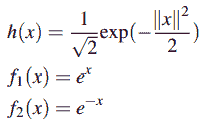

**等式 6:** 用于逼近 Softmax (FAVOR+ version)的函数

最后，作者解释说，确保ωs 正交会导致更小的方差(因此正交部分更有利于+)。

## 自我关注的替代品

很明显，有很多研究致力于提高点产品注意力的效率。然而，还有另一种选择:完全不使用自我关注，而是使用一种更简单的方法在我们的令牌之间共享信息。最近有多篇论文提出了这个想法([13]、[14]、[15])。我们将讨论一个，因为所有这些论文的总体思路都非常相似。

**FNet** O(n)

FNet [15]是一种替代的变换器架构，它用离散傅里叶变换(DFT)完全取代了自关注模块。因此，除了前馈层之外，不再有可学习的参数。DFT 将信号分解成其组成频率。其定义如公式 7 所示:

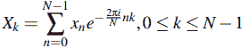

**等式 7:** DFT 函数

其中 N 是组件的数量。当 N 为无穷大时，我们可以精确地创建原始信号。在 NLP 的上下文中，我们的信号是一个令牌序列。实际上，每个组件 n 都包含一些关于输入序列中每个标记的信息。

他们方法的有趣之处不在于他们使用 DFT，而在于他们应用线性变换来混合他们的令牌。他们还尝试了一种线性编码器，这与合成器模型的工作方式非常相似，甚至是一种完全随机的编码器。虽然线性编码器的性能稍高，但它有可学习的参数，因此比 FNet 慢。BERT-Base 在 GLUE 上的平均分仍然高得多，但是他们报告说训练时间提高了大约 7 倍。因为有许多可能的线性变换，所以有一个有趣的开放式研究问题，即什么是最适合变压器的。

# 基准

虽然本帖中讨论的所有论文都报告了它们关于输入序列长度 n 的理论复杂性，但在实践中，由于较大的常数(如 Reformer)或低效的实现，一些论文可能仍然不切实际。为此， [Xformers](https://pypi.org/project/xformers/) 被用于计算许多方法的不同序列长度的内存使用和运行时间。注意，并不是所有讨论的方法都在 Xformers 中实现，不幸的是，BlockSparse 在我的 GPU(RTX 3090)上不工作。

**长序列长度(512，1024，2048):**

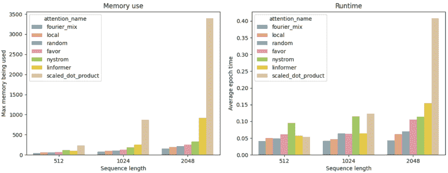

**图 9** :各种高效注意力方法的长序列长度的内存使用和运行时使用。图片作者。

**短序列长度(128，256):**

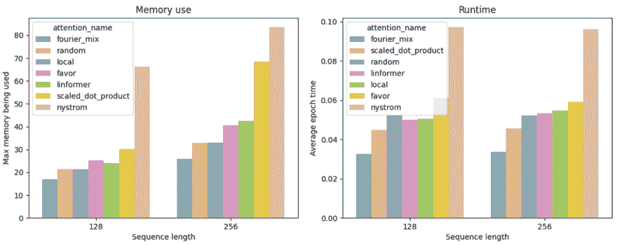

**图 10** :各种高效注意方法的短序列长度的内存使用和运行时使用。图片作者。

显然，对于更长的序列，所有方法都明显比 SDP 更有效。虽然这里比较的所有注意机制(除了 SDP)都与序列长度成线性比例关系，但有趣的是，由于常数和其他比例因子，这些机制之间仍然存在明显的差异。值得注意的是，Linformer 的伸缩性不如其他方法。另一个有趣的结果是 Nystromformer 的内存使用和运行时间。虽然它的伸缩性很好，如序列长度(512、1024、2048)的图表所示，但对于短序列(128 和 256)，它实际上是最低效的方法。这可能是由于所选标志的数量，如[8]中所建议的，其值保持在 64。

有趣的是，对于最长 512 的序列长度，SDP 的性能与其他方法非常相似。唯一明显比其他方法更有效的方法是 FNet(傅立叶混合注意)。它几乎完全独立于序列长度，同时没有重要的常数需要考虑。

# 结论

考虑到基于变压器的模型日益增长的相关性，有效的自我关注仍然是一个活跃的研究领域。虽然它们看起来令人望而生畏，但大多数技术实际上可以追溯到您可能已经熟悉的更一般的数学概念。希望这篇博文既是对大多数相关技术的介绍，也是对它们的解释，帮助你更深入地了解这个领域。

# 参考

[1] Ashish Vaswani、Noam Shazeer、Niki Parmar、Jakob Uszkoreit、Llion Jones、Aidan N. Gomez、Lukasz Kaiser 和 Illia Polosukhin。你只需要关注，2017。

[2] Devlin，j .，Chang，m .，Lee，k .，& Toutanova，K. BERT:用于语言理解的深度双向转换器的预训练，2018 年。

[3] Brown，T. B .，Mann，b .，Ryder，n .，Subbiah，m .，Kaplan，j .，Dhariwal，p .，Neelakantan，a .，Shyam，p .，Sastry，g .，Askell，a .，Agarwal，s .，Krueger，g .，Henighan，t .，Child，r .，Ramesh，a .，Ziegler，D. M .，Wu，j .，Winter，c .，Hesse，c .。。阿莫代伊博士。语言模型是很少出手的学习者，2020。

[4]托马斯·米科洛夫、程凯、格雷戈·科拉多和杰弗里·迪恩。向量空间中单词表示的有效估计，2013。

[5]蔡尔德，r .，格雷，s .，拉德福德，a .，& Sutskever，I .用稀疏变压器生成长序列，2019。

[6] Iz Beltagy，Matthew E. Peters 和 Arman Cohan。Longformer:长文档转换器，2020

[7]王，李，B. Z，Khabsa，m .，方，h .，，马，h .林前:自我注意与线性复杂性，2020 .

[8] Xiong，y .，Zeng，z .，Chakraborty，r .，Tan，m .，Fung，g .，Li，y .，& Singh，V. Nystromformer:一种基于 Nystrom 的自我注意近似算法.2021.

[9]尼基塔·基塔耶夫、祖卡斯·凯泽和安塞尔姆·列夫斯卡娅。改革者:高效的变压器，2020。

[10]亚历山大·巴甫洛夫·安多尼、彼得·因迪克、蒂伊斯·拉霍文、伊利亚·拉赞施泰因和路德维希·施密特。角距离的实用和最佳 lsh，2015。

[11] Choromanski，k .，Likhosherstov，v .，Dohan，d .，Song，x .，Gane，a .，Sarlos，t .，Hawkins，p .，Davis，j .，Mohiuddin，a .，Kaiser，l .，Belanger，d .，Colwell，l .，& Weller，a .，重新思考表演者的注意力，2020 年。

[12]阿里·拉希米，本杰明·雷希特。大规模内核机器的随机特性，2007。

[13] Tay，y .，Bahri，d .，Metzler，d .，Juan，d .，Zhao，z .，& Zheng，c .合成器:在变形金刚模型中反思自我注意。2020.

[14]托尔斯提欣、霍尔斯比、科列斯尼科夫、拜尔、李、翟、安特辛纳、杨、施泰纳、基泽斯、乌兹科雷特、卢契奇、多索维茨基、《混合建筑:全建筑展望》，2021 年。

[15] Ainslie，j .，Eckstein，I .，& Ontanon，S. FNet:用傅立叶变换混合令牌，2021 年。