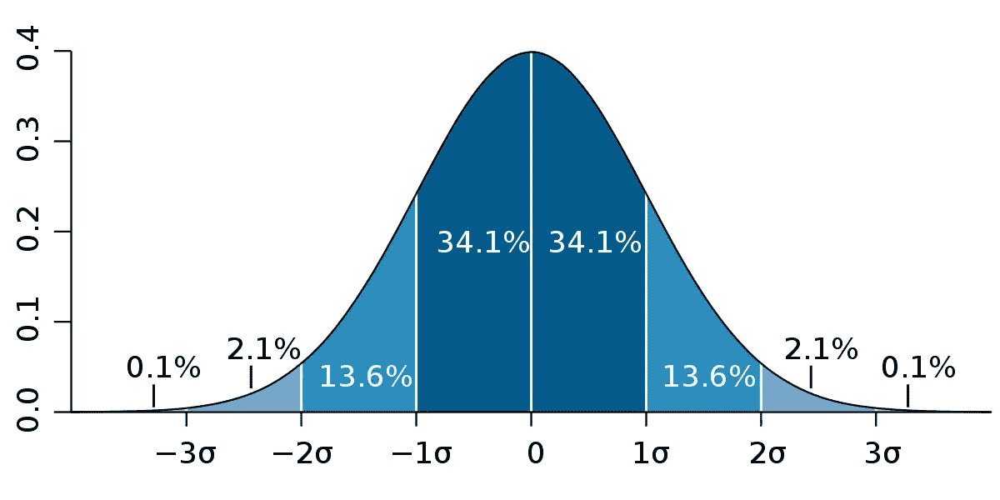
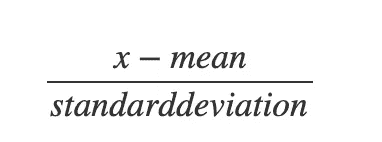
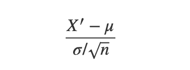
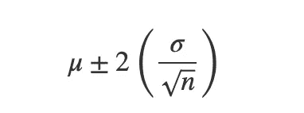
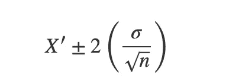

# 揭开评估的神秘面纱:基础

> 原文：<https://towardsdatascience.com/demystifying-estimation-the-basics-5206532b6378>

## 更多地了解人口

罗马法师在 [Unsplash](https://unsplash.com/s/photos/maths-plots?utm_source=unsplash&utm_medium=referral&utm_content=creditCopyText) 上拍摄的照片

# 目录

1.  [简介](https://medium.com/p/5206532b6378/edit#8971)
2.  [正态分布](https://medium.com/p/5206532b6378/edit#d215)
3.  [中心极限定理](https://medium.com/p/5206532b6378/edit#09db)
4.  [需要了解基础知识](https://medium.com/p/5206532b6378/edit#5cea)？
5.  [结论](https://medium.com/p/5206532b6378/edit#7299)

# 介绍

统计学是涉及数据的多个领域的重要基础。有两种主要的统计类型:

1.  描述性统计:这种类型的统计有助于使用图形描述、总结和可视化数据。描述性统计的两个主要元素是集中趋势的度量，这完全是关于数据样本的中心位置，如均值、中值和众数。第二个是变化的度量，它是关于数据样本的分布，比如方差和标准差。但是，它不能帮助我们做出超越数据的结论。
2.  推断统计:在大多数情况下，对人口做出结论是不可能的，因为这是昂贵的，需要时间和资源。例如，一位研究人员想知道一个青少年花在学习上的平均时间。收集地球上每个青少年的数据并得出结论是不可能的。所以剩下的唯一方法就是从样本中得出关于总体的结论。这就是所谓的推断统计学。推断统计学有两个主要元素:

*   估计:它包括考虑样本参数并对总体参数做出结论。例如，如果随机选择的 10 名学生样本的平均值为 52，则计算总体参数(在本例中为青少年的平均学习时间)的取值范围。
*   假设检验:它包括检查关于人口参数的声明的可信度。例如，一名研究人员声称，一名青少年平均每天学习 4 小时，10 名学生的平均学习时间为 3.2 小时。然后，假设检验有助于检查关于总体均值的主张是否正确。

在本文中，我们将深入探讨评估的概念。在此之前，我将解释一些支持性和基础性的概念，这将帮助您更好地理解评估的概念。

# 正态分布

正态分布|图片来自[维基百科](https://en.wikipedia.org/wiki/Standard_deviation)

存在许多可能的数据分布，例如偏斜的、双峰的、均匀的等等。正态分布是一种具有以下性质的分布:

1.  钟形的
2.  均值、中值、众数是一样的，都在中心。
3.  平均对称
4.  它是单峰的，即只有一种模式
5.  曲线下的总面积为 100%

正态分布有一种变体，称为标准正态分布。它是一种均值为零，标准差为 1 的类型。z 得分是特定值偏离数据平均值的标准偏差数。使用 Z 分数，任何正态分布都可以转换为标准正态分布。

z 评分公式|来源:作者图片

对于正态分布，曲线下的值如下:

*   1 标准偏差有 68%
*   2 标准偏差有 95%
*   3 标准偏差有 99.7%

# 中心极限定理

样本均值的抽样分布是一种使用从总体中抽取的特定大小的所有可能随机样本计算出的均值的分布。抽样误差是样本参数和总体参数(例如，样本均值和总体均值)之间的差值，因为样本不是总体的完美代表。

当从总体中提取特定大小的所有可能样本而不替换时，那么，

*   样本平均值等于总体平均值。
*   样本均值的标准差等于总体的标准差除以样本大小的平方根。

中心极限定理指出，随着样本大小 n 的增加，从总体中取出的样本均值的分布形状将接近正态分布。

中心极限定理是重要的，因为它是两个主要推断统计元素的基础:估计和假设检验。中心极限定理可以用来回答与样本均值相关的问题。有两个条件:

1.  如果总体是正态分布，那么样本均值的分布将是任何样本大小的正态分布。
2.  如果总体不是正态分布，样本量必须大于 30。

纵观全局，可以得出结论，68%的样本均值位于总体均值的一个标准差范围内。类似地，95%和 99.7%的样本均值位于总体均值的 2 和 3 个标准偏差内。为了找到标准偏差的确切数目，样本平均值远离总体平均值，计算 Z 得分，

样本分布的 z 分数|来源:作者图片

这里 X '是样本均值，mu 是样本均值的均值，sigma 是样本均值的标准差。它与前面的 z 得分公式相同，只是在抽样分布方面有所不同。

# 需要了解基础知识？

正如我们所了解的，估计就是在考虑样本的情况下寻找总体参数。正如上面在抽样分布和中心极限定理中提到的，任何样本均值都在总体均值的 X 标准差处。例如，95%的样本平均值落在总体平均值的两个标准偏差内，那么样本平均值 X’落在，

样本均值区间|来源:作者图片

颠倒上面的公式，对于任何 X '，下面提到的区间包含总体均值的概率为 95%,

人口平均值的区间|来源:作者图片

这个关系用于求总体均值的区间估计，只有事先了解基础知识才能理解。

# 结论

在本文中，我们学习了理解评估的基本概念。本文是评估系列的第一部分。我将发布一些其他的文章来解释评估的类型和进行评估的测试。

就这些了，伙计们。我希望你喜欢它！！