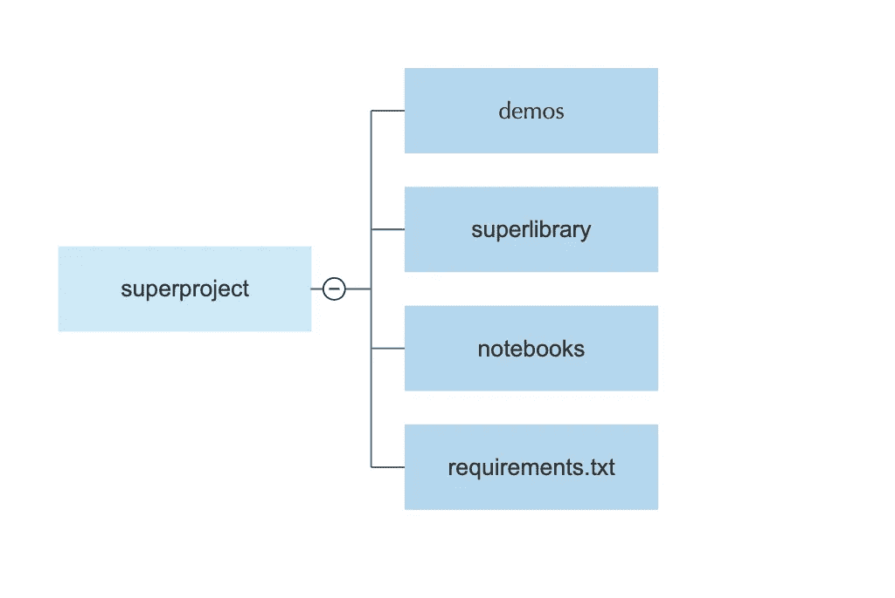

# 揭开 Python 中模块和包的神秘面纱

> 原文：<https://towardsdatascience.com/demystifying-modules-and-packages-in-python-968c13b3b990>

## 模块和包是任何大型项目的核心。我将展示一些涉及它们的技巧，比如如何组织包和创建名称空间。


照片由阿尔瓦罗·雷耶斯从 Unsplash 拍摄

当我在 Github 上检查复杂的项目时，我通常会发现自己迷失在无数的文件夹和源文件之间。这些报告的作者认为他们的定制对他们自己来说非常明显，这是完全可以理解的；可悲的是，我努力让自己对构建不同的文件夹和源文件有同样的感觉，但却没有用。

揭秘一些处理包和模块的常见反应如何？

在这个快速教程中，我花时间模拟了一个具有以下全局结构的项目:



作者图片

具体来说，我们项目的树状结构可以概括为:

我们最感兴趣的是`superlibrary`的内容:

Dataloader 处理所有类型的数据加载器。

`Learners`包含按学习类型划分的模型。

`Preprocessor`拥有熊猫、NumPy 和 Scikit-Learn 的各种预处理器模块。

`Tests`是您集中所有测试的地方。

`Utils`通常包含各种执行优化或充当成本函数的函数。

每个函数只是一个简单的打印函数，也可以作为一个整体实现。

我们将进行简单快速的实验来强调一些概念，并举例回答如下问题:

> 包装是如何制作的？
> 
> 如何控制进口包装？
> 
> 如何执行一个包作为主入口函数？
> 
> 如何利用名称空间包？

# 实验

## 包装是如何制作的？

如果你检查我们的模拟项目的结构，你会注意到在我们的文件夹的不同层次传播`__init__.py`。

包含此类文件的每个文件夹都被视为一个包。`__init__.py` 文件的目的是包含可选的初始化代码，这些代码在遇到不同级别的包时运行。

例如，让我们将自己定位在`preprocessor`文件夹中。我们将编写几行代码进行一些导入。

让我们在`preprocessor/__init__.py` 文件中写下以下几行:

让我们返回到预处理器目录的上一级(因此我们将查看`preprocessor`、`learner`、`dataloader`、`tests`和`utils`目录)，打开 Python 解释器并执行以下操作:

```
>>> from preprocessor import numpy_prep, pd_prep, sk_prep
>>> numpy_prep()
This is the numpy implementation for the preprocessor.
>>> pd_prep()
This is the Pandas implementation for the preprocessor.
>>> sk_prep()
This is the sklearn implementation for the preprocessor.
>>> ...
```

了解这里做了什么很重要；`preprocessor`目录中的`__init__.py`文件将我们需要在更高层次调用的所有函数粘在了一起。

通过这样做，我们为`preprocessor`包提供了额外的逻辑功能，节省了您的时间和更复杂的导入行。

## 如何控制进口包？

比方说，使用与前面相同的层次结构配置，您想要控制某个行为，该行为包括导入所有带有星号的内容。

你会写:

```
from module import * .
```

让我们通过添加一个新的`__all__`属性来修改`preprocessor/__init__.py` 文件:

`__all__`正在接收一个受限的属性列表。

看看如果我们在`preprocessor`目录之上运行解释器会发生什么:

```
>>> from preprocessor import *
>>> numpy_prep()
This is the numpy implementation for the preprocessor.
>>> pd_prep()
This is the Pandas implementation for the preprocessor.
>>> sk_prep()
Traceback (most recent call last):
File "<stdin>", line 1, in <module>
NameError: name 'sk_prep' is not defined
>>> ...
```

`sk_prep`函数被省略，不包含在`__all__`属性中。这保护了加载`sk_prep`的原始包免受任何意外行为的影响。

尽管一般不鼓励使用`from module import *`,但它还是经常在声明大量名称的模块中使用。

默认情况下，此导入将导出所有不以下划线开头的名称。但是，如果指定了`__all__`,则只导出明确说明的名称。

如果`__all__`被定义为空列表，则不会导出任何内容。如果`__all__`包含未定义的名称，导入时会抛出`AttributeError`。

## 如何执行一个包作为主入口函数？

毫无疑问，你对写这样的东西很熟悉:

```
If __name__ == "__main__" :
...
```

把它带到另一个水平怎么样？可以将`learner`包作为主模块运行吗？

让我们转到`learner`文件夹:

接下来我们要做的是确保在导入三个包中的每一个时，我们同时导入与每种学习类型相关的函数。

对于`clustering`包，我们在`clustering/__init__.py`文件中写下几行代码:

同样为`supervised_learning` 包装:

对于`reinforcement_learning`包:

我们现在能够将所有必要的功能直接加载到学员目录中的新实现中。

我们创建一个新文件，命名为`__main__.py`:

我们返回到主`superlibrary`目录，因此我们将在`learner`目录的上一级，并运行以下内容:

```
Username@Host current_directory % python learner 
Methods for clustering :
This is the implementation for model1.
This is the implementation for model2.
Methods for reinforcement learning :
This is the implementation for model1.
This is the implementation for model2.
Methods for supervised learning :
This is the implementation for model1.
This is the implementation for model2.
```

万岁！属性似乎比你所习惯的做得更多。它可以超越一个简单的文件，控制整个包，因此您可以导入或运行它。

## 如何利用名称空间包？

在我们的最后一节中，假设您稍微修改了 utils 文件夹的内容:

所以在每个`subpackage`中有一个名为`modules` 的新模块，它没有`__init__.py`初始化文件。

也许我们应该从一开始就谈论你可能遇到的这种类型的场景，以及其行为非常值得怀疑。没有`__init__`文件的文件夹的行为几乎类似于一个包，但并不被视为包。

更技术上来说，它被认为是一个`namespace` 包。事实证明，我们可以用它来实现有趣的事情。

您可以创建一些包含在每个`backend_connectors`和`custom_functions`包中的公共名称空间，这样`modules`将作为一个`single`模块..

还不够信服？让我们在解释器中写一些高于前面提到的两个包的东西:

```
>>> import sys
>>> sys.path.extend(['backend_connectors','custom_functions'])
>>> from modules import cloud_connectors, optimizers
>>> cloud_connectors
<module 'modules.cloud_connectors' from 'path_to_current_directory/cloud_connectors.py'>
>>> optimizers
<module 'modules.optimizers' from 'path_to_current_directory/optimizers.py'>
>>> ...
```

通过在模块搜索路径中添加这两个包，我们从一种特殊的包中获益，这种包是为在一个公共名称空间下将不同的代码目录合并在一起而设计的，如图所示。对于大型框架，这可能非常有用。

这里有一个关于 Python 在导入时如何感知`modules`的技巧。

```
>>> import modules
>>> modules.__path__
_NamespacePath(['backend_connectors/modules','custom_functions/modules'])
>>> modules.__file__
>>> modules
<module 'modules' (namespace)>
>>> ...
```

您观察到一个联合的名称空间路径，一个缺失的`__file__`属性(如果它有一个的话，这个属性应该与它的`__init__`文件的路径相关联),以及它的类型的一个清楚的指示:名称空间。

为了充分利用名称空间包，特别是在这种情况下，您不能在任何一个`modules`目录中包含任何`__init__.py`文件。假设您真的添加了它们:

仔细观察当你试图合并`modules`目录时会发生什么:

```
>>> import sys
>>> sys.path.extend(['backend_connectors','custom_functions'])
>>> from modules import cloud_connectors, optimizers
Traceback (most recent call last):
File "<stdin>", line 1, in <module>
ImportError: cannot import name 'optimizers' from 'modules' (path_to_project_directory/superlibrary/utils/backend_connectors/modules/__init__.py)
...
```

正如所料，当您将普通包视为名称空间包时，Python 无法加载您的函数。

# 结论

我希望这些内容能让你更清楚地了解一个适度复杂的项目的结构。这是一个热门话题，尽管它在社区中缺乏分享和写作的热情。关于 Python 如何处理包和模块，有太多东西需要学习。

目前的材料旨在让读者意识到将一个人的项目放在一个可读的层次结构中的重要性，以便其他每个用户都有信心使用它。

谢谢你的时间。