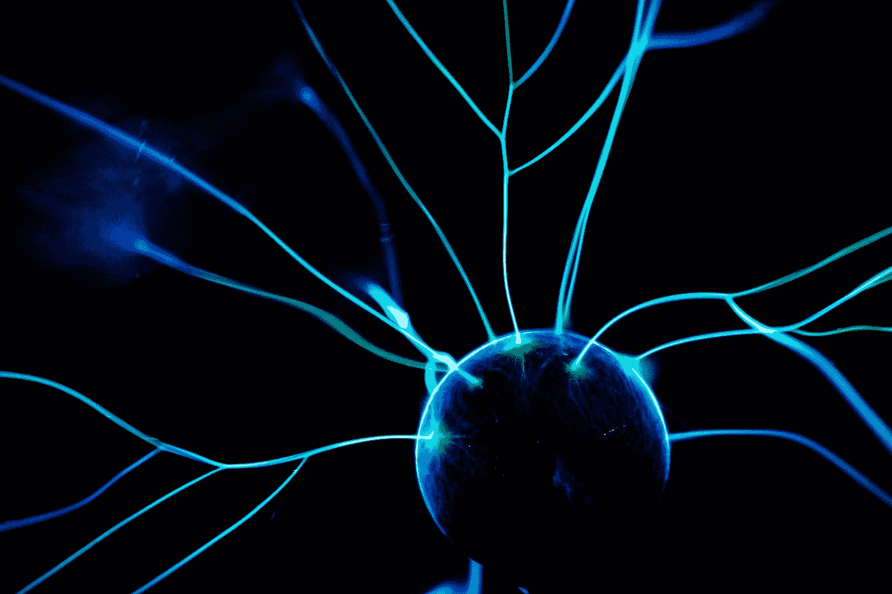

# 揭秘深度学习中的彩票假说

> 原文：<https://towardsdatascience.com/demystifying-the-lottery-ticket-hypothesis-in-deep-learning-158570b62674>

## 为什么彩票是训练神经网络的下一件大事

训练神经网络是昂贵的。据计算，OpenAI 的 GPT-3 使用市场上成本最低的云 GPU 的[培训成本为 460 万美元](https://lambdalabs.com/blog/demystifying-gpt-3/)。难怪[弗兰克尔和卡宾的 2019 年彩票假说](https://arxiv.org/abs/1803.03635)开始了一场研究淘金热，引起了脸书和微软等顶级学术头脑和科技巨头的关注。在论文中，他们证明了**中奖(彩票)**的存在:一个神经网络的子网络可以被*训练产生与原始网络*一样好的性能，并且规模小得多。在这篇文章中，我将阐述这是如何工作的，为什么它是革命性的，以及研究的现状。

# 为什么是彩票？

传统观点认为，神经网络最好在训练后修剪，而不是在开始时。通过修剪权重、神经元或其他组件，得到的神经网络**更小、更快，并且在推理过程中消耗更少的资源**。如果处理得当，网络规模可能会大幅缩小，但精度不会受到影响。

通过颠倒传统智慧，我们可以考虑 ***我们是否可以在训练*** 之前修剪网络并获得相同的结果。换句话说，*来自删减组件的信息是网络学习所必需的吗，即使不代表它的学习？*

彩票假说集中于修剪权重，并提供了经验证据，即某些修剪后的子网络可以从一开始就被训练，以实现与整个网络相似的性能。怎么会？迭代幅度修剪。

# **迭代幅度修剪**

当历史上尝试过这样的任务时，修剪后的网络权重会随机重新初始化，性能会迅速下降。

这里的关键区别是权重被返回到它们的初始**状态。当训练时，在相同的训练时间内，在高水平的修剪下，结果匹配原始性能。**

照片由[马克·泰格霍夫](https://unsplash.com/@tegethoff?utm_source=medium&utm_medium=referral)在 [Unsplash](https://unsplash.com?utm_source=medium&utm_medium=referral) 拍摄

这表明这些彩票作为特定子网和初始权重的交集而存在。可以说，他们“赢得了彩票”，因为该架构和这些权重的匹配表现得与整个网络一样好。这适用于更大的型号吗？

对于更大的模型，同样的方法并不适用。在观察对噪声的敏感度时，弗兰克尔和卡宾复制了经过修剪的网络，并对不同排序的数据进行了训练。当**线性模式连通性**存在时，IMP 成功，这是一种非常罕见的现象，其中多个网络收敛到相同的局部最小值。对于小型网络，这种情况很自然。对于大型网络来说，则不然。那怎么办呢？

以较小的学习速率开始导致 IMP 适用于大模型，因为对来自数据的初始噪声的敏感性降低了。学习率可以随着时间的推移而增加。另一个发现是，在稍后的训练迭代中，将我们修剪过的神经网络的权重恢复到它们的值，而不是第一次迭代，同样有效。例如，1000 次迭代训练中第 10 次迭代的权重。

这些结果在不同的架构中保持稳定，如变压器、LSTMs、CNN 和强化学习架构。

虽然这篇论文**证明了这些彩票**的存在，但是**还没有提供识别它们的方法**。因此，淘金热在寻找他们的属性和他们是否可以在训练前确定。他们也启发了早期修剪的启发式工作，因为我们当前的启发式工作集中在训练后的修剪。

# 当前研究

[一票全赢](https://arxiv.org/abs/1906.02773) (2019)显示**彩票编码信息对数据类型和优化器**不变。他们能够成功地在基于不同数据类型(如 VGG 到 ImageNet)的网络之间传输彩票，并获得成功。

一个关键指标是网络训练数据的相对规模。*如果彩票票源在比目的地网络更大的数据集上被训练，则其表现更好*；否则，类似或更糟。

照片由[莫里茨·金德勒](https://unsplash.com/@moritz_photography?utm_source=medium&utm_medium=referral)在 [Unsplash](https://unsplash.com?utm_source=medium&utm_medium=referral) 上拍摄

[抽早鸟票](https://arxiv.org/abs/1909.11957) (2019):本文旨在证明在训练中可以早早发现彩票。每次训练迭代，他们都会计算一个剪枝掩码。如果上一次迭代和这次迭代的掩码距离*(使用汉明距离)*低于某个阈值，网络停止修剪。

[通过迭代保存突触流](https://arxiv.org/abs/2006.05467) (2020)在没有任何数据的情况下修剪神经网络:本文重点讨论在没有数据的情况下初始化*时计算修剪。它在初始化时优于现有的最先进的剪枝算法。该技术侧重于最大化**临界压缩**、*在不影响性能的情况下可能发生的最大修剪。为了做到这一点，作者旨在防止整层被修剪。网络通过对保留层进行积极评分并在每次网络修剪时重新评估分数来实现这一点。**

# 结束语

在神经结构中存在小的子网络，这些子网络可以被训练得和整个神经网络一样好，这为有效的训练打开了一个可能性的世界。在这个过程中，研究人员正在学习很多关于神经网络如何学习以及学习需要什么的知识。谁知道呢？很快有一天，我们可能能够在 训练之前 ***修剪我们的网络，节省时间、计算和能量。***

照片由[埃米利亚诺·维托里奥西](https://unsplash.com/@emilianovittoriosi?utm_source=medium&utm_medium=referral)在 [Unsplash](https://unsplash.com?utm_source=medium&utm_medium=referral) 上拍摄