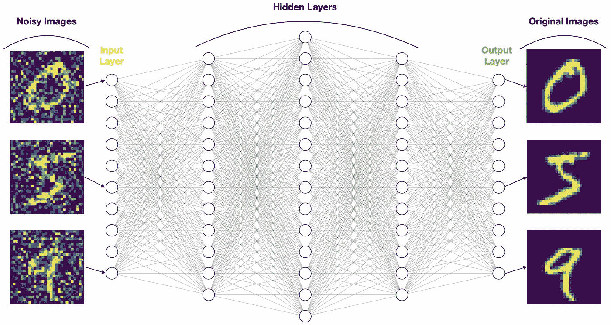
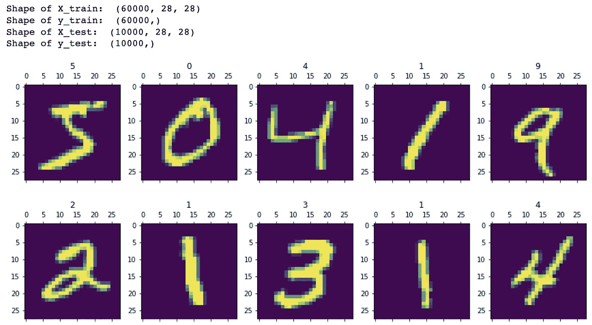
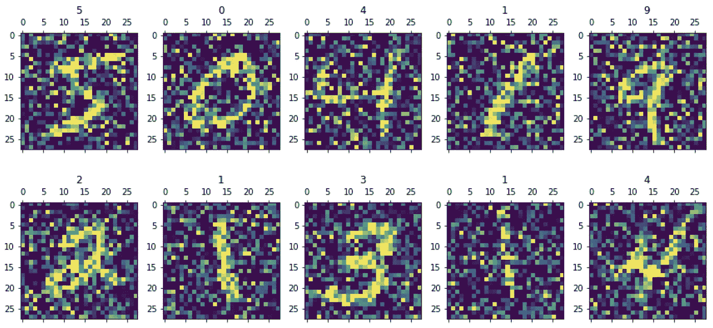
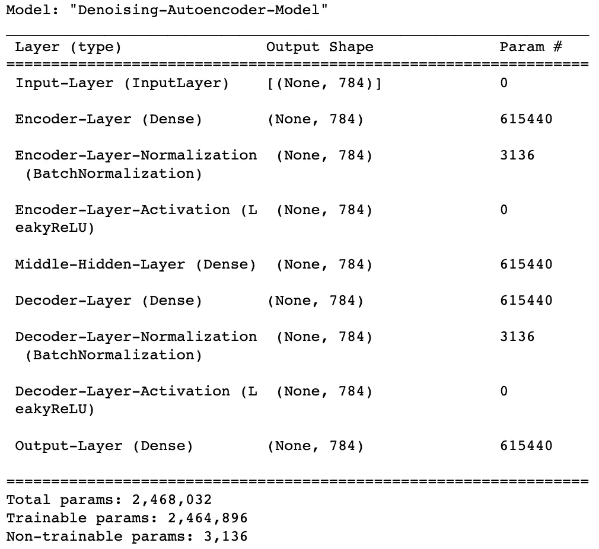
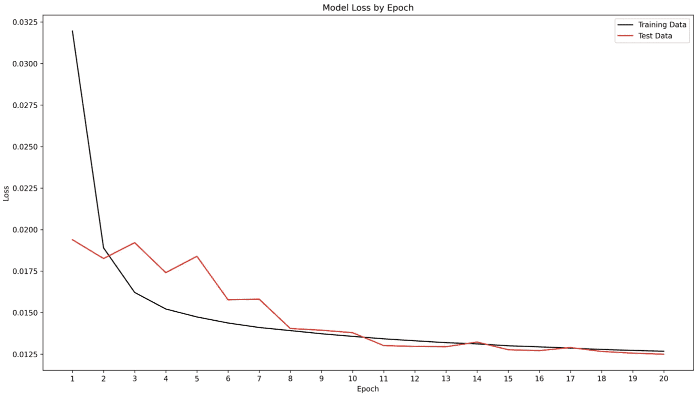
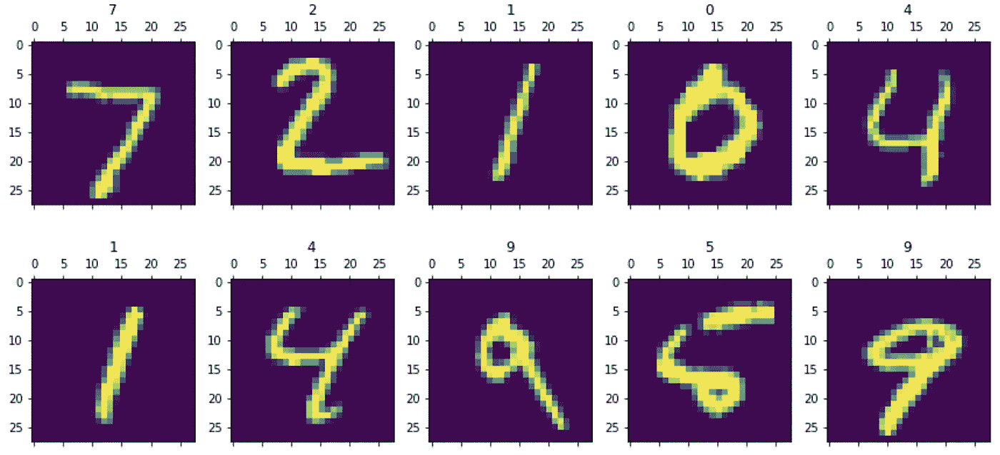
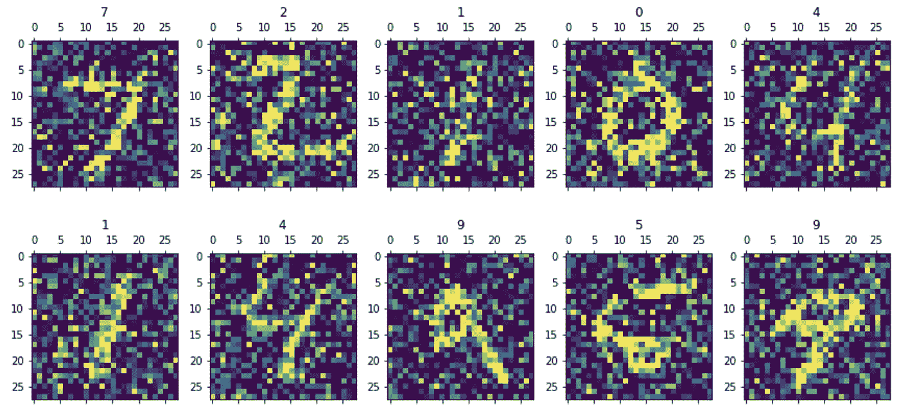
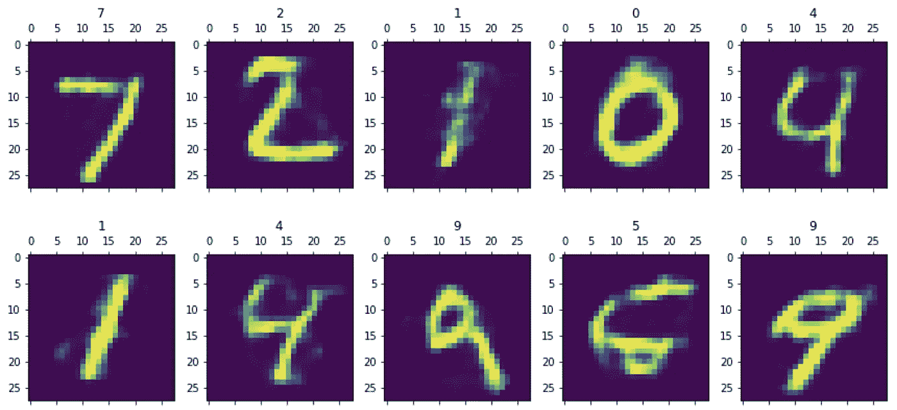

# 去噪自动编码器(DAE)——如何使用神经网络清理数据

> 原文：<https://towardsdatascience.com/denoising-autoencoders-dae-how-to-use-neural-networks-to-clean-up-your-data-cd9c19bc6915>

## 神经网络

## 使用 Tensorflow / Keras 库在 Python 中构建 DAE 的指南


去噪自动编码器(DAE)。图片由[作者](https://solclover.com/)提供。

# 介绍

自动编码器提供了一种有效的方法来学习数据的表示，这有助于完成降维或特征提取等任务。你甚至可以训练一个自动编码器来**识别并去除你数据中的噪音**。

本文将快速回顾自动编码器(AE ),并深入探讨一种称为**去噪自动编码器(DAE)的特定类型。**

如果你在找 AE 降维、特征提取的例子，可以参考我之前的文章:[under complete Autodencoders](/autoencoders-ae-a-smart-way-to-process-your-data-using-unsupervised-neural-networks-9661f93a8509)。

# 内容

*   机器学习领域中的去噪自动编码器(DAE)
*   DAE 的结构
*   如何使用 Keras/Tensorflow 在 Python 中构建 DAE

# 机器学习领域中的去噪自动编码器(DAE)

自动编码器不同于其他流行类型的神经网络([前馈](/feed-forward-neural-networks-how-to-successfully-build-them-in-python-74503409d99a)、[递归](/rnn-recurrent-neural-networks-how-to-successfully-model-sequential-data-in-python-5a0b9e494f92)和[卷积](/convolutional-neural-networks-explained-how-to-successfully-classify-images-in-python-df829d4ba761#b32e-f8a4ab5107c5))，因为它们不需要标记数据来训练它们。因此，我们可以称它们为**无监督的**，或者，如果我们想要非常精确的话，称它们为**自监督的**神经网络。

鉴于神经网络的多样性和它们对机器学习的独特方法，我觉得它们应该被单独归类。

通过**点击**打开并**探索**下面的**交互式旭日图**，看看你是否能找到去噪自动编码器(DAE)👇。

机器学习算法分类。由[作者](https://solclover.com/)创建的互动图表。

***如果你喜欢数据科学和机器学习*** *，请* [*订阅*](https://bit.ly/3sItbfx) *获取我的新文章的邮件。如果你不是中等会员，可以在这里* *加入* [*。*](https://bit.ly/36Mozgu)

# DAE 的结构

首先，让我们快速回顾一下自动编码器的高级结构。自动编码器的关键组件包括:

*   **输入层** —将输入数据传入网络
*   **隐藏层**由**编码器**和**解码器—** 组成，通过应用权重、偏置和激活函数来处理信息
*   **输出层** —通常匹配输入神经元

以下是对上述总结的说明:


自动编码器神经网络中各层的高级图示。图片由[作者](https://solclover.com/)提供。

最常见的自动编码器类型是[欠完整自动编码器](/autoencoders-ae-a-smart-way-to-process-your-data-using-unsupervised-neural-networks-9661f93a8509)，它将数据压缩(编码)到更少的神经元(更低的维度)中，同时删除“不重要”的信息。它通过同时训练编码器和解码器来实现这一点，因此输出神经元尽可能地匹配输入。

以下是欠完整自动编码器的网络图示例:


欠完全自动编码器神经网络。图片由[作者](https://solclover.com/)提供，使用 [AlexNail 的 NN-SVG 工具](http://alexlenail.me/NN-SVG/index.html)创建。

## **去噪自动编码器(DAE)**

DAE 的目的是消除噪音。你也可以把它想象成一个为你的数据定制的去噪算法。

注意对单词**定制**的强调。假设我们在一组特定的数据上训练 DAE，它将被优化以消除相似数据中的噪声。例如，如果我们训练它从一组图像中去除噪声，它将在相似的图像上工作得很好，但不适合清理文本数据。

与不完全 AE 不同，我们可以在隐藏层中使用相同或更多数量的神经元，使 DAE **过度完全**。

第二个区别来自于没有使用相同的输入和输出。相反，输出是原始数据(例如，图像)，而输入包含带有一些添加噪声的数据。



去噪自动编码器架构。图片由[作者](https://solclover.com/)提供。

上面的例子是一个 DAE 设置去噪 MNIST 手写数字。在下一节中，我将向您展示如何设置和训练这样的 DAE。

[](https://solclover.com/membership)[](https://www.linkedin.com/in/saulius-dobilas/)

# **如何使用 Keras/Tensorflow 在 Python 中构建 DAE？**

## 设置

我们需要以下数据和库:

*   [MNIST 手写数字数据](https://www.tensorflow.org/api_docs/python/tf/keras/datasets/mnist/load_data)(版权由 Yann LeCun 和 Corinna Cortes 根据[知识共享署名-分享 3.0 许可](https://creativecommons.org/licenses/by-sa/3.0/)持有；数据的原始来源:[MNIST 数据库](http://yann.lecun.com/exdb/mnist/)
*   [Numpy](https://numpy.org/) 用于数据操作
*   用于一些基本可视化的 [Matplotlib](https://matplotlib.org/stable/api/index.html) 和 [Graphviz](https://graphviz.org/)
*   [神经网络的 Tensorflow/Keras](https://www.tensorflow.org/api_docs/python/tf)

让我们导入所有的库:

上面的代码打印了本例中使用的包版本:

```
Tensorflow/Keras: 2.7.0
numpy: 1.21.4
matplotlib: 3.5.1
graphviz: 0.19.1
```

接下来，我们加载 MNIST 手写数字数据并显示前十位数字。请注意，我们可以去掉标签，因为我们在模型中不使用它们，但我保留了它们，所以我们知道更难阅读的数字是什么。

这是我们运行上述代码得到的结果:



MNIST 数据集的前十位数字。图片由[作者](https://solclover.com/)提供。

如您所见，我们在训练集中有 60，000 张图像，在测试集中有 10，000 张图像。请注意，它们的尺寸是 28 x 28 像素。

现在是时候给我们的图像添加一些噪声了。使用下面的代码，您可以指定噪声的级别，这当然会影响最终的模型。我们添加的噪声越多，模型就越难清理。

这就是我们嘈杂的图像的样子:



有附加噪声的 MNIST 数字。图片来自[作者](https://solclover.com/)。

在大多数情况下，这些数字仍然是可读的，但是很难说出它是什么数字。

构建 DAE 之前的最后一步是重塑我们的输入。展平我们的映像的原因是，在本例中，我们将制作一个标准 DAE，而不是卷积 DAE。

以下是我们的 MNIST 图像数据的新形状:

```
New shape of X_train:  (60000, 784)
New shape of X_test:  (10000, 784)
New shape of X_train_noisy:  (60000, 784)
New shape of X_test_noisy:  (10000, 784)
```

## 构建去噪自动编码器

现在，我们将组装和训练我们的 DAE 神经网络。我们可以使用 Keras 顺序模型或 Keras Functional API 来实现。在下面的例子中，我选择了后者。

请注意，我在每一层都保留了相同数量的神经元(784)，并在中间层添加了 L1 正则化以控制过度拟合。然而，这个模型决不是最佳的，所以您应该仅将它作为试验不同结构和超参数的起点。

上面的代码打印了两项内容。第一个是模型总结:



去噪自动编码器模型概述。图片由[作者](https://solclover.com/)提供。

第二部分是看待模型结构的一种略微不同的方式，有些人更喜欢这种方式:


去噪自动编码器模型图。图片由[作者](https://solclover.com/)提供。

组装好模型后，让我们对其进行 20 个时期的训练，并绘制损失图。



通过历元去噪自动编码器模型损失。图片由[作者](https://solclover.com/)提供。

最后，是时候对我们的模型进行可视化评估了。我们将使用**测试数据集**并显示来自**原始**、**噪声**和**去噪**集的十幅图像进行比较。

## **原文**

请注意，我们必须将尺寸调整回 28 x 28。



来自测试数据集的十幅原始图像。图片由[作者](https://solclover.com/)提供。

## **嘈杂**

现在我们来看看添加了噪声的图像。



来自测试数据集的 10 个噪声图像。图片来自[作者](https://solclover.com/)。

## **去噪**

最后，让我们使用 DAE 来处理有噪声的图像并显示输出。



应用 DAE 神经网络模型后，来自测试数据集的 10 个图像。图片由[作者](https://solclover.com/)提供。

尽管我们没有试验不同的网络设置和超参数调整，但结果令人印象深刻。我相信您可以创建一个性能更好的 DAE。试一试，让我知道结果如何！

# 结束语

**去噪自动编码器是神经网络的一个迷人应用，有现实生活中的用例**。除了对图像去噪之外，还可以使用它们在模型管线中预处理数据。让我知道你如何在你的数据科学项目中使用它们！

为了您的方便，我在我的 [GitHub 库](https://github.com/SolClover/Art048_NN_DAE)中保存了一个 Jupyter 笔记本，其中包含了上述所有代码。在构建自己的去噪自动编码器时，可以随意使用它作为指南。

干杯！🤓
T3【索尔·多比拉斯】T4

***通过以下我的个性化链接加入 Medium，继续您的数据科学之旅****:*

[](https://bit.ly/3J6StZI) [## 通过我的推荐链接加入 Medium 索尔·多比拉斯

### 作为一个媒体会员，你的会员费的一部分会给你阅读的作家，你可以完全接触到每一个故事…

solclover.com](https://bit.ly/3J6StZI)