# 图 ML 中去噪扩散生成模型

> 原文：<https://towardsdatascience.com/denoising-diffusion-generative-models-in-graph-ml-c496af5811c5>

## Graph ML 有什么新特性？

## 去噪扩散就够了吗？

[去噪扩散概率模型](https://arxiv.org/abs/2006.11239) (DDPM)的突破发生在大约 2 年前。从那时起，我们观察到生成任务的巨大改进: [GLIDE](https://arxiv.org/abs/2112.10741) 、 [DALL-E 2](https://openai.com/dall-e-2/) 、 [Imagen](https://gweb-research-imagen.appspot.com/paper.pdf) 、[图像的稳定扩散](https://github.com/Stability-AI/stablediffusion)、语言建模的 [Diffusion-LM](https://arxiv.org/pdf/2205.14217.pdf) 、视频序列的扩散，甚至是强化学习的[扩散](https://arxiv.org/pdf/2205.09991.pdf)。

扩散可能是 GraphML 在 2022 年的最大趋势——特别是当应用于药物发现、分子和构象异构体生成以及一般的量子化学时。通常，它们与等变 GNNs 的最新进展配对。

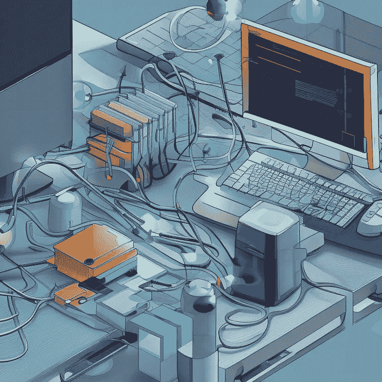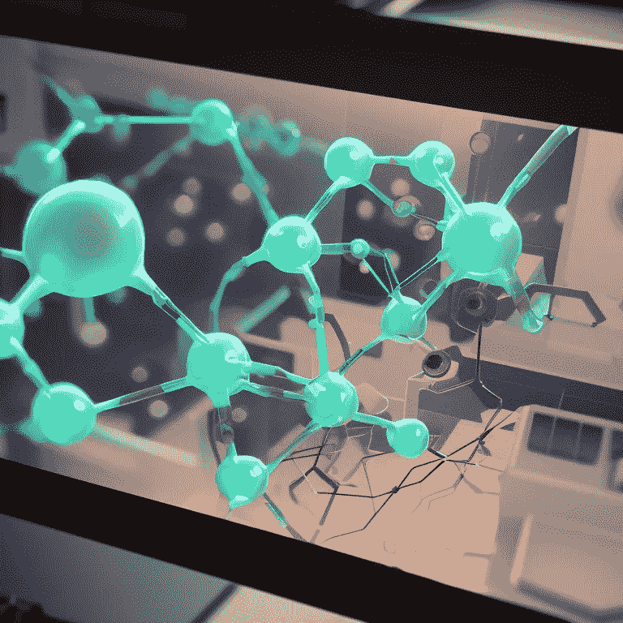

分子生成。生成与[稳定扩散 2](https://huggingface.co/spaces/stabilityai/stable-diffusion)

# 基础:扩散和图上的扩散

让我们以 [Hoogeboom 等人](https://arxiv.org/abs/2203.17003)的等变扩散论文为例，使用尽可能少的方程来概括扩散模型的基础知识😅

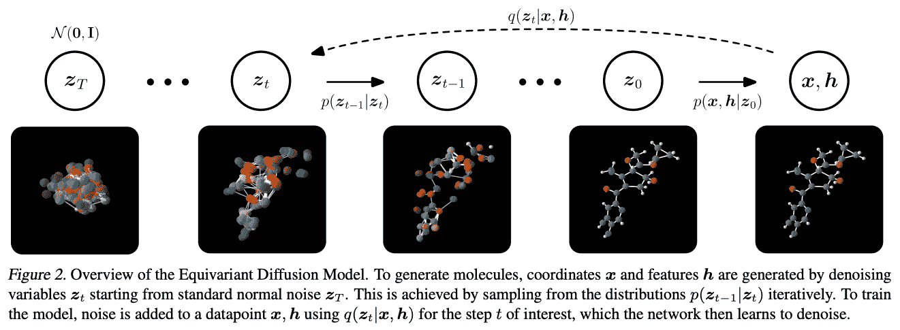

向前和向后扩散过程。正向过程 q(z|x，h)逐渐将噪声添加到图中，直到它变成高斯噪声的阶段。反向过程 p(x，h|z)从高斯噪声开始，并逐渐对图形去噪，直到它变成有效图形的阶段。来源: [**胡格博姆、萨托拉斯、维格纳克、韦林**](https://arxiv.org/pdf/2203.17003.pdf) 。

*   输入:一个带有 *N* 个节点和 *E* 条边的图( *N，E*
*   节点特征通常有两个部分:*z =【x，h】*其中 *x* ∈ R 是 3D 坐标， *h* ∈ R^d 是类似原子类型的分类特征
*   (可选)边特征是焊接类型
*   输出:带有节点、边和相应特征的图( *N，E* )
*   **前向扩散**过程 *q(z_t | x，h)* :在每个时间步 *t* ，向特征注入噪声，使得在最后一步 *T* 它们变成白噪声
*   **反向扩散**过程 *p(z_{t-1} | z_t)* :在每个时间步 *t-1，*要求模型预测噪声并*“减去”*它从输入中减去，这样在最后一步 *t=0* 我们有一个新的有效生成图
*   **去噪**神经网络学习预测注入噪声
*   去噪扩散已知等价于*基于分数的匹配*[**宋和尔蒙(2019**](https://arxiv.org/abs/1907.05600)**)**[**宋等人(2021**](https://arxiv.org/abs/2011.13456) **)** )其中神经网络学习预测扩散数据的分数*【∇_x log p _ t(x)*。基于分数的观点用[随机微分方程](https://en.wikipedia.org/wiki/Stochastic_differential_equation) (SDEs)和[维纳过程](https://en.wikipedia.org/wiki/Wiener_process)描述正向/反向过程

> Emiel Hoogeboom，Victor Garcia Satorras，Clément Vignac，Max Welling。[三维分子生成的等变扩散](https://arxiv.org/pdf/2203.17003.pdf)。ICML 2022。 [GitHub](https://github.com/ehoogeboom/e3_diffusion_for_molecules)

该工作引入了用于分子生成的等变扩散模型( **EDM** )，其必须在原子坐标 *x* (关于*旋转*、*平移*、*反射*)上保持 E(3)等变，同时节点特征 *h* (例如原子类型)保持不变。重要的是，原子具有不同的特征形态:原子电荷是有序整数，原子类型是一次性分类特征，原子坐标是连续特征，因此作者设计了特定特征的噪声处理和损失函数，并缩放输入特征以训练稳定性。

EDM 采用等变 [E(n) GNN](https://arxiv.org/pdf/2102.09844.pdf) 作为神经网络，根据输入特征和时间步长预测噪声。在推理时，我们首先对期望数量的原子 *M* 进行采样，然后我们可以根据期望的属性 *c* 对 EDM 进行调节，并要求 EDM 生成分子(由特征 *x* 和 *h* 定义)作为 *x，h ~ p(x，h | c，M)* 。

在实验上，EDM 在实现负对数似然性、分子稳定性和独特性方面远远优于基于归一化流量和 VAE 的方法。烧蚀表明，等变 GNN 编码器至关重要，因为用标准 MPNN 代替它会导致性能显著下降。

基于扩散的生成可视化。来源:[推特](https://twitter.com/emiel_hoogeboom/status/1509838163375706112)

# 题外话:图形生成的扩散

> 克莱门特·维格纳克、伊戈尔·克劳祖克、安托万·西劳丁、王博涵、沃尔坎·切弗赫、帕斯卡尔·弗罗萨德。[题外话:用于图形生成的离散去噪扩散](https://arxiv.org/abs/2209.14734)。 [GitHub](https://github.com/cvignac/DiGress)

[扯远了](https://arxiv.org/abs/2209.14734)由 Clemént Vignac、Igor Krawczuk 和 EPFL 团队提出的是无条件**图形生成**模型(尽管有可能整合一个基于分数的函数，用于调节像 energy MAE 这样的图形级特征)。decade 是一个离散扩散模型，也就是说，它对离散节点类型(如原子类型 C、N、O)和边缘类型(如单键/双键/三键)进行操作，其中向图中添加噪声对应于与从训练集中挖掘为边际概率的转移矩阵(从一种类型到另一种类型)相乘。去噪神经网络是一种改进的图变换器。decade 适用于许多图形家族——平面、SBM 和分子,[代码](https://github.com/cvignac/DiGress)可用，查看 LoGaG 阅读小组演示的[视频](https://www.youtube.com/watch?v=k2saMtP-Fn8)！

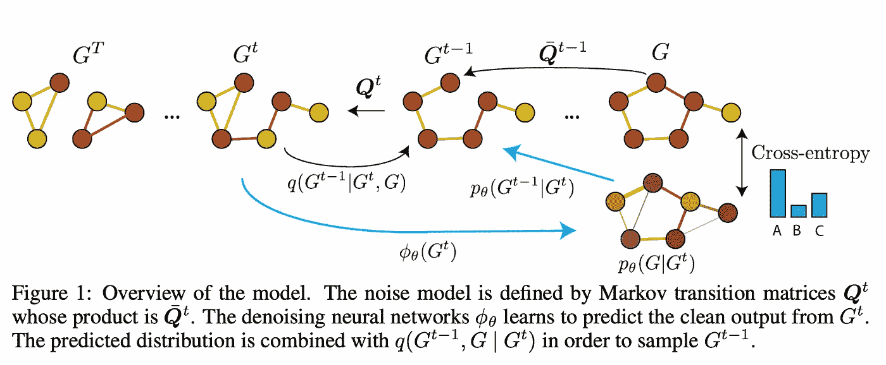

离题扩散过程。来源: [**维格纳克、克劳祖克等人**](https://arxiv.org/pdf/2209.14734.pdf)

# 地理 Diff 和扭转扩散:分子构象生成

拥有一个具有其原子的 3D 坐标的分子，**构象异构体生成**的任务是生成另一组**有效的** 3D 坐标，一个分子可以用这些坐标存在。最近，我们看到 GeoDiff 和 Torsional Diffusion 将扩散框架应用于这项任务。

> 许敏凯，俞兰涛，，陈策，斯特凡诺·埃尔蒙，。 [GeoDiff:分子构象生成的几何扩散模型](https://arxiv.org/abs/2203.02923)。ICLR 2022。 [GitHub](https://github.com/MinkaiXu/GeoDiff)

[GeoDiff](https://arxiv.org/abs/2203.02923) 是 SE(3)-等变扩散模型，用于生成给定分子的构象异构体。扩散应用于 3D 坐标，逐渐转化为高斯噪声(正向过程)。相反的过程将随机样本去噪为一组有效的原子坐标。GeoDiff 在欧几里得空间中定义了等变扩散框架(假设可以添加哪种噪声),并应用等变 GNN 作为去噪模型。去噪 GNN，一个*图场网络*，是相当标准的 EGNNs *的扩展。*geo diff 首次展示了*扩散模型如何优于*标准化流量和基于 VAE 的模型💪

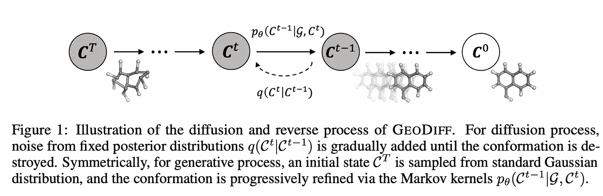

地理论坛。来源: [**徐等**](https://arxiv.org/pdf/2203.02923.pdf)

> 鲍文京，加布里埃尔科尔索，，里贾纳巴兹莱，汤米亚科拉。[分子构象体生成的扭转扩散](https://arxiv.org/abs/2206.01729)。NeurIPS 2022。 [GitHub](https://github.com/gcorso/torsional-diffusion)

当 GeoDiff 扩散欧几里得空间中原子的 3D 坐标时，[扭转扩散](https://arxiv.org/pdf/2206.01729.pdf)提出了一种扰乱分子自由旋转键中扭转角的简洁方法。由于这种可旋转键的数量总是比原子的数量少得多(在 GEOM 药物中，平均每个分子有 44 个原子对 8 个扭转角)，生成可能会快得多。棘手的部分是扭转角并没有形成欧几里得空间，而是一个[超环面](https://en.wikipedia.org/wiki/Torus)(一个甜甜圈🍩)，所以向坐标添加一些高斯噪声是行不通的——相反，作者设计了一种新颖的扰动内核，作为*包裹的正态分布*(来自真实空间，但由 *2pi* ) *。*扭转扩散将基于分数的观点应用于训练和生成，其中分数模型必须是 SE(3)- **不变量**和 sign- **等变变量**。分数模型是[张量场网络](https://arxiv.org/abs/1802.08219)的变体。

实验证明，扭转扩散确实工作得更快——与 GeoDiff 的 5000 步相比，它只需要 5-20 步，目前是 conformer 一代中的 SOTA🚀

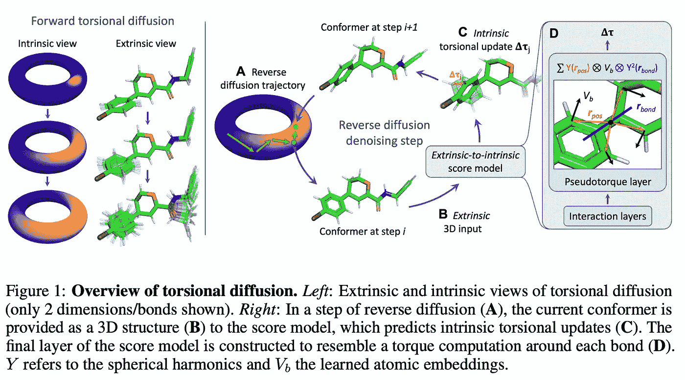

扭转扩散。来源: [**景、科尔索等人**](https://arxiv.org/pdf/2206.01729.pdf)

# DiffDock:分子对接扩散

> 加布里埃尔·科尔索、汉尼斯·斯特尔克、鲍文·京、里贾纳·巴兹莱、汤米·亚科拉。 [DiffDock:扩散步骤，分子对接的曲折](https://arxiv.org/abs/2210.01776)。 [GitHub](https://github.com/gcorso/DiffDock)

[DiffDock](https://arxiv.org/abs/2210.01776) 是基于分数的生成模型，用于**分子对接**，例如，给定配体和蛋白质，**预测配体如何结合目标蛋白质**。DiffDock 在产品空间中的平移 T(3)、旋转 SO(3)和扭转角 SO(2)^m 上运行扩散过程:(1)配体相对于蛋白质的定位(通常称为结合口袋)，口袋事先未知，因此它是*盲对接*，(2)定义配体的旋转方向，以及(3)定义构象的扭转角(参见上文的扭转扩散以供参考)。

DiffDock 训练 2 个模型:用于预测实际坐标的分数模型和用于估计生成预测的可能性的置信度模型。这两个模型都是点云上的 SE(3)-等变网络，但更大的分数模型(就参数计数而言)对来自α碳的蛋白质残基(从现在著名的 ESM2 蛋白质 LM 的[初始化)起作用，而置信度模型使用细粒度的原子表示。初始配体结构由 RDKit 生成。DiffDock 极大地提高了预测质量，你甚至可以在 HuggingFace spaces](https://github.com/facebookresearch/esm) 上的[在线演示中上传自己的蛋白质(PDB)和配体(微笑)来测试它！](https://huggingface.co/spaces/simonduerr/diffdock)

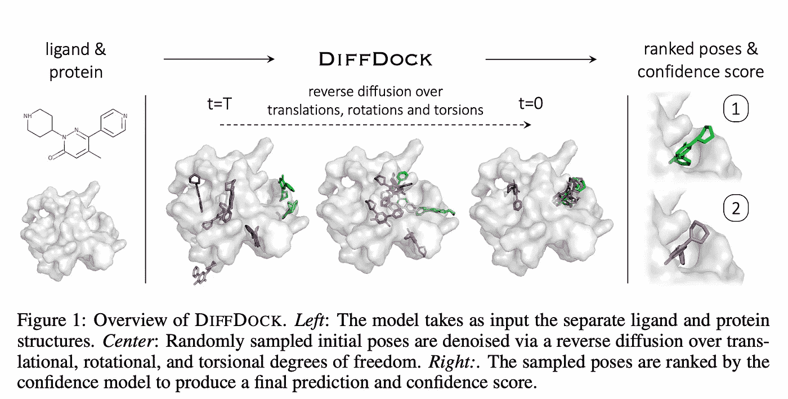

DiffDock 直觉。资料来源: [**科尔索、斯特尔克、景等**](https://arxiv.org/pdf/2210.01776.pdf)

# DiffSBDD:用于产生新配体的扩散

> 阿恩·施耐因、袁琪·杜、查尔斯·哈里斯、阿里安·贾马斯、伊利亚·伊加绍夫、陶伟·杜、汤姆·布伦德尔、彼得罗·利奥、卡拉·戈麦斯、马克斯·韦林、迈克尔·布朗斯坦、布鲁诺·科雷亚。[具有等变扩散模型的基于结构的药物设计](https://arxiv.org/abs/2210.13695)。 [GitHub](https://github.com/arneschneuing/DiffSBDD)

[DiffSBDD](https://arxiv.org/abs/2210.13695) 是**生成以蛋白质口袋为条件的新配体的扩散模型。** DiffSBDD 可以用 2 种方法实现:(1)当口袋固定时口袋条件性配体的产生；(2)近似口袋-配体对的联合分布的类修复生成。在这两种方法中，DiffSBDD 依赖于调整的等变扩散模型( [EDM，ICML 2022](/graph-machine-learning-icml-2022-252f39865c70#7cf5) )和等变 [EGNN](https://arxiv.org/pdf/2102.09844.pdf) 作为去噪模型。实际上，配体和蛋白质被表示为具有分类特征和 3D 坐标的点云(蛋白质可以是α-碳残基或全原子，残基的一键编码 ESM2 将来可以在这里使用)，因此扩散在 3D 坐标上进行，确保等方差。

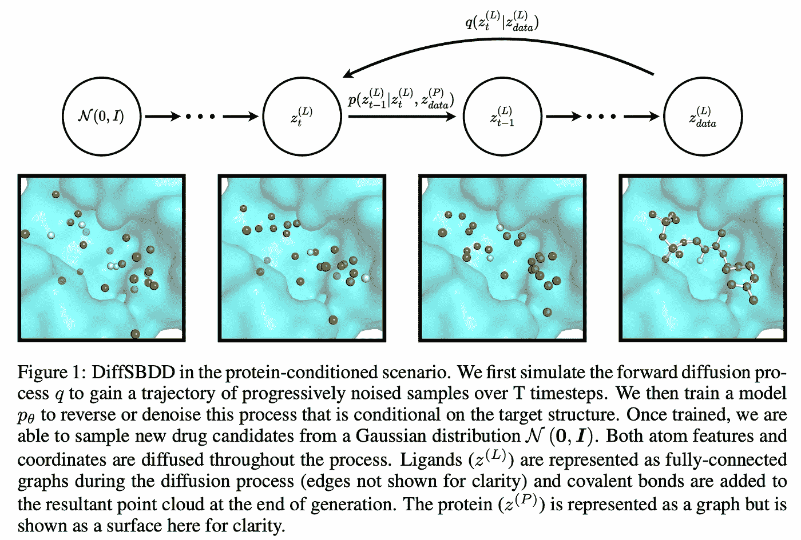

DiffSBDD。来源: [**施耐庵、杜等人**](https://arxiv.org/pdf/2210.13695.pdf)

# DiffLinker:产生分子接头的扩散

> 伊利亚·伊加绍夫、汉尼斯·斯特尔克、克莱门特·维格纳克、维克托·加西亚·萨托拉斯、帕斯卡尔·弗罗萨德、马克斯·韦林、迈克尔·布朗斯坦、布鲁诺·科雷亚。[用于分子接头设计的等变 3D 条件扩散模型](https://arxiv.org/abs/2210.05274)。 [GitHub](https://github.com/igashov/DiffLinker)

[DiffLinker](https://arxiv.org/abs/2210.05274) 是以 3D 片段为条件的**生成分子接头**的扩散模型。虽然以前的模型是自回归的(因此不是置换等变的)并且只能连接 2 个片段，但是 DiffLinker 生成整个结构并且可以连接 2+个片段。在 DiffLinker 中，每个点云都以上下文(所有其他已知片段和/或蛋白质口袋)为条件，上下文通常是固定的。扩散框架类似于 EDM，但现在以 3D 数据而不是标量为条件。去噪模型是相同的等变 EGNN。有趣的是，DiffLinker 有一个额外的模块来预测链接器的大小(分子的数量)，因此您不必事先指定它。

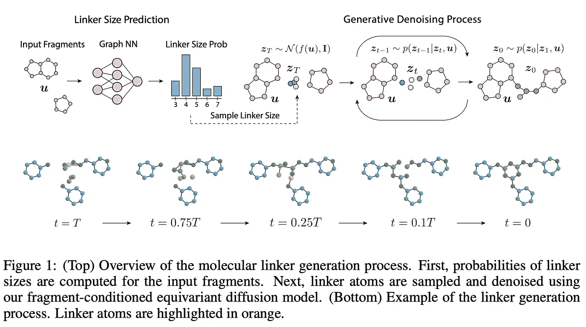

DiffLinker。来源: [**伊加绍夫等人**](https://arxiv.org/pdf/2210.05274.pdf)

# **了解更多信息**

*   [SMCDiff](https://arxiv.org/abs/2206.04119) 用于产生以所需基序为条件的蛋白质支架(也用 EGNN)。
*   一般来说，在图形和分子生成中，我们希望支持一些离散性，因此对离散扩散的任何改进都是非常受欢迎的，例如， [Richemond、Dieleman 和 Doucet 利用 Cox-Ingersoll-Ross SDE(罕见的发现！).](https://arxiv.org/abs/2210.14784)
*   在最近的[扩散器](https://arxiv.org/abs/2210.16886)中，离散扩散也被研究用于文本生成。
*   拥抱脸维护🧨 [扩散器](https://github.com/huggingface/diffusers)库开始[关于扩散模型的公开课](https://github.com/huggingface/diffusion-models-class)——查看它们以获得实用的实施技巧
*   查看由 Karsten Kreis、Ruiqi Gao 和 Arash Vahdat 撰写的 [CVPR 2022 扩散模型指南](https://cvpr2022-tutorial-diffusion-models.github.io/)的录音

我们暂时不用你的浏览器标签📚但是，请期待更多的几何扩散模型！

*特别感谢* [*汉尼斯·斯特尔克*](https://hannes-stark.com/)*[*拉迪斯拉夫·拉帕切克*](https://rampasek.github.io/) *对帖子的校对！关注推特上的* [*【汉尼斯】*](https://twitter.com/HannesStaerk)*[*拉迪斯拉夫*](https://twitter.com/rampasek) *，以及* [*me*](https://twitter.com/michael_galkin) *，或者订阅电报中的*[*GraphML*](https://t.me/graphML)*频道。***

**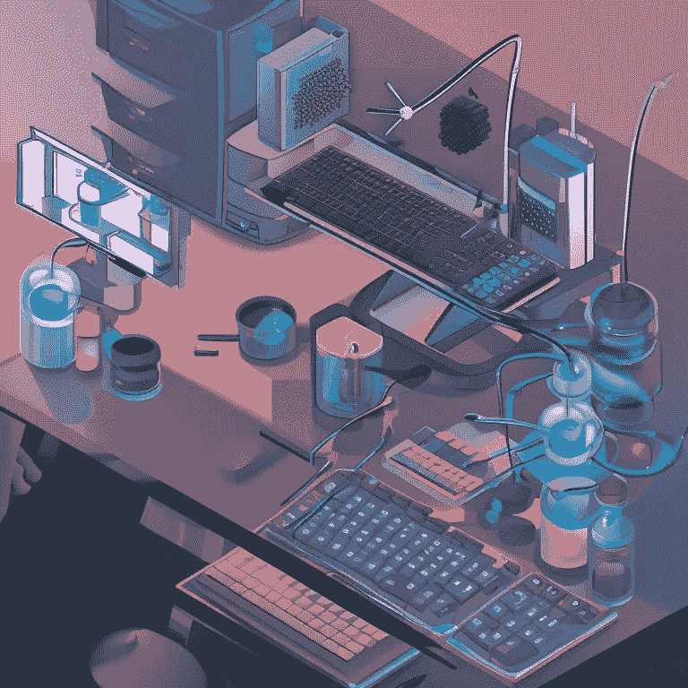****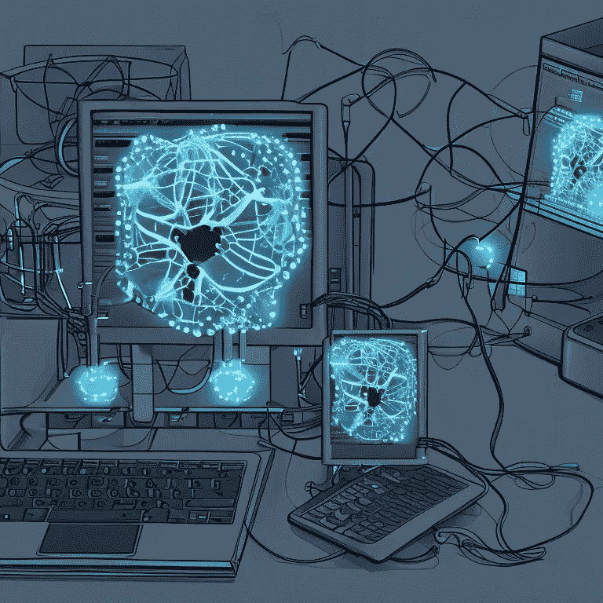**

**分子生成。生成与[稳定扩散 2](https://huggingface.co/spaces/stabilityai/stable-diffusion)**