# Python 深度学习在雷达卫星图像去噪中的应用

> 原文：<https://towardsdatascience.com/denoising-radar-satellite-images-using-deep-learning-in-python-946daad31022>

## 如何应对雷达卫星的固有干扰

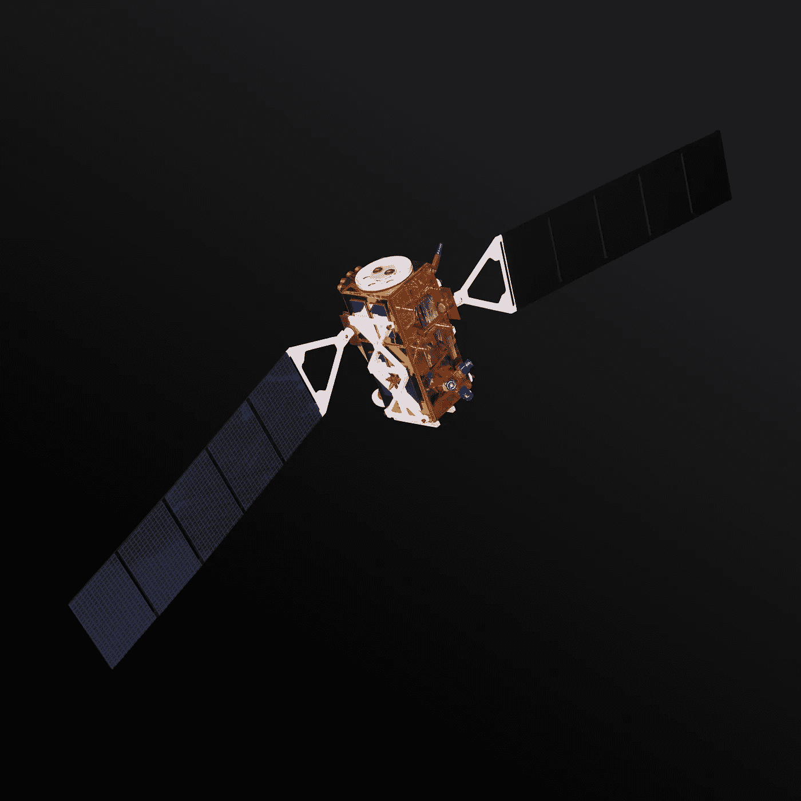

轨道上的哨兵卫星，图片由 Rama 提供，维基共享

**伊曼纽·达尔萨索**(CNAM 和巴黎电信研究员)**尤瑟夫·科米切**(嗨！巴黎机器学习工程师)，**皮埃尔·布兰查德**(嗨！巴黎机器学习工程师)

当人们想到卫星图像时，他们通常会想到显示大规模飓风的图片。这种图像由光学传感器捕捉，并被科学家广泛用于测量和预测森林火灾、自然灾害和全球变暖的其他后果，被公司用于为客户提供导航功能，被军队用于监测和跟踪敌人的军队，被城市化机构用于测量栖息地破碎或光污染。

总的来说，他们倾向于拥有出色的细节水平，但他们面临(至少)两个主要问题来详述地球的细节:**夜晚和天气。**

一种特殊的传感器可以帮助科学家在黑暗中透过云层和雨水进行观察。我们正在谈论合成孔径雷达(SARs)。合成孔径雷达系统可以搭载在卫星、飞机甚至无人驾驶飞机上，使其能够获取全球和局部范围的数据。虽然光学系统依赖于阳光(即传感器是被动的)，但雷达会发送电磁波，并测量地面上的物体反向散射的分量(即传感器是主动的)。

这样，SAR 传感器可以在一天中的任何时间和任何气象条件下获取数据，因为传输波的波长允许它穿透云层。然而，它们遇到了一个固有的问题:斑点。我们将在本文中了解什么是散斑波动，以及如何在我们的软件包[**deepdespecling**](https://github.com/hi-paris/deepdespeckling)的帮助下，显著提高雷达图像的可解释性。

为什么要使用雷达卫星图像？

作者照片

普通的光学卫星携带多种数码相机和摄像机来拍摄地球图像。然而，合成孔径雷达卫星(SAR)向其目标物体发送电子无线电信号。然后，信号从土壤或海洋反射回来，并在一定时间内返回到发射器，这决定了距离，从而决定了观察到的拓扑结构。天线位置也决定了方位角和高度。无线电波的固有特性不允许它们给图像着色。然而，它们有非常值得赞赏的特性，这些特性使它们对科学界来说是必不可少的(但不仅仅是！)

事实上，无线电波不受天气或日周期的影响。它们使得在漆黑的夜晚或巨大的气旋中捕捉图像成为可能。但不仅仅是尽他们所能:

*   检测湿度水平
*   看穿火山烟雾
*   测量树的高度，从而测量森林吸收二氧化碳的能力

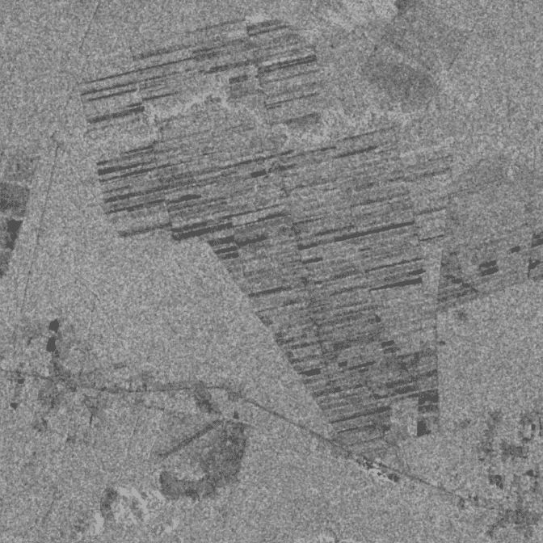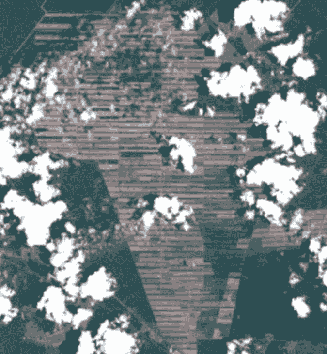

光学(Sentinel-2)和合成孔径雷达(Sentinel-1)图像之间的互补性示例:在巴西亚马逊森林的这个区域，在光学图像中，云层遮挡了一些区域，而合成孔径雷达图像却可以访问这些区域:我们可以在图像的左侧看到街道，并在右侧识别森林/森林砍伐区域。来自伊曼纽·达尔萨索球场的图片。

**SAR 图像的一个主要缺点:斑点。**

虽然雷达卫星有许多优点，但它们固有地面临一个主要缺点:斑点。散斑是由于发射的无线电波的反弹特性而引起的颗粒干扰，其降低了图像的质量，并因此降低了人眼对图像的可解释性。

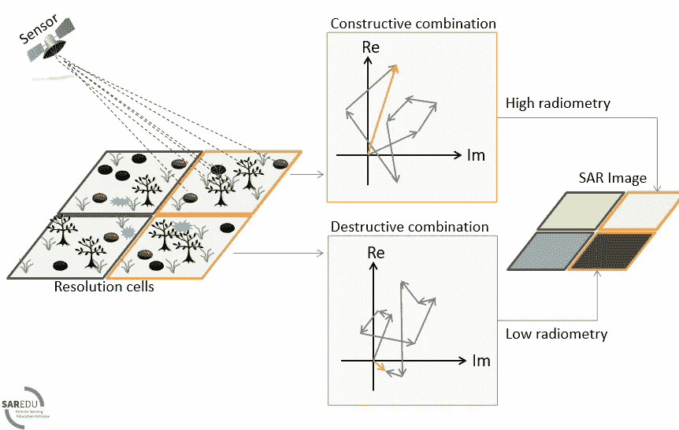

【萨热杜研究员解释的斑点现象】https://creativecommons.org/licenses/by-sa/4.0/，许可证:

在雷达图像上，斑点看起来像粒状的“盐和胡椒”纹理(见图 1)。这是因为在每个分辨单元内会出现来自多次散射返回的随机相长和相消干涉。

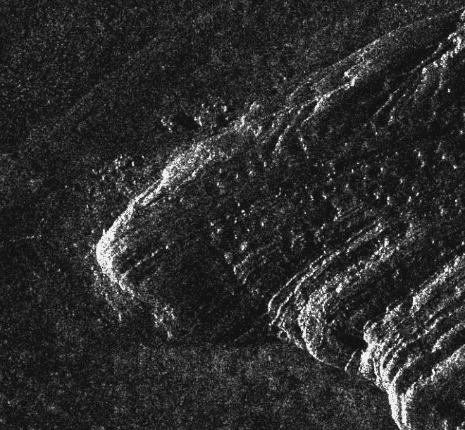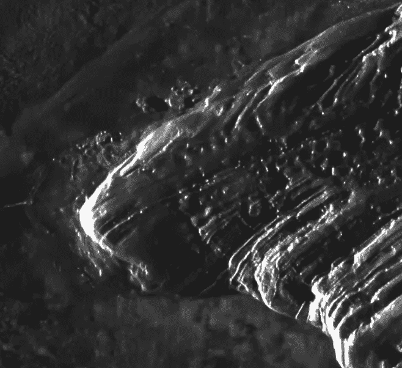

澳大利亚乌鲁鲁岩石的一个裁剪区域的降噪器示例([左侧有噪声](https://www.intelligence-airbusds.com/en/9317-sample-imagery-detail?product=2449&keyword=&type=1383)，右侧有噪声:[https://goo.gl/maps/jELs19EDypMUvjf3A](https://goo.gl/maps/jELs19EDypMUvjf3A)

虽然它是雷达图像中固有的，但存在用于去除斑点的常见方法:多重观察或自适应滤波器，但它们通常会影响细节水平。

该方法由伊曼纽·达尔萨索、洛克·丹尼斯和佛罗伦萨·图平提出，在 PyTorch 中开发，并由 Hi！巴黎工程师 Youcef Kemiche 和 Pierre Blanchard 依赖于图像的实部和虚部的分离及其处理。它允许我们减少斑点并保留细节层次。

**DeepDespeckling，一个解决这个问题的 Python 包**

**它是如何工作的？**

到目前为止，大多数方法都考虑了监督训练策略:训练网络以产生尽可能接近无斑点参考图像的输出。无散斑图像通常是不可用的，这需要求助于自然或光学图像或选择长时间序列中的稳定区域，以避免缺乏地面真实性。另一方面，自我监督避免使用无斑点图像。

我们介绍了一种基于单视复 SAR 图像实部和虚部分离的自监督策略，称为 MERLIN(复自监督去斑点)，并表明它提供了一种训练各种深度去斑点网络的直接方法。用 MERLIN 训练的网络考虑了由于特定于给定传感器和成像模式的 SAR 传递函数而产生的空间相关性。

通过只需要一张图像，并可能利用大量的档案，MERLIN 打开了无麻烦以及大规模训练去斑网络的大门。

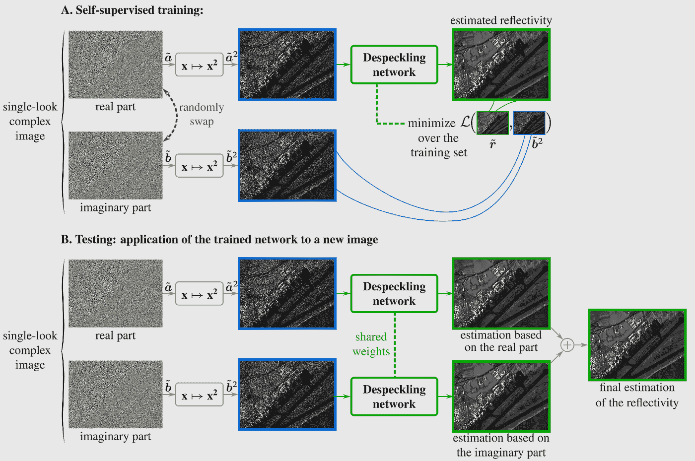

MERLIN 的原理:在步骤 A 中，训练去斑点网络仅基于实部来估计反射率。损失函数根据虚部评估预测的可能性。一旦训练好网络，就可以如 B 所示使用:使用具有相同权重的网络分别处理实部和虚部。输出被组合以形成最终估计。作者伊曼纽·达尔萨索的图片。[出处。](https://arxiv.org/pdf/2110.13148.pdf)

如需更详细的解释，请点击[链接](https://arxiv.org/abs/2110.13148)查看伊曼纽·达尔萨索、洛伊克·丹尼斯和佛罗伦萨·图平的作品。

deepdespeckling 包直接来自上面列出的研究人员的工作，旨在为开源社区提供一套方法来处理不同类型操作(聚光灯和条纹图)的斑点干扰。

**如何安装？**

**怎么用？**

请注意，两个独立的网络一直在训练两种图像形态:

TerraSAR-X 带状地图模式和 TerraSAR-X 高分辨率聚光灯模式。

下面举例说明高分辨率聚光灯数据。要对 SpotLight 数据应用可用函数，请将“deepdespeckling . merlin . test . spot light”替换为“deepdespeckling . merlin . test . strip map”。

**测试部分**

考虑到 SAR 图像的巨大尺寸，我们在这个包中开发了一组去斑功能，这样每个用户都可以将去斑效果应用到 CoSar 或 Numpy 图像。事实上，将去斑功能应用于大图像(通常有数千像素宽和高)对计算资源的要求非常高，可能需要相当长的时间。

您可以使用的 3 个功能如下:

*   **除斑()**

该函数获取要去斑的整幅图像。如果图像尺寸很大，你最好依靠 GPU 来减少计算时间。

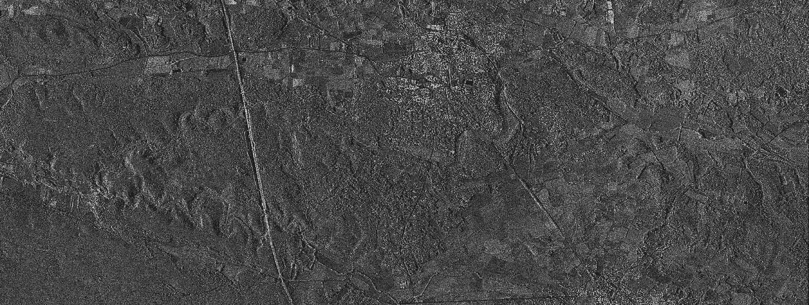

全尺寸噪声图像

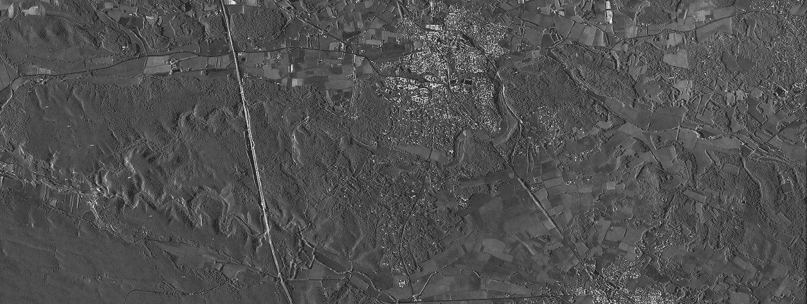

全尺寸去噪图像

*   **去斑 _from_crop()**

该功能允许您裁剪所提供图像的子集。如果您只需要去除较大图像的一部分斑点，这将非常有用。因此，与*去斑点()相比，计算时间将会减少。*

注意，该函数采用一个附加参数“fixed ”,该参数可以设置为**真**或**假**。如果**为真，**裁剪将是一个 256 像素* 256 像素的正方形。如果**为假，**裁剪将为您的图纸尺寸。

实用的裁剪工具！

左侧有噪声的裁剪图像/右侧有去噪的裁剪图像

*   **去斑点 _ 从 _ 坐标()**

该函数将去斑点功能应用于“coordinates _ dictionnary”中列出的坐标所描述的图像部分。如果您知道要去除斑点的细节的位置，这将非常有用。

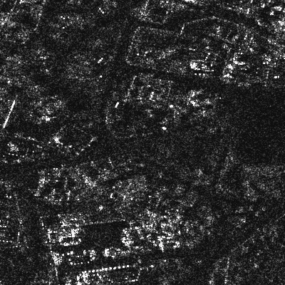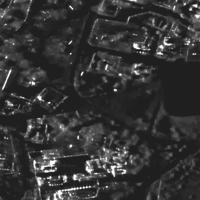

从左侧的坐标图像中裁剪出的噪声/从右侧的坐标图像中裁剪出的噪声

**列车部分**

该软件包还允许您使用两种模型训练方法，无论您希望从头开始训练自己的模型并获得自己的重量，还是从我们预先训练的模型中训练模型。

1.  从头开始训练你自己的模型(例如，将 from pretrained 参数设置为 **False** ，并从拟合中获得你自己的权重)

2.从预训练版本训练模型(即，将 from_pretrained 参数设置为 **True** 并使用我们的权重)

**结论**

这篇文章是关于用雷达传感器捕获的卫星图像的去噪。这些图像固有的颗粒干扰称为斑点。为了解决这个问题，来自巴黎电信的伊曼纽·达尔萨索和来自 Hi！巴黎。它允许您在条带地图和聚光灯操作中极大地提高 cosar 和 numpy 图像的可解释性。

我希望你喜欢它！如有问题和反馈，请随时联系我！

**联系人**

想知道更多关于你好！巴黎及其工程团队:

[嗨！巴黎](https://www.hi-paris.fr/)

[嗨！巴黎工程团队](https://engineeringteam.hi-paris.fr/)