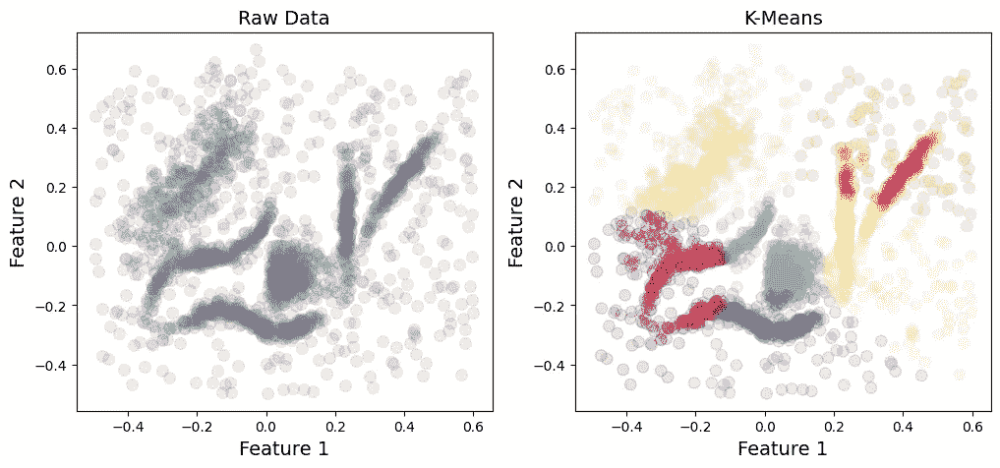
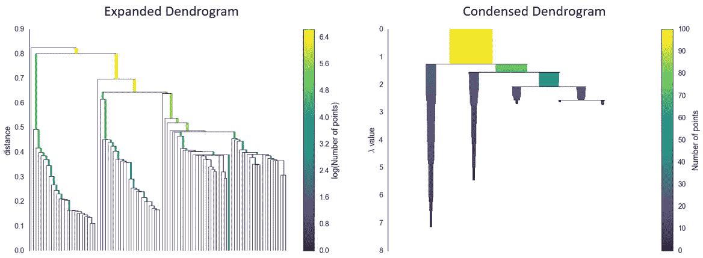
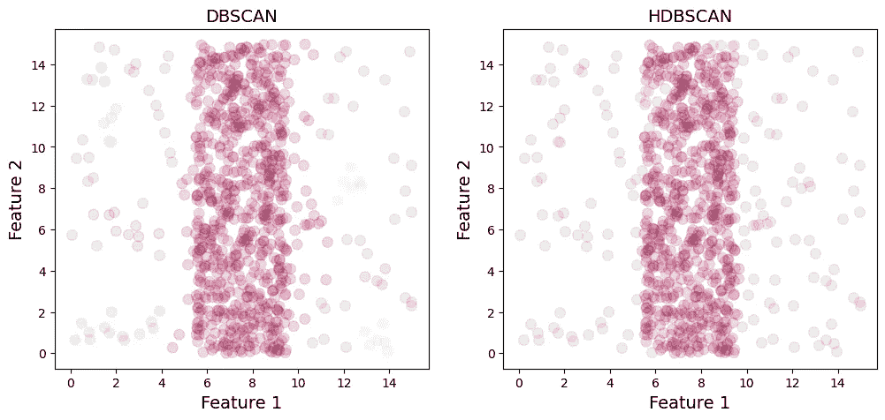
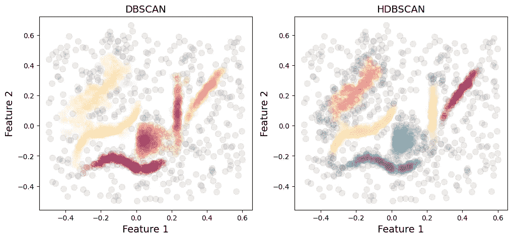
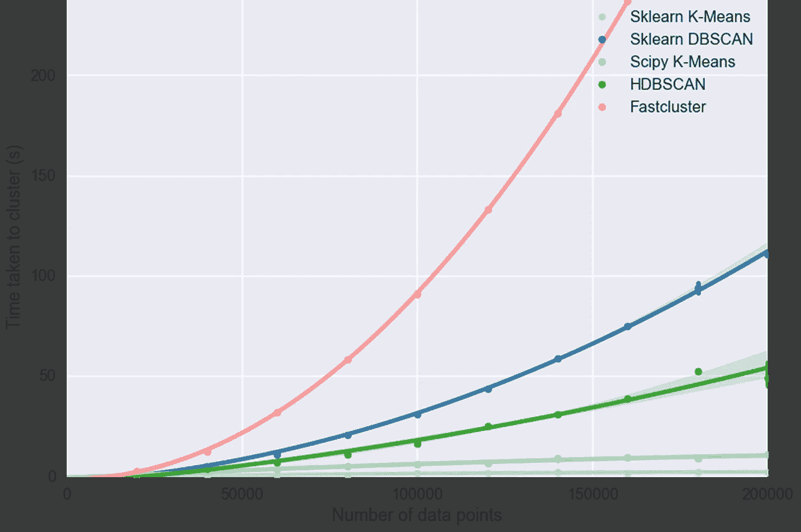

# 基于密度的聚类:DBSCAN 与 HDBSCAN

> 原文：<https://towardsdatascience.com/density-based-clustering-dbscan-vs-hdbscan-39e02af990c7>

## 为您的数据选择哪种算法

美国宇航局在 [Unsplash](https://unsplash.com/photos/_SFJhRPzJHs) 拍摄的照片

# 介绍

聚类分析是数据科学中的一个相关领域，它能够将相似的对象分组到不同的子组中。虽然有不同的聚类算法家族，但最广为人知的是 [K-Means](https://scikit-learn.org/stable/modules/generated/sklearn.cluster.KMeans.html) 。这是一种基于质心的算法，这意味着数据中的对象通过被分配到最近的质心来进行聚类。然而，K-Means 的一个主要缺陷是它缺乏对异常值或噪声数据点的检测，这导致它们被错误地分类。此外，K-Means 对球状星团有一种固有的偏好，并且在由任意形状的星团组成的数据上不能很好地工作。这在图 1 中举例说明，其显示了数据集[【1】](https://github.com/lmcinnes/hdbscan/blob/master/notebooks/clusterable_data.npy)，该数据集由被噪声数据点包围的任意构象的六个不同聚类组成。K-Means(使用 *n_clusters* = 6 运行)很难处理这些变化的形状，此外，还会将所有有噪声的数据点分配给聚类。

图 1:由任意形状的聚类和噪声组成的数据的 K 均值。图片作者。

这种类型的问题可以通过使用基于密度的聚类算法来解决，该算法将聚类描述为通过低密度区域与其他聚类分隔开的高密度区域。这一领域的两个流行算法是 [DBSCAN](https://scikit-learn.org/stable/modules/generated/sklearn.cluster.DBSCAN.html#sklearn.cluster.DBSCAN) (基于密度的噪声应用空间聚类)及其分层后继算法 [HDBSCAN](https://hdbscan.readthedocs.io/en/latest/how_hdbscan_works.html) 。

# 基于密度的噪声应用空间聚类

该算法[【2】](https://www.aaai.org/Papers/KDD/1996/KDD96-037.pdf)基于密度对数据进行聚类，通常要求一个聚类内的密度一致，聚类之间的密度下降。它有两个主要参数，需要仔细选择以获得最佳结果:

1.  ***eps*** :定义每个数据点周围邻域的半径。
2.  ***min_samples*** :一个数据点被认为是核心点所需的邻域内的最小数据点数。

DBSCAN 将数据点分为三类:

1.  **核心点**:在半径 *eps* 的邻域内至少有 *min_samples* 个数据点的点。
2.  **边界点**:具有少于 *min_samples* 的点，但在其邻域内至少有一个核心点。
3.  **噪声**:一个既不是核心点也不是边界点的点，其邻域内的最小样本点少于*个*个。

该算法从随机选取一个点开始，如果满足参数要求，就开始将数据点分配给聚类。然后通过递归计算每个数据点周围的邻域来扩展聚类，直到访问了所有点。描述 DBSCAN 算法的优秀视觉指南可以在[这篇文章](/dbscan-clustering-break-it-down-for-me-859650a723af)中找到。

# HDBSCAN

HDBSCAN 是最近开发的一种算法[【3】](https://link.springer.com/chapter/10.1007/978-3-642-37456-2_14)，它建立在 DBSCAN 的基础上，与其前身不同，它能够识别不同密度的簇。该算法通过寻找每个数据点的核心距离非常相似地开始。然而，与 DBSCAN 不同，它使用 *eps* 作为相应树状图的截止点，HDBSCAN 通过查看分裂来压缩树状图，分裂仅产生少量脱离聚类的点。结果是一个更小的树，具有更少的丢失点的聚类(图 2)，然后可以用于选择最稳定和持久的聚类。

图 2:扩展与压缩的树状图。数字摘自 [hdbscan.readthedocs.io](https://hdbscan.readthedocs.io/en/latest/how_hdbscan_works.html) 。

保留的簇的大小由 HDBSCAN 唯一需要的输入参数定义:

*   ***min _ cluster _ size***:形成一个聚类的最小数据点数。

该参数确定点是脱离一个聚类还是分裂形成两个新的聚类。这一过程使得生成的树可以在不同的高度被切割，并根据其稳定性采摘不同密度的簇。

关于 HDBSCAN 底层功能的更广泛的解释可以在它的[相应文档](https://hdbscan.readthedocs.io/en/latest/how_hdbscan_works.html)中找到。

# 比较

## 因素

如果用户对手头的数据有一些领域知识，DBSCAN 可能会非常有效。这具体指的是 *eps* 参数，该参数不太直观，通常需要一些关于数据点应被分配到一个聚类的接近度的知识(或微调)(详见[本帖](https://hdbscan.readthedocs.io/en/latest/how_to_use_epsilon.html#:~:text=While%20DBSCAN%20needs%20a%20minimum,size%20as%20single%20input%20parameter.))。相比之下，HDBSCAN 的唯一必需参数 *min_cluster_size* 更直观。

## 噪音

DBSCAN 对噪声非常敏感(图 3)，这可能导致不正确的聚类。HDBSCAN 虽然并不完美，但在将噪声数据点分配给聚类时通常会更加谨慎。

图 3: DBSCAN 产生各种小簇，应归类为噪声。HDBSCAN 也可以做到这一点，但程度要小得多。有噪声的数据点以灰色显示。图片作者。

## 变化密度

DBSCAN 往往不能识别具有不均匀密度的簇。这个问题是 HDBSCAN 开发的主要动机，因此，它可以更好地处理不同密度的集群(图 4)。

图 4:由具有不同密度的簇组成的数据的 DBSCAN 与 HDSCAN。图片作者。

## 表演

可扩展性研究还表明，随着数据量的增加，HDBSCAN 的计算性能优于 DBSCAN。下图显示，在 200，000 个数据点时，HDBSCAN 的速度大约是 DBSCAN 的两倍(图 5)。

图 5:不同聚类算法的性能。图取自并采用自 [hdbscan.readthedocs.io](https://hdbscan.readthedocs.io/en/latest/performance_and_scalability.html) 。

# 结论

虽然 DBSCAN 和 h DBSCAN 都可以很好地处理包含噪声和任意形状和大小的簇的数据，但它们确实有一些复杂的差异。虽然如果您对数据有领域知识，DBSCAN 的附加 *eps* 参数会很有用，但它通常被认为是一个非常不直观的参数。相比之下，HDBSCAN 的 *min_cluster_size* 设置起来更直观。HDBSCAN 在对噪声和不同密度的集群进行分类时也占了上风。最后，HDBSCAN 比 DBSCAN 速度更快，计算效率更高。

# 参考

[1]麦金尼斯等人(2017 年)。hdbscan:基于分层密度的聚类*。*开源软件杂志，《开放杂志》，第 2 卷，第 11 期。2017【数据文件】。

[2] Ester 等人(1996 年)。“一种基于密度的算法，用于在带有噪声的大型空间数据库中发现聚类。”KDD 96:第二届知识发现和数据挖掘国际会议论文集，第 226-231 页。

[3]坎佩洛等人(2013 年)。"基于层次密度估计的密度聚类."PAKDD 2013:知识发现和数据挖掘的进展，第 160–172 页。