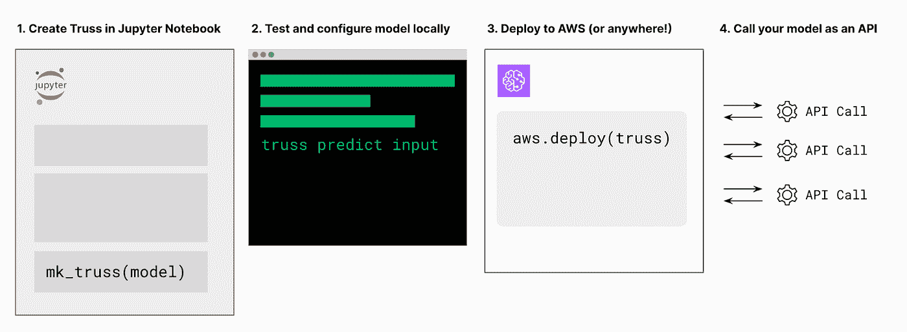

# 将任何 ML 模型部署到任何云平台

> 原文：<https://towardsdatascience.com/deploy-any-ml-model-to-any-cloud-platform-f27a8311f6d4>

## 介绍 Truss，一个用于模型打包和部署的开源库


Truss 是用于 ML 模型服务的开源 Python 库|照片由 [Joshua J. Cotten](https://unsplash.com/@jcotten?utm_source=unsplash&utm_medium=referral&utm_content=creditCopyText) 在 [Unsplash](https://unsplash.com/s/photos/truss?utm_source=unsplash&utm_medium=referral&utm_content=creditCopyText) 上拍摄

模型服务不仅仅是一个难题，它是一个不断需要新的解决方案的难题。

作为 MLOps 的一部分，模型服务是 DevOps 的挑战，即保持一个复杂、脆弱的工件(模型)在多个动态环境中工作。随着为培训模型构建和更新框架，以及生产环境为新的功能和约束而发展，数据科学家必须重新实现模型服务脚本并重建模型部署流程。

在资源充足的大型组织中工作的数据科学家可以将他们的模型交给专业的 MLOps 团队进行服务和部署。但对于我们这些在初创公司和新公司工作的人来说，就像我在职业生涯的第一个十年所做的那样，我们必须自己处理 ML 部署的挑战。问题:服务和部署一个模型需要一套完全不同于培训的技能和技术。

简单介绍一下:我是 Tuhin Srivastava， [Baseten](http://baseten.co) 的首席执行官，Truss 最初就是在这里开发的。在努力找出数据科学家需要什么来实现 MLOps 的过程中，我们与数据科学领导者进行了交谈，并听到了类似这样的事情:

*   “我们希望避免任何形式的自定义开发，自行托管模型。如果我们自己来做，我们可能需要在虚拟机或 Kubernetes 集群上部署我们自己的 Docker，然后我们还必须处理围绕这些东西的所有开发工作。”— Faaez Ul Haq，数据科学主管@ Pipe
*   “我们的团队主要由数据科学家和语言学家组成，我们不是 DevOps 专家。我们可以写 Python，但我们不想整天写 YAML 配置。”—丹尼尔·怀特纳克，数据科学家@ SIL

数据科学家的工作环境是 Jupyter notebook，这是一个为迭代实验而设计的灵活而宽松的系统。Jupyter 笔记本是训练模型的一个很好的工具，但是作为一个非永久性的和面向开发的环境，它对于模型服务来说不是很好。模型服务需要像 Docker 这样的技术来带来一个稳定的、可预测的环境。

# 当今数据科学家如何处理服务模型

为生产中的模型提供服务通常归结为几个步骤:

1.  序列化模型
2.  将模型放在 Flask 之类的 web 服务器后面
3.  将 web 服务器打包成 Docker 映像
4.  在容器上运行 Docker 映像

在这些步骤中潜藏着额外的复杂性。该模型需要接受输入并以适当的格式生成输出，从 Python 优先的接口转换为 web 优先的接口。而且有些模型需要访问 GPU 硬件进行预测，或者安全访问秘密值，或者导入 Python 和系统包。


导航部署迷宫|照片由 [Unsplash](https://unsplash.com/s/photos/lost-in-a-maze?utm_source=unsplash&utm_medium=referral&utm_content=creditCopyText) 上的 [Robert Linder](https://unsplash.com/@rwlinder?utm_source=unsplash&utm_medium=referral&utm_content=creditCopyText) 拍摄

但是更大的问题是，即使基本步骤对于每个框架都是不同的，有时对于用同一框架构建的不同模型也是如此。因此，即使你知道如何服务 TensorFlow 模型，你也必须重新学习如何服务 PyTorch 模型，并在尝试拥抱脸模型时再次经历该过程。

“嗯，没关系，”你可能会说，“我只是要使用一个建模框架。我会成为 TensorFlow ML 工程师。”问题是，我们没有不同的框架，因为数据科学家不擅长达成一致。因为不同的问题需要不同的方法。每个流行的建模框架擅长不同种类的底层算法和结构。但是模型服务技术不需要完全不同。

像 [Cog](https://github.com/replicate/cog) 、 [BentoML](https://github.com/bentoml/BentoML) 和 [MLflow](https://github.com/mlflow/mlflow/) 这样的开源包有助于简化模型部署过程。我们希望扩展这些想法，开发一个开源库，特别是针对初创企业的数据科学家。我们的两个关键信念:

1.  **为 Python 用户构建:**作为数据科学家，Python 是我们的舒适区。我们想要一个可以完全用 Python 管理的模型部署库。
2.  **与每个模型和平台一起工作:**我们想要一个开源包，它可以处理模型部署，而不管模型框架和云平台。

在这些想法的指导下，我们构建并开源了 [Truss](https://github.com/basetenlabs/truss) 。

# 模型服务如何与 Truss 一起工作



提供和部署模型|作者图像的步骤

## 步骤 1:标准化模型打包

我们在本地机器上的 Jupyter 笔记本中，这是数据科学家的家乡。使用拥抱脸变压器，我们将在这个例子中引入 t5 小模型作为管道。

```
from transformers import pipeline
import truss

pipe = pipeline(tokenizer="t5-small", model="t5-small")
scaf = truss.mk_truss(pipe, target_directory="my_model")
```

拥抱脸是 Truss 开箱即用支持的许多流行框架之一，还包括 LightGBM、PyTorch、scikit-learn、TensorFlow 和 XGBoost(更多即将推出)。因此，我们需要做的就是在模型上运行 mk_truss，所有的东西都将被序列化和打包，以备使用。

## 第二步:扎实的地方发展

使用我们的 Truss，我们可以在 Jupyter 环境中调用模型:

```
print(scaf.server_predict({"inputs" : ["translate: hello world in german"]}))
# Expected result is {'predictions': [{'translation_text': 'Übersetzen: Hallo Welt in deutsch'}]}
```

但是 Truss 超越了代码内模型调用。有多种本地开发选项，包括在 Docker 容器中运行模型和发出 API 请求。

要启动 docker 容器:

```
truss run-image my_model
```

要提出请求:

```
curl -X POST [http://127.0.0.1:8080/v1/models/model:predict](http://127.0.0.1:8080/v1/models/model:predict) -d "{'inputs': [{'translation_text': 'Übersetzen: Hallo Welt in deutsch'}]}"
```

本地开发不仅仅是测试。您可以更新您的模型，以便通过[预处理和后处理功能](https://truss.baseten.co/develop/processing)更好地与其他系统集成，创建[样本输入](https://truss.baseten.co/develop/examples)以记录测试用例，以及[配置您的 Truss 的每个方面](https://truss.baseten.co/develop/configuration)以满足您的需求。有了上面介绍的各种调用选项，您将能够通过一个紧密的开发循环快速地为生产准备好您的模型。

## 步骤 3:无缝生产部署

多亏了 Docker，我们一直工作的开发环境与最终的生产环境非常匹配。根据您希望在哪里部署您的模型，请遵循针对平台的特定部署说明，如 [AWS ECS](https://truss.baseten.co/deploy/aws) 、 [Baseten](https://truss.baseten.co/deploy/baseten) 和 [Google Cloud Run](https://truss.baseten.co/deploy/gcp) 。您的模型也可以部署在任何可以运行 Docker 映像的地方。

根据您的环境，调用部署的模型可能略有不同，但是应该是与步骤 2 中的请求相匹配的 API 请求，但是目标是生产域。

## 步骤 4:共享和迭代

您的序列化模型以及相关的代码和配置文件构成了整个桁架。因此，将您的模型打包成一个 Truss 使其具有可移植性，从而释放了两个关键用例:版本控制和共享。

一切都在文件中，所以您可以在 Git 中提交您的模型。通过这种方式，您可以实现模型版本化，测试您模型的不同迭代，并将您的模型推送到 GitHub 或类似的存储库中。

尝试运行别人的模型最令人沮丧的部分是复制他们的环境。但是现在你的模型被保存为一个 Truss，所有人需要做的就是从 GitHub 或另一个资源库下载它，安装 [Docker](https://www.docker.com/) 和 [Truss Python 包](https://pypi.org/project/truss/)，并在本地服务模型。我们很高兴能够在开源建模中实现更多的协作和迭代。


桁架标志|作者图片

机器学习模型只会变得更加复杂和强大。反过来，在本地和生产中可靠地服务于这些模型变得比以往任何时候都更加重要。我们致力于对 Truss 的长期支持和开发，并让我们知道应该在我们的[路线图](https://github.com/basetenlabs/truss/blob/main/ROADMAP.md)中添加什么。

Truss 为跨模型框架和部署目标的模型服务提供了统一的方法。从由 repo 主演的[开始，通过](http://github.com/basetenlabs/truss)[端到端部署教程](https://baseten.gitbook.io/truss/e2e)学习您最喜欢的框架和平台。