# 使用拥抱脸 DLC 在网站中部署聊天机器人

> 原文：<https://towardsdatascience.com/deploy-chatbots-in-web-sites-using-hugging-face-dlcs-be59a86fd7ba>


沃洛季米尔·赫里先科在 [Unsplash](https://unsplash.com?utm_source=medium&utm_medium=referral) 上的照片

## 带代码的分步教程

在本教程中，您将学习如何使用拥抱脸 DLC 来实现预训练模型，并在网站上部署它们以创建聊天机器人。虽然本教程主要关注对话类型模型，但是您可以将关键概念用于任何类型的应用程序。

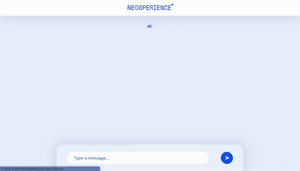

资料来源:新科学

*本文作者是罗伯托·扎帕*

如今，由于亚马逊 AWS，我们有大量不同的方法来实现人工智能模型，使我们能够创建几年前无法实现的应用程序。最近，亚马逊宣布了通过拥抱脸实现 AWS 深度学习容器(DLCs)的可能性，从而简化了亚马逊 SageMaker 中模型的部署。在这篇文章中，我想把这种新方法与不同的 AWS 服务结合起来，用 chatbot 创建一个网站。我将使用预训练的 DialoGPT-medium 模型，可用于拥抱脸。

最终的架构将如下所示:


最终架构。来源:作者自己的作品

本教程结束时，您将能够:

*   **使用拥抱脸 DLCs 创建 SageMaker 端点**
*   **创建 lambda 函数，并在其中调用我们的端点**
*   **用 lambda 函数创建、设置和连接 API 网关**
*   **在 Amplify 上创建一个网页，并将其连接到我们的网关**

准备好了吗？我们走吧

# 使用拥抱脸 DLC 创建 SageMaker 端点

从[拥抱脸](https://huggingface.co/)中选择您想要使用的型号，然后点击按钮“**部署**”→“**亚马逊 SageMaker**

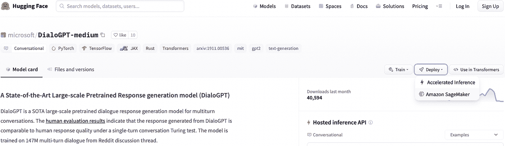

拥抱脸网页。作者图片

现在您必须选择模型的任务和配置。不同的任务涉及不同的数据结构，我们必须提供给我们的模型，以便进行预测，你可以在这里看到不同的数据结构。选择**对话**和 **AWS** 。

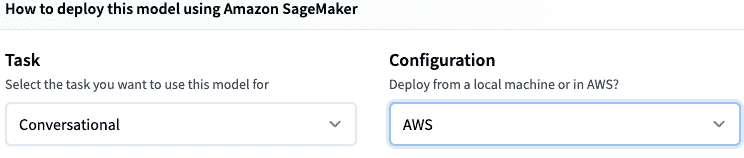

拥抱脸网页。作者图片

在您想要使用的 SageMaker 笔记本实例中，复制并运行 Jupyter 笔记本中生成的代码。

很简单，对吧？

**警告**

当我写这篇教程的时候，有一个 bug 不允许在 SageMaker 中使用对话类型模型进行预测。为了绕过这个问题，需要对代码进行一些修改。别担心，你可以复制我的代码:

我们可以通过 SageMaker 控制台看到刚刚创建的端点→ **“推理”** → **“端点”**。复制它的名称，因为在后面的章节中需要它。此外，记住在不再需要时删除端点，以免产生不必要的成本。你可以通过 SageMaker 控制台或者在你的 Jupyter 笔记本里面运行下面的代码来删除它:

```
predictor.delete_endpoint()
```

# 创建 lambda 函数，并在其中调用我们的端点

现在我们必须创建我们的 lambda 函数。登录 [AWS Lambda 控制台](https://console.aws.amazon.com/lambda/)，点击按钮**创建功能**。命名，选择你想要的语言(我选择 Python 3.8)，点击“**创建函数**”。

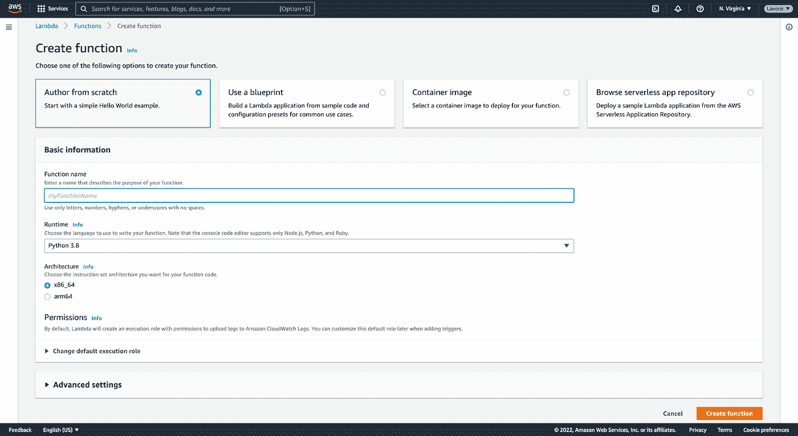

AWS Lambda。作者图片

在**【代码】**部分复制**【lambda _ function . py】**内的这段代码:

为了能够将端点连接到该功能，选择**“配置”** → **“环境变量”** → **“编辑”**，并在**键**“端点名称】下和**值**下写入上一节中复制的端点名称。点击**【保存】**。

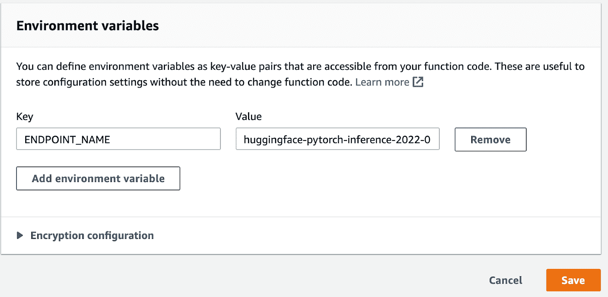

AWS Lambda。作者图片

最后但同样重要的是，我们必须为我们的功能添加正确的权限:选择**“配置”** → **“权限”**，并单击**角色名称**。

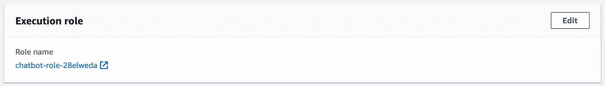

AWS Lambda。作者图片

向您的策略授予此权限:

# 用 lambda 函数创建、设置和连接 API 网关

在 [API 网关](https://console.aws.amazon.com/apigateway/main/)中，点击**“创建 API”**，并点击 **REST API** 中的**“构建”**

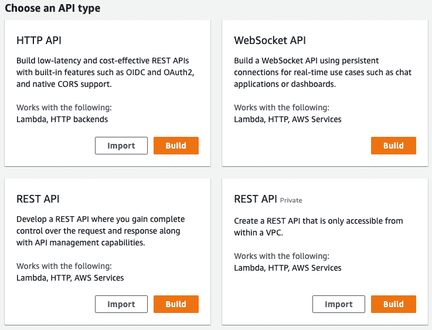

AWS API 网关。作者图片

在下面的页面中，给你的 API 命名，选择**【端点类型】** **【边缘优化】**，点击蓝色按钮**【创建 API】**


AWS API 网关。作者图片

从**“动作”**中选择**“创建方法”**

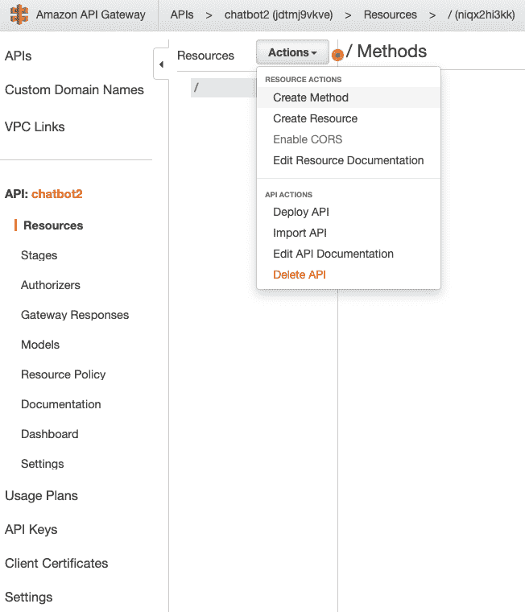

AWS API 网关。作者图片

从新方法中选择**“POST”**并确认。选择 POST 方法并选择**【集成类型】** Lambda 功能。写下 lambda 函数的名称后，点击**“保存”**按钮，在接下来的页面中点击**“确定”**按钮。

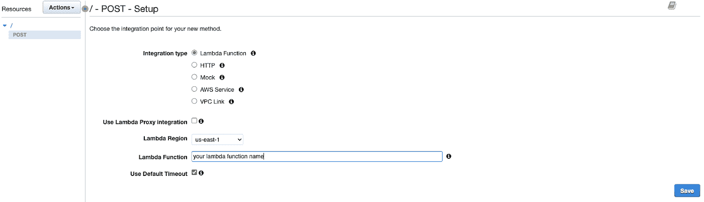

AWS API 网关。作者图片

现在，再次从**“Action”**选择**“Enable COREs”**，不做任何更改，点击**“Enable CORS and replace existing CORS headers”**按钮，在随后的消息中点击**“Yes，replace existing values”**。

最后要做的是部署它:从**“动作”**选择**“部署 API”**。在**【部署阶段】**中选择**【新阶段】**，选择一个名称，点击“部署”按钮。

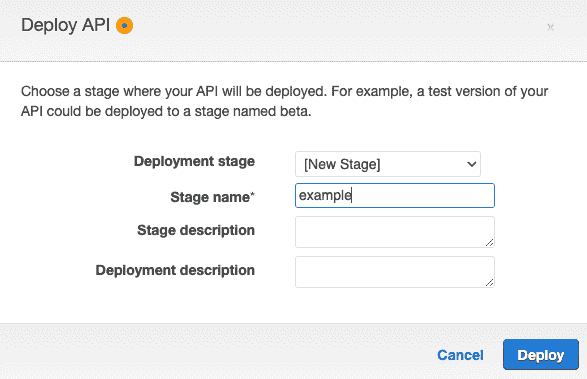

AWS API 网关。作者图片

在下一页中，您将看到一个“调用 URL”。复制并在 HTML 文件中使用它，以便能够调用 API 网关。


调用 URL 的示例。作者图片

# 测试我们的聊天机器人

我们快完成了！

现在我们有了调用 URL，我们可以使用下面的 python 程序测试我们的聊天机器人。您需要做的唯一更改是用您的调用 URL 替换 def main()函数中的 URL。

如果一切正常，我们可以继续将聊天机器人连接到我们的网页。

# 在 Amplify 上创建一个网页，并将其连接到我们的网关

在 [AWS Amplify](https://us-west-2.console.aws.amazon.com/amplify/home) 中，选择按钮**“新应用”** → **“主机 web 应用”**，在接下来的页面中选择**“无 Git 提供者部署”**，点击**“继续”**。

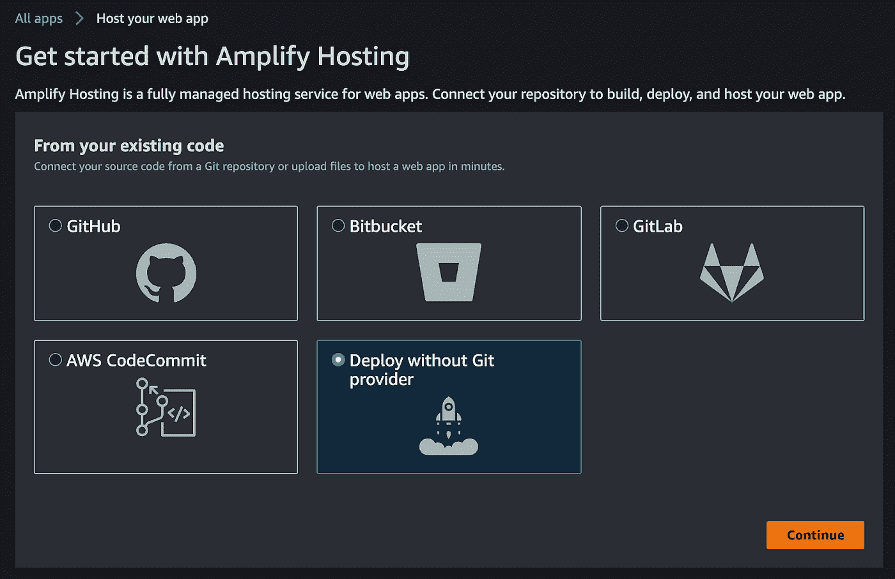

AWS 放大。作者图片

现在决定你想要的名字，然后拖放你的 html/css 代码。HTML 文件必须命名为 **"index.html"** 。如果你只想上传 HTML 文件，你必须把它压缩成 zip 格式。否则，创建一个文件夹，给它你喜欢的名字，并把 html/css 文件放在里面。为了将您的 Amplify web 应用程序与您的 HTML 代码中的 API 网关连接起来，当您想要发送/接收来自模型的数据时，您必须使用 API 网关提供的 URL。

仅此而已！

**结论和未来改进**

在本教程中，我们学习如何将预训练的拥抱人脸模型部署到 Amazon SageMaker，并将 SageMaker 端点连接到其他 AWS 服务。在未来，学习如何改变我们的预训练模型以允许不同的用例并超越标准模型的限制可能是有用的，但那是另一回事了😁。

感谢您的阅读！我希望这对你有帮助。

**关于作者**

大家好，我是 Roberto Zappa，Neosperience 的机器学习工程师。我从事 ML 技术和 AWS 基础设施方面的工作。对技术充满热情，热爱机器学习和计算机视觉。

你可以在[中](https://medium.com/@roberto-zappa)或者 [linkedin](http://www.linkedin.com/in/roberto-zappa) 上找到我

Neosperience 通过软件解决方案释放同理心的力量，这些解决方案利用人工智能使品牌能够理解、参与和发展他们的客户群。在[www.neosperience.com](http://www.neosperience.com/)伸出手。