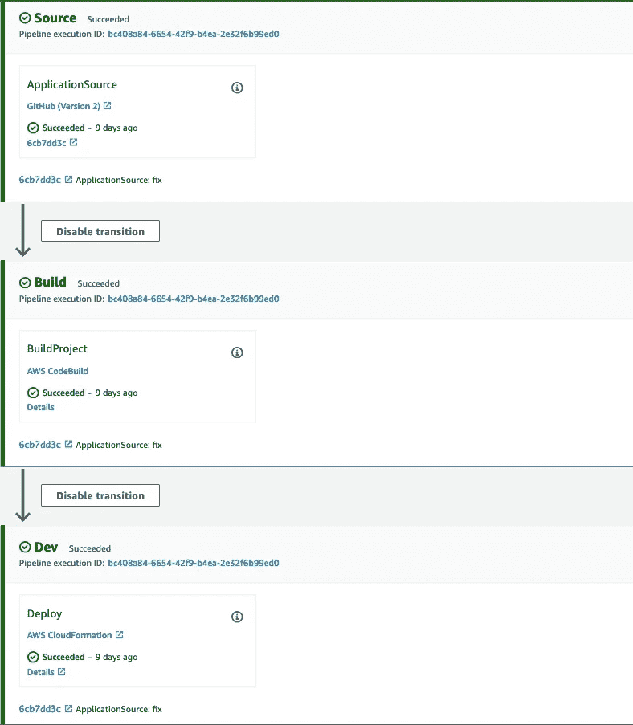

# 使用 AWS 代码管道快速部署 Lambdas

> 原文：<https://towardsdatascience.com/deploy-lambdas-fast-with-aws-codepipeline-f90b0bf5ca64>

## 用于在 AWS 上部署代码变更的连续部署管道


迈克·本纳在 [Unsplash](https://unsplash.com?utm_source=medium&utm_medium=referral) 上的照片

建立一个好的软件发布渠道很重要，这有很多原因。如果没有建立管道，程序员通常会花更多的时间测试和部署代码，而不是进行改进。理想情况下，我们希望将代码推送到我们的存储库中，让管道负责打包、测试和发布对我们环境的更改。

在 AWS 上，CodePipeline 是一种直接的软件发布服务。使用 CodePipeline，您可以定义一组在 AWS 上运行的阶段，每个阶段都包含按指定顺序运行的操作。如果你曾经使用 Jenkins 来构建管道，那么这可能听起来很熟悉。

在本文中，我将为您提供一个使用 AWS 代码管道部署 Lambda 的设置。我们将使用 CloudFormation 和 CodeBuild 等其他 AWS 服务的组合，因此如果您对 AWS 完全陌生，您会希望用其他资源来补充这篇文章，以使事情真正有意义。

以下是我们将涉及的所有内容:

*   将 Github 存储库连接到 AWS
*   创建服务角色
*   使用 AWS Cloudformation 部署管道
*   为代码构建准备 buildspec 文件
*   为你的 Lambda 准备一个云模板
*   使用代码管道部署 Lambda

让我们开始吧。我假设您已经建立了一个 git 存储库，其中包含您的 Lambda 代码。

# 将存储库连接到 AWS

如果您正在使用 Github，您必须在 AWS 和您的存储库之间创建一个连接，以便每当有新的代码更改时，您的管道可以得到通知。为此，请转到 AWS 控制台上的 AWS Codepipeline，单击“设置”下的“连接”并创建一个连接。这将打开一个向导，您将选择 Github 作为您的提供商，给你的连接一个名称，然后它将要求您通过一个 Github 弹出窗口授权您的连接。完成后，您将在 connections 下看到一个新的连接，它有自己的 ARN，我们稍后将在管道中使用。

# 创建服务角色

为此，我们将使用 AWS CodePipeline、CodeBuild 和 CloudFormation。我们需要创建一个服务角色，为每个服务授予代表您访问其他服务的权限。例如，服务角色将授予 CodeBuild 将您的代码上传到 S3 的权限。让我们使用 aws cli 为每个角色创建服务角色。

将下列信任策略保存在 3 个单独的文件夹中。每个服务的 json 文件。对于每个文件，使用“cloudformation.amazonaws.com”、“codepipeline.amazonaws.com”、“codebuild.amazonaws.com”更改突出显示的服务块

```
{
  "Version": "2012-10-17",
  "Statement": [
    {
      "Effect": "Allow",
      "Principal": {
        "Service": **[SERVICE]**
      },
      "Action": "sts:AssumeRole"
    }
  ]
}
```

对于每个服务，创建一个服务角色并记下 ARN。

```
aws iam create-role --role-name role-example --assume-role-policy-document file://[your-file-for-each-trust-policy].json
```

现在您已经创建了三个角色，每个角色都可以控制您为其赋予信任策略的服务，但是它们没有访问其他服务的权限。让我们通过将内联策略附加到角色来授予这些权限。下面是一个简单的内联策略，它将为您的服务提供对任何服务的任何操作的权限。这不是一个好的做法，所以您需要在以后缩小范围，只对它需要的资源执行操作。

将这个内联策略存储在一个. json 文件中。

```
{
  "Version": "2012-10-17",
  "Statement": [
    {
      "Action": "*",
      "Effect": "Allow",
      "Resource": "*"
    }
  ]
}
```

将该政策应用于您的每个角色，如下所示:

```
aws iam put-role-policy --role-name role-example --policy-name policy-example --policy-document file://[your-policy-file].json
```

# 部署具有云结构的管道

[AWS CloudFormation](https://docs.aws.amazon.com/AWSCloudFormation/latest/UserGuide/Welcome.html) 帮助我们设置和管理我们帐户中的资源。yaml 文件，这样我们就不必手动提供每个资源。下面我粘贴了将部署管道和构建项目的模板。

cloudformation 模板有几个主要组件。这里有两个——参数和资源。参数是资源的输入。资源是我们想要部署的 AWS 服务的定义。该模板部署两种资源:CodeBuild 和 CodePipeline。

让我们来分解一下我们的渠道阶段:

*   源代码阶段:连接到您的代码库并获取代码更改
*   构建阶段:使用 Codebuild 项目为 Lambda 安装 python 依赖项，并为 Lambda 资源打包 Cloudformation 脚本
*   开发阶段:部署前一阶段打包的 Cloudformation 脚本

一旦我们通过 CloudFormation 部署了模板，它将自动提供和管理构建项目和管道。如果您在控制台上进入 CloudFormation 并找到一个包含您的资源的新堆栈，您将能够看到资源已部署。

在部署模板之前，创建一个 S3 存储桶，并将模板文件上传到存储桶中的某个位置。

```
aws s3api create-bucket --bucket bucket-example
```

此外，我们需要一个. json 文件来存储模板中的参数值。复制这个。json 文件，并用您之前创建的参数值替换这些参数值。

然后部署模板:

```
aws cloudformation create-stack --stack-name stack-example --template-url [your-s3-template-location] --parameters file://[your-param-file.json]
```

现在，您应该会在 CloudFormation 中看到一个用于管道和构建项目的新堆栈。如果导航到 CodePipeline，您还会看到一个名为“lambda-pipeline”的管道。管道将显示上面讨论的阶段。现在，每当您的存储库中有代码变更时，它将自动通过管道运行。管道将在部署阶段失败，因为我们的构建项目找不到 buildspec 文件。

# 为代码构建准备 buildspec 文件

一个 [buildspec 文件](https://docs.aws.amazon.com/codebuild/latest/userguide/build-spec-ref.html)包含一组在软件发布期间测试和打包代码时应该运行的命令。一个例子是为你的 Lambda 安装依赖项。这些命令被分成几个阶段，如 pre_build、build、post_build 和 outputs。查看链接的参考页面，了解所有阶段的更多信息。

管道的工作是将工件从前一个阶段移动到下一个阶段。在我们的例子中，管道将它在源代码阶段获取的代码库移动到构建阶段的代码构建项目中。工件由管道模板中的输入工件和输出工件指定。构建项目的输入工件将是我们的源代码。默认情况下，它位于构建容器的$CODEBUILD_SRC_DIR 目录中。

我们构建项目的目的是从 requirements.txt 文件安装 Lambda 的所有依赖项(我假设是 python Lambda)，准备另一个描述 Lambda 的 cloudformation 模板，并将该模板作为输出工件返回到构建项目。下面是 buildspec 的样子。

cfn.yaml 文件是 Lambda 的 cloudformation 模板。让我们也创造它。

在这个模板中，我们有两个资源，一个 Lambda 角色和一个 Lambda 函数。Lambda 函数包含代码和处理程序属性，指向 Lambda 文件和处理程序函数的目录。buildspec 文件中的 cloudformation package 命令将打包来自这个源代码(包括已安装的依赖项)的代码，将包上传到命令中指定的 S3 位置，并将模板中的代码位置替换为 S3 的位置。然后，它将返回一个新的模板文件，其名称在$TEMPLATE_FILE_NAME 环境变量中指定。这是我们将指定为部署阶段的输出工件的文件，用于使用 Cloudformation 进行部署。

buildspec 文件中的输出还指定了一个 config.json 文件。该文件将包含 cloudformation 模板中任何参数的值。作为示例，我们添加了一个名为 S3ArtifactStore 的参数，因此 config.json 会:

```
{
 "Parameters": {
  "S3ArtifactStore": "your-s3-bucket-name"
 }
} 
```

现在您已经创建了这些文件，推动更改以查看您的管道启动。一旦管道成功运行，您将在 CloudFormation 中看到一个名为“lambda-stack”的 lambda 新堆栈，并在 AWS Lambdas 中看到一个新的 Lambda。



AWS 代码管道

现在，您已经使用自动化发布过程成功地部署了 Lambda。您所做的任何进一步的代码更改都将直接更新 AWS 上的 Lambda，因此您不必浪费任何时间来手动部署您的更改。

仅仅遵循这个指南应该可以帮助你成功地建立一个管道，但是如果你是这些服务的新手，那么你会发现我的解释在很多阶段都是欠缺的。最好的理解方法是查看每个阶段的 AWS 指南。与此同时，我可能会写更多的指南来更深入地研究所使用的一些服务，并将它们链接到这里。