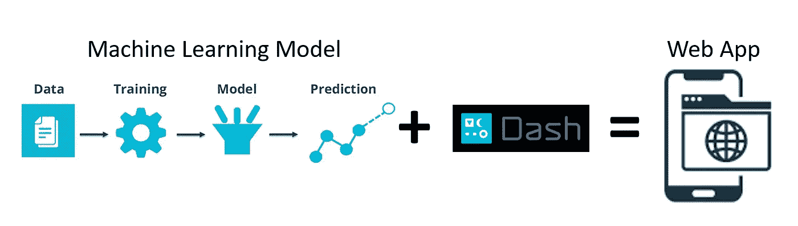
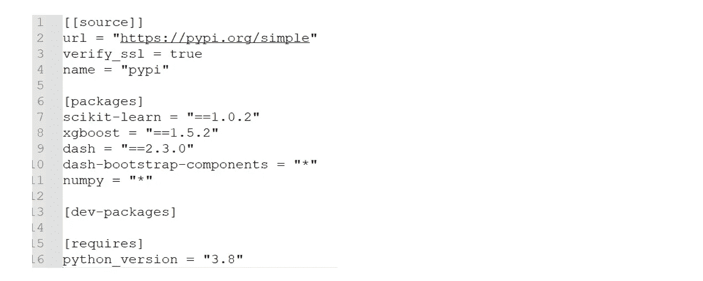
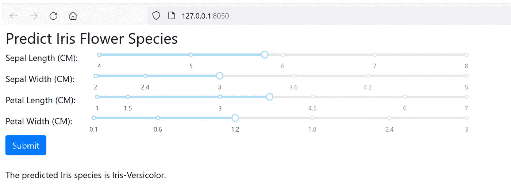
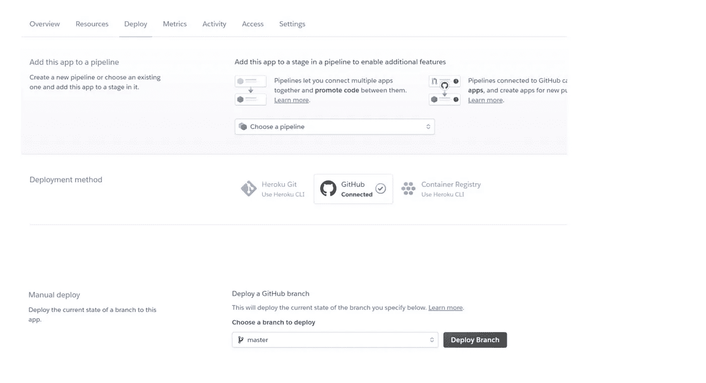
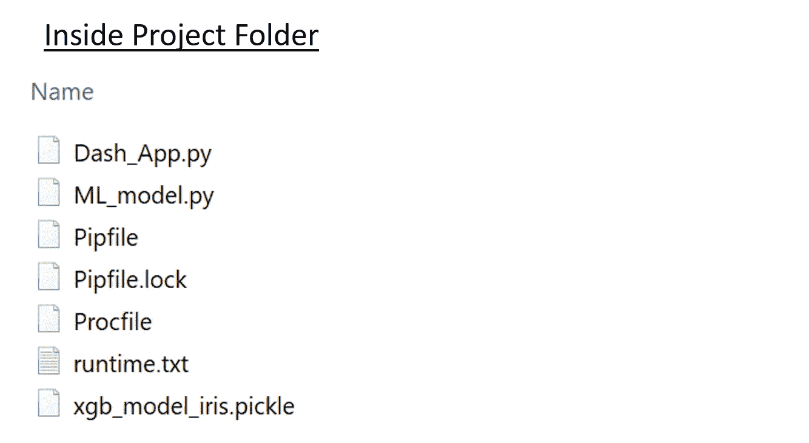

# 使用 Python Dash 和 Pipenv 部署机器学习模型

> 原文：<https://towardsdatascience.com/deploy-machine-learning-model-using-dash-and-pipenv-c543569c33a6>

## 用 Github 和 Heroku 公开托管一个 Web 应用



作者图片

数据科学家和机器学习工程师花费大量时间进行探索性数据分析(EDA)、ML 模型开发和超参数调整。通常，项目的最终目标是在生产中部署机器学习模型**。本文旨在介绍一种简单而有效的方法来开发一个 **web 应用程序**，将一个经过训练的 ML 模型投入生产: **Dash 和 Pipenv** 。**

# 步骤 1:创建虚拟环境

虚拟环境是一种工具，它创建一个隔离的空间来存储所有程序和文件，并保留项目所需的 Python 包的依赖关系。

## 为什么虚拟环境是必要的？

其他人可能会问你“**为什么你的程序会在我的电脑上崩溃？**“Python 有其独特的安装、存储和加载其包的方式，以便底层程序能够正常运行。*如果您要在不同的项目之间切换或与其他人共享您的项目，创建一个虚拟环境会使管理所需的包变得更加容易*。它是一个有用的工具，可以给项目带来很多好处。

*   它可以**在每个项目的基础上保持包**的依赖性。例如，您可以在同一台计算机上对一个项目使用 Dash 2.1，对另一个项目使用 Dash 2.2。
*   它可以为你的程序创建一个**隔离空间**，这样你的项目就是独立的，并且**可以用所需的包**进行复制。
*   在虚拟环境中，您可以安装软件包**而无需管理员权限**。

创建虚拟环境有不同的工具。对于本文，我将使用`pipenv`为我们的 ML 项目建立一个虚拟环境。

## 安装管道

```
pip install pipenv
```

## 初始化虚拟环境

打开 anaconda 提示符或命令提示符，键入以下命令来初始化虚拟环境。最初，它将在项目文件夹中创建一个名为“ **Pipfile** ”的文件。该文件将包含项目所需的所有包。

```
cd "project folder path"
pipenv shell
```

## 在虚拟环境中安装 Python 包

在命令提示符下键入以下命令。`pipenv install [package]`将在虚拟环境中安装软件包，并更新“Pipfile”文件以包含所有已安装的软件包。`pipenv lock`将创建一个名为“ **Pipfile.lock** ”的文件，其中包含项目的依赖项和子依赖项、已安装的版本以及已下载文件的散列。这确保了*确定性的*构建。

```
pipenv install "scikit-learn==1.0.2"
pipenv install "xgboost==1.4.2"
pipenv install "dash==2.3.0"
pipenv install "dash-bootstrap-components==1.0.3"
pipenv install "numpy==1.22.3"
pipenv lock
```



Pipfile(作者图片)

在虚拟环境中卸载包。您可以在移除包后使用`pipenv uninstall [package1] [package2] [package3] ...`，运行`pipenv lock`来更新“Pipfile.lock”。

# 步骤 2:开发一个 ML 模型

在我们创建了一个虚拟环境并安装了所有必要的 Python 包之后，我们就可以开始开发我们的机器学习模型了。对于本文，我们不打算关注模型开发和超参数调整，所以我使用 XGBoost 开发了一个简单的分类模型来预测鸢尾花的种类。

在我们训练完 ML 模型(即 clf)之后，我们可以使用`pickle`导出模型，这是一个序列化和反序列化 Python 对象的有用工具。确保导出项目文件夹中的 ML 模型，因为我们将在 Dash 程序中部署 ML 模型。

```
**# ML_model.py**
from sklearn import datasets
from **xgboost** import XGBClassifier
import pickle#Importing dataset from sklearn
iris = datasets.load_iris() 
X = iris.data               
y = iris.target#Create an XGB classifier
**clf = XGBClassifier()
clf.fit(X, y)**# Export the ML model
with open(r'**xgb_model_iris.pickle**', 'wb') as f:
    **pickle**.dump(clf, f)
```

# 步骤 3:使用 Dash 开发一个 Web 应用程序

现在我们可以开始开发一个漂亮的前端 Web 应用程序来部署我们的 ML 模型。我们将使用由 **Flask** 、 **Plotly.js** 和 **React.js** 编写的轻量级 Python 框架[、Dash](https://dash.plotly.com/) 来构建 web 应用。

Dash 程序需要几个步骤。

*   导入所需的库(例如，dash、dash_bootstrap_components、pickle 等)
*   dash 环境的设置
*   使用 Pickle 加载 ML 模型
*   为 web 应用程序准备**布局**，以便用户可以为 ML 模型输入他们的输入(例如，萼片长度、萼片宽度、花瓣长度和花瓣宽度)。输入可以采取不同的形式，例如，下拉菜单、文本框、滑块**和复选框。为了让 app 结构看起来漂亮，我们将使用`dash_bootstrap_components`这个包，它将 [*Bootstrap*](https://getbootstrap.com/) 框架集成到 Dash app 中。**
*   创建**回调**以接收来自用户的输入，运行 ML 模型，然后输出预测(例如，鸢尾花的种类)。

```
**# Dash_App.py**
**### Import Packages ########################################**
import **dash**
from dash import dcc
from dash import html
from dash.dependencies import Input, Output, State
import dash_bootstrap_components as dbc
import numpy as np
import pickle**### Setup ###################################################**
app = dash.Dash(__name__)
app.title = 'Machine Learning Model Deployment'
server = app.server**### load ML model ###########################################**
with open('**xgb_model_iris.pickle**', 'rb') as f:
    clf = pickle.load(f)**### App Layout ###############################################**
app.layout = html.Div([
    **dbc.Row**([html.H3(children='Predict Iris Flower Species')]),
    dbc.Row([
        **dbc.Col**(html.Label(children='Sepal Length (CM):'), width={"order": "first"}),
        dbc.Col(**dcc.Slider**(min=4, max=8, value = 5.8, id='sepal_length')) 
    ]),
    dbc.Row([
        dbc.Col(html.Label(children='Sepal Width (CM):'), width={"order": "first"}),
        dbc.Col(dcc.Slider(min=2.0, max=5,  value = 3.0, id='sepal_width')) 
    ]),
    dbc.Row([
        dbc.Col(html.Label(children='Petal Length (CM):'), width={"order": "first"}),
        dbc.Col(dcc.Slider(min=1.0, max=7,  value = 3.8, id='petal_length')) 
    ]),
    dbc.Row([
        dbc.Col(html.Label(children='Petal Width (CM):'), width={"order": "first"}),
       dbc.Col( dcc.Slider(min=0.1, max=3,  value = 1.2, id='petal_width')) 
    ]),   
    dbc.Row([dbc.Button('Submit', id='submit-val', n_clicks=0, color="primary")]),
    html.Br(),
    dbc.Row([html.Div(id='prediction output')])

    ], style = {'padding': '0px 0px 0px 150px', 'width': '50%'})**### Callback to produce the prediction #########################** 
[@app](http://twitter.com/app).**callback**(
    **Output**('prediction output', 'children'),
    **Input**('submit-val', 'n_clicks'),
    State('sepal_length', 'value'),
    State('sepal_width', 'value'),
    State('petal_length', 'value'), 
    State('petal_width', 'value')
)

def update_output(n_clicks, sepal_length, sepal_width, petal_length, petal_width):    
    x = np.array([[float(sepal_length), float(sepal_width), float(petal_length), float(petal_width)]])
    prediction = **clf.predict**(x)[0]
    if prediction == 0:
        output = 'Iris-Setosa'
    elif prediction == 1:
        output = 'Iris-Versicolor'
    else:
        output = 'Iris-Virginica'
    return f'The predicted Iris species is {output}.'**### Run the App ###############################################**
if __name__ == '__main__':
    app.run_server(debug=True)
```

# 步骤 4:在本地部署 ML 应用程序

完成 Dash 程序后，我们现在可以在本地机器上部署 web 应用程序。打开 anaconda 提示符或命令提示符，并键入以下命令。

```
cd [project folder path]
pipenv shell
python **Dash_App.py**
```

它将运行我们的应用程序，该应用程序将在 [http://localhost:8050/](http://localhost:8050/) 或 [http://127.0.0.1:8050/](http://127.0.0.1:8050/) 上提供。



作者图片

# 第五步:用 GitHub 和 Heroku 公开部署 ML 应用

在公共网站上部署 web 应用程序最简单的方法之一是使用 [**Heroku**](https://www.heroku.com/) ，这是一种云平台服务，只需一个免费帐户即可托管 web 应用程序。我们可以将所有的文件和程序导出到一个 [**Github**](https://github.com/) 仓库，然后将 Github 仓库链接到你的 Heroku 账户，并在仓库中部署一个分支。



作者图片

除了我们上面提到的文件和程序，我们还需要存储库中的两个附加文件来在 Heroku 中正确运行应用程序， **Procfile** 和 **runtime.txt.**

以下是 **Procfile 的一个例子。**这是一个没有文件扩展名的简单文本文件。“gunicorn”是一个用于 WSGI 应用程序的纯 Python HTTP 服务器，允许多个用户同时访问应用程序。这里的“Dash_App:server”表示 Dash_App.py 内部的服务器对象。

```
web: gunicorn Dash_App:server
```

下面是一个 **runtime.txt 的例子。**它指定了一个 Python 运行时(例如，主要、次要和补丁)。它区分大小写，不得包含空格。

```
python-3.8.5
```



作者图片

# 感谢您的阅读！！！

如果你喜欢这篇文章，并且想**请我喝杯咖啡，请**点击这里。

您可以注册一个 [**会员**](https://aaron-zhu.medium.com/membership) 来解锁我的文章的全部访问权限，并且可以无限制地访问介质上的所有内容。如果你想在我发表新文章时收到电子邮件通知，请订阅。