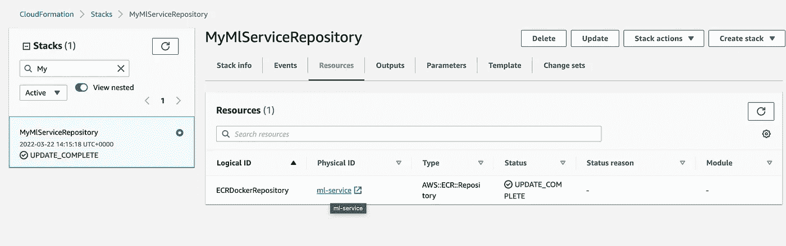

# 使用 Node.js Swagger、BigQuery 和 AWS Cloudformation 部署机器学习模型

> 原文：<https://towardsdatascience.com/deploy-machine-learning-models-with-node-js-swagger-bigquery-and-aws-cloudformation-1c66f60e79a3>

## 教程如何用一个命令部署你的机器学习模型


作者图片[💡迈克·沙克霍米罗夫](https://medium.com/u/e06a48b3dd48?source=post_page-----1c66f60e79a3--------------------------------)

# 对初学者来说真的简单易学。

包含代码的存储库可以在这里找到。

# 概述

在这篇文章中，我将创建一个简单的 API，并用 AWS Cloudformation 部署它。我想实现以下目标:

*   创建一个**节点。JS** API 服务于我的**机器学习**模型。
*   将 API 服务连接到数据仓库解决方案(在我的例子中是 **BigQuery** )
*   使用 **Docker** 和 **AWS Cloudformation** 部署我的服务

# 先决条件、库和设置

*   **Node.js** 。你将需要它来创建一个新的**招摇** API。
*   **GCP 账号**已启用 **Google BigQuery** 。我将使用 BigQuery 作为数据仓库解决方案来存储我的数据和训练 ML 模型。当涉及到数据清理时，它是非常有用的。然后我可以导出数据并在 **Spark** 中训练我的模型，甚至直接在 **BigQuery** 中训练它。一些常见的任务如*逻辑回归*已经存在。
*   AWS 帐户来部署服务。是的，在这个练习中我们将完全混合。

免费层是可用的，所以它不会花费你任何东西，但它总是一个好主意，以保持对帐单的关注。

> *顺便说一下，使用 AWS Cloudformation，您可以删除所有相关资源，然后一键重新创建它们。*

# 第一步。创建一个新的 Swagger 项目

我将使用**swagger**1 包来创建我的 API。

*   `$ npm install -g swagger`
*   `cd Documents/code`
*   `$ swagger project create ml-service`
*   选择**表示**作为框架。
*   成功！您可以通过运行`$ swagger project start ml-service`来启动您的新应用

# 第二步。连接您的 ml-service 和 BigQuery 数据仓库

我们假设我们在 **BigQuery** 中保存了一个机器学习模型，即流失预测等。让我们构建一个数据连接器，用我们的服务来服务这些预测。

# 为您的移动服务创建一个服务帐户

这需要授权您的应用程序，以便它可以访问 BigQuery 中的数据。

`./bq-shakhomirov-b86071c11c27.json`是 **BigQuery** 凭证文件的一个例子。您将需要这个 ***服务帐户凭证*** 文件来通过 Google 验证您的微服务，这样它就可以真正做一些事情。点击阅读更多关于[服务账户认证的信息。只需从你的*谷歌云平台*账户下载并添加到你的应用文件夹。](https://cloud.google.com/docs/authentication/production)

看起来应该是这样的:

然而，我们正在用 **swagger** 构建一个服务，所以让我们把它添加到`config/default.yaml`中。

最后，它应该是这样的:

# 向 API 路由添加端点

我们将使用这个端点来返回我们需要的数据。

在接下来的步骤中，我们将创建一个函数作为控制器，这样每当我们点击 API 端点时，它将执行并从我们的 BigQuery 表中提取数据。

转到`api/swagger/swagger.yaml`，在默认`/hello_world`端点之后添加新的 API 端点:

# 添加一个 swagger api 控制器(函数)

它将运行一个 SQL 查询，并从 BigQuery 表中返回*模型*数据。让我们称它为`api/controllers/userList.js`，它将被用来返回一个用户列表，以防我们想以某种方式使用它，例如，在重定向中。

在这种情况下，`api/controllers/userList.js`将为我们的端点处理响应和状态代码。作为依赖项添加的`bigQueryHelper`将负责我们需要的任何数据仓库逻辑，包括潜在的数据转换、缓存和其他一切。

# BigQuery 助手

这将处理实际的连接和我们的数据逻辑。让我们创建一个文件`api/helpers/bigQueryHelper.js`

# 安装所需的第三方依赖项

我们将只使用两个。运行以下命令:

`$ npm i @google-cloud/bigquery http-status-codes --reg [http://registry.npmjs.org/](http://registry.npmjs.org/)`

现在运行`$ swagger project start`并尝试一个建议的`$ curl [http://127.0.0.1:10010/hello?name=Scott](http://127.0.0.1:10010/hello?name=Scott)`

> *注意:如果你运行的 Node.js 高于 10.x，你很可能会遇到这个错误* [*4*](https://github.com/swagger-api/swagger-node/issues/586)

我希望 swagger-node 会收到更多及时的更新，但这里是一个修复。

# 权宜之计

*   更新你的 swagger-express-mw: `"swagger-express-mw": "^0.7.0"`
*   在`config/default.yaml`将 swagger_params_parser 添加到 swagger_controllers

*   跑`npm install`
*   运行`swager project start`
*   再试试`curl http://127.0.0.1:10010/hello?name=Scott`。现在一切都应该运行正常。

# 在 BigQuery 中填充您的表

我们假设 model trainer 作为一个单独的流程运行，并填充我们的表，例如，每天。我们来模拟一些数据。在您的数据仓库中运行以下 SQL:

# 最后

如果一切正常，那么尝试运行我们的 **BigQuery 数据连接器**

输出必须是:

**这里我们创建了一个简单的数据服务，它将从您的数据仓库中提供数据。**

# 第三步。Docker 映像和 AWS Cloudformation 部署

创建文档文件`./Dockerfile`:

# 构建 Docker 映像

在命令行中运行:

*   `$ docker build -f Dockerfile -t yourAccountNumber.dkr.ecr.eu-west-1.amazonaws.com/ml-service:latest .`
*   `$ docker run -p 80:10010 -it yourAccountNumber.dkr.ecr.eu-west-1.amazonaws.com/ml-service:latest`

这将容器的端口 10011 绑定到主机 127.0.0.1 上的 TCP 端口 80。记得你暴露了端口 80，所以试试:`$ curl [http://localhost:80/userList/3](http://localhost:80/userList/3)`

**输出:**输出必须是:

现在，当我们构建了 Docker 映像后，让我们**将**映像推送到 *AWS ECR 库*。我们需要先创建一个。

# 创建 AWS ECR 存储库

为此，您将需要 **AWS CLI** 。

创建 AWS Cloudofrmation 文件(复制—粘贴此文件):`cloudformation/ecr.template`

**运行:**

*   `$ cd ./cloudformation`
*   用您的名字替换 **MyMlServiceRepository** 和 **ml-service** 并运行:

```
aws cloudformation create-stack — template-body file://ecr.template — stack-name MyMlServiceRepository — capabilities CAPABILITY_IAM — parameters ParameterKey=YourModule,ParameterValue=ml-service
```

如果成功的输出是这样的:

```
{ "StackId": "arn:aws:cloudformation:eu-west-1:53763437664:stack/MyMlServiceRepository/123f55-a9ea-11ec-97f2-02af2e5b45e7" }
```

现在，如果您转到 AWS 控制台并选择 **Cloudformation** ，您将看到您的堆栈以及相关的存储库资源。



作者图片[💡迈克·沙克霍米罗夫](https://medium.com/u/e06a48b3dd48?source=post_page-----1c66f60e79a3--------------------------------) ak

现在，让我们将我们的形象推向这个回购:

*   `$ docker push yourAccountNumber.dkr.ecr.eu-west-1.amazonaws.com/ml-service:latest`

如果您遇到`no basic auth credentials`错误，您可能想先登录:

再次按下，您的 Docker 图像将被上传:

# 使用 Cloudformation 堆栈创建资源并部署我们的服务

现在我们在 AWS 中有了 Docker 映像，我们希望在云中部署我们的服务。

> *我想用一个命令创建所有相关的资源，即 EC 集群、任务定义和负载平衡器。*

使用`./cloudformation/cluster_and_task.yaml`创建带有任务定义和负载均衡器的集群和 ECS 服务。**删除并重新创建是安全的**

> AWS Cloudformation 可以轻松实现这一点

> 只需一个 Cloudformation 文件，即可创建 Docker 集群、任务定义和负载平衡器。

在运行`create`命令到达`./cloudformation/cluster_and_task.yaml`之前，确保**堆栈**参数**存在**:

*   关键名称
*   图像
*   VPC
*   您的默认 VPC 的子网

转到 [EC2 服务](https://eu-west-1.console.aws.amazon.com/ec2/v2/home?region=eu-west-1#KeyPairs)并创建一个名为`dockerClusterKeyPair`的密钥对。确保堆栈文件中的其他默认名称与您的 AWS 帐户匹配。

**在你的命令行运行:**

```
$ aws cloudformation create-stack --template-body file://cluster_and_task.yaml --stack-name MlServiceStaging --capabilities CAPABILITY_IAM
```

成功创建堆栈后，您将在输出中看到您的 ELB(负载平衡器)端点:


`$ curl [http://ecsalbmed-1019625851.eu-west-1.elb.amazonaws.com/userList/3](http://ecsalbmed-1019625851.eu-west-1.elb.amazonaws.com/userList/3)`

**现在您可以安全地删除整个堆栈了。**

或者，您可以从文件中提供所有堆栈参数，即

```
$ aws cloudformation create-stack --template-body file://cluster_and_task.yaml --stack-name MlServiceStaging --capabilities CAPABILITY_IAM --parameters file://staging.json
```

有关更多信息，请参见亚马逊 ECS 开发人员指南 [6](https://docs.aws.amazon.com/AmazonECS/latest/developerguide/launch_container_instance.html) 的故障排除部分。

# 结论

我们已经创建了一个简单而可靠的 API 服务来服务我们来自 BigQuery 的机器学习模型。使用基础设施作为代码使得部署、改变和进行任何类型的修改变得非常容易。例如，您可能想要创建另一个数据连接器来从 **Postgres** 中提取预测，并在提供给客户之前应用一些奇特的数据转换逻辑。 **AWS Cloudformation** 让你的代码可以重用。包括 **CI/CD** 在内的部署过程变得非常简单。我知道，作为代码的基础设施是一个复杂的话题，但是一旦你掌握了它，它将对你的部署有巨大的帮助和难以置信的速度提升。

# 资源

[1]:[https://www.npmjs.com/package/swagger](https://www.npmjs.com/package/swagger)

【2】:[https://swagger.io/tools/open-source/getting-started/](https://swagger.io/tools/open-source/getting-started/)

[3]:[https://cloud.google.com/docs/authentication/production](https://cloud.google.com/docs/authentication/production)

[4]:[https://github.com/swagger-api/swagger-node/issues/586](https://github.com/swagger-api/swagger-node/issues/586)

https://aws.amazon.com/cli/

[6]:[https://docs . AWS . Amazon . com/AmazonECS/latest/developer guide/launch _ container _ instance . html](https://docs.aws.amazon.com/AmazonECS/latest/developerguide/launch_container_instance.html)

*原载于 https://mydataschool.com*[](https://mydataschool.com/blog/deploy-ml-model-with-swagger-bigquery-and-node-js/)**。**