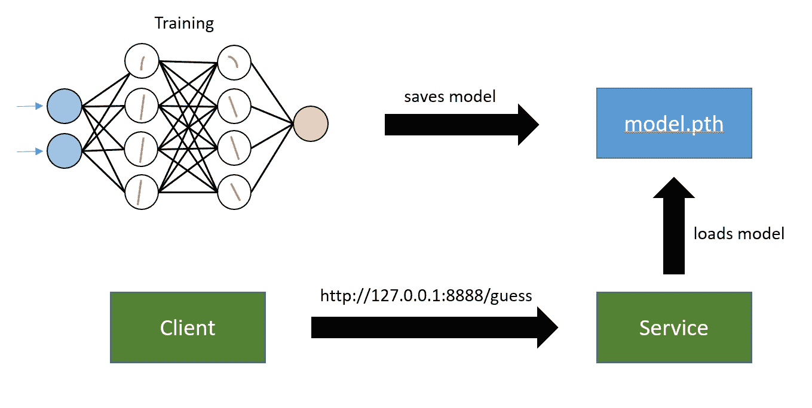
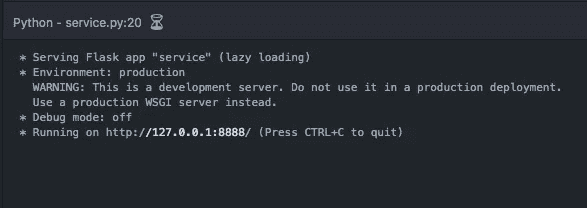
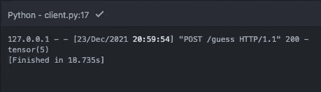

# 将 MNIST 训练模型部署为 Web 服务

> 原文：<https://towardsdatascience.com/deploy-mnist-trained-model-as-a-web-service-ba333d233a5d>

## 我负责培训、服务和客户实现。该服务接收 0 到 9(张量格式)之间的手写数字图像，并猜测该图像代表哪个数字



图片由作者提供。

在我的一篇关于深度学习的文章中，我教了如何实现一个简单的图像识别系统。该程序在一个文件中完成所有的编码工作——数据集加载、模型定义、训练和评估。

在这篇文章中，我将带您了解如何保存模型并从使用 Flask (Python web framework)实现的服务中加载它。

我还将展示如何构建一个简单的客户端来调用服务。

**代码在** [**Github**](https://github.com/vinimonteiro/mnist-service) 上有。回购包含以下文件，

*   client.py
*   service.py
*   train.py
*   神经网络. py

# 培训和保存模型

我在之前的[文章](/implementing-deep-learning-with-pytorch-image-recognition-d403d5da98ea)中提到了培训阶段。我用了 PyTorch。

这是一个简单的神经网络，有一个输入层、两个隐藏层和一个输出层。

我用的例子是图像识别的“Hello World”。对于刚开始深度学习的新手来说很棒。

训练后，我保存模型学习到的权重/参数。保存学习参数，也称为“保存用于推理”。这是[推荐的方法](https://pytorch.org/tutorials/beginner/saving_loading_models.html#save-load-entire-model)。

尽管保存整个模型更容易(代码更少),但不建议这样做，因为在保存模型时，数据被绑定到类和目录结构。

下面是我如何保存模型，

```
torch.save(model.state_dict(), "model.pth")
```

# 服务

为了开发服务，我使用了一个名为 Flask 的 Python web 框架。该实现只包含一个端点(`/guess`)。

作为参考，我使用了 [Tanuj Jain](https://medium.com/u/15510b6546e?source=post_page-----ba333d233a5d--------------------------------) 的这篇[文章](/simple-way-to-deploy-machine-learning-models-to-cloud-fd58b771fdcf)。Tanuj 还讲述了如何在云虚拟机(VM)中部署。

当执行 service.py 时，程序加载模型(以前保存的)。模型只加载一次。

## 请求和响应

该服务接收包含手写数字(张量表示)的 JSON。它将字符串 JSON 转换为数组，然后再转换为张量。

接下来，它将张量展平到大小 784 (28 乘以 28)并传递给模型。模型输出(10 个节点)包含对从 0 到 9 的每个数字的猜测。

`torch.argmax`返回所有输出节点的最大值。最后，服务响应是一个字符串。

service.py



图一。服务正在运行。图片由作者提供。

该服务在端口 8888 上运行。可能是任何港口。如果您选择端口 80 或其他标准端口号，您可能会面临“权限”错误。

## 停止服务

如果需要停止服务，我用的方法就是简单的根据某个关键字寻找进程，然后杀死它。

```
ps -ef | grep service.py
kill -9 <process>
```

# 客户

客户端很简单。这是一个加载 MNIST 数据集并将一些手写数字(张量表示)传递给服务的程序。你选择要发送的号码。

在调用服务之前，代码将张量转换成一个列表，并将其包装在 JSON 中。此外，在调用服务之前，它将数字显示为图像，以便与服务的响应进行比较。

client.py



图二。服务响应。图片由作者提供。

# 最后的想法

我希望你喜欢这个教程。这里展示的例子是为了让你开始并发展到更有趣的东西。例如，想象在纸上写一个数字，指向你的相机，然后调用服务。

最关键的一步是学习保存、加载模型，并将其作为服务。接下来解释如何在不同的云供应商中部署。我打算写一篇关于它的教程。

暂时就这样了。感谢阅读。