# 使用 Lambda 函数从 SageMaker 部署 XGBoost 模型

> 原文：<https://towardsdatascience.com/deploy-xgboost-models-from-sagemaker-using-lambda-functions-be58284ca0cf>

## 关于如何公开 SageMaker ML 模型端点供所有人使用的快速教程


杰克·法甘在 [Unsplash](https://unsplash.com?utm_source=medium&utm_medium=referral) 上的照片

在 Amazon SageMaker 中创建 ML 模型端点非常棒，但是除非您能够让其他人使用它们，否则这有什么意义呢？在上一个教程中:

> [**用 4 个简单的步骤在亚马逊 SageMaker 中训练 XGBoost 模型**](https://medium.com/@nikola.kuzmic945/train-xgboost-models-in-amazon-sagemaker-in-4-simple-steps-4eb3e104ee61)

我们讨论了如何创建一个 XGBoost 分类器，它可以根据一个人的房子面积来预测一只完美的小狗。也就是说，对于小于 500 平方英尺的房屋，模型会推荐小猎犬(0)，而对于大于 500 平方英尺的房屋，模型会推荐德国牧羊犬(1)。

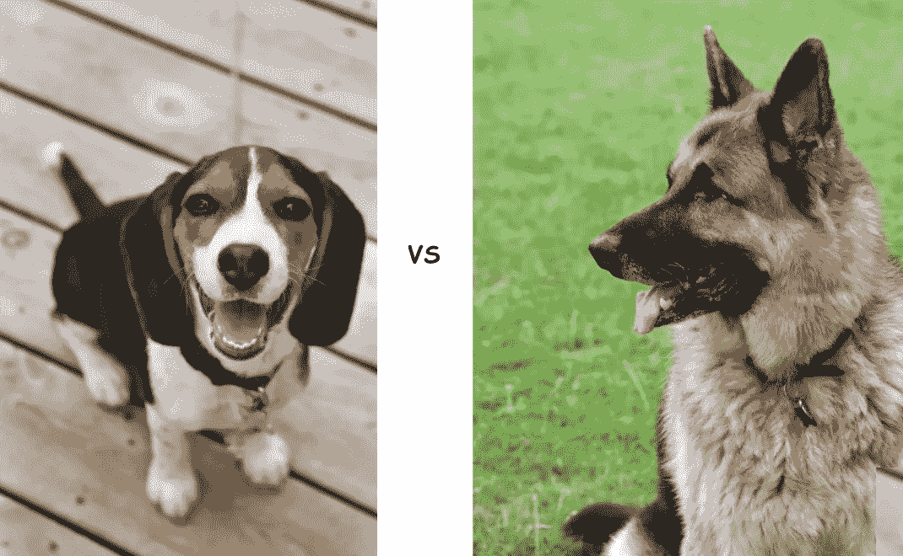

来源:左[1]和右[2]

现在是时候在互联网上部署这个端点了！以下是方法:

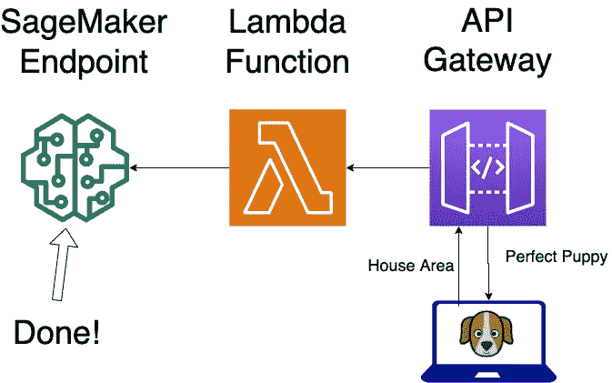

作者图片

## 👉策略

1.  创建一个 Lambda 函数，用于处理传入的请求有效负载(即住宅区输入)，并将其传递给 SageMaker ML 模型端点
2.  使用 API 网关创建一个 REST API 来接受客户机请求

这是我们努力实现的最终目标。我们希望能够从互联网上的任何地方向我们的 SageMaker 端点发送 POST 请求:

```
curl -X POST https://<Your_API_Gateway_REST_API>/resource/method -H 'Content-Type: application/json' -d '{"area":"300"}'
```

并接收以下输出响应:

```
"beagle"
```

让我们看看如何！

## 1.创建 Lambda 函数

在 AWS 中创建一个 Lambda 函数非常简单，只需几次点击。以下是您需要的代码:

在进入 AWS 控制台中的 Lambda 选项卡之前，首先确保**记下**您的 XGBoost **端点名称**，您需要将它作为环境变量存储在 Lambda 函数中。

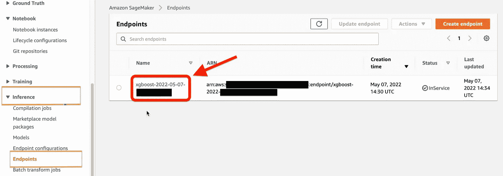

让我们创建 Lambda 函数

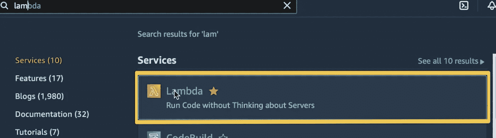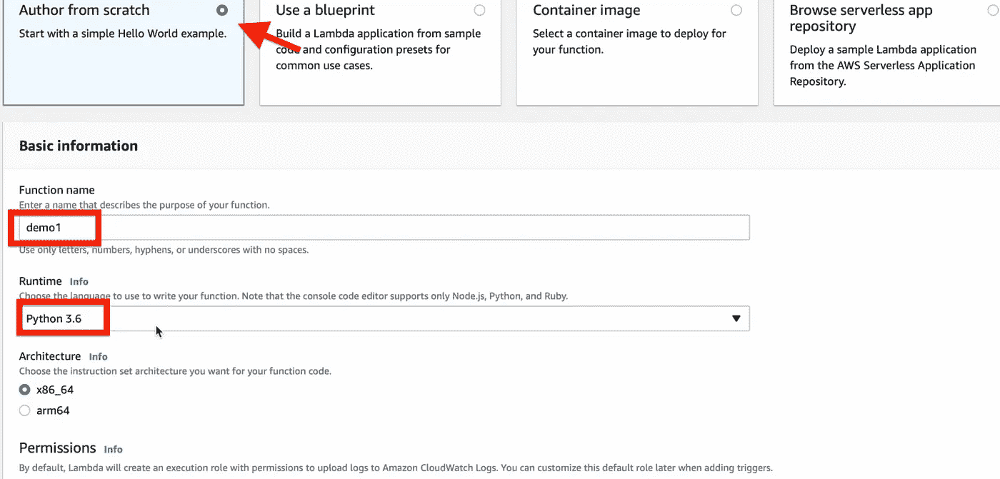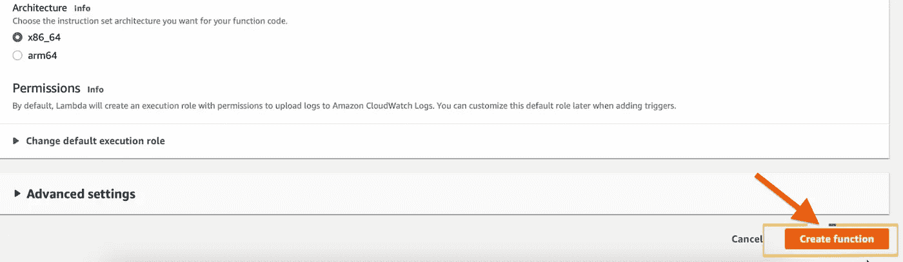

你可以在这里粘贴 lambda 代码:

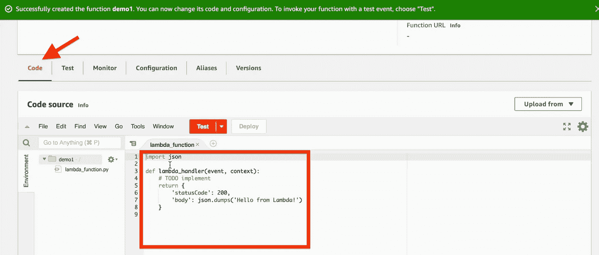

接下来，输入 SageMaker 端点名称(您之前复制的)作为环境变量

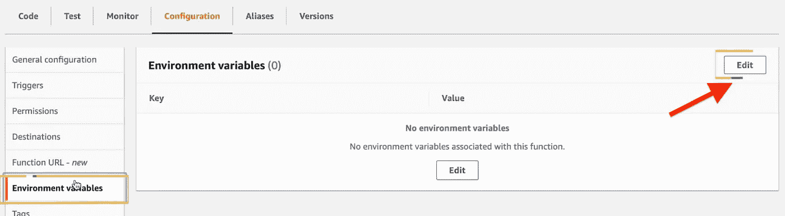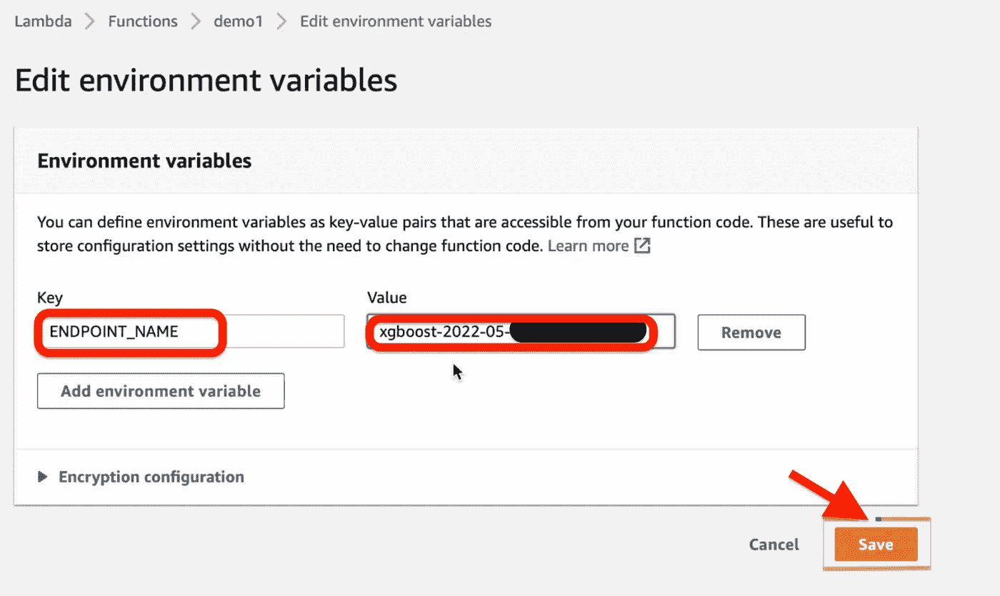

接下来，我们需要给我们的 Lambda 函数权限来调用 SageMaker 端点。在权限下，单击执行角色:

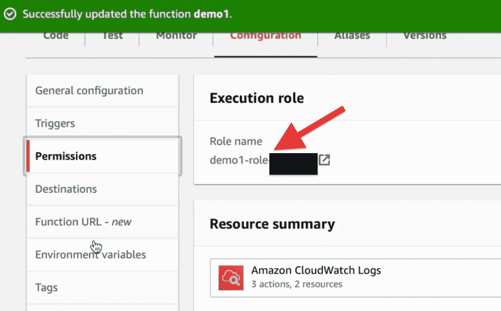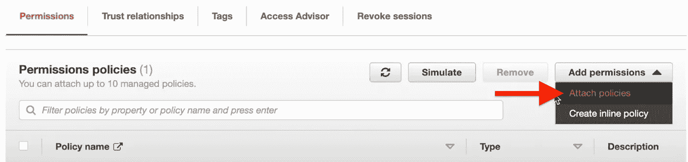

我们将给予 Lambda 函数对 SageMaker 的完全访问权:

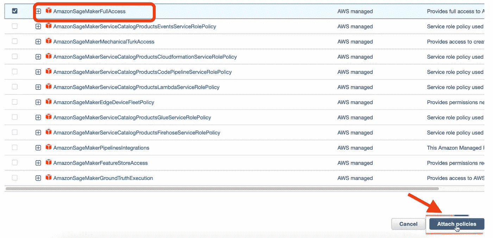

我们的 Lambda 函数现在知道**要调用哪个端点**，并且拥有**相应的权限**来这样做。是时候创建 REST API 了。

## 2.使用 API 网关创建一个 REST API

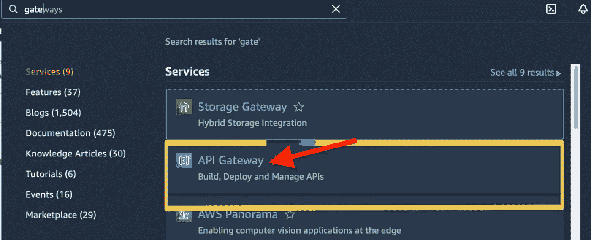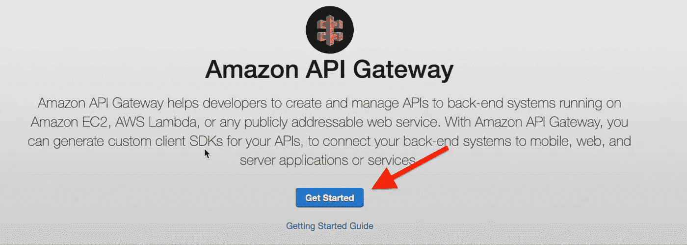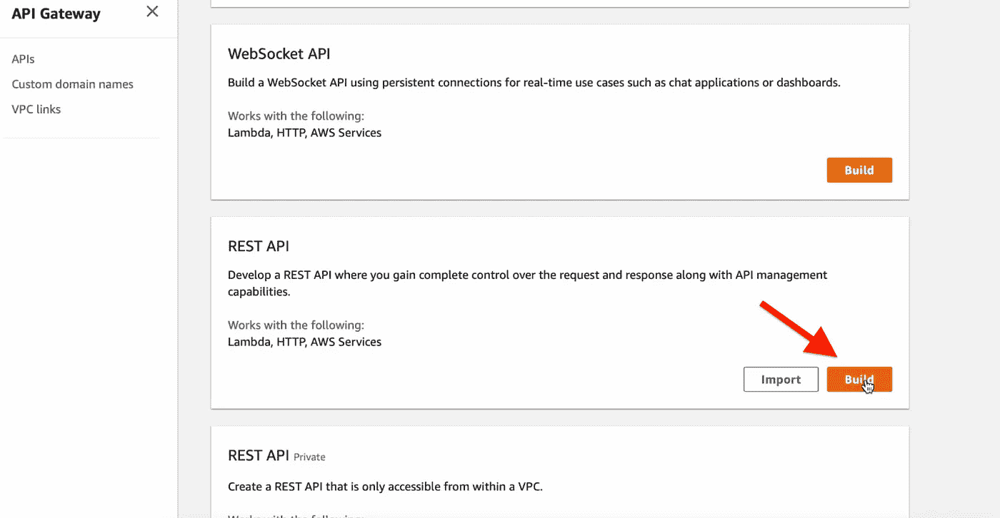

选择:

*   休息
*   新 API

给它一个**名称**，保留默认类型为**区域**和**点击:创建 API**

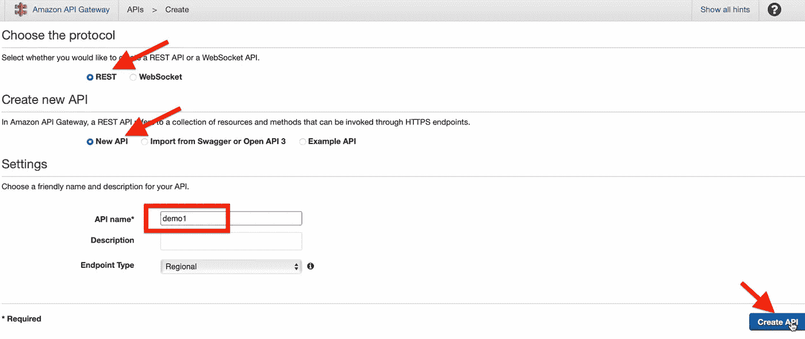

接下来，我们需要**创建资源**作为 REST API 的一部分:

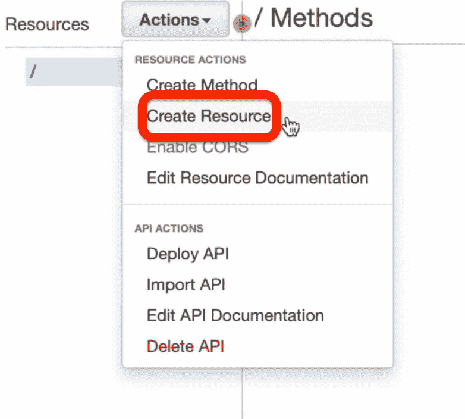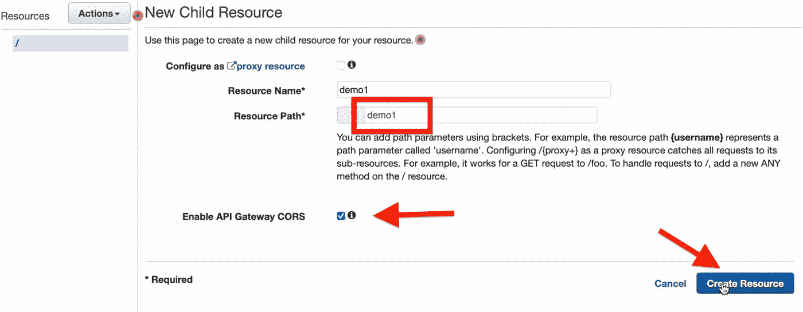

然后**创建方法**:

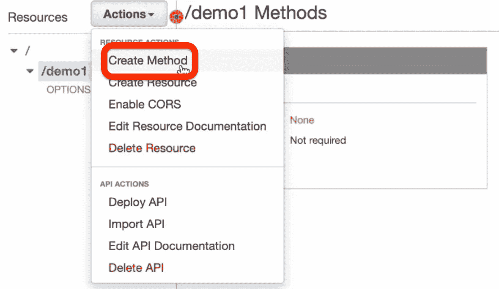

选择发布方法:

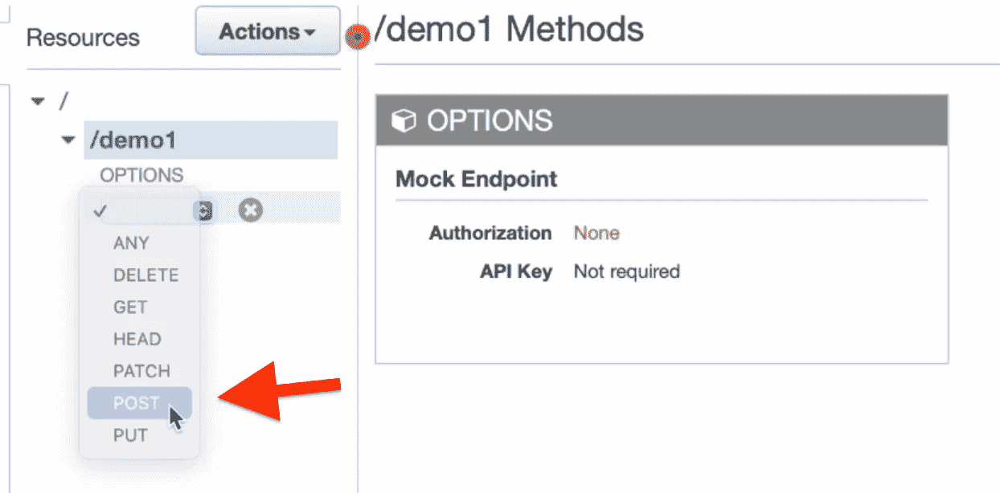

让我们将这个 REST API 指向我们在上一步中创建的 Lambda 函数(“demo1”):


现在我们将**部署 API**

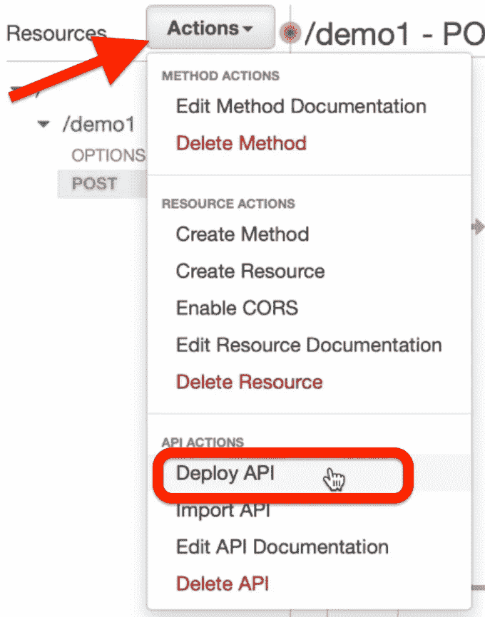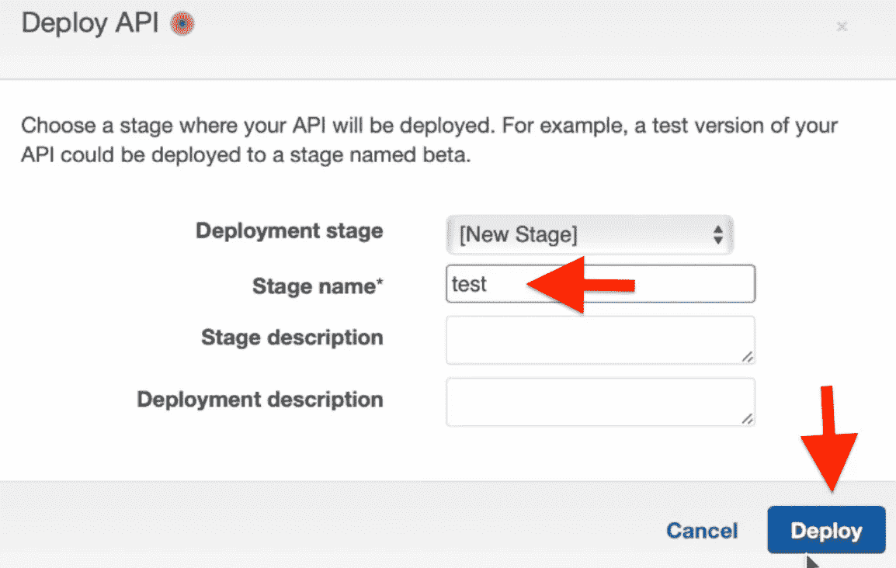

复制 REST API url:

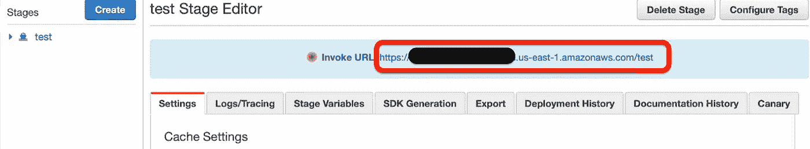

然后在发送请求时，确保将**方法名**(即 demo1)添加到复制的 API url 中

```
curl -X POST https://<Your_API_Gateway_REST_API>/test/demo1 -H 'Content-Type: application/json' -d '{"area":"300"}'**Output:**
"beagle"
```

## 最后的话

现在你知道了！现在，我们已经证明，我们的 SageMaker 模型已经成功地在互联网上公开，供每个人使用，如果我们有 React、Vue.js 或 Angular frontend 应用程序，它将能够提出类似的请求，并为用户提供完美的小狗推荐。

## 清理以停止产生成本！

> 1.通过在 Jupyter 笔记本中运行以下命令来删除已部署的端点

```
xgb_predictor.delete_endpoint()
```

> 2.停止 SageMaker 笔记本实例

> **感谢你的阅读，如果这篇文章帮你节省了时间或者解决了问题，一定要点击下面的按钮！总是非常感谢。**

## 图像来源

[1][https://commons . wikimedia . org/wiki/File:Beagle _ puppy _ cadet . jpg](https://commons.wikimedia.org/wiki/File:Beagle_puppy_Cadet.jpg)

[https://pxhere.com/en/photo/1003603](https://pxhere.com/en/photo/1003603)