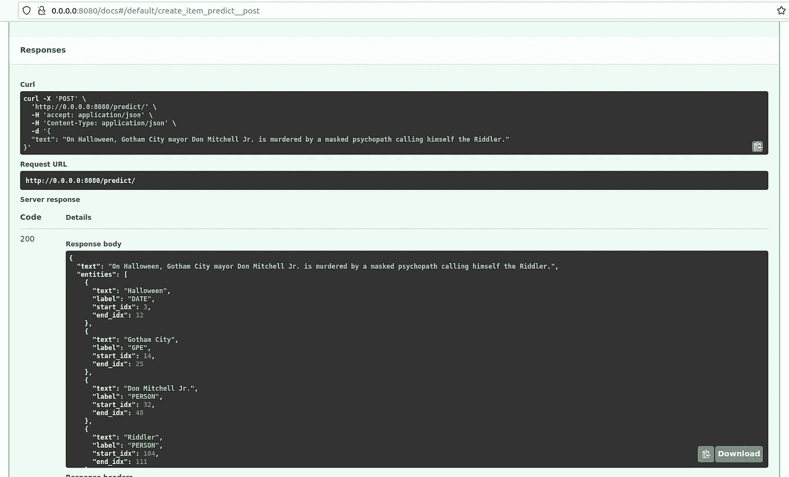
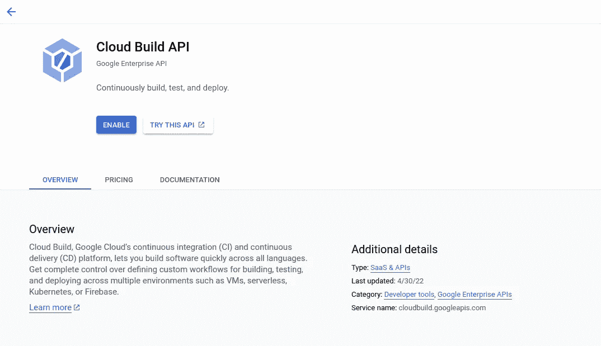
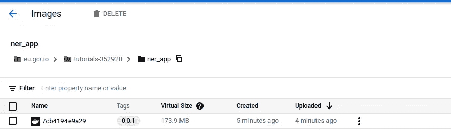
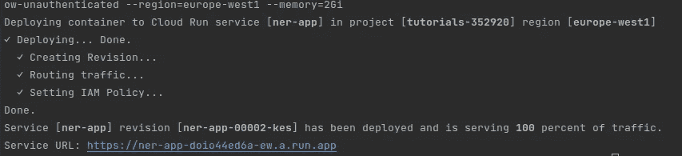
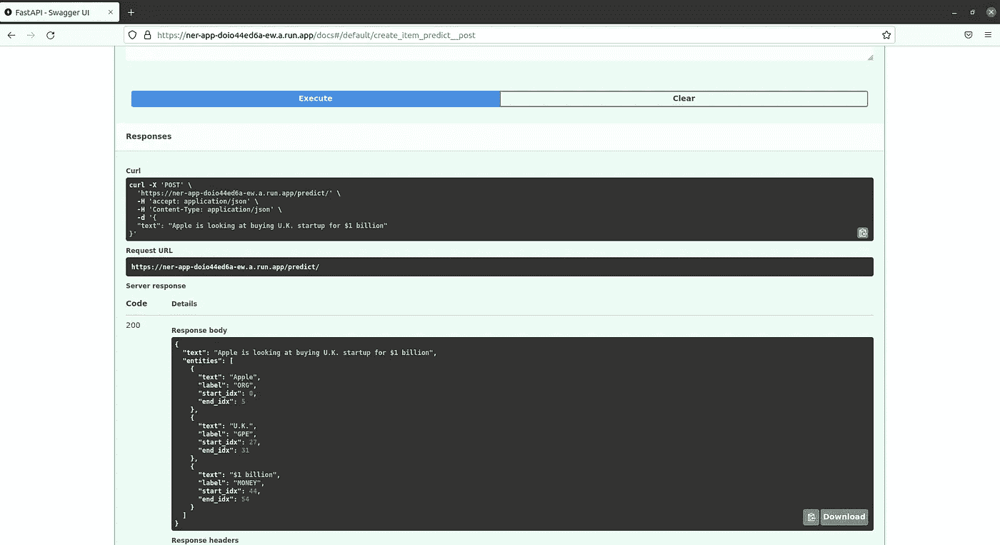
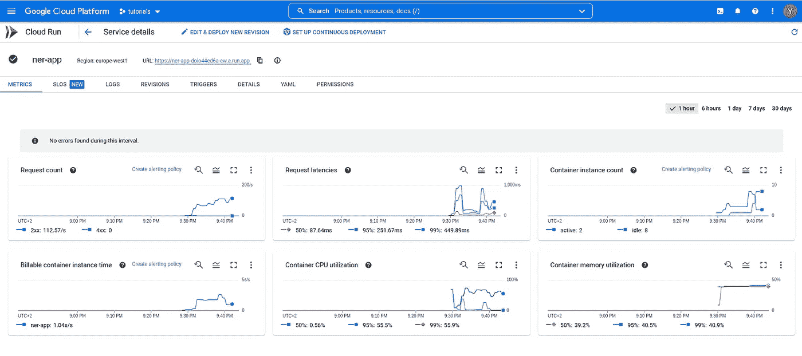
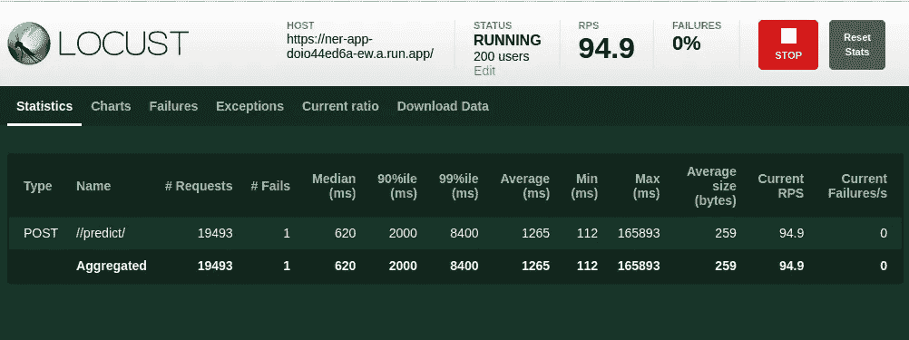

# 使用 GCP 的云在几分钟内将您的 ML 模型部署为 Web 服务

> 原文：<https://towardsdatascience.com/deploy-your-ml-model-as-a-web-service-in-minutes-using-gcps-cloud-run-ee9d433d8787>

## 使用 GCP 全面管理的无服务器服务分享您的 ML 模型


约翰-马克·史密斯在 [Unsplash](https://unsplash.com/backgrounds/colors?utm_source=unsplash&utm_medium=referral&utm_content=creditCopyText) 上的照片

模型部署是 ML 项目生命周期中的关键步骤。有多种方式可以做到这一点，无论是在批处理或流处理管道或作为一个 web 服务。最后一个选项是本文的重点，我们将部署一个 ML 模型到 Cloud run，这是 Google Cloud 提供的一个服务，用于以无服务器的方式部署应用程序。

在这篇文章中，我们将分三步从一个项目想法到一个部署的服务:

*   建立一个预测模型。
*   将模型打包成 dockerized 服务。
*   部署到 GCP。

这篇文章的代码可以在这里找到:【https://github.com/CVxTz/gcp_model_deploy_example 

# 构建模型

首先，我们需要设置我们的 Python 开发环境。
我更喜欢使用 Anaconda 来创建新的虚拟环境:

```
conda create --name gcp_model_deploy python==3.8
conda activate gcp_model_deploy
```

然后，为了管理项目依赖，我使用了**诗歌**。你可以在这里找到如何在你的系统上安装它:[https://python-poetry.org/docs/](https://python-poetry.org/docs/)。这是一个非常酷的工具，它可以帮助我们定义 python 项目的依赖性，同时避免 pip 的一些缺点，例如有限的依赖性冲突解决方案。

在克隆了上面链接的存储库并创建了虚拟环境之后，我们可以使用以下命令安装项目的所有依赖项:

```
poetry install
```

现在，由于这个项目的重点不是集中在模型部分，我们将使用来自 **SpaCy** 的预训练的 **NER** 模型来检测句子中的实体。我们将 SpaCy 和“ **en_core_web_md** ”模型添加到我们的诗歌依赖关系中，这样我们就可以将该模型应用于如下句子:

```
import spacy

NLP = spacy.load("en_core_web_md")

def predict_entities(text):

    doc = NLP(text)

    entities = [
        {
            "text": entity.text,
            "label": entity.label_,
            "start_idx": entity.start_char,
            "end_idx": entity.end_char,
        }
        for entity in doc.ents
    ]

    return entities
```

例如，对于这句话:

```
On Halloween, Gotham City mayor Don Mitchell Jr. is murdered by a masked psychopath calling himself the Riddler.
```

**预测函数**将返回以下内容:

```
[
    {
        "text": "Halloween",
        "label": "**DATE**",
        "start_idx": 3,
        "end_idx": 12
    },
    {
        "text": "Gotham City",
        "label": "**GPE**",
        "start_idx": 14,
        "end_idx": 25
    },
    {
        "text": "Don Mitchell Jr.",
        "label": "**PERSON**",
        "start_idx": 32,
        "end_idx": 48
    },
    {
        "text": "Riddler",
        "label": "**PERSON**",
        "start_idx": 104,
        "end_idx": 111
    }
]
```

我们现在已经完成了模型部分！

# 将模型打包成一个 dockerized 服务

## 该服务:

我们将把预测函数包装成一个 **FastApi** 端点。

```
@app.post("/predict/", response_model=Response)
def create_item(in_query: Query):
    entities = predict_entities(in_query.text)

    return Response(text=in_query.text, entities=[Entity(**x) for x in entities])
```

因此，要获得预测，我们只需要调用/predict/ endpoint。
本地运行 API 可以从项目根目录使用以下命令来完成:

```
poetry run uvicorn --app-dir ner_app app:app --host 0.0.0.0 --port 8080 --workers 2
```

或者运行“make run_app”

然后，我们可以在 [http://0.0.0.0:8080/docs](http://0.0.0.0:8080/docs) 访问 API 的 swagger 页面



下一步是将这个应用程序打包成 docker 映像，这样我们就可以在任何地方运行它。

## 码头工人:

我们将使用 **python:3.8-slim** 作为我们的基础映像，然后运行一个两阶段构建，以便最终得到一个更小的映像大小:

```
FROM python:3.8-slim as *builder* WORKDIR "/app"

ENV *PYTHONFAULTHANDLER*=1 \
    *PYTHONHASHSEED*=random \
    *PYTHONUNBUFFERED*=1

ENV *PIP_DEFAULT_TIMEOUT*=100 \
    *PIP_DISABLE_PIP_VERSION_CHECK*=1 \
    *PIP_NO_CACHE_DIR*=1 \
    *POETRY_VERSION*=1.1.13

RUN pip install "poetry==$*POETRY_VERSION*"
RUN python -m venv /venv

COPY pyproject.toml poetry.lock ./
COPY ner_app ner_app

RUN . /venv/bin/activate && poetry install --no-dev --no-root
RUN . /venv/bin/activate && poetry build

FROM python:3.8-slim as *final* WORKDIR "/app"

COPY --from=*builder* /venv /venv
COPY --from=*builder* /app/dist .
COPY ner_app ner_app

RUN . /venv/bin/activate && pip install *.whl

CMD ["/venv/bin/python", "-m", "uvicorn", "--app-dir", "ner_app", "app:app", "--host", "0.0.0.0", "--port", "5000", "--workers", "2"]
```

第一阶段构建 python 虚拟环境，第二阶段只是复制它并使用它来运行 API。

现在，我们可以使用以下内容构建映像:

```
docker build . -t ner_app:0.0.1
```

然后使用以下命令运行它:

```
docker run -p 5000:5000 -i -t ner_app:0.0.1
```

该应用程序可在 [http://0.0.0.0:5000/docs](http://0.0.0.0:5000/docs) 下载

# 部署到 GCP

## GCP 设置:

这里，我假设您已经有了一个 **GCP** 账户，您在那里创建了一个项目，并在您的开发环境中安装和验证了 **gcloud** CLI。

现在，我们需要激活 **cloudbuild** 功能，这样我们就可以轻松地构建 docker 映像并将其推送到 GCR (Google 容器注册表)。



您可以在 GCP 控制台中查找并启用该功能。这允许我们远程构建 docker 映像，然后将其推送到 GCR。

## 推送图像:

使用以下命令可以轻松构建映像并将其推送到 GCR:

```
PROJECT_ID := $(shell gcloud config get-value project)
HOSTNAME := eu.gcr.io
GCR_TAG := ${HOSTNAME}/${PROJECT_ID}/${APP_NAME}:${VERSION}
APP_NAME := ner_apprun_grc_build:
   echo "${GCR_TAG}"
   gcloud builds submit --tag ${GCR_TAG} -q
```

所以现在，我们可以运行“make run_grc_build”来构建并推送 dockerized API 到 GCP。

我们可以在这里找到我们推送的图像:



## 部署服务:

将服务部署到云运行也可以通过一个命令来完成:

```
PROJECT_ID := $(shell gcloud config get-value project)
HOSTNAME := eu.gcr.io
GCR_TAG := ${HOSTNAME}/${PROJECT_ID}/${APP_NAME}:${VERSION}
APP_NAME := ner_appcloud_run_deploy:
   gcloud run deploy ner-app --image=${GCR_TAG} \
--max-instances=2 --min-instances=0 --port=5000 \
--allow-unauthenticated --region=europe-west1 \
--memory=2Gi --cpu=4 -q
```

我们只需运行“make cloud_run_deploy ”,即可在不到一分钟的时间内将应用部署到云上。



Cloud run 是一种无服务器服务，所以如果没有流量，它可以缩小到零，在这种情况下，我们不必支付任何费用。这就是为什么我们把**最小实例=0** 。
该服务还可以根据 CPU 利用率自动扩展到 **x** 个实例。
我们还指定了一些其他参数，比如 memory=2Gi，因为默认值 512 Mib 不够用。

我们现在可以访问返回的 URL 来测试我们的 API:



Cloud run 还提供了一些有用的指标来监控您的 web 服务的健康状况:



注意:您可以使用 locust+GitHub 存储库中可用的 locustfile 对您部署的服务进行负载测试。



可以进一步调整部署配置，以改善 NER 应用程序的延迟和吞吐量。

# 结论

在这篇文章中，我们看到了如何使用 Cloud run 轻松地将机器学习模型部署到 Google 云平台。这项服务有助于降低模型部署的成本，因为我们只需为我们使用的服务付费，这对于负载变化很大的模型来说是一个很好的选择。

遵循教程的代码可以在这里找到:[https://github.com/CVxTz/gcp_model_deploy_example](https://github.com/CVxTz/gcp_model_deploy_example)

如果你有任何问题，欢迎在 Github 上发表评论或提出问题！