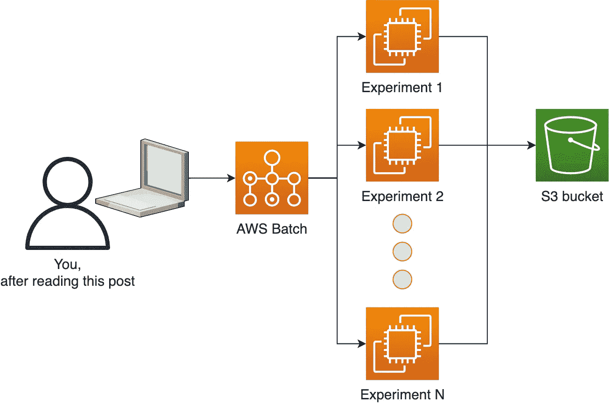
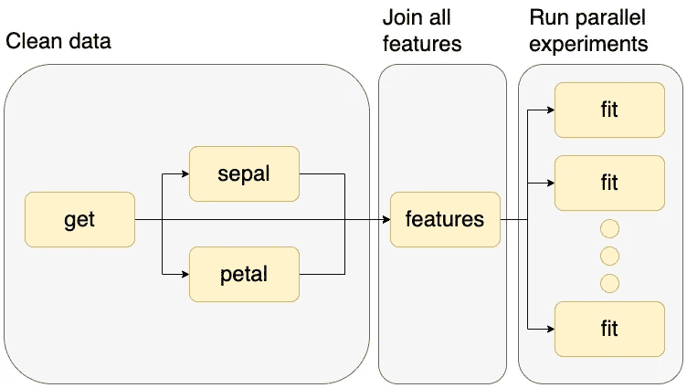

# 在 AWS 上部署数据科学平台:并行化实验(第三部分)

> 原文：<https://towardsdatascience.com/deploying-a-data-science-platform-on-aws-parallelizing-experiments-part-iii-774d972aabba>

## 数据科学云基础架构

## 使用开源软件在 AWS 上部署数据科学平台的分步指南


照片由[克里斯里德](https://unsplash.com/@cdr6934?utm_source=medium&utm_medium=referral)在 [Unsplash](https://unsplash.com?utm_source=medium&utm_medium=referral) 上拍摄

在我们之前的[帖子](/deploying-a-data-science-platform-on-aws-running-containerized-experiments-part-ii-bef0e22bd8ae)中，我们配置了 Amazon ECR 来将 Docker 映像推送到 AWS，并配置了一个 S3 桶来写入我们的数据科学实验的输出。

在这最后一篇文章中，我们将向您展示如何使用 [Ploomber](https://github.com/ploomber/ploomber) 和 [Soopervisor](https://github.com/ploomber/soopervisor) 来创建可以在 AWS 批处理上并行运行的实验网格，以及如何动态请求资源(CPU、RAM 和 GPU)。

> 嗨！我的名字是爱德华多，我喜欢写所有的东西。如果您想了解我的最新内容。在 [Medium](https://medium.com/@edublancas) 或 [Twitter](https://twitter.com/edublancas) 上关注我。感谢阅读！

这是我们建筑的样子:



平台的架构。图片作者。

# 使用`aws` CLI 进行身份验证

我们将再次使用`aws` CLI 来配置基础架构，因此请确保您已经过身份验证并且拥有足够的权限:

# 检查码头工人

这部分我们将使用 Docker，因此请确保它已启动并运行:

# 创建 Amazon ECR 存储库

首先，让我们创建另一个 ECR 存储库来托管我们的 Docker 映像:

**输出:**

将`REPOSITORY`变量赋给前面命令的输出:

# 获取示例代码

我们现在将获得一个示例项目。首先，让我们安装所需的软件包。

*注意:我们建议您在虚拟环境中安装它们。*

在`grid`目录下下载示例:

**输出:**

这下载了一个完整的项目:

**输出:**

我们下载的示例准备了一些数据，并并行训练了十几个机器学习模型，下面是一个图形表示:



我们工作流程的图形表示。图片作者。

让我们看一下`pipeline.yaml`文件，它指定了我们工作流中的任务:

**输出:**

`pipeline.yaml`是 Ploomber 用来描述计算工作流的一个接口(你也可以用 Python 来声明它们)。

任务部分包含五个条目，每个任务一个。前四个是处理一些输入数据的 Python 函数(`tasks.raw.get`、`tasks.features.sepal`、`tasks.features.petal`、`tasks.features.features`)，最后一个是适合一个模型的脚本(`scripts/fit.py`)。

注意，最后一个条目更长，因为它是一个网格任务:它将使用相同的脚本，并使用不同的参数执行多次。总的来说，该脚本将被执行 12 次，但这可能是一个更大的数字。

要了解更多关于`pipeline.yaml`文件和 Ploomber 的信息，[查看我们的文档](https://docs.ploomber.io/en/latest/api/spec.html)。

现在让我们将 AWS Batch 配置为我们的云环境(也支持 Kubernetes、SLURM 和 Airflow)。

# 配置项目以在 AWS 上运行

**输出:**

```
========================= Loading DAG =========================
No pipeline.aws-env.yaml found, looking for pipeline.yaml instead Found /Users/Edu/dev/ploomber.io/raw/ds-platform-part-iii/grid/pipeline.yaml.
Loading...
Adding /Users/Edu/dev/ploomber.io/raw/ds-platform-part-iii/grid/aws-env/Dockerfile...
============================= Done ============================
Fill in the configuration in the 'aws-env' section in soopervisor.yaml then submit to AWS Batch with: soopervisor export aws-env
Environment added, to export it:
$ soopervisor export aws-env
To force execution of all tasks:
$ soopervisor export aws-env --mode force
```

我们需要配置一些额外的东西，为了便于设置，我们创建了一个脚本，可以根据您的 AWS 基础架构自动执行这些任务，让我们下载它:

**输出:**

现在，为您想要使用的 AWS 批处理作业队列和工件存储桶设置值。(如果有疑问，您可能想重温以前的教程:[第一部分](/deploying-a-data-science-platform-on-aws-setting-up-aws-batch-part-i-da4a7566db7e)和[第二部分](/deploying-a-data-science-platform-on-aws-running-containerized-experiments-part-ii-bef0e22bd8ae))。

让我们生成配置文件，指定要使用的作业队列和 ECR 存储库来上传我们的代码:

**输出:**

现在，让我们指定 S3 客户端，以便将管道的输出上传到 bucket:

**输出:**

修改`pipeline.yaml`，使其使用我们在上一步中创建的客户端:

# 将项目上传到 ECR 存储库

让我们将我们的项目上传到 ECR:

**输出:**

确保`boto3`作为我们项目的一部分安装。我们需要上传到 S3:

# 在 AWS 批处理中执行作业

我们现在准备好安排我们的工作流程了！让我们使用`soopervisor export`命令构建 Docker 映像，将其推送到 ECR，并在 AWS 批处理上调度作业:

您可以在 [AWS 批处理控制台](https://us-east-1.console.aws.amazon.com/batch/home?region=us-east-1#jobs)中监控执行。或者使用下面的命令，只要确保您更改了作业名称。以下命令检索`fit-random-forest-1-gini`任务的状态:

**输出:**

几分钟后，所有的任务都应该执行了！

# 检查输出

让我们检查一下 S3 桶中的输出:

**输出:**

您可以看到这里有一个`.pickle`文件(经过训练的模型)`.csv`(经过处理的数据)和`.html`(从训练脚本生成的报告)的组合。

让我们下载其中一份报告:

**输出:**

打开`report.html`，你会看到训练脚本的输出！

# 请求更多资源

让我们来看看配置云环境的`grid/soopervisor.yaml`文件:

**输出:**

`soopervisor.yaml`文件指定要使用的后端(`aws-batch`)、默认使用的资源(`{memory: 16384, vcpus: 8}`)、作业队列、区域和存储库。

我们可以添加一个新的部分来指定每个任务的资源，以覆盖默认值:

# 结束语

在这最后一部分，我们展示了如何创建多步骤工作流，以及如何参数化脚本来创建可以并行运行的实验网格。现在，您有了一个可扩展的基础架构来运行数据科学和机器学习实验！

如果您需要帮助定制基础架构或想要分享您的反馈，请加入我们的[社区](https://ploomber.io/community)！

与我们的内容保持同步；在 [Twitter](https://twitter.com/ploomber) 、 [LinkedIn](https://www.linkedin.com/company/ploomber/) 或[上关注我们，订阅我们的时事通讯](https://www.getrevue.co/profile/ploomber)！

# 尾声:清理基础设施

下面是您需要运行的命令，以删除我们在这篇文章中创建的 ECR 存储库。要删除所有基础结构，请重新访问前面的教程。

**输出:**

*最初发布于*[*ploomber . io*](https://ploomber.io/blog/ds-platform-part-iii/)