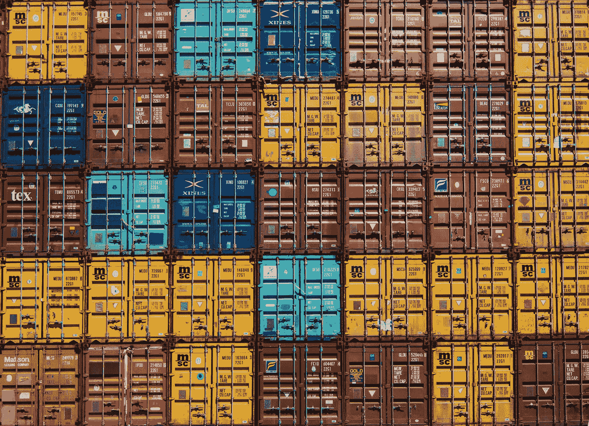

# 在 AWS 上部署数据科学平台:运行容器化实验(第二部分)

> 原文：<https://towardsdatascience.com/deploying-a-data-science-platform-on-aws-running-containerized-experiments-part-ii-bef0e22bd8ae>

## 数据科学云基础架构

## 使用开源软件在 AWS 上部署数据科学平台的分步指南



由 [Guillaume Bolduc](https://unsplash.com/@guibolduc?utm_source=medium&utm_medium=referral) 在 [Unsplash](https://unsplash.com?utm_source=medium&utm_medium=referral) 上拍摄的照片

在我们的[上一篇](/deploying-a-data-science-platform-on-aws-setting-up-aws-batch-part-i-da4a7566db7e)文章中，我们看到了如何配置 AWS 批处理，并通过执行一个启动容器、等待 3 秒钟然后关闭的任务来测试我们的基础设施。

在本文中，我们将利用现有的基础设施，但这一次，我们将执行一个更有趣的例子。

我们将通过构建一个容器并将其存储在 [Amazon ECR](https://aws.amazon.com/ecr/) 中来将我们的代码发送到 AWS，这是一个允许我们存储 Docker 图像的服务。

> 如果你想及时了解我的数据科学内容。在[媒体](https://medium.com/@edublancas)或[推特](https://twitter.com/edublancas)上关注我。感谢阅读！

# 使用`aws` CLI 进行身份验证

我们将再次使用`aws` CLI 来配置基础架构，因此请确保您已经过身份验证并且拥有足够的权限:

# **检查码头工人**

这部分我们将使用 Docker，因此请确保它已启动并运行:

**输出:**

# **创建亚马逊 ECR 存储库**

我们首先创建一个存储库，它将托管我们的 Docker 映像:

创建 ECR 存储库:

**输出:**

上面的命令将打印存储库 URI，将其赋给下一个变量，因为我们以后会用到它:

# **获取一些样本代码**

我们现在将使用两个开源工具( [Ploomber](https://github.com/ploomber/ploomberhttps://github.com/ploomber/ploomber) 和 [Soopervisor](https://github.com/ploomber/soopervisorhttps://github.com/ploomber/soopervisor) )来编写我们的计算任务，生成 Docker 映像，将其推送到 ECR，并在 AWS 批处理中调度一个作业。

让我们安装软件包:

注意:我们建议您在虚拟环境中安装它们。

我们来举个例子。这个例子训练和评估一个机器学习模型:

**输出:**

让我们看看文件:

**输出:**

该结构是典型的 [Ploomber](https://github.com/ploomber/ploomber) 项目。Ploomber 允许您轻松地将计算工作流组织为函数、脚本或笔记本，并在本地执行它们。要了解更多信息，请查看 Ploomber 的文档。

另一方面，[soobervisor](https://github.com/ploomber/soopervisor/)允许您导出一个 Ploomber 项目并在云中执行它。

下一个命令将告诉 Soopervisor 创建必要的文件，以便我们可以导出到 AWS 批处理:

**输出:**

```
===================Loading DAG===================
No pipeline.aws-env.yaml found, looking for pipeline.yaml instead
Found /Users/Edu/dev/ploomber.io/raw/ds-platform-part-ii/example/pipeline.yaml.
Loading... Adding /Users/Edu/dev/ploomber.io/raw/ds-platform-part-ii/example/aws-env/Dockerfile... 
===================Done===================
Fill in the configuration in the 'aws-env' section in soopervisor.yaml then submit to AWS Batch with: soopervisor export aws-env
Environment added, to export it: $ soopervisor export aws-env
To force execution of all tasks: $ soopervisor export aws-env --mode force
```

`soopervisor add`将创建一个`soopervisor.yaml`文件和一个`aws-batch`文件夹。

`aws-batch`文件夹包含一个`Dockerfile`(我们需要它来创建一个 Docker 映像):

**输出:**

`soopervisor.yaml`文件包含配置参数:

**输出:**

这里我们必须配置一些参数，我们创建了一个小脚本来生成配置文件:

*   `job_queue`:作业队列的名称
*   `aws_region`:您的 AWS 批处理基础设施所在的区域
*   `repository`:URI 集控室

以下是我的基础架构的价值(用您的替换):

*注意:如果您没有作业队列名称，您可以从* [*AWS 控制台*](https://us-east-1.console.aws.amazon.com/batch/home?region=us-east-1#queues) *获取(确保您在正确的区域)。*

让我们下载一个实用程序脚本来帮助创建配置文件:

**输出:**

创建`soopervisor.yaml`配置文件:

**输出:**

文件看起来是这样的:

**输出:**

现在让我们使用`soopervisor export`来执行 AWS 批处理中的命令。这样的命令将为我们做几件事:

*   构建 Docker 容器
*   将其推送到亚马逊 ECR 存储库
*   将作业提交给 AWS 批处理

我们需要安装`boto3`,因为它是向 AWS 批处理提交作业的依赖项:

通过 Amazon ECR 认证，这样我们就可以推送图片:

**输出:**

现在让我们导出项目。请记住，该命令需要几分钟时间:

如果一切顺利，您将看到类似这样的内容:

如果您在使用`soopervisor export`命令时遇到问题，或者无法推送至 ECR，请加入我们的[社区](https://ploomber.io/community)，我们将帮助您！

一旦命令执行完毕，作业将被提交给 AWS 批处理。让我们使用`aws` CLI 列出提交到队列的作业:

**输出:**

一分钟后，你会看到任务显示为`SUCCEEDED`(如果没有完成，会显示为`RUNNABLE`、`STARTING`或`RUNNING`)。

然而，有一个问题:AWS 批处理运行了我们的代码，但是不久之后，它关闭了 EC2 实例，因此，我们不再能够访问输出。

为了解决这个问题，我们将在项目中添加一个 S3 客户端，这样所有的输出都会被存储。

# **创建一个 S3 存储桶来存储输出**

让我们首先在 S3 创建一个桶。S3 桶名必须是唯一的，您可以在您的终端中运行以下代码片段，或者选择一个唯一的名称并将其赋给`BUCKET_NAME`变量:

**输出:**

创建存储桶:

**输出:**

# **向我们的管道添加客户端**

Ploomber 允许我们指定一个 S3 桶，它会负责为我们上传所有输出。我们只需要创建一个短文件。`generate.py`脚本可以为我们创建一个:

**输出:**

我们需要配置我们的`pipeline.yaml`文件，以便它上传工件到 S3。让我们使用`generate.py`文件，让它为我们做这件事:

此外，让我们将`boto3`添加到我们的依赖项中，因为我们将调用它来将工件上传到 S3:

# **授予 AWS 批处理权限以访问存储桶**

让我们将 S3 权限添加到 AWS 批处理任务中。生成策略:

**输出:**

应用它:

# **执行工作负荷**

我们现在准备在 AWS 批处理上执行我们的任务！

让我们确保我们能够推进 ECR:

**输出:**

再次提交任务:

注意，这一次，`soopervisor export`命令快了很多，因为它缓存了我们的 Docker 图像！

让我们检查任务的状态:

**输出:**

一分钟后，您应该会看到它是`SUCCEEDED`。

检查我们的 bucket 的内容，我们将看到任务输出(一个`.parquet`文件):

**输出:**

# **包装完毕**

在这篇文章中，我们学习了如何上传代码并通过 Docker 映像在 AWS 批处理中执行它。我们还配置了 AWS Batch 来读写 S3 存储桶。有了这种配置，我们可以开始以可扩展的方式运行数据科学实验，而不用担心维护基础架构！

在本系列的下一篇(也是最后一篇)文章中，我们将看到如何轻松地生成数百个实验并检索结果。

如果你想第一个知道最终部分什么时候出来；在 [Twitter](https://twitter.com/ploomber) 、 [LinkedIn](https://www.linkedin.com/company/ploomber/) 或[上关注我们，订阅我们的简讯](https://www.getrevue.co/profile/ploomber)！

# **尾声:清理基础设施**

如果你想删除我们在这篇文章中创建的基础设施，这里有一些命令。

删除 ECR 存储库:

**输出:**

删除 S3 存储桶:

**输出:**

*最初发布于*[*ploomber . io*](https://ploomber.io/blog/ds-platform-part-ii/)