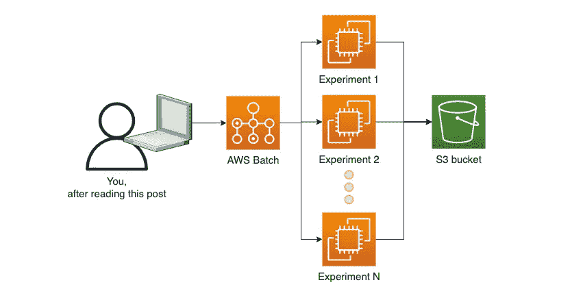
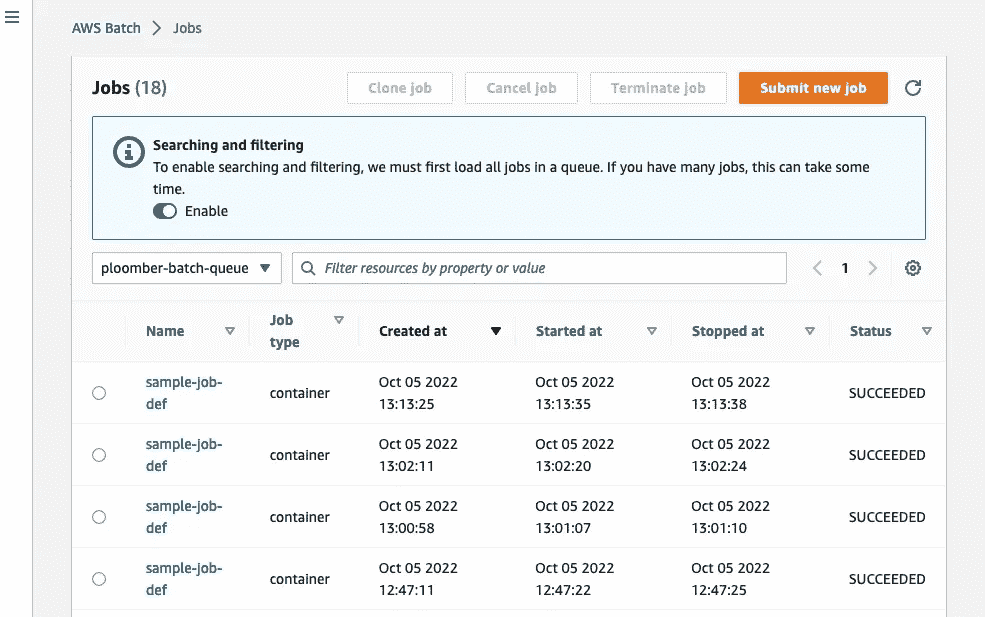

# 在 AWS 上部署数据科学平台:设置 AWS 批处理(第一部分)

> 原文：<https://towardsdatascience.com/deploying-a-data-science-platform-on-aws-setting-up-aws-batch-part-i-da4a7566db7e>

## 数据科学云基础架构

## 使用开源软件在 AWS 上部署数据科学平台的分步指南


你的笔记本电脑不够用，我们用云吧。由 [CHUTTERSNAP](https://unsplash.com/@chuttersnap?utm_source=medium&utm_medium=referral) 在 [Unsplash](https://unsplash.com?utm_source=medium&utm_medium=referral) 上拍摄的照片

在这一系列教程中，我们将向您展示如何使用 AWS 和开源软件部署数据科学平台。到本系列结束时，您将能够通过一个命令**向 AWS 可伸缩基础设施提交计算任务。**



我们将部署的数据科学平台的体系结构。图片作者。

# **什么是 AWS 批次？**



AWS 批处理控制台的屏幕截图，显示了我们最近的作业。图片作者。

为了实现我们的平台，我们将使用几个 AWS 服务。但是，中心的是 AWS Batch。

AWS Batch 是针对计算作业的托管服务。它负责维护作业队列、启动 EC2 实例、运行我们的代码和关闭实例。它根据我们提交的作业数量而上下调整。这是一个非常方便的服务，允许我们以可扩展的方式执行代码，并为计算密集型作业(例如，具有许多 CPU 和大内存的实例)请求定制资源，而不需要我们维护集群(不需要使用 Kubernetes！).

我们开始吧！

# 安装`aws`命令行界面

本教程的唯一要求是安装 AWS 命令行界面(以及有足够权限使用该工具的[访问键](https://docs.aws.amazon.com/cli/latest/userguide/getting-started-prereqs.html))。遵循[安装说明](https://docs.aws.amazon.com/cli/latest/userguide/getting-started-install.html)。如果您有问题，请在我们的[空闲时间](https://ploomber.io/community)寻求帮助。

验证您的安装(确保您运行的是版本 2):

**输出:**

然后使用您的访问密钥进行身份验证:

# 网络配置

我们需要为运行我们任务的 EC2 实例创建一个 VPC(虚拟私有云),这一部分包含了配置 VPC 所需的所有命令。

请注意，所有 AWS 帐户都有一个默认的 VPC。如果您想使用它，请确保您有想要使用的子网 id 和安全组 id，并跳过这一部分。

如果你需要帮助，请随时向我们询问关于 Slack 的任何事情。

让我们创建一个新的 VPC，并检索 VPC ID:

**输出:**

让我们将 ID 分配给一个变量，这样我们就可以重用它(用您的 ID 替换它):

现在，让我们创建一个子网并获取子网 ID:

**输出:**

并将 ID 赋给一个变量(用您的 ID 替换):

我们需要修改子网的配置，以便每个实例获得一个公共 IP:

现在，让我们配置互联网接入:

**输出:**

将网关 ID 分配给以下变量(用您的 ID 替换):

让我们将互联网网关连接到我们的 VPC:

该[文档](https://docs.aws.amazon.com/vpc/latest/userguide/vpc-subnets-commands-example.html)更详细地解释了上述命令。

请注意，允许实例访问互联网简化了网络设置。但是，如果您不希望 EC2 实例拥有公共 IP，您可以配置 NAT 网关。

现在，我们通过添加路由表来完成子网的配置:

**输出:**

分配路由表 ID(用您的 ID 替换):

让我们添加一个与我们的互联网网关相关联的路由:

**输出:**

并将该表与子网相关联:

**输出:**

最后，在我们的 VPC 中创建一个安全组:

**输出:**

并分配安全 ID(用您的 ID 替换):

# 配置权限

我们现在需要创建一个角色来允许 AWS Batch 调用 ECS(另一个 AWS 服务)。

下载配置文件:

**输出:**

创建角色:

**输出:**

创建实例配置文件:

**输出:**

将角色添加到实例配置文件:

附加角色策略:

# 配置计算环境

配置好网络和权限后，我们现在就可以配置计算环境了！

在 AWS Batch 中，计算环境决定了为我们的作业使用哪些实例类型。

我们创建了一个简单的脚本来生成您的配置文件:

**输出:**

运行脚本并传递子网和安全组 id:

**输出:**

您也可以编辑`my-compute-env.json`文件，将您的子网 id 放入`subnets`列表，将您的安全组 id 放入`securityGroupIds`列表。如果您需要针对您的计算环境进行更多定制，请加入我们的 [Slack](https://ploomber.io/community) ，我们将为您提供帮助。

创建计算环境:

**输出:**

为了提交作业，我们需要创建一个作业队列。该队列将接收作业请求，并将它们路由到相关的计算环境。

*注意:在运行下一个命令之前等待几秒钟，因为创建计算环境可能需要一点时间。*

下载文件:

**输出:**

创建作业队列:

**输出:**

让我们测试一下一切是否正常！

我们定义了一个等待几秒钟并完成的示例作业:

**输出:**

让我们向队列提交一个作业:

**输出:**

让我们确保工作成功执行。复制执行命令时打印的`jobId`,并将其传递给下一条命令:

**输出:**

第一次运行上述命令时，您很可能会看到:`RUNNABLE`，这是正常的。

AWS Batch 会启动新的 EC2 机器，并在您的工作完成后关闭它们。这很好，因为它可以防止机器空转，继续计费。然而，由于新机器每次都在旋转，这引入了一些启动时间开销。等待一分钟左右，再次运行该命令，您应该很快就会看到`STARTING`、`RUNNING`和`SUCCEEDED`。

如果超过几分钟后作业仍停留在`RUNNABLE`状态，请在我们的[社区寻求帮助。](https://ploomber.io/community)

# **收尾**

在这篇博文中，我们配置了 AWS Batch，这样我们就可以按需提交计算任务。不需要维护集群或者手动启动和关闭 EC2 实例。您只需为您提交的作业付费。此外，AWS Batch 是高度可伸缩的，因此您可以提交任意多的作业！

在下一篇文章中，我们将向您展示如何向 AWS Batch 提交一个自定义容器作业，并配置一个 S3 桶来读取输入数据和写入结果。

如果你想第一个知道第二部什么时候出来；在 [Twitter](https://twitter.com/ploomber) 、 [LinkedIn](https://www.linkedin.com/company/ploomber/) 或[上关注我们，订阅我们的简讯](https://www.getrevue.co/profile/ploomber)！

# 尾声:清理基础设施

除 EC2 使用外，使用 AWS 批处理不收费。但是，如果您想要清理您的环境，请遵循以下步骤。

禁用 AWS 批处理队列和计算环境:

**输出:**

更新计算环境:

**输出:**

您需要等待 1-2 分钟，让队列和计算环境显示为`DISABLED`。

删除队列和计算环境:

删除 VPC 及其组成部分:

删除 IAM 角色:

```
aws iam remove-role-from-instance-profile --instance-profile-name \ ploomber-ecs-instance-role \ --role-name ploomber-ecs-instance-role aws iam delete-instance-profile --instance-profile-name ploomber-ecs-instance-roleaws iam detach-role-policy --role-name ploomber-ecs-instance-role \
    --policy-arn arn:aws:iam::aws:policy/service-role/AmazonEC2ContainerServiceforEC2Roleaws iam delete-role --role-name ploomber-ecs-instance-role
```

# 关于作者

嗨！我叫爱德华多，我喜欢写关于数据科学的所有东西。如果您想了解我的最新内容。在[媒体](https://medium.com/@edublancas)或[推特](https://twitter.com/edublancas)上关注我。感谢阅读！

*最初发表于* [*ploomber.io*](https://ploomber.io/blog/ds-platform-part-i/)