# 用头盔在谷歌 Kubernetes 引擎上部署气流——第二部分

> 原文：<https://towardsdatascience.com/deploying-airflow-on-google-kubernetes-engine-with-helm-part-two-f833b0a3b0b1>

## 添加创建数据并将其写入 GCS 的 DAG

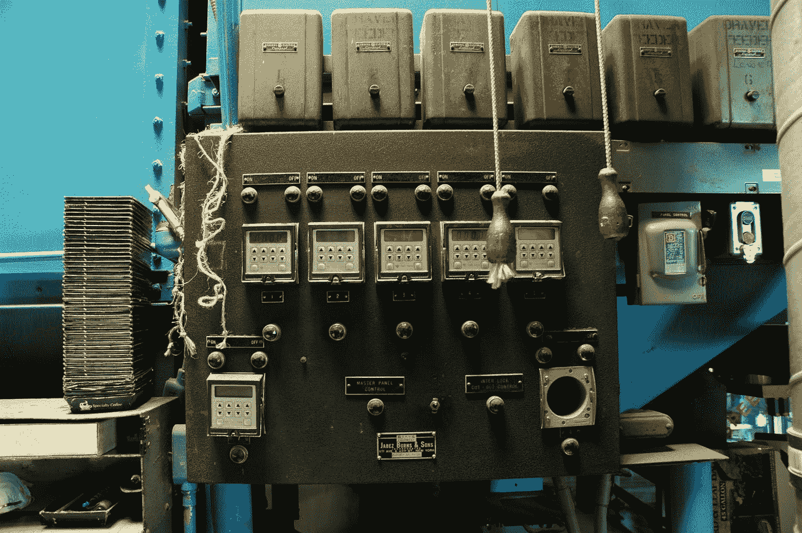

在 [Unsplash](https://unsplash.com?utm_source=medium&utm_medium=referral) 上 [Wonderlane](https://unsplash.com/@wonderlane?utm_source=medium&utm_medium=referral) 拍摄的照片

注意:这里是文章第一部分的[链接。](/deploying-airflow-on-google-kubernetes-engine-with-helm-28c3d9f7a26b)

# 介绍

在本文的第一部分中，我们获得了托管在 GKE 上的 Kubernetes 集群上的功能性气流部署。通过编辑 values.yaml 文件，我们让 GCP 为 Airflow web 服务器部署了一个负载平衡器，并用 LocalExecutor 替换了 CeleryExecutor。然而，我们还没有任何 Dag。这就是我们将在本文中重点讨论的内容。

具体来说，在第二部分，我们将学习如何:

1.使用 git-sync 特性从私有 GitHub 存储库中自动提取我们的 DAG。
2。通过从工件注册表中提取的 Docker 映像，为我们的 DAG 安装气流依赖项和自定义操作符。
3。将我们的 DAG 与谷歌云存储等 GCP 服务相集成。

在第二部分结束时，我们将使用 DAG 进行气流部署，该 DAG 使用自定义操作符创建数据并将其写入 GCS。

# 先决条件

除了第一部分中的先决条件之外，还应该安装和配置 Docker 以及“Docker”CLI。

# 关于目录结构的说明

本文假设您有一个私有 GitHub 存储库的本地和远程副本，目录结构如下:

*   我们的狗的目录。
*   一个目录“插件”,带有我们 DAG 中使用的自定义操作符。
*   带有“requirements.txt”的“Dockerfile”用于构建我们自己的气流 Docker 图像。
*   我们编辑的“values.yaml”文件，用于配置我们在 GKE 的气流部署。

# DAG 概述

我们将使用以下 DAG 测试气流部署:

它只有一个任务，创建如下所示的临时 JSON 文件:

然后将这个 JSON 文件写入 Google 云存储，进行长期存储。默认情况下,“ExampleDataToGCSOperator”不存在。这是一个从插件目录自动加载的自定义操作符[。稍后我们将看到如何将插件目录包含到我们的气流部署中。](https://airflow.apache.org/docs/apache-airflow/stable/plugins.html)

这是“ExampleDataToGCSOperator”的代码:

这个操作符如何工作的细节并不十分重要。但是请注意这个操作符是如何导入“GCSHook”的。这意味着我们需要在我们的气流部署中安装“Apache-air flow-providers-Google”Python 包。这也将在后面讨论。

# 1.将 DAG 添加到气流部署中

第一种简单的方法是向“Dockerfile”添加“COPY”命令，该命令将“dags”目录复制到在我们的部署中用于气流的 Docker 映像中。这种方法的缺点是，每次我们对 DAG 进行更改时，都必须重新构建和重新部署这个 Docker 映像。这是不方便的

我们将选择一种更好的方法，使用 [git-sync](https://airflow.apache.org/docs/helm-chart/stable/manage-dags-files.html#mounting-dags-from-a-private-github-repo-using-git-sync-sidecar) 从私有 GitHub 库中自动提取我们的 DAG。这个特性在 Kubernetes 上创建了一个额外的服务，将所有 Dag 从我们的 GitHub 存储库中的指定目录中提取到我们的 Airflow 部署中。默认情况下，拉入频率为 60 秒。

我们将假设我们的私有 GitHub 存储库对应于上面列出的目录结构。但是请注意,“dags”文件夹也可以在另一个私有的 GitHub 存储库中。

## 配置 git-sync

首先，我们需要为我们的私有存储库生成一个 SSH 密钥对。将 ssh-key 命名为“airflow-gke”。

输出应该类似于:

接下来，转到 GitHub 存储库中的“设置”，在“部署密钥”选项卡下，单击“添加部署密钥”。

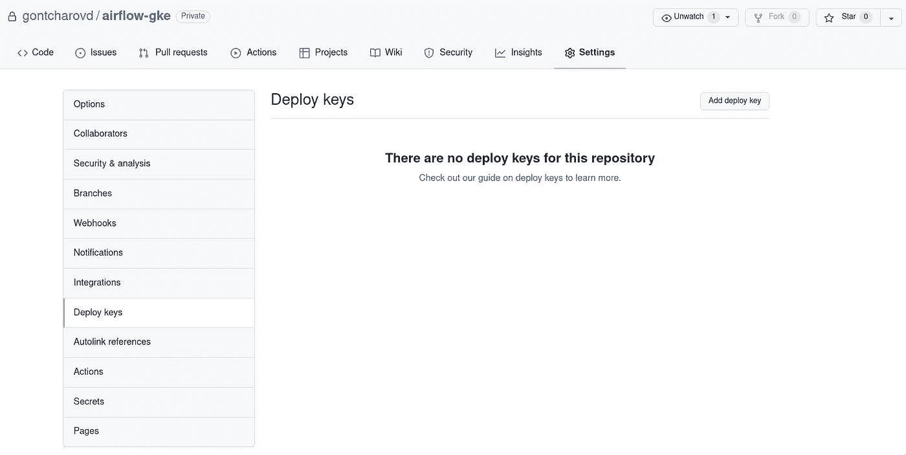

作者图片

将**公共**密钥从 airflow-gke.pub 复制到密钥字段:

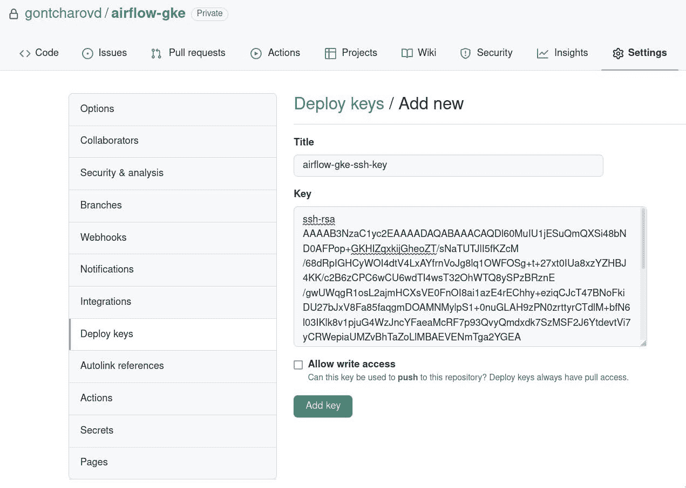

作者图片

您不需要选择“Allow write access ”,因为 git-sync 只会从该存储库中提取 Dag，而不会推送。

现在我们必须在舵图中启用 git-sync。与本文的第一部分一样，我们通过编辑 values.yaml 文件来配置 Helm 图表。转到 values.yaml 文件的第 1339 行。这是我们将配置 git-sync 的地方。

进行以下更改:

*   第 1340 行:将 enabled 设置为“真”。
*   第 1346 行:更新仓库的 URL。不要忘记用斜线代替冒号`:'，如第 1343 行所示。
*   将分支名称设置为“main ”(包含气流 Dag 的分支)。
*   将子路径更改为存储库中的正确路径。在我们的目录结构中，这对应于“Dag”。

现在我们必须添加**私钥**，它将被我们在 GKE 的气流部署用来从这个 GitHub 存储库中读取。取消对第 1381 行的注释，并用“airflow-gke-git-secret”替换该值。这将是我们稍后创建的 [Kubernetes Secret](https://kubernetes.io/docs/concepts/configuration/secret/) 的名称。

*注意，密钥必须是 base64 编码的，而我们之前创建的 SSH-key 不是。然而，GCP 会自动将我们的密钥转换为 base64。所以不要按照* [*气流文档*](https://airflow.apache.org/docs/helm-chart/stable/manage-dags-files.html) *这种情况！*

## 将 GitHub 私有 SSH 密钥添加为 Kubernetes 秘密

下面的命令从我们前面创建的私钥文件中创建 Kubernetes 秘密。确保将路径调整到您的私钥文件。

您可以通过浏览 Kubernetes 引擎上的“配置映射和机密”选项卡来检查是否成功创建了机密:

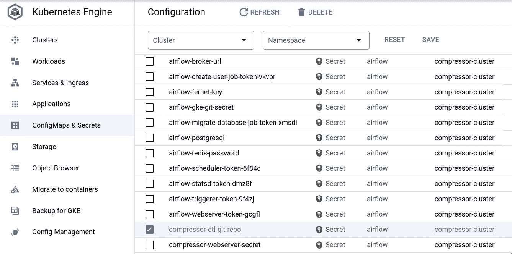

作者图片

最后，再次升级您的气流部署:

如果您对 git-sync 的工作原理感兴趣，可以运行以下命令:

请注意，现在调度程序有三个容器，而不是以前的两个。这个新的“sidecar”容器用于 git-sync。

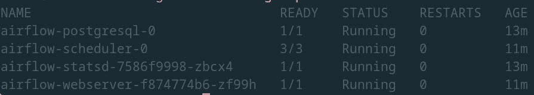

作者图片

# 2.为气流添加自定义 Docker 图像

如果您转到 Airflow UI 检查 DAG 是否可用，您将会看到以下错误:

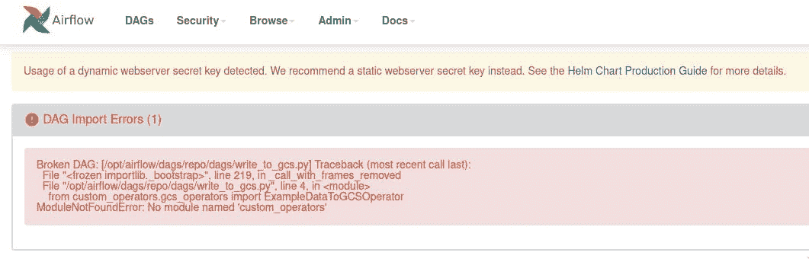

作者图片

这个错误告诉我们 DAG 确实是从 GitHub 库中提取的，但是它不能被导入，因为 Python 模块“custom_operators”在我们的 Airflow 部署中丢失了。这是有意义的，因为我们没有添加它。

要解决这个问题，我们必须在气流部署中注意两件事:

1.添加包含自定义操作符的插件目录。
2。安装“Apache-air flow-providers-Google”Python 依赖项，以便我们的自定义操作符可以导入“GCPHook”。

插件目录和 Python 依赖项都可以通过 Airflow 使用的 Airflow Docker 映像添加到我们的 Airflow 部署中。我们将为气流扩展基本图像，并将其推送到 GCP 上的工件注册表。然后，我们将配置头盔使用此图像的气流。

## 配置 GCP 工件注册表

首先，我们必须通过点击“enable”来启用 GCP 上的工件注册 API。

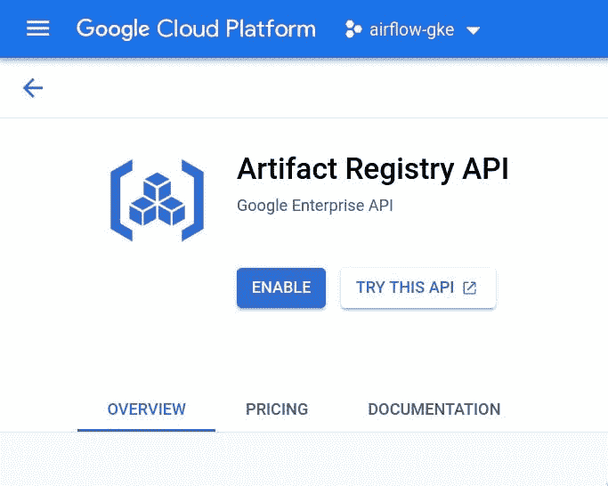

作者图片

以下命令允许“docker”CLI 根据我们将在 GCP 上创建的 Docker 存储库进行身份验证:

接下来，我们在 GCP 项目的工件注册中心创建一个 Docker 存储库:

收到此消息时，请回复“y ”:

> 项目[1077449300737]中未启用 API[artifactregistry.googleapis.com]。是否要启用并重试(这将需要几分钟时间)？
> (y/N)？

我们可以在工件注册表上查看我们新创建的 Docker 存储库:

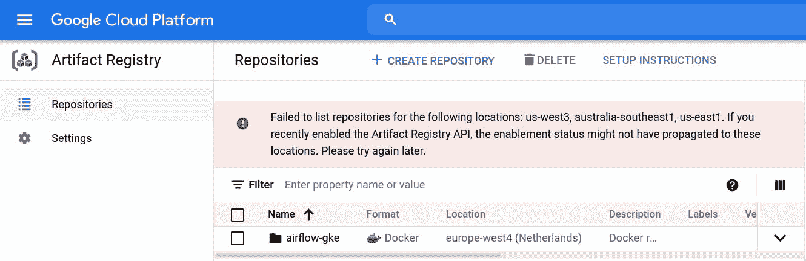

作者图片

## 为气流创建新的 Docker 图像

现在，我们可以基于“apache/airflow:2.2.1”映像创建一个新的 Docker 映像。下面的 docker 文件将插件目录和 requirements.txt 文件复制到“＄{ air flow _ HOME }”目录。

requirements.txt 文件包含 Python 依赖项，该依赖项包含“GCPHook”及其版本:

我们现在可以使用以下命令构建这个映像:

请注意，图像名称具有非常特殊的结构。这对于将它推送到工件注册中心的正确 Docker 存储库是必要的。让我们来看看它的各个部分:

*   ` europe-west4-docker.pkg.dev '是指 docker 注册表的区域。
*   “气流-gke-338120”是这个 GCP 项目的项目 ID。注意，对你来说会有所不同。
*   “airflow-gke”是我们在 Artifact Registry 上给 Docker 存储库起的名字。
*   “airflow-plugins-dependencies”是 Docker 图像的名称。
*   “1.0.0”是 Docker 图像的标签。

使用类似的命令将创建的映像推送到工件注册表:

这个图像现在可以在 GCP 用户界面的工件注册表中看到:

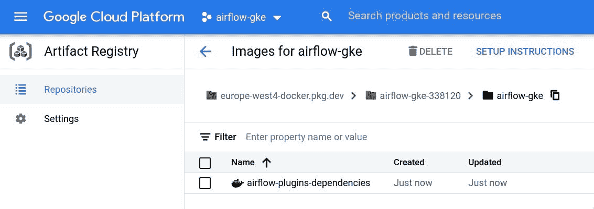

作者图片

## 更新 Airflow Docker 图像

我们现在可以从工件注册表中提取这个 Docker 图像，将其用作部署中气流的图像。第 48–53 行允许我们指定气流使用哪个 Docker 图像，而不是舵图中包含的默认图像。使用我们图像的名称和标签更新条目，如下所示:

再次升级气流部署:

我们现在可以在气流界面中看到我们的 DAG。

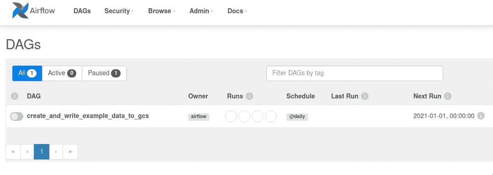

作者图片

# 3.配置 GCS

剩下的最后一步是将 GCS 集成到我们的气流部署中，以便我们的定制运营商可以将其数据写入一个桶中。我们将这个存储桶命名为“示例-数据-存储桶”。当我们的定制操作员执行“GCSHook”时，一个请求被发送到 GCP。这需要认证。有几种方法可以启用身份验证。在本文中，我们将依靠一个 [GCP 服务帐户](https://cloud.google.com/iam/docs/service-accounts)来完成这项工作。现在，我们将为我们的项目创建这个服务帐户，并授予适当的权限来写入 GCS。一个好的做法是不要给你的服务帐户比完成任务严格需要的更多的权限。

## 创建 GCP 服务帐户

在 GCP 用户界面中，浏览至“IAM & Admin ”,然后浏览至“服务帐户”。点击“创建服务帐户”。

作者图片

将其命名为“airflow-gke ”,然后单击“创建并继续”。接下来，选择产品“云存储”，并分配“存储对象管理员”的角色。这使得服务帐户可以完全控制 GCS 对象。单击“继续”和“完成”(我们不需要授予用户访问此服务帐户的权限)。

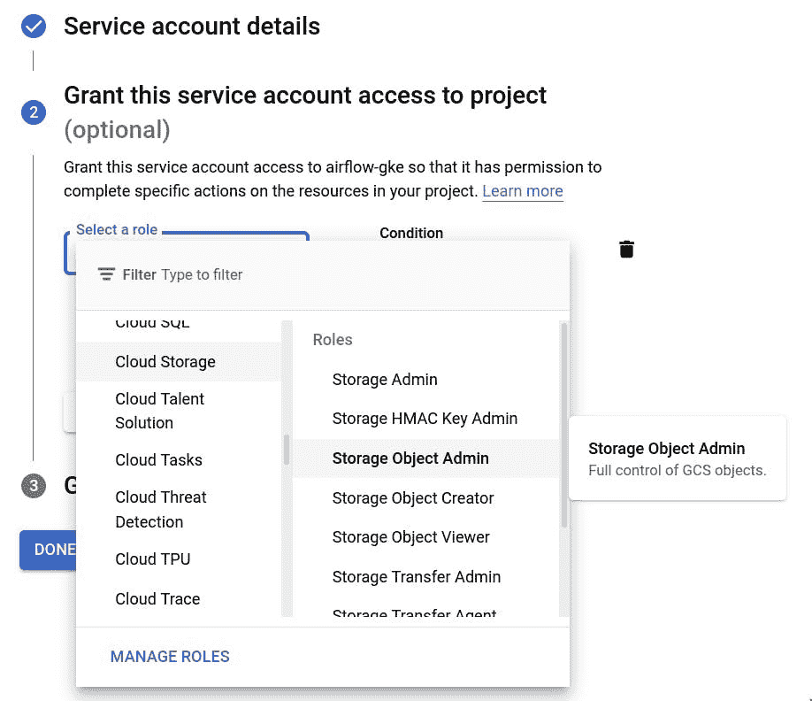

作者图片

现在，我们必须创建一个密钥文件，该文件将存储在任务用来针对 GCP 进行身份验证的气流连接中。选择“airflow-gke”服务帐户，并在“操作”选项卡下点击“管理密钥”。点击“添加密钥”和“创建新密钥”。密钥类型应该是 JSON。密钥将被下载到您的计算机上。

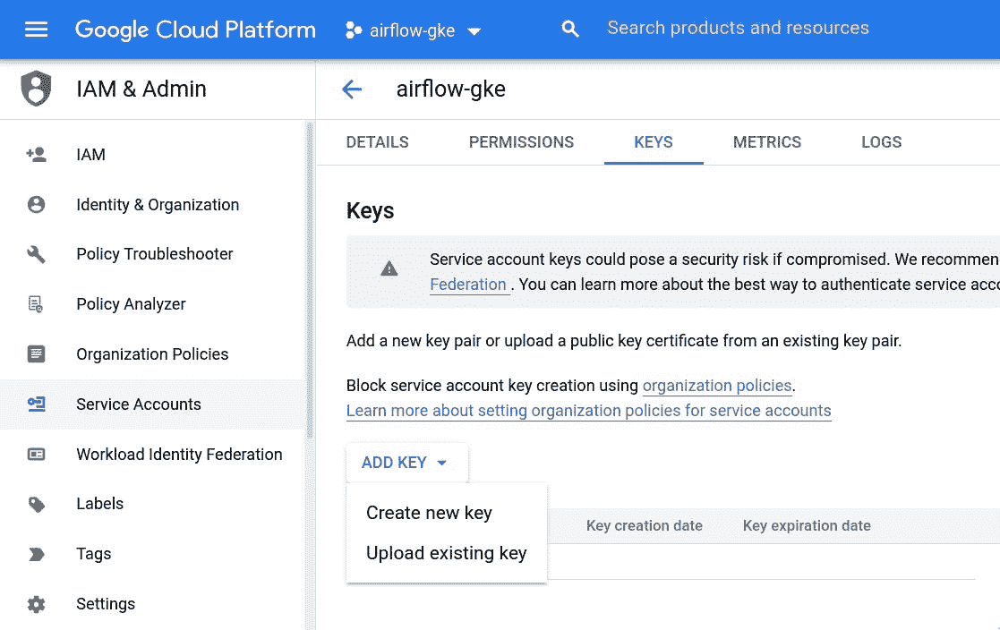

作者图片

## 创建气流连接

理想情况下，我们将通过来自 Kubernetes [ConfigMap](https://kubernetes.io/docs/concepts/configuration/configmap/) 的环境变量来创建这个气流连接。但是这种讨论会使我们偏离本文的目标太远。我们将通过气流 UI 手动完成。

在 Airflow UI 中，浏览至“管理”选项卡，然后浏览至“连接”。单击蓝色加号图标。

*   连接 Id `airflow _ gke _ gcs _ conn _ id ”,以便它对应于 DAG 中“create_and_write_example_data”任务的“gcp_conn_id”参数。
*   连接类型应该是“谷歌云”。
*   将我们之前下载的服务帐户密钥文件的全部 JSON 内容复制到 Keyfile JSON 字段中。
*   “项目 ID”字段应包含您的 GCP 项目的项目 Id。
*   将范围字段留空。

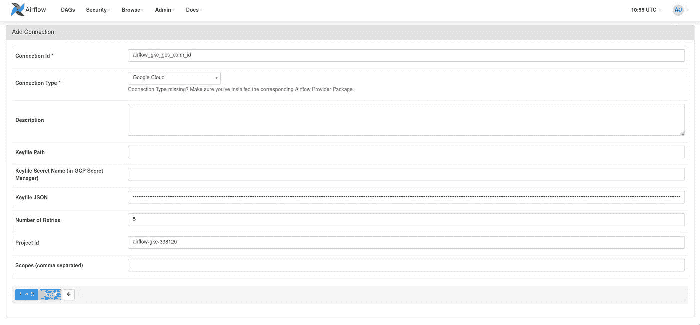

作者图片

## 创建 bucket Google 云存储

我们现在必须在 GCS 中创建“示例数据桶”。导航到 GCP 用户界面上的“云存储”，然后单击“创建存储桶”。

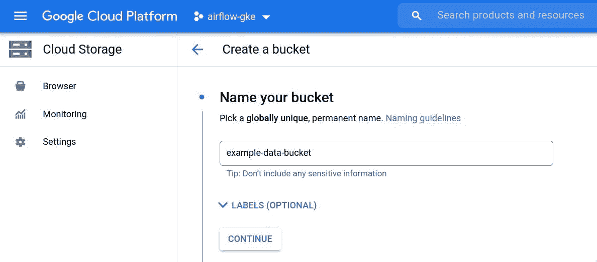

作者图片

多次点击“继续”(默认值就可以了)，最后点击“创建”。

# 4.运行 DAG。

现在转到 Airlfow UI 并激活 DAG。DAG 现在应该成功运行:

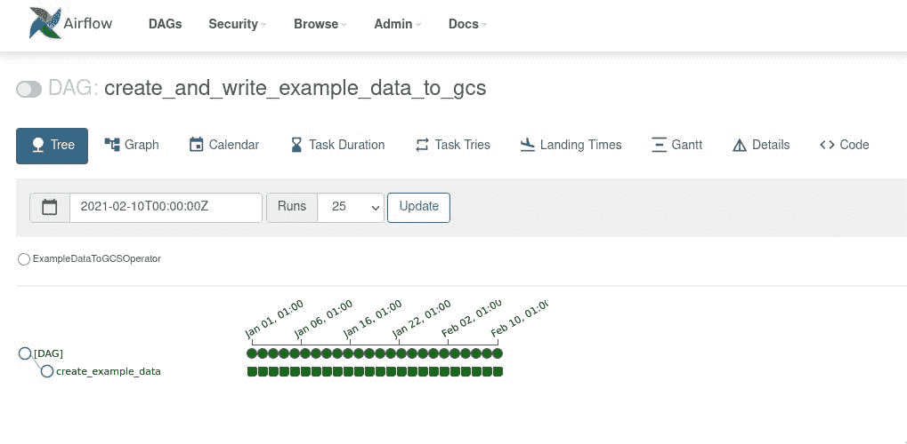

作者图片

通过浏览 GCP 用户界面上的“云存储”，我们可以在 example-data-bucket 中看到示例数据 JSON 文件。

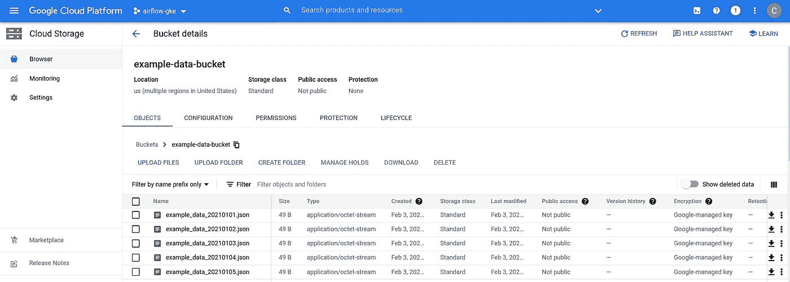

作者图片

# 结论

在这篇由两部分组成的文章的最后，我们现在有了一个功能完整的气流部署，它带有一个与 GCS 交互的 DAG。多亏了 git-sync 特性，我们可以通过将更改推送到私有的 GitHub 存储库来更新我们的 DAG。这些变化将自动纳入我们的气流部署。然而，如果我们想要编辑我们的自定义操作符或者添加新的 Python 依赖项，我们将不得不为 Airflow 构建并推送一个新版本的 Docker 映像。

*我希望您喜欢这篇由两部分组成的文章！如果你有任何问题或遇到任何问题，请在评论中告诉我。*