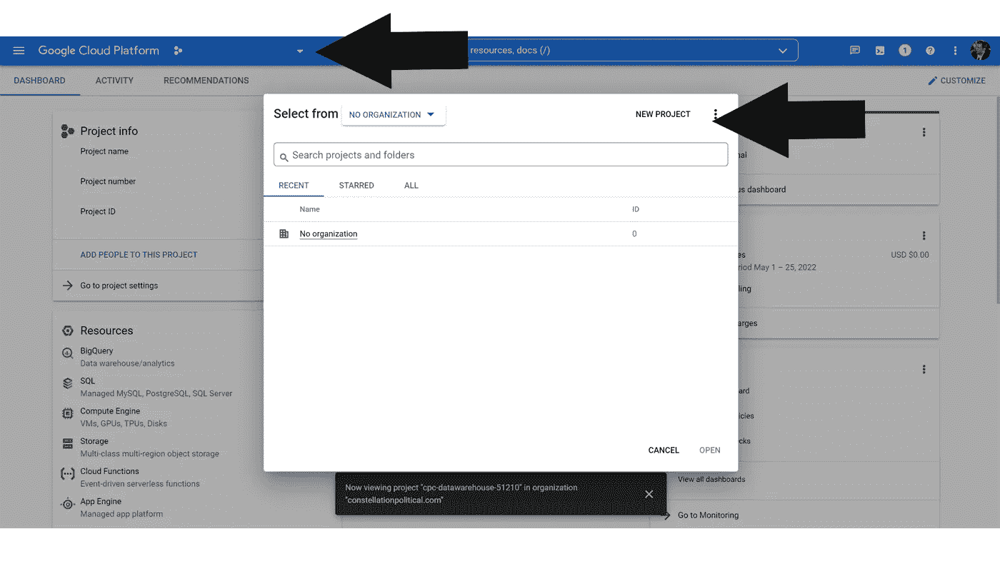
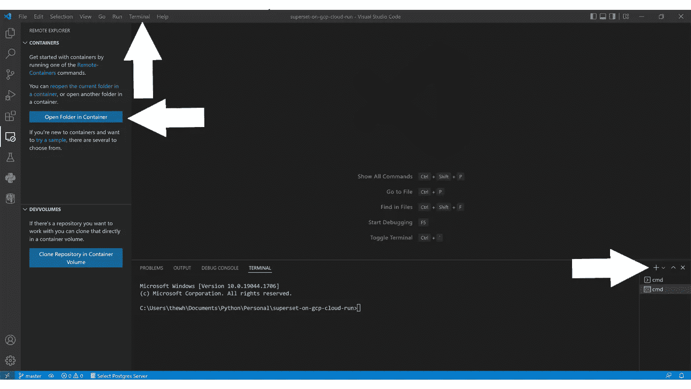

# 在 Google Cloud Run 上部署 Apache 超集

> 原文：<https://towardsdatascience.com/deploying-apache-superset-on-google-cloud-run-4e8f9b85a78a>

照片由[伊萨贝尔·🇺🇦](https://unsplash.com/@peacelily234?utm_source=medium&utm_medium=referral)在 [Unsplash](https://unsplash.com?utm_source=medium&utm_medium=referral) 上拍摄

## 数据科学

## 在几分钟内完成概念验证

Apache Superset 是一个强大的开源仪表板工具。但是，设置可能很麻烦。我将一步一步地带你通过它。

## 介绍

本指南依赖于附带的 GitHub 库，可以在这里找到[。](https://github.com/bengen343/superset-on-gcp-cloud-run)

概括地说，我们将使用这个存储库来:

*   在本地 VS 代码开发容器中设置超集。
*   我们不会在本地创建超集配置数据库，而是将开发容器指向 Google Cloud Platform 中的 SQL 数据库，我们将使用它来支持最终的部署。
*   使用我们的本地部署来配置 GCP SQL 数据库。
*   一旦谷歌云数据库配置完毕，我们将在谷歌工件注册中存放一个容器映像。
*   从工件注册容器创建 Google Cloud Run 服务。

该存储库包含:

*   `.devcontainer`:包含将创建 VS 代码开发容器的文件的文件夹。
*   `setup-scripts`:包含 shell 脚本集合的文件夹，用于设置和配置谷歌云平台(GCP)服务。这些脚本可以根据您的需要定制，但是它们不需要任何定制，因为它们依赖于您将在`.env.template`中设置的 VS 代码开发容器中的环境变量。
*   `src`:包含构建 Google Cloud Run 服务的文件的文件夹。
*   `.env.template`允许您为您的部署设置环境变量的值。

> 如果您觉得本指南有用和/或您对更详细的入门指南感兴趣，请 [**在 Medium**](https://medium.com/@bengen) 上跟随我。

## **先决条件**

执行上述步骤需要:

1.  [Docker 桌面](https://www.docker.com/)
2.  [Visual Studio 代码](https://code.visualstudio.com/)

*   [远程容器](https://marketplace.visualstudio.com/items?itemName=ms-vscode-remote.remote-containers)扩展

3.[谷歌云 CLI](https://cloud.google.com/sdk/docs/install)

下面列出的所有 shell 命令/脚本都要从 VS 代码开发容器中的终端*执行，这一点非常重要。*

按照显示的顺序安装上述每个必备组件。Visual Studio 代码、远程容器扩展和 Google Cloud CLI 都很容易安装。明确遵循 Docker 安装说明！ Docker 本身有许多先决步骤。如果你还没有安装 Docker，请注意安装步骤。

**如果您在以下步骤中遇到错误，很可能是因为您没有正确执行必要的安装步骤。**

## **入门**

1.一旦你完成了先决条件的安装，将库克隆到你的机器上。不要从`superset-on-gcp-cloud-run`重命名存储库根文件夹。

2.将文件`./.env.template`重命名为`./.env`，并在记事本或其他文本编辑器中打开该文件。让它保持打开，直到指示保存并关闭它。我们将在下一节填充一些需要的值。

## **配置谷歌云**

## **项目创建**

如果你还没有为此建立一个谷歌云项目，你需要创建一个。所以，来看看谷歌云平台的网络界面— [谷歌云控制台](https://console.cloud.google.com/)。

从“Google Cloud Platform”文本左上方的下拉列表中，可以轻松选择或创建项目。创建项目后，请确保您正在其中工作，方法是确保正确的项目名称出现在您刚刚选择的下拉列表旁边。

谷歌云控制台——项目选择和创建

确保对您创建的项目启用计费。

1.  在顶部搜索栏中键入' *Billing* '并选择该选项。
2.  您应该会收到一个通知，告知您该项目没有计费帐户。选择**链接一个计费账户**。
3.  选择(或创建)您的付费帐户。

确保`./.env`中的`GOOGLE_CLOUD_PROJECT`变量被设置为匹配您为项目名称选择的任何内容。注意，这个值也需要用在`SUPERSET_CONNECTION_NAME`和`SUPERSET_CONECTION_SECRET`变量中，所以现在也要替换那些字符串的那部分。

## **配置谷歌同意屏幕**

我们的部署旨在允许来自基于 Google 的组织的任何用户访问超集。换句话说，如果他们的电子邮件包含“@yourorganization.com”，他们就可以登录。为此，在继续之前，我们需要在 Google Cloud 控制台中配置一些东西。

1.  从谷歌控制台主页键入“APIs &服务”并选择该部分。
2.  从左侧菜单中选择“ **OAuth 同意屏幕**”。
3.  选择“内部”并点击**创建**。
4.  设置以下字段。所有这些都可以由您自行决定，但请注意'*授权域*'将决定访问权限，因此请确保这是您组织的正确顶级域。

*   应用名称
*   用户支持电子邮件
*   授权域
*   开发者联系信息

5.点击**保存并继续**。

6.点击**添加或删除范围**按钮。

7.选择' *openid'* 范围，点击**更新**。

8.点击**保存并继续**。

9.点击**返回仪表板**按钮。

## **创建凭证**

1.  从“*API&服务*”屏幕的左侧菜单中选择**凭证**。
2.  点击**+创建凭证** > **OAuth 客户端 ID** 。
3.  将**应用类型**下拉框设置为“ *Web 应用*，并选择您喜欢的“*名称*”。
4.  点击**创建**。
5.  *您的客户 ID* 和*您的客户机密*将在弹出窗口中显示。记下这些值，并将它们复制到`./.env`文件中各自的变量:`GOOGLE_CLIENT_ID`和`GOOGLE_CLIENT_SECRET`。注意前导/尾随空格。明智的做法是**也下载 JSON** 。你应该不需要，但以防万一。

## **环境变量**

确保这个库附带的`./.env`文件中的所有变量现在都有赋值。保存并关闭`./.env`文件。

## **打开本地开发容器**

1.  确保 Docker 正在运行并在您的机器上打开，然后打开 VS 代码。
2.  在 VS 代码中，从左侧导航栏中选择**远程浏览器**图标，打开“*远程容器*扩展。
3.  选择**打开容器**中的文件夹按钮，选择包含整个[资源库](https://github.com/bengen343/superset-on-gcp-cloud-run) : `superset-on-gcp-cloud-run`的文件夹。在下载依赖项和构建容器的过程中，此步骤可能需要 5-10 分钟。当容器完全构建后，文件树应该显示在左窗格中。
4.  从顶部 VS 代码菜单中选择**端子** > **新建端子**打开端子面板。
5.  在终端中输入命令`printenv`并按回车键。这将打印出容器中所有环境变量的列表。浏览以确保那些在`./.env`中定义的变量显示正确的值。如果他们没有仔细检查文件，保存它，并重新构建容器。如果有不准确的地方，你将无法继续。

VS 代码—集装箱和码头控制

## **配置谷歌云平台基础设施**

1.  通过终端输入命令`gcloud auth login`登录 Google cloud。因为容器没有与外界连接，所以它会生成一个命令，您需要将这个命令复制到在容器外运行的 Google Cloud SDK 中。所以，在你的机器上打开 Google Cloud SDK Shell，从 VS 代码终端粘贴命令。这将打开一个浏览器窗口，请求您授权继续。使用部署超集的同一个域的 Google 帐户授予它访问权限。
2.  将 Google Cloud SDK 的结果复制并粘贴回 VS 代码终端。如果成功，您应该会收到一条消息，提示“*您现在以…* 的身份登录”
3.  通过输入命令`gcloud config set project $GOOGLE_CLOUD_PROJECT`切换到您之前设置的 Google Cloud 项目，这将利用定义您之前应该设置的 Google Cloud 项目名称的环境变量。如果成功，终端应该返回'*更新的属性[核心/项目]。*’
4.  通过在 VS 代码终端中键入`setup-scripts/enable_gcp_services.sh`来启用项目中我们需要的各种 Google 云服务。

> 一些用户报告了在尝试运行这些 shell 脚本时出现“权限被拒绝”的错误。如果您遇到这种情况，只需通过键入`chmod u+x setup-scripts/enable_gcp_services.sh`来允许自己执行该脚本。这将授予您对指定脚本的执行权限。

## **创建超集配置 SQL 数据库**

1.  通过在 VS 代码终端中键入`setup-scripts/setup_sql.sh`，从这个存储库中运行`setup_sql.sh`脚本，在 Google Cloud 中创建超集 SQL 数据库。

## **设置机密&服务账户**

你的云运行服务将从 GCP [秘密管理器](https://console.cloud.google.com/security/secret-manager)获取秘密。这些秘密都将根据您在`./.env`文件中设置的值来创建。

1.  通过`entering setup-scripts/create_gcp_secrets.sh`在 VS 代码终端运行`create_gcp_secrets.sh`脚本。
2.  我们还需要为 Superset 创建一个服务帐户，并授予它访问我们刚刚创建的秘密以及我们将依赖的各种服务的权限。在 VS 代码终端中运行`setup-scripts/create_gcp_service_account.sh`，在您的项目中创建一个名为“ *superset* ”的服务帐户，它可以完成这项工作。

## **构建超集配置 SQL 数据库**

1.  通过在终端运行这个命令，将 VS 代码开发容器连接到我们创建的 GCP 数据库:`/cloud_sql_proxy -instances=$SUPERSET_CONNECTION_NAME=tcp:5432`。如果成功，您应该会看到终端顶部的“*端口*”标题旁边的数字增加 1，并且可能会显示一个弹出窗口，通知您“*您的应用程序现在正在端口 5432* 上运行。
2.  这个代理连接将独占您刚才工作的终端窗口。点击您刚刚使用的终端窗口右上角的 **+** ，打开一个新的终端窗口。
3.  在你刚刚打开的新终端窗口中，键入`superset db upgrade`。这可能需要一些时间来执行，但是这个命令非常重要，因为它会用运行超集所需的所有表来填充 Google Cloud 托管的 SQL 数据库。

## **构建&部署 Apache 超集容器**

接下来，我们将把 Docker 图像推送到 Google Cloud 项目中的 Google 工件注册中心。然后将创建一个云运行服务来部署该映像。

1.  通过在 VS 代码终端中键入命令`setup-scripts/create_gcp_artifact.sh`来创建一个 Google 工件注册容器。
2.  通过在 VS 代码终端中键入`setup-scripts/create_gcp_image.sh`，将存储库的`src`文件夹的内容上传到您刚刚创建的存储库，作为 Docker 映像。
3.  通过在 VS 代码终端中键入命令`setup-scripts/create_gcp_cloud_run.sh`,将你上传的图片转换成一个活动的 Google Cloud Run 服务

## **更新服务凭证**

运行上面的脚本后，您将收到一个 Google Cloud Run 服务 URL。

1.  返回[谷歌云控制台](https://console.cloud.google.com/)。
2.  在顶部搜索栏中搜索并选择**API&服务**。
3.  从左侧导航栏中选择**凭证**。
4.  选择**铅笔图标**编辑您的 OAuth 凭证，并将*授权重定向 URIs* 更新为`<CLOUD-RUN-URL>/oauth-authorized/google`，用 VS 代码终端返回的值替换`<CLOUD-RUN-URL>`。**等待几分钟后再继续。**
5.  导航到 VS 终端显示的云运行服务 URL(**，不包含您在步骤 4 中添加的额外文本。*)。这将验证您是超集部署的管理员。

完成后，您将需要运行下面的步骤，以确保未来的用户不会被授予管理员访问权限。

## **刷新超集角色**

1.  将`superset_config.py`中的`AUTH_USER_REGISTRATION_ROLE`更新为*公共*。保存并关闭该文件。所有新帐户将默认为公共帐户，而不再是管理员帐户。
2.  通过在 VS 代码终端再次键入`setup-scripts/create_gcp_image.sh`来更新容器图像。
3.  通过再次在 VS 代码终端中键入`setup-scripts/create_gcp_cloud_run.sh`来部署您的新容器版本。

## **初始化超集**

1.  确保您仍然通过 Google cloud sql 代理连接，并在 VS 代码终端中键入`superset init`。这将需要几分钟才能完成。

## **恭喜**

现在一切都应该运行成功，您应该能够通过访问运行`setup-scripts/create_gcp_cloud_run.sh`时返回的 URL 来访问您的部署。