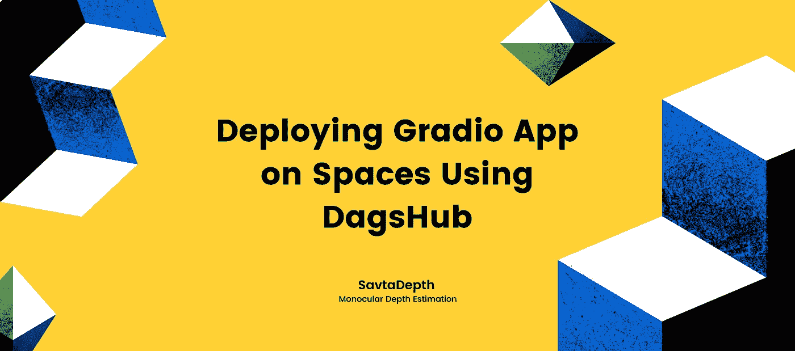
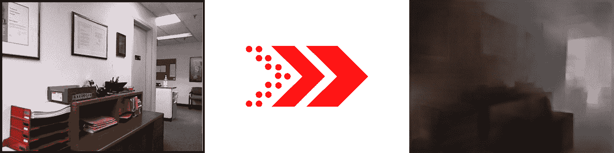
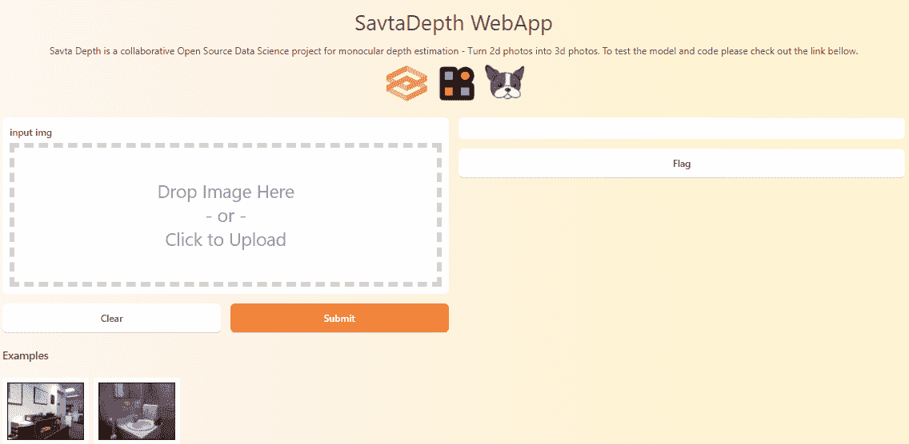
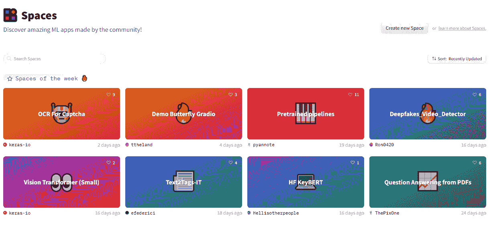
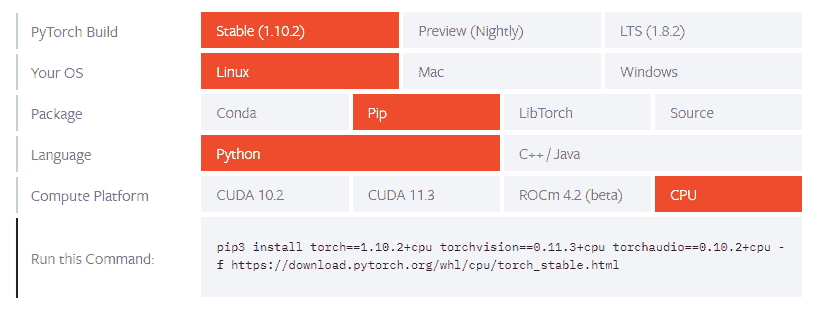
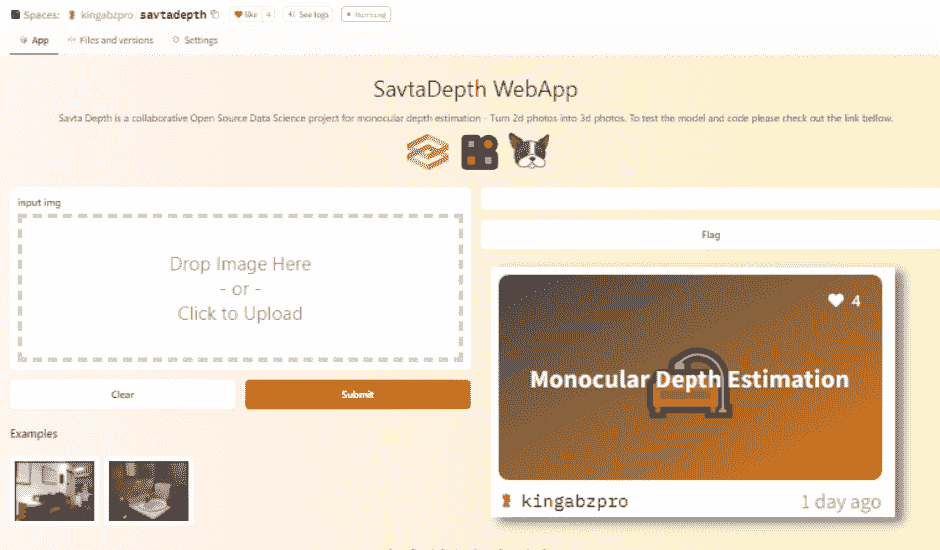
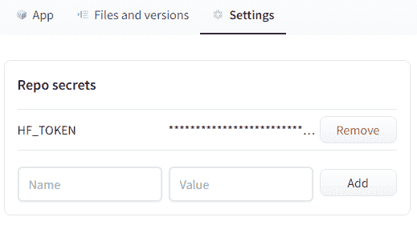
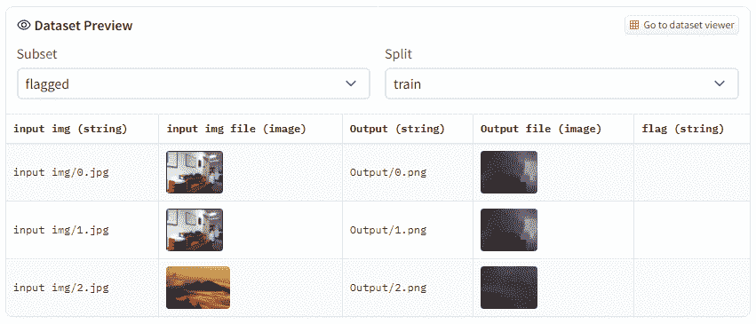

# 使用 DagsHub 在空间上部署 Gradio 应用程序:初学者教程

> 原文：<https://towardsdatascience.com/deploying-gradio-app-on-spaces-using-dagshub-a-beginners-tutorial-a42664abcc14>

## 基于项目的教程介绍了 MLOps 集成，如 DVC，DagsHub，Gradio web 框架，和拥抱脸空间

作者封面

由于公司正在为其复杂的机器学习(ML)模型寻找易于部署的解决方案，因此对 MLOps 工具的需求很高。为了使事情简单有效，我们将把 DVC，DagsHub，Gradio 和拥抱脸空间整合到我们的合作 ML 项目中。

在本教程中，我们将了解端到端的机器学习集成，并使用它们来创建图像生成 web 应用程序。我们将使用 Gradio 开发开源项目 SavtaDepth 的模型推理，它将提供一个用户友好的 web 界面。SavtaDepth 通过预测深度维度将 2D 图像转换为 3D 图像。这是一个初学者友好的教程，这意味着我们将学习一些技巧来简化复杂 ML 模型的部署过程。

# SavtaDepth 项目

[SavtaDepth](https://dagshub.com/OperationSavta/SavtaDepth) 是一个用于单目深度估计的合作开源数据科学项目。它拍摄 2D 图像并估计物体的深度。深度估计用于创建 3D 图像、3D 绘图、安全监控和自动驾驶汽车。单目深度估计的目标是预测每个像素的深度值或推断深度信息，仅给定单个 RGB 图像作为输入— [(keras.io)](https://keras.io/examples/vision/depth_estimation/) 。

该项目使用 [U-Net](https://paperswithcode.com/method/u-net) 模型，作者已经将最后一层从对象分割改为深度估计。模型在 [CC BY 4.0](https://creativecommons.org/licenses/by/4.0/) license 下的 [NYU 深度数据集 V2](https://cs.nyu.edu/~silberman/datasets/nyu_depth_v2.html) 上进行训练。该数据集包含来自微软 [Kinect](http://www.xbox.com/kinect) 的 RGB 和深度相机记录的各种室内场景的视频序列。该项目仍然是活跃的，因此贡献者可以帮助改善结果。如果你对这个项目感兴趣，请阅读投稿指南。

作者图片|单目深度估计

# 集成

在这一节中，我们将了解使我们的项目与众不同的各种集成。我们还将了解这些工具如何融入我们的项目生态系统。

*   [**DVC**](https://dvc.org/) 是一个开源版本控制的机器学习系统。它附带了数据和模型版本控制、模型度量监控和重现实验。它是 Git 的一个扩展，所以学习 DVC 会很自然。
*   [**DagsHub**](https://dagshub.com/) 是一个类似 GitHub 的社区第一平台，用于机器学习和数据科学项目。它使其用户能够利用流行的开源工具来版本化数据集&模型、跟踪实验、标记数据和可视化结果。
*   [**Gradio**](https://www.gradio.app/) 是为您的机器学习模型创建用户友好的 web 界面的最快方法。您可以在几分钟内构建并共享您的应用程序。它还带有 FastAPI 支持，这意味着您可以在任何地方访问该模型。
*   [**Spaces**](https://huggingface.co/spaces) 是拥抱脸新推出的机器学习应用分享平台。您可以构建 Streamlit、Gradio 或 HTML web 应用程序，并使用几行代码将它们部署到空间中。

在这个项目中，我们将使用 **DVC** 进行数据和模型版本控制，使用 **DagsHub** 进行远程存储，使用 **Gradio** 进行 ML 应用程序接口，使用 **Spaces** 作为 web 服务器。

# Gradio WebApp

Gradio 是一个轻量级的强大的网络界面，用于创建机器学习演示。在本节中，我们将学习如何添加图像，使用 FastAI 运行模型推理，并输出生成的结果。为了运行 web 应用程序而不出现依赖问题，我们需要首先安装 [PyTorch](https://pytorch.org/get-started/locally/) 、 [FastAI](https://pypi.org/project/fastai/) 和 [Gradio](https://www.gradio.app/) 。

## 模型推理

为了简单起见，我只添加了重要的部分，并删除了数据加载器。您可以通过查看 SavtaDepth [笔记本](https://colab.research.google.com/drive/1XU4DgQ217_hUMU1dllppeQNw3pTRlHy1?usp=sharing)了解更多关于图像数据加载器和 *create_data* 功能的信息。

我们只是使用 FastAI 的函数 *unet_learner* 来创建模型架构，然后加载最新的模型检查点。最后，我们将创建一个 *gen* 函数，该函数将以 Numpy 数组的形式获取图像，并运行预测以生成黑白 3D 图像。

## 网络界面

创建 Gradio web 界面很容易。我们只需要定制 *gradio。我们的用例与 Vallah 的接口*函数！！！您的 web 应用程序已准备就绪。

让我们仔细看看*接口*函数中使用的参数:

*   **第一个**参数是 *fn* 。我们需要为它提供模型推理，它接受输入并返回输出。在我们的例子中，它*生成*函数。
*   **第二个**参数是*输入*。我们正在将图像形状转换为 640X480 Numpy 数组。这个功能自动为我们做了大部分的图像处理工作。
*   **第三个**参数是*输出*。在我们的例子中，它是一个图像。所有的后处理都是由 Gradio 自动完成的。因此，我们不必担心使用 PIL 包来显示图像。
*   **标题**取一个字符串显示应用名称或标题。
*   **描述**采用一个简单的字符串、markdown 或 HTML 来显示副标题或标题下的图像。
*   **文章**是应用程序的页脚，你可以在这里写申请信息，比如你的研究和项目库的链接。它还接受简单的文本、markdown 或 HTML。
*   **示例**可用作示例输入，这样我们就不必寻找图像来运行应用程序。在我们的例子中，我们已经创建了一个文件夹，并从数据集的一个测试子集中复制了两个图像。这些示例接受一个相对文件路径数组，如下所示。
*   **主题是自定义 UI 的**，你可以在[文档](https://www.gradio.app/docs/)中找到更多关于主题的信息。
*   **allow_flagging** 是一个很酷的功能，可以帮助你跟踪模型的性能。您可以标记错误的预测，以便开发人员可以根据反馈改进模型。
*   **enable_queue** 用于防止推理超时。

在最终版本中，我使用 HTML 脚本对**描述**和**文章**做了一些修改。随时检查我的[代码](https://dagshub.com/kingabzpro/SavtaDepth/src/main/app/app_savta.py)。

作者 Gif

## 部署

在本节中，我们将学习如何将 Gradio 应用程序部署到拥抱面部空间。为此，我们需要使用拥抱脸网站创建新的空间，然后在 savta_app.py、README.md 和 requirement.txt 文件中进行更改。

## 拥抱面部空间

通过拥抱 Face 机器学习应用程序共享平台，人们可以在各种 Python web 框架上创建应用程序，并使用简单的 Git 函数进行部署。您还可以查看特色空间，体验最新的 ML 模型。

图片来自[空间——拥抱脸](https://huggingface.co/spaces)

在我们开始部署之前，我们需要首先创建一个[新空间](https://huggingface.co/new-space)，然后我们需要添加空间的名称、许可证，并选择 SDK。之后，我们可以克隆空间或者向当前的 Git 存储库添加一个远程。

作者图片

## 建立 DVC

用空间整合 DVC 很容易。我们只需要在主 Python 文件中运行一个 shell 脚本。下面的代码只从训练和测试数据集中提取了一个模型和一些样本。最后，它去掉了**。dvc** 文件夹来优化存储。确保在模型推理函数之前添加此代码。

## 自定义环境

为了将 Gradio 应用程序部署到 Spaces，我们需要做一些更改以避免错误和依赖性问题。

**添加拥抱脸遥控器**

首先，我们需要将 Space remote 添加到当前项目中。空间远程地址应该是这样的

**README.md**

然后转到您的 **README.md** 文件，以 **yml** 的形式添加元数据。这些元数据将告诉 Space 应用程序文件的位置、封面的表情符号、应用程序缩略图的颜色渐变、SDK 和许可证信息。您可以自定义颜色和表情符号，让您的缩略图更加醒目。

**requirements.txt**

我们受限于 CPU，为了优化存储，我们将使用 PyTorch CPU 版本。

图片来自[入门| PyTorch](https://pytorch.org/get-started/locally/)

我们将只包含运行模型推理和 web 界面所必需的包到 *requirements.txt* 文件中。

## 最後的

完成所有更改后，就该提交代码并将其推送到 Space 远程服务器了。初始远程空间有 README.md 和。gitattributes，所以为了避免冲突，我们将使用 **-f** 标志。我们将使用 **master:main** 将所有文件从本地(主分支)发送到远程(主分支)服务器。

> **警告:**请在开始时只使用一次 **-f** 标志，避免使用它，因为它会覆盖其他人的工作。

按下代码后，你会在你的应用上看到一个“**大厦”**的标志。大约需要 3 分钟来构建。

作者图片

恭喜您，您的应用已成功部署，可以在朋友和同事之间共享。

图片作者| [拥抱脸空间](https://huggingface.co/spaces/kingabzpro/savtadepth)

# 奖金

额外的部分是给 MLOps 爱好者的，他们总是渴望学习更多集成新工具和数据库的方法。在这一部分，我们将整合拥抱脸[数据集](https://huggingface.co/datasets)来收集所有的标志。这些标志将包括输入图像、输出图像和 CSV 文件。flag 选项有助于我们跟踪模型性能，并且我们可以在以后使用该数据集来提高模型性能。

我们需要将下面的代码添加到 *savta_app.py* 文件中，以便集成工作。它将使用*HuggingFaceDatasetSaver*来创建和更新标志数据集。该函数需要两个参数 *HF_TOKEN* ，您可以在[设置](https://huggingface.co/settings/tokens)和数据集名称中找到。最后，您可以在 Gradio 接口函数中将对象添加到 **flagging_callback** 中。

您还需要在空间设置中设置 *HF_TOKEN* 环境变量。只需复制并粘贴[用户访问令牌](https://huggingface.co/settings/tokens)。

作者图片

之后，转到应用程序并标记几个预测，以便您可以在您的个人资料下看到标记的数据集。在我们的例子中，可以公开访问的是 [savtadepth-flags](https://huggingface.co/datasets/kingabzpro/savtadepth-flags) 。

图像来自 [savtadepth-flags](https://huggingface.co/datasets/kingabzpro/savtadepth-flags)

# 结论

拥抱面部空间提供了一个易于部署的平台，数据科学家可以通过用户友好的界面测试和分享机器学习模型。如果你是机器学习的初学者，想体验端到端的产品开发，那就尝试在 Gradio 上开发你的 app，与 DagsHub 集成，最后部署到 Spaces。它还将帮助你创建一个强大的投资组合，其中你可以提到部署机器学习模型的经验。

在本教程中，我们学习了如何使用 Git、DVC、DagsHub、Gradio 和 Hugging Face Space 来创建和部署复杂的机器学习应用程序。这是你成为 MLOps 工程师的第一步。

**项目资源:**

*   [SavtaDepth WebApp](https://huggingface.co/spaces/kingabzpro/savtadepth)
*   [标记数据库](https://huggingface.co/datasets/kingabzpro/savtadepth-flags)
*   [SavtaDepth 项目](https://dagshub.com/OperationSavta/SavtaDepth)
*   [SavtaDepth Fork + WebApp](https://dagshub.com/kingabzpro/SavtaDepth/src/dagshub)
*   [谷歌 Colab 演示](https://colab.research.google.com/drive/1XU4DgQ217_hUMU1dllppeQNw3pTRlHy1?usp=sharing)
*   [项目数据集](https://cs.nyu.edu/~silberman/datasets/nyu_depth_v2.html)

**数据集参考:** Nathan Silberman，P. K .，Derek Hoiem en Fergus，r .(2012)“RGBD 图像的室内分割和支持推断”，载于 *ECCV* 。