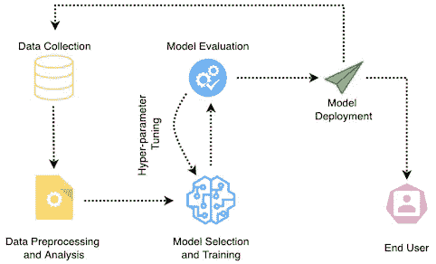
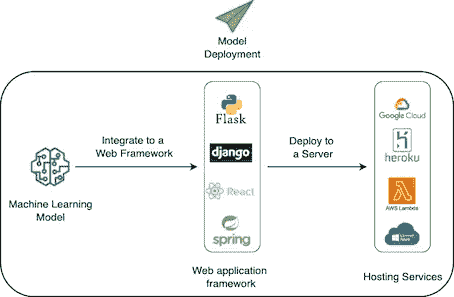
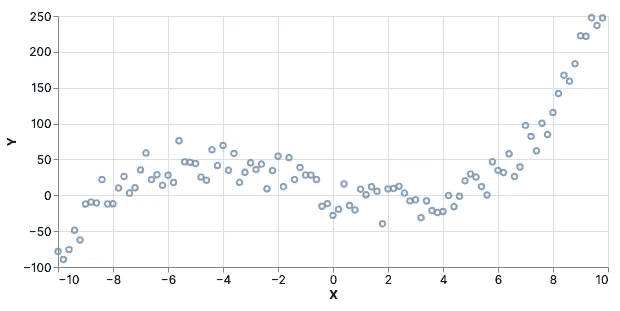
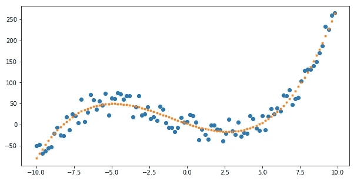
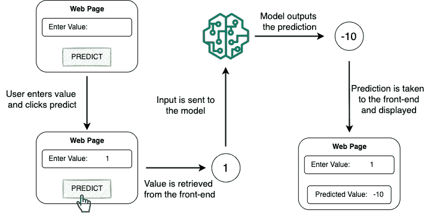
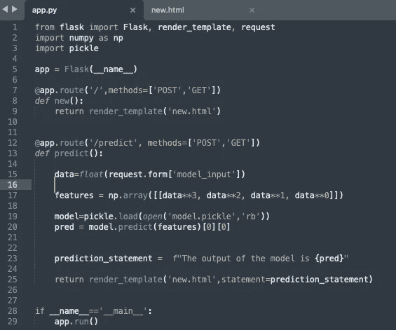
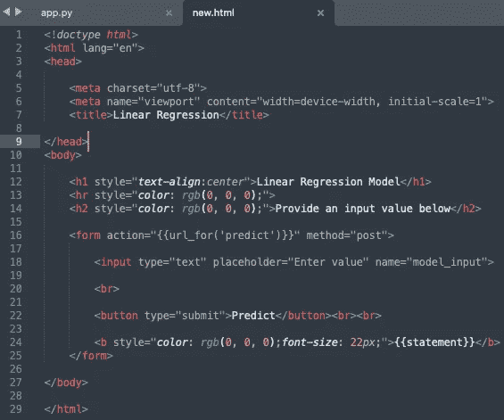
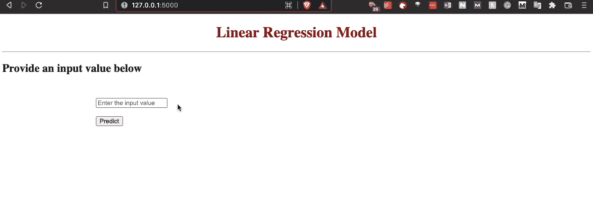
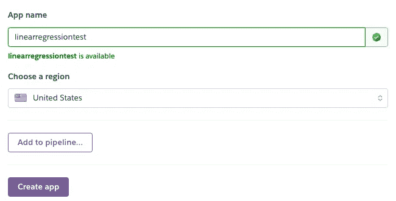
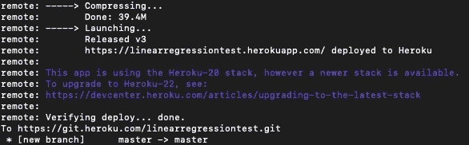

# 使用 Heroku 部署机器学习模型

> 原文：<https://towardsdatascience.com/deploying-machine-learning-models-with-heroku-4dec1df87f71>

## 不要只是培训，还要部署:一步一步的指南


罗曼·辛克维奇在 [Unsplash](https://unsplash.com?utm_source=medium&utm_medium=referral) 上拍摄的照片

最近，在机器学习领域运营的组织对大规模构建和部署数据驱动的智能系统非常感兴趣。这不仅导致了高效和精确系统的快速发展，还通过使用智能嵌入式产品对改善整体终端用户体验做出了深远的贡献。

由于与智能嵌入式软件相关的各种好处，在部署阶段管理机器学习模型已经成为当今机器学习工程师的一项基本技能。有时，这甚至需要单独的团队在部署中发布和管理产品。

因此，这篇文章将提供一个详细的概述，介绍如何将你训练好的模型应用到部署中。具体来说，我将演示如何使用 **Flask** 创建一个 web 应用程序，然后使用 **Heroku** 将机器学习模型部署到云中。

文章的亮点如下:

[**什么是部署？**](#ebc3)[**步骤 1:开发机器学习模型**](#4450)[**步骤 2:使用 Flask 创建 Web 应用程序**](#63f2)[**步骤 3:将应用程序部署到 Heroku 服务器**](#c254)[**结论**](#4522)

我们开始吧！

# 什么是部署？

首先，部署是将经过训练的机器学习模型集成到生产环境中的过程，通常是为了服务于最终用户。

部署通常是机器学习产品开发生命周期的最后一个阶段。下图简要概述了开发生命周期:



机器学习产品的开发生命周期(图片由作者提供)

上面的“模型部署”阶段由一系列步骤组成，如下图所示:



模型部署阶段(图片由作者提供)

部署机器学习模型的三个主要步骤如下:

*   首先，我们开发机器学习模型。这包括收集相关数据并对其进行分析、生成特征、选择模型、执行超参数调整，以及最后评估模型。
*   一旦我们对预测和准确性指标有了信心，我们就将模型集成到 web 应用程序中，如 Flask、Django 等。这包括创建应用程序的前端(或用户界面)供用户交互并提供输入，然后将其与后端融合，将获得的数据馈送给机器学习模型以进行预测。
*   最后，我们使用 Heroku、Google Cloud 等托管服务将应用程序部署到服务器上。

出于本教程的目的，我将使用 **Flask** 来构建 web 应用程序。接下来，我将把应用程序部署在一台 **Heroku** 服务器上。

# 步骤 1:开发机器学习模型

在本节中，让我们训练我们打算部署的机器学习模型。为了简单起见，也为了不偏离本文的主要目标，我将部署一个线性回归模型。

## #1 生成虚拟数据点

我将对下面散点图中描述的一组虚拟数据点训练一个线性回归模型:



虚拟数据点的散点图(图片由作者提供)

从自变量到`x`到因变量`y`的映射实现如下:

## #2 培训模型

接下来，我将使用 [scikit-learn](https://scikit-learn.org/stable/index.html) 来训练一个线性回归模型。下面演示了这一点:

模型学习的回归线如下所示:



带有回归线的虚拟数据点散点图(图片由作者提供)

## #3 将模型保存到 Pickle 文件

要在 Heroku 服务器上部署训练好的模型，您应该将它保存为 pickle 文件，如下面的代码块所示:

# 步骤 2:使用 Flask 创建 Web 应用程序

Flask 是一个流行的 web 框架，用于在 python 中构建轻量级 web 应用程序。如上所述，在这个项目中使用 Flask 的目的是构建一个最终用户可以与之交互的 web 应用程序。

在本节中，我将使用在步骤 1 中创建的模型 pickle 文件，并将其集成到 web 应用程序中。web 应用程序的前端将允许用户向模型提供输入。这将被获取并传递给在后端运行的模型以进行预测。最后，我们将检索模型的预测，并将其显示给用户。

## #1 项目要求

要在 Flask 中构建 web 应用程序，应该在 python 中安装 [Flask](https://pypi.org/project/Flask/) 库。打开命令行，键入以下命令来安装 Flask:

```
pip install Flask
```

## #2 Web 应用程序工作流程

暂时忽略技术实现，web 应用程序的分步预期工作流应该如下(通俗地说):



web 应用程序工作流(图片由作者提供)

*   首先，我们显示一个带有表单的 HTML 页面，供用户输入。此外，用户应该单击“预测”按钮来了解相应的输出。
*   一旦用户点击“预测”，web 应用程序应该获取输入值，并将其带到后端进行进一步处理。
*   下一步是根据获取的值计算输入特征，并将它们作为输入提供给训练好的模型以生成输出。
*   最后，应用程序应该将预测值传送到 HTML 页面并显示给用户。

## #3 实施

要在 Flask 中构建这个 web 应用程序，我们需要编写两个文件并将它们集成在一起。这些是:

1.  `app.py`:这个文件包含了与网页交互的 Flask APIs。它负责获取输入值，在加载模型后计算预测，并将其返回到 HTML 文件。
2.  `new.html`:顾名思义，这个文件包含了我们的 web 应用程序的前端，用户将会看到它。

应用程序的当前目录结构是:

```
Linear_Regression_Model
├── templates
│   ├── new.html
├── app.py
└── model.pickle
```

这两个文件的实现如下所示:



web 应用程序的实现(图片由作者提供)

*   `app.py`文件定义了两种方法，`new()`和`predict()`。`new()`方法对应 app 的`“/”` URL，返回`new.html`网页。
*   `predict()`方法用于计算模型的预测值。当用户点击网页上的“**预测**按钮时，一个 POST 请求被发送到`predict()`方法。
*   一旦模型给出了它的预测，我们再次呈现`new.html`页面并发送一个`prediction_statement`显示给用户。

## #4 应用程序演练

要执行应用程序，运行项目目录中的`python app.py`。一旦服务器开始运行，在任何本地浏览器中前往`[http://127.0.0.1:5000/](http://127.0.0.1:5000/)`打开应用程序。

此应用程序的演练如下所示:



Flask web 应用程序的演练(Gif 由作者提供)

如上面的 gif 所示，用户得到一个输入值的表单。这被带到后端进行处理。一旦模型做出预测，预测值就会显示给用户。

# 步骤 3:将应用程序部署到 Heroku 服务器上

现在我们已经训练了机器学习模型，并将其集成到 web 应用程序中，我们的最后一步是将应用程序部署到 Heroku 服务器上，这是一个免费的云即服务平台，可以部署任何 web 应用程序。

支持的编程语言有 Java、PHP、Python、Go 等。此外，大多数数据科学家使用 Heroku 来获得在云上部署模型的实践经验。但是，在部署应用程序之前，您应该在 [Heroku](https://signup.heroku.com/) 上创建一个帐户。

为了将代码推送到 Heroku 服务器并进行部署，Heroku 提供了三种不同的方式:Heroku git、GitHub 和容器注册表。


将代码部署到 Heroku 服务器的选项(图片由作者提供)

在本文中，我将使用 Heroku Git 来部署这个模型。

现在，让我们从部署流程开始。

## #1 安装要求

就包需求而言，您应该用 python 安装`[gunicorn](https://pypi.org/project/gunicorn/)`包，如下所示:

```
pip install gunicorn
```

接下来，您应该安装 Heroku 命令行界面(Heroku-CLI)。根据您的操作系统，您可以在这里找到说明。

## #2 将 requirements.txt 和 Procfile 添加到目录中

在将代码推向部署之前，您应该在`requirements.txt`文件中指定项目的需求。该项目的文件如下所示:

```
Flask==2.1.0
Werkzeug==2.0.3
numpy==1.21.5
gunicorn==20.1.0
jinja2
Werkzeug
itsdangerous
```

接下来，创建一个新文件，命名为`Procfile`，并添加以下命令:

```
web: gunicorn app:new
```

本质上，该文件让生产环境知道 app 文件中的哪个函数是主方法。此外，它还提供了应用程序在启动时将运行的命令。`app:new`部分表示主文件是`app.py`，其中`new()`方法是主要函数。

完成此步骤后，您的目录结构应该如下所示:

```
Linear_Regression_Model
├── templates
│   ├── new.html
├── app.py
├── model.pickle
├── requirements.txt
└── Procfile
```

## #3 在 Heroku 服务器上创建应用程序

导航至您的账户[仪表盘](https://dashboard.heroku.com/apps)并选择`Create new app`。


在 Heroku 帐户仪表板上创建新应用程序的选项(图片由作者提供)

接下来，为您的应用程序键入一个名称，并选择`Create app`。



在 Heroku 上输入要托管的应用程序名称的字段(图片由作者提供)

一旦创建了应用程序，就可以开始部署过程，这将在下一步中演示。

## #4 将应用程序部署到 Heroku 服务器

首先，选择`Heroku Git`作为“部署方式”。


将代码部署到 Heroku 服务器的选项(图片由作者提供)

打开本地计算机上的终端并登录 Heroku。确保您已经安装了 Heroku-CLI。

```
$ heroku login
```

接下来，导航到您的项目并初始化一个 git 存储库，如下所示:

```
$ cd my-project/
$ git init
$ heroku git:remote -a linearregressiontest
```

现在，将您的代码提交到存储库，并使用 Git 将其部署到 Heroku。

```
$ git add .
$ git commit -am "deployment step 1"
$ git push heroku master
```

如果部署成功，您应该会在命令行中看到以下日志:



描述成功部署的图片(图片由作者提供)。

这样，你的机器学习模型就部署成功了！可以通过以下地址访问该应用程序:

```
https://your-app-name.herokuapp.com/
```

# 结论

总之，在这篇文章中，我详细介绍了如何从头开始部署机器学习模型。

具体来说，我首先演示了简单线性回归模型的训练，然后将它集成到使用 Flask 开发的 web 应用程序中。

最后，我展示了使用 Heroku Git 将 web 应用程序部署到 Heroku 服务器的分步过程。

你可以在这里找到这篇文章的代码。

**感谢阅读！**

[🧑‍💻**成为数据科学专家！获取包含 450 多个熊猫、NumPy 和 SQL 问题的免费数据科学掌握工具包。**](https://subscribepage.io/450q)

✉️ [**注册我的电子邮件列表**](https://medium.com/subscribe/@avi_chawla) 永远不要错过关于数据科学指南、技巧和提示、机器学习、SQL、Python 等的另一篇文章。Medium 会将我的下一篇文章直接发送到你的收件箱。