# 使用 TensorFlow 服务部署机器学习模型—简介

> 原文：<https://towardsdatascience.com/deploying-machine-learning-models-with-tensorflow-serving-an-introduction-6d49697a1315>

从初始环境设置到使用 TensorFlow 服务和 Docker 服务和管理多个模型版本的分步教程


Patrick Robert Doyle 在 [Unsplash](https://unsplash.com?utm_source=medium&utm_medium=referral) 拍摄的照片

# 目录

1.  [简介](#cfca)
2.  [环境设置](#d1c7)
3.  [创建机器学习模型](#904e)
    3.1 [数据生成](#4558)
    3.2 [分割训练、验证和测试集](#15cc)
    3.3 [训练并保存回归模型](#4a91)
4.  [服务于模型](#d0c4)
    4.1 [安装 TensorFlow 服务于 Docker](#d2ec)
    4.2 [服务于最新模型](#b941)
    4.3 [服务于多个模型版本](#8fea)
    4.4 [将自定义标签应用于模型版本](#2c22)
    4.5 [随着时间的推移自动重新加载配置](#1f9f)
5.  [结论](#5fa8)
6.  [参考文献](#4675)

# 1.介绍

这篇文章涵盖了使用 **TensorFlow Serving** 作为 web 服务开始服务机器学习模型所需的所有步骤，TensorFlow 是一个灵活的高性能服务系统。

在这个例子中，我们将建立一个虚拟环境，在这个环境中，我们将为一个回归问题生成合成数据，训练多个模型，最后将它们部署为 web 服务，从 REST APIs 访问预测。

本教程的唯一先决条件是安装了 **Python** 和 **Docker 引擎**的工作机器。我们将最终使用 **curl⁴** 来编写 API 调用，并通过它们的预测端点来消费机器学习模型。

# 2.环境设置

一个`virtual environment`是一个自洽的 Python 环境，可以创建它来管理和分离项目:它提供了隔离，因此依赖关系不会影响同一操作系统上的其他包。

对于本教程，我们在`myProject`文件夹中创建一个`virtual environment`。从命令行:

```
# create the virtual environment
python -m venv /myProject# activate the environment
myProject\Scripts\activate
```

一旦环境被激活，我们就可以安装所需的依赖项:

*   `pip install scikit-learn`利用便捷的数据准备方法；
*   `pip install tensorflow`用于机器学习开发；
*   `pip install matplotlib`以可视化方式探索数据和模型度量；
*   `pip install jupyter`使用笔记本。

安装完依赖项后，我们通过执行以下命令来启动 Jupyter Notebook:

```
jupyter notebook
```

从 Jupyter Notebook web 界面，我们可以在`myProject`文件夹中创建一个笔记本(`create_models.ipynb`),因为我们将使用它来生成通过 TensorFlow 服务提供的机器学习模型。

# 3.创建机器学习模型

从我们的笔记本开始，我们导入以前安装的依赖项:

## 3.1 数据生成

我们生成如下合成数据:

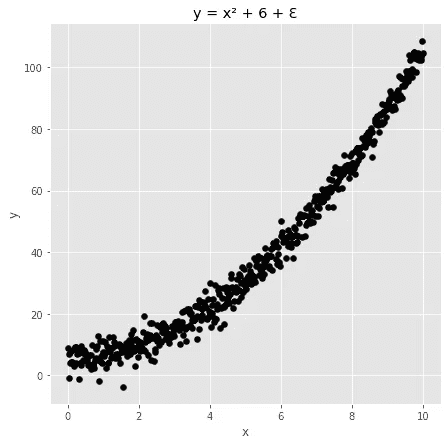

图片作者。

## 3.2 培训、验证和测试集的划分

我们将数据集分为:

*   **训练和验证组**:在训练过程中使用。
*   **测试集**:用于估计样本外性能。

我们观察获得的集合:

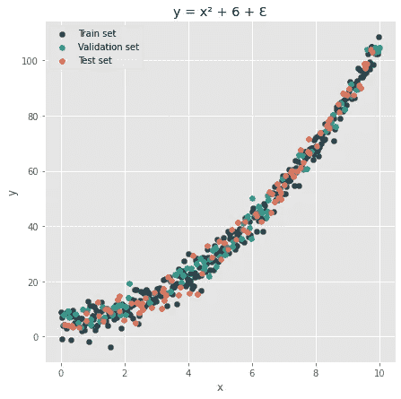

训练、验证和测试集。图片作者。

当我们训练一个新的模型时，我们希望将它存储在我们项目根的一个子文件夹中，这个子文件夹被随意命名为`saved_models`。在这个空间中，我们将每个模型保存在一个专用的目录中，该目录用增量整数命名:

## 3.3 训练和保存回归模型

我们拟合了由致密层构成的第一个简单模型:

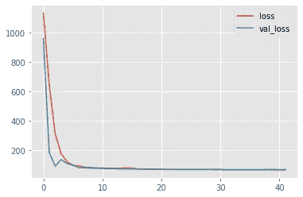

第一个模型的训练历史。图片作者。

现在，让我们创建另一个略有不同的模型:

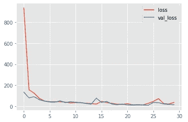

第二个模型的训练历史。图片作者。

我们可以观察两个不同模型的测试集预测:

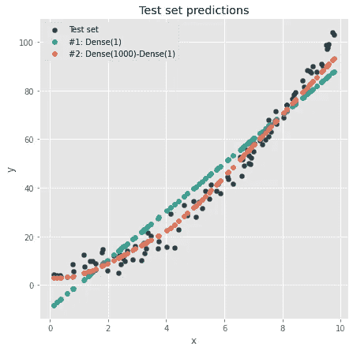

测试集预测。图片作者。

通过浏览`./myProject/saved_models`文件夹的内容，我们可以观察到训练好的模型保存在专用目录中:

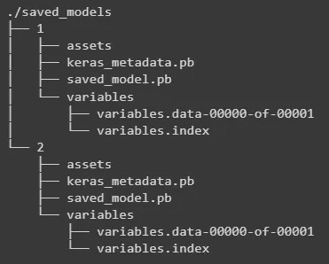

保存在 saved_models 文件夹中的增量命名目录中的模型。

我们的最终目标是探索如何使用 TensorFlow 服务将一组给定的模型部署为用于推理的 web 服务。因此，我们不会更深入地研究建模任务，尽管人们可能会测试不同的模型或进一步改进训练策略。

# 4.为模特服务

## 4.1 使用 Docker 安装 TensorFlow 服务

开始 TensorFlow 服务最简单的方法是拉最新的 docker image⁵.从命令行:

```
docker pull tensorflow/serving
```

提取映像后，我们可以通过运行以下命令来检查其可用性:

```
docker images
```

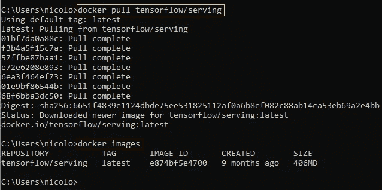

拉最新的 TensorFlow 服务 Docker 图片。图片作者。

## 4.2 提供最新型号

我们从提取的图像创建一个运行容器:

```
docker run --name myTFServing -it -v C:\myProject:/myProject -p 9001:9001 --entrypoint /bin/bash tensorflow/serving
```

让我们更详细地研究一下这个命令:

*   从输入图像创建一个容器。
*   `--name <myName>`设置一个名称来标识 Docker 容器。
*   `-it`在交互模式下启动容器。
*   `-v <host_volume>:<container_volume>`将主机上的卷绑定到容器内的目录。在我们的例子中，容器将从容器内的`/myProject`目录访问主机上的项目文件夹`C:\myProject`。
*   `-p <host_port>:<container_port>`将主机的端口绑定到容器的端口。
*   `--entrypoint`指定容器启动时应该运行的可执行文件。在我们这里，`/bin/bash`。
*   `tensorflow/serving`是从中派生容器的图像的名称。

从容器内部，我们检查是否存在`/myProject`文件夹及其内容，这应该与主机上的`C:\myProject`相同:

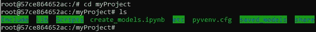

由于 Docker 卷，容器可以访问主机上的项目根。图片作者。

当我们在容器内部时，我们启动 TensorFlow，如下所示:

```
tensorflow_model_server 
  --rest_api_port=9001 
  --model_name=regression_experiments 
  --model_base_path=/myProject/saved_models
```

我们注意到，我们将存储模型的文件夹传递给了`model_base_path`标志，并用`model_name`为模型指定一个任意的名称。该名称将成为 TensorFlow 服务公开的端点的一部分。

一旦命令被执行，日志显示只有最新的模型被加载用于推断:

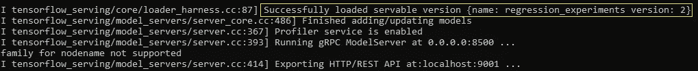

默认情况下，会加载最新的模型进行推理。图片作者。

我们可以通过从容器外部使用`curl`执行 API 调用来测试预测。例如，我们从获得可用模型开始:

```
curl -X GET http:/localhost:9001/v1/models/regression_experiments
```

该调用返回:

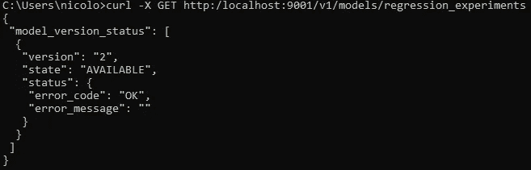

图片作者。

事实上，默认情况下，TensorFlow Serving 只自动加载 model_base_path 中可用的不同模型的最新版本。

我们测试一个预测如下:

```
curl -X POST "http://localhost:9001/v1/models/regression_experiments:predict" ^
-H "Content-Type: application/json" ^
-d "{\"instances\":[[1.0], [2.0], [5.0]]}"
```

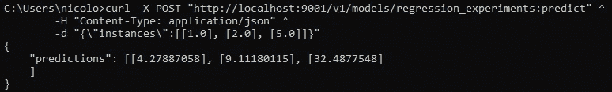

TensorFlow 服务成功服务于 model_base_path 中的最新模型。图片作者。

**注意事项**

*   在 Windows 机器上，`^`字符可以用于 curl 语句中的换行符。在 MacOS 或 Unix 系统上，应该使用反斜杠`\`字符。
*   人们可能想交替使用双引号`"`和单引号`'`来编写 curl 语句。例如，通过键入:`-d '{"instances":[..]}'`。在 Windows 上，这可能会导致以下消息:`{"error":"Malformed request: POST /v1/models/regression_experiments/predict"}`，或者其他 curl / JSON 解析错误。为了避免任何问题，命令应该只包含双引号`"`(嵌套时用反斜杠屏蔽)。

## 4.3 提供多种型号版本

在真实的场景中，我们可能需要一次公开多个模型。例如，我们可能希望逐渐将流量从服务的先前版本切换到新版本(**蓝绿色部署**)，或者我们可能需要随机地将用户重定向到多个共存版本中的一个以进行测试( **A/B 测试**)。

我们可以很容易地指示 TensorFlow Serving 加载不同的模型版本，并使用**配置 files⁶** 进行推理。

在`myProject`文件夹中，我们如下创建`cfg1.conf`文件:

```
model_config_list {
  config {
    name: 'regression_experiments'
    base_path: '/myProject/saved_models'
    model_platform: 'tensorflow'
    model_version_policy: {all: {}}
  }
}
```

在这个文件中，我们设置了一个策略，指示 TensorFlow 考虑给定基本路径中的所有可用模型。

我们从容器开始 TensorFlow 服务，如下所示:

```
# entering the container in interactive mode
docker exec -it myTFServing bin/bash# starting TensorFlow Serving with configuration file
tensorflow_model_server 
  --rest_api_port=9001 
  --allow_version_labels_for_unavailable_models 
  --model_config_file=/myProject/cfg1.conf
```

从服务日志中，我们可以看到现在两个型号版本都是在启动时加载的:

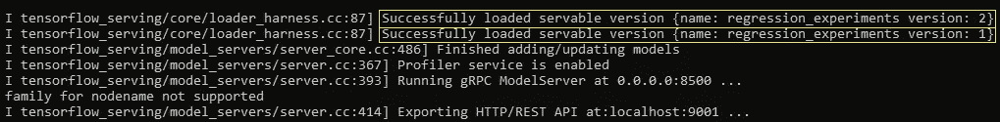

服务启动时的 TensorFlow 服务日志。图片作者。

让我们用来自容器外部的 GET 请求来检查可用的模型:

```
curl -X GET http:/localhost:9001/v1/models/regression_experiments
```


图片作者。

我们现在可以对服务执行外部 API 调用，并随意将流量重定向到任何所需的版本，如下所示:

```
# call to model version 1
curl -X POST
"http://localhost:9001/v1/models/regression_experiments/***versions/1:predict***" ^
-H "Content-Type: application/json" ^
-d "{\"instances\":[[1.0], [2.0], [5.0]]}"# call to model version 2
curl -X POST "http://localhost:9001/v1/models/regression_experiments/***versions/2:predict***" ^
-H "Content-Type: application/json" ^
-d "{\"instances\":[[1.0], [2.0], [5.0]]}"
```

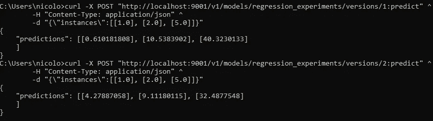

不同模型版本的预测。图片作者。

## 4.4 将自定义标签应用于模型版本

我们可以很容易地将字符串标签应用到模型 versions⁶.通过这种方式，可以向我们的预测服务添加一个“语义抽象”层，从而提高可读性并促进 DevOps 实践。例如，通过 REST 接口消费我们的模型的集成层可能更喜欢调用“*生产*或“*测试*”版本，而不是像“ *23* 或“ *57* ”这样的随机整数。

这一结果可以通过在配置文件中指定所需的标签来实现。让我们在项目目录中创建一个`cfg2.conf`文件，如下所示:

```
model_config_list {
  config {
    name: 'regression_experiments'
    base_path: '/myProject/saved_models'
    model_platform: 'tensorflow'
    model_version_policy {
      specific {
        versions: 1
        versions: 2
      }
    }
    version_labels {
      key: 'production'
      value: 1
    }
    version_labels {
      key: 'test'
      value: 2
    }
  }
}
```

在这个文件中，我们将我们的模型版本分别分配给`production`和`test`标签。我们现在可以启动服务了:

```
# entering the container in interactive mode
docker exec -it myTFServing bin/bash# starting TensorFlow Serving with configuration file
tensorflow_model_server 
  --rest_api_port=9001 
  --allow_version_labels_for_unavailable_models 
  --model_config_file=/myProject/cfg2.conf
```

服务启动后，我们可以执行外部 API 调用。值得注意的是，这次终点将是`/v1/models/<model_name>/**labels**/`而不是`/v1/models/<model_name>/**versions**/`:

```
# call to production model
curl -X POST
"http://localhost:9001/v1/models/regression_experiments/***labels/production:predict***" ^
-H "Content-Type: application/json" ^
-d "{\"instances\":[[1.0], [2.0], [5.0]]}"# call to test model
curl -X POST "http://localhost:9001/v1/models/regression_experiments/***labels/test:predict***" ^
-H "Content-Type: application/json" ^
-d "{\"instances\":[[1.0], [2.0], [5.0]]}"
```

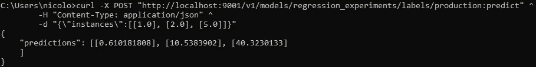

从模型的生产实例进行推断。图片作者。

## 4.5 随着时间的推移自动重新加载配置

我们在启动时通过将配置文件传递给`--model_config_file`标志来使用它们。

我们还可以传递`--model_config_file_poll_wait_seconds`标志来指示 TensorFlow Serving 定期检查指定路径的配置文件中的更新。例如，语句

```
# entering the container in interactive mode
docker exec -it myTFServing bin/bash# starting TensorFlow Serving
tensorflow_model_server 
  --rest_api_port=9001 
  --allow_version_labels_for_unavailable_models 
  --model_config_file=/myProject/cfg2.conf 
  --model_config_file_poll_wait_seconds=30
```

将基于来自`cfg2.conf`文件的配置启动`myTFServing`容器中的服务，并且更新将被定期提取。我们可以从日志中验证系统如何每 30 秒检查一次更新:

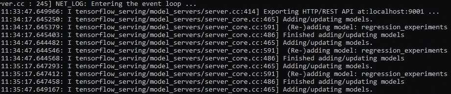

模型 _ 配置 _ 文件 _ 轮询 _ 等待 _ 秒标志的效果。图片作者。

# 5.结论

在这篇文章中，我们探讨了如何使用 TensorFlow 服务部署模型，使得预测可以通过 REST APIs 轻松访问。

特别是我们从零开始。我们创建了一个虚拟环境，在该环境中，我们安装了生成合成数据和适应多个模型所需的最小依赖集。然后，我们提取 TensorFlow 服务 Docker 映像，并从中创建一个运行容器，涵盖了管理和服务多个模型版本所需的所有步骤。

# 6.参考

[1][https://www.tensorflow.org/tfx/serving/architecture](https://www.tensorflow.org/tfx/serving/architecture)

[https://docs.python.org/3/using/](https://docs.python.org/3/using/)

[https://docs.docker.com/engine/install/](https://docs.docker.com/engine/install/)

[https://curl.se/](https://curl.se/)

[https://www.tensorflow.org/tfx/serving/docker](https://www.tensorflow.org/tfx/serving/docker)

[https://www.tensorflow.org/tfx/serving/serving_config](https://www.tensorflow.org/tfx/serving/serving_config)