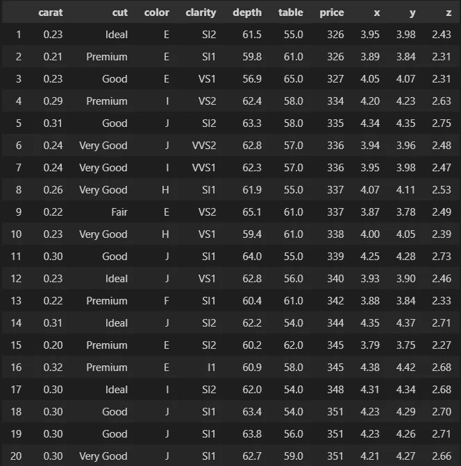
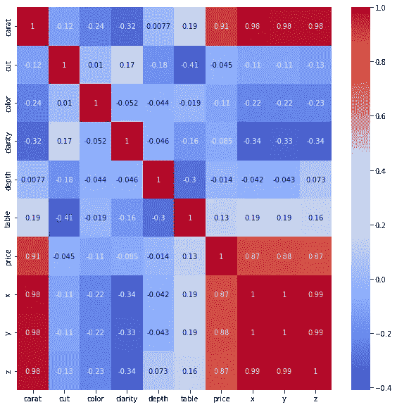

# 使用 Streamlit 部署 ML 模型

> 原文：<https://towardsdatascience.com/deploying-ml-models-using-streamlit-5d6212453bdd>

## 使用 XGBoost & Streamlit 快速构建和部署 Python 应用程序

凯利·西克玛在 [Unsplash](https://unsplash.com?utm_source=medium&utm_medium=referral) 上的照片

[GitHub 回购 ](https://github.com/NateDiR/diamond_price_streamlit_prototype_app)

[*Streamlit App*](https://share.streamlit.io/natedir/diamond_price_streamlit_prototype_app/main/streamlit.py)

# 介绍

实话实说:很难让普通人对数据科学感兴趣。

即使在专业环境中，如果决策者不认同你工作的潜在好处，要获得他们的认同也可能是一场艰苦的战斗。

通常，我会收集客户的数据，进行分析，展示我的发现，并提出建议，只让他们忽略这些数据，做他们想做的事情。

我也不是在批评以前的客户。数据科学不是一个特别容易理解的学科，它如何工作的细节也不会成为引人入胜的内容。作为数据科学专业人员，我们有责任说明我们所做工作的价值，如果我们想最大限度地发挥其影响，就要真正赋予它生命。

写作的金科玉律是“秀，不要说”。我们希望读者通过思想、行动、情感和感官而不是枯燥的阐述来体验故事。对于数据科学家来说，我认为类似的原则也适用。当你只是告诉决策者你的结论和建议时，很难说服他们。如果你能有效地向他们展示你是如何做到这一点的，那会更有说服力，如果你能给他们工具让他们自己得出同样的结论，那就更有影响力了。

“教人钓鱼，你就喂了他们一辈子”，或者其他什么。

[格雷森·约翰逊](https://unsplash.com/@_grey_?utm_source=medium&utm_medium=referral)在 [Unsplash](https://unsplash.com?utm_source=medium&utm_medium=referral) 上拍摄的照片

# 宗旨声明

考虑到这一点，让我们来看看如何使用 Streamlit 将您创建的机器学习模型转化为一个简单的应用程序。但首先:为什么这值得去做？

# 基本原理

我认为，对于刚开始接触数据科学的人来说，了解如何部署他们创建的模型非常重要，原因有两个:

1.  正如我上面提到的，它使你的工作更容易被非技术涉众所理解(因此也更有影响力)。
2.  拥有一个切实可行的工具/应用程序是你投资组合中的一大亮点。
3.  将你的模型从 Jupyter 笔记本中拿出来放到“真实世界”中，可以确保你的作品得到更多的曝光和实际应用。
4.  能够快速创建提议的数据科学解决方案的原型/MVP 是专业环境中一项非常宝贵的技能。

# 数据

我在这个项目中使用的数据集是 Kaggle 的[钻石数据集](https://www.kaggle.com/datasets/natedir/diamonds)。根据 CC0，它被授权作为公共领域的一部分使用，可以通过上面的链接获得。感谢 Kaggle 用户 natedir 的维护。

我喜欢这个数据集，因为这是一个相当简单的线性回归问题，我们需要解决一些重要的问题。对于流量更大的线性回归数据集，如房地产、身体质量指数和医疗保险，这也是一个很好的替代方案。除此之外，它还有令人尊敬的 50，000+次观察，是一个有趣的预测应用程序。

# 目标

目标是使用数据集中的特征来预测钻石的价格。一旦我们有了一个表现令人满意的模型，我们将继续使用 Streamlit 在它的基础上构建应用程序。

由 [Lucas Santos](https://unsplash.com/@_staticvoid?utm_source=medium&utm_medium=referral) 在 [Unsplash](https://unsplash.com?utm_source=medium&utm_medium=referral) 上拍摄的照片

# 构建模型

首先，让我们介绍一下我们将用来创建模型的库:

接下来，我们将读入数据(在 GitHub repo 中以 diamonds.csv 的形式提供)并检查前 20 个条目:

作者图片

以及其他一些杂项检查:

如果您继续跟进，我们的数据集中应该有 53，940 个观察值和 10 个要素。不存在缺失值，除切割、颜色和净度之外的所有变量都是数字。让我们深入研究这三个变量。

## 数据准备

通过检查这些变量的值，我们可以看到它们是**分类的**:

更重要的是，稍微搜索一下互联网就会发现，这些变量中的值有一个内在的层次结构。每颗钻石都有切割、颜色和净度等级。对于 Cut，等级(从最高到最低)为理想>优质>非常好>良好>一般。

由于这种层次结构，我们可以称这些**序数分类**变量。如果我们想要以数字形式适当地捕捉信息，我们必须根据固有的标度对它们进行编码。

对于每个变量中如此少的类别，最简单的方法是使用映射，但是 scikit-learn 也有一个[**OrdinalEncoder**](https://scikit-learn.org/stable/modules/generated/sklearn.preprocessing.OrdinalEncoder.html)**类:**

**一旦我们编码了序数变量，让我们去掉任何离群值和/或无意义的数据。**

**首先，任何 X、Y 或 Z 维度为 0 的观测值都将获得轴:**

**然后，我们将根据几个不同的变量将数据集削减到第 99 个百分位数，以排除最严重的异常值。这绝不是处理异常值的细微方法，在现实场景中，这部分工作需要付出更多的努力:**

**现在，数据已经为建模做好了准备，让我们来看看关联热图，看看我们可以预期哪些功能会影响价格以及如何影响:**

****

**作者图片**

## **创建模型**

**首先，我们将进行标准的培训/验证/测试划分:**

**现在，因为我很懒，这是一个示例问题，所以我将向 XGBoost 回归器抛出一个 GridSearchCV，以快速得出最佳拟合。同样，不要在真实的场景中这样做，这很笨拙(也需要很长时间来运行):**

## **验证分数:**

*   ****验证平均绝对误差:** $235.76 美元**
*   ****验证 R2 评分:** .98**

## **测试分数:**

*   ****测试平均绝对误差:** $229.80 美元**
*   ****测试 R2 得分:** .98**

**既然我们对模型的性能感到满意(因为我是这么说的)，我们可以继续保存它:**

**让我们继续使用 Streamlit 构建预测器应用程序！**

# **构建应用程序**

**Streamlit 通过直接从公共 GitHub 存储库中读取代码来工作。因此，要使应用程序工作，我们需要一个包含以下内容的回购:**

*   **的。JSON 文件，这是我们的模型。**
*   **requirements.txt 文件，该文件指定了 Streamlit 运行应用程序所需安装的 Python 包。**
*   **答。创建和定义我们的 Streamlit 应用程序的 py 文件。**

**你可以在这里找到我的回购。我的 Streamlit 应用程序[在这里](https://share.streamlit.io/natedir/diamond_price_streamlit_prototype_app/main/streamlit.py)。让我们来看看如何构建这个应用程序。**

**一、requirements.txt:**

**简单！最好的做法是包含您需要的每个包的版本，但是我没有在这里包含它，因为这又是一种懒惰。不要像我一样。**

**一旦我们告诉 Streamlit 要安装哪些包，我们就可以编写代码在我们的。py 文件:**

**在这里，我们已经从 JSON 文件中加载了我们的模型，并告诉 Streamlit 将它缓存到以便快速访问。**

**接下来，我们将定义一个接受用户输入(钻石特征)并输出价格预测的函数:**

**你会注意到我们再次对顺序变量进行了编码——这是因为我们将以原始格式接收这些值。**

**此外，由于该模型最初是使用 pandas 数据框架训练的，它坚持以类似的格式获取新数据。这就是为什么我们必须使用 pd.DataFrame 将变量提供给模型的预测方法。**

**定义了预测函数后，我们需要创建应用程序本身，以及用户输入的区域。先说 app:**

**这给了我们一个非常基本的标题和图像的登陆页面，以及一个带有说明的标题。**

**Streamlit 的好处在于它可以快速读取 GitHub repo。当您对代码进行小的更改并将它们提交给 repo 时，您的 Streamlit 应用程序将在稍后更新以反映这些更改。当您可以增量地完成时，它使格式更改和故障排除变得不那么痛苦。**

**一旦我们决定了我们的设计选择，我们定义用户输入:**

**这创建了许多数字输入和下拉菜单字段，与我们的模型输入一致。您可以定义数值输入的范围和最小值，以及分类输入的选项。**

**最后，我们需要定义一个调用预测函数的输入:**

**这将创建一个“预测价格”按钮，单击该按钮将输出模型对给定变量的预测。这是整个过程的 gif 图片:**

**正如你所看到的，创建这个“应用”所需的代码量很少，但现在任何人都可以使用它，并获得钻石价格的粗略估计。整洁！**

# **结束语**

**能够快速创建交互式工具是非常有影响力的。对于刚开始接触数据科学的人来说，用自己编写的代码构建一个真正的“东西”是值得的。对于专业人士和执业数据科学家来说，能够以一种易于理解的格式展示您的工作有助于向利益相关者和决策者推销您的想法。**

**Streamlit 赋予我们做这些事情的能力。它快速、无痛苦、灵活，并且是 Python 所固有的。对于生产级别的部署来说，它可能不够健壮，但是值得您花时间来学习用于原型、模型、MVP、内部工具和个人项目的包。**

**我现在就知道这么多。如果您有任何问题或评论，请留言，感谢您的阅读！**

****

**[Teemu Paananen](https://unsplash.com/@xteemu?utm_source=medium&utm_medium=referral) 在 [Unsplash](https://unsplash.com?utm_source=medium&utm_medium=referral) 上的照片**