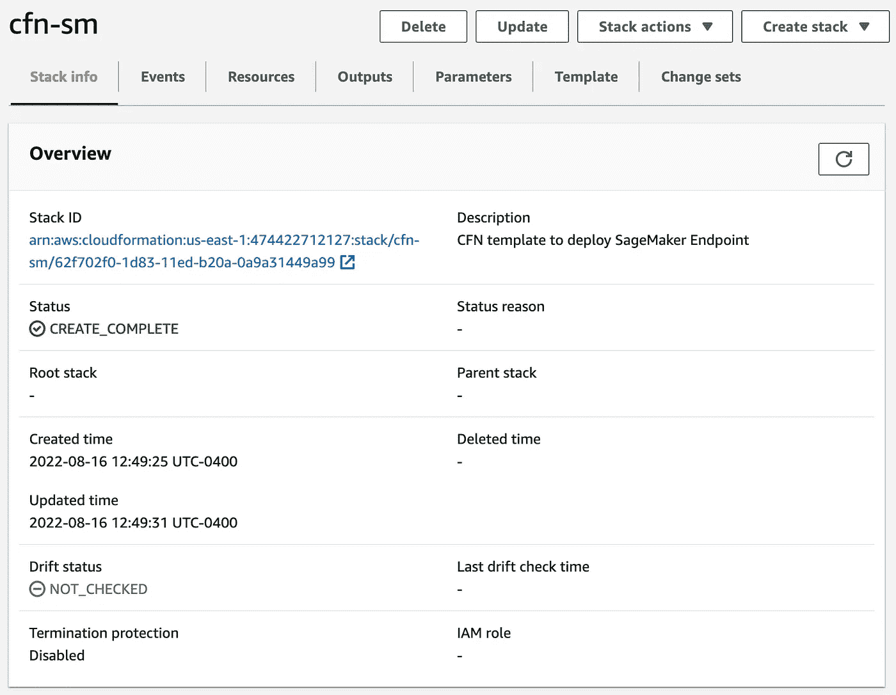
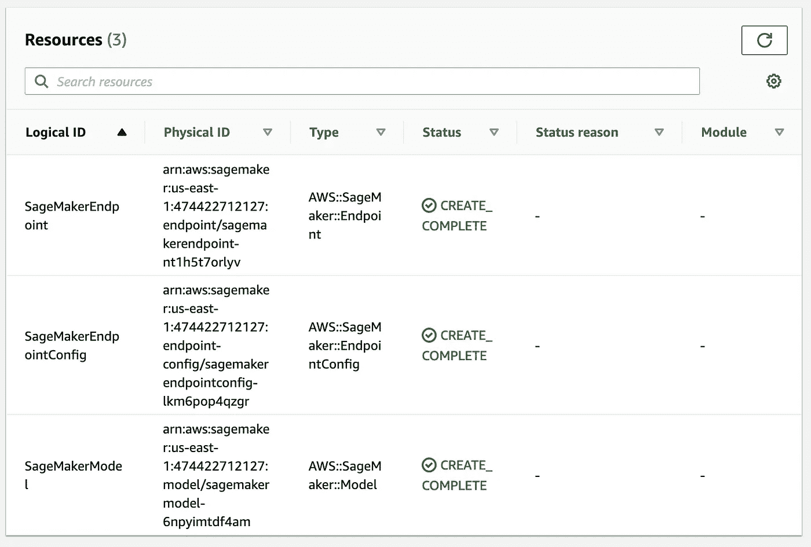

# 使用 CloudFormation 部署 SageMaker 端点

> 原文：<https://towardsdatascience.com/deploying-sagemaker-endpoints-with-cloudformation-b43f7d495640>

## 使用 SageMaker 将基础设施作为代码

图片来自 [Abraham Barrera](https://unsplash.com/@abebarrera) 的 [Unsplash](https://unsplash.com/@abebarrera)

过去，我通过 Jupyter 笔记本和 Python 脚本与 [SageMaker Deployment](https://docs.aws.amazon.com/sagemaker/latest/dg/deploy-model.html) 合作过。这完全没问题，但通常在较大的应用程序范围内，您需要能够在一个中心模板中定义 SageMaker 资源和基础设施的其余部分。这引入了作为代码的[基础设施的概念，然后引入](https://www.redhat.com/en/topics/automation/what-is-infrastructure-as-code-iac) [AWS CloudFormation](https://aws.amazon.com/cloudformation/) 。当涉及到生产应用程序时，能够在各种中央模板中捕获您的资源是至关重要的，维护或管理笔记本或单个脚本的隔离流程变得非常困难。

在本文中，我们将了解如何使用 CloudFormation 来定义 SageMaker 资源并创建实时端点。利用这个模板，您应该能够为其他 SageMaker 推理选项(如多模型端点、无服务器推理和异步推理)推断和创建云信息模板。

**注意**:对于刚接触 AWS 的人来说，如果你想继续下去，请确保在下面的[链接](https://aws.amazon.com/console/)中建立账户。确保还安装了 [AWS CLI](https://aws.amazon.com/cli/) 来处理该示例。这篇文章也将假设云形成的基本知识，如果你需要一个入门指南，在这里看一下这篇文章。本文还假设对 SageMaker 部署有一个中级理解，我建议遵循本文[为了更深入地理解部署/推理，我们将在本文中使用相同的模型，并将其映射到 CloudFormation。](/deploying-a-pre-trained-sklearn-model-on-amazon-sagemaker-826a2b5ac0b6)

## 设置

在开始构建 CloudFormation 模板之前，我们需要了解我们的 SageMaker 端点需要什么。对于这个用例，我们将在 SageMaker 实时端点上部署一个预训练的 Sklearn 模型。利用下面的脚本，我们可以快速运行一个[线性回归模型](https://scikit-learn.org/stable/modules/generated/sklearn.linear_model.LinearRegression.html)并生成一个模型数据工件。

本地模型

运行这个脚本后，您应该得到一个 model.joblib 文件，它包含部署所需的模型元数据。一般来说，使用 SageMaker 推理，您还需要一个推理脚本来控制自定义代码的前/后处理。

推理脚本

SageMaker 推理期望将这个模型数据和推理脚本打包成一个 tarball，因此我们运行下面的脚本将这些资源转换成期望的格式，并将其上传到 S3 存储桶。

创建并上传 model.tar.gz

现在我们已经有了模型工件，我们可以继续处理云的形成。

## 定义云形成参数

一个 [CloudFormation 模板](https://aws.amazon.com/cloudformation/resources/templates/)是一个 yaml 或 json 文件，你可以在其中定义你所有的基础设施。 [CloudFormation 参数](https://docs.aws.amazon.com/AWSCloudFormation/latest/UserGuide/parameters-section-structure.html)允许你在模板中注入自定义值。然后在定义资源时，您可以引用这些参数。在这种情况下，我们提供默认值，但是如果您愿意，您可以通过 [CLI](https://docs.aws.amazon.com/AWSCloudFormation/latest/UserGuide/cfn-using-cli.html) 覆盖它们。对于 SageMaker 端点，我们必须定义以下参数(注意，您可以随意命名这些参数，但要确保在命名时引用它们):

*   **RoleARN** :您授予权限的 SageMaker 执行角色。用您为 SageMaker 资源定义的 IAM 角色替换默认角色值。

*   **ImageURI** :这是 URI 的图像，你可以从现有的[深度学习容器](https://github.com/aws/deep-learning-containers/blob/master/available_images.md)中检索到，或者如果你做了 [BYOC 部署](/bring-your-own-container-with-amazon-sagemaker-37211d8412f4)，你可以从 ECR 中自己定制图像 URI。对于这个例子，我们有一个 Sklearn 模型，所以我们已经用[检索了](https://aws.plainenglish.io/how-to-retrieve-amazon-sagemaker-deep-learning-images-ff4a5866299e)那个托管容器的适当版本。

Sklearn 图像

*   这是我们打包在一起并上传到 S3 桶的模型工件和推理脚本。

*   **instance type&instance count**:您正在为端点定义的硬件，针对无服务器推理(内存大小&并发)对其进行适当的更改。

实例配置

我们现在已经有了部署 SageMaker 实时端点所必需的参数，接下来让我们专注于定义我们的资源。

## 云信息资源和部署

为了部署 SageMaker 端点，有三个主要的实体协同工作: [SageMaker 模型](https://boto3.amazonaws.com/v1/documentation/api/latest/reference/services/sagemaker.html#SageMaker.Client.create_model)、 [SageMaker 端点配置](https://boto3.amazonaws.com/v1/documentation/api/latest/reference/services/sagemaker.html#SageMaker.Client.create_endpoint_config)和 [SageMaker 端点](https://boto3.amazonaws.com/v1/documentation/api/latest/reference/services/sagemaker.html#SageMaker.Client.create_endpoint)。SageMaker 模型实体定义了我们用于部署的模型数据和图像，并且是我们创建的第一个资源。

SageMaker 模型实体

注意，我们引用了我们已经定义的 ImageURI 和模型数据参数。接下来，我们对端点配置做了同样的事情，我们在端点后面定义了实例配置。

SageMaker 端点配置

现在，我们在定义 SageMaker 端点的最后一步时指向这个资源。

SageMaker 端点创建

使用 AWS CLI，我们可以通过指向我们的 yaml 文件来[部署](https://docs.aws.amazon.com/cli/latest/reference/cloudformation/deploy/index.html)这个 CloudFormation 堆栈。

部署云架构堆栈

我们可以在控制台中验证这一点，几分钟后，您应该会看到所有三个资源都已创建。

云形成堆栈完成(作者截图)

SageMaker 端点已创建(作者截图)

## 其他资源和结论

  

您可以在上面的链接中找到示例的完整代码。AWS CloudFormation 是一个非常强大的工具，它使得在一个中央模板中捕获您的 AWS 资源变得非常容易。没有作为代码的基础设施，在软件生命周期中迭代变得非常困难，这也适用于 ML 服务，如 SageMaker。我希望这篇文章对那些对 SageMaker、CloudFormation 和 AWS 感兴趣的人有用。

*   [SageMaker 部署示例](https://github.com/RamVegiraju/SageMaker-Deployment)
*   [SageMaker 文章列表](https://ram-vegiraju.medium.com/list/amazon-sagemaker-f1b06f720fba)
*   [样本模板](https://docs.aws.amazon.com/AWSCloudFormation/latest/UserGuide/sample-templates-services-us-west-2.html)

*如果你喜欢这篇文章，请在*[*LinkedIn*](https://www.linkedin.com/in/ram-vegiraju-81272b162/)*上与我联系，并订阅我的媒体* [*简讯*](https://ram-vegiraju.medium.com/subscribe) *。如果你是新来的中号，用我的* [*会员推荐*](https://ram-vegiraju.medium.com/membership) *报名吧。*