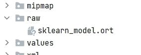

# 使用 ONNX 在 Android 应用中部署 Scikit-Learn 模型

> 原文：<https://towardsdatascience.com/deploying-scikit-learn-models-in-android-apps-with-onnx-b3adabe16bab>

## 📱[移动机器学习](https://equipintelligence.medium.com/list/stories-on-mobile-ml-with-kotlin-and-tf-lite-3ebee822c87b)

## 使用 scikit-learn 模型在 Android 应用程序中执行推理


[图片](https://www.pexels.com/photo/woman-using-smartphone-and-laptop-4549414)由佩克斯的普兰拍摄

[Scikit-learn](https://scikit-learn.org/) 确实是一个彻底改变了机器学习和数据科学的包，并且仍然是任何 ML/DS 角色的最基本的先决条件。但是，随着机器学习领域从研究走向工业，ML 模型的部署现在在软件开发周期中起着至关重要的作用。

但是我们大多数人只能在 Python 脚本或 Jupyter 笔记本中运行 scikit-learn 模型，并且只有有限数量的博客/视频讨论了它们的部署。[使用 Flask](/deploy-a-machine-learning-model-using-flask-da580f84e60c) 、 [Django](https://www.djangoproject.com/) 或 [FastAPI](https://fastapi.tiangolo.com/) 之类的 web 框架可以轻松部署，这些框架可以帮助构建一个 API 来连接应用程序代码和 ML 代码。

部署能够为移动应用带来创新功能的 ML 模型将是一件大事，因为智能手机是唯一始终伴随用户并处理其大部分工作负载的设备。因此，在这个故事中，我们将讨论如何使用 [ONNX](https://onnx.ai/) 在 Android 应用程序上部署 scikit-learn 模型，这将充当两个世界之间的桥梁。如果你不知道 ONNX，不要担心，即使我在做这个故事之前不知道！

> 作为一名 Android 开发人员，我可以从头到脚讨论一个 ML 模型在 Android 上的部署过程。对于 iOS 或跨平台框架，也可以遵循类似于我们将要讨论的过程。

首先，我们将把 scikit-learn 模型转换成 ONNX，然后在 Android 应用程序中使用这个 ONNX 模型。

Android 应用程序的源代码可以在这里找到->

[](https://github.com/shubham0204/Scikit_Learn_Android_Demo) [## GitHub-Shu bham 0204/sci kit _ Learn _ Android _ Demo:一个运行 scikit-learn 模型的 Android 应用程序…

### 一个运行 scikit-learn 模型并转换成 ONNX 格式的 Android 应用程序- GitHub …

github.com](https://github.com/shubham0204/Scikit_Learn_Android_Demo) 

舒巴姆·潘查尔

## 📱Android 中的移动机器学习

[View list](https://equipintelligence.medium.com/list/mobile-machine-learning-in-android-3ebee822c87b?source=post_page-----b3adabe16bab--------------------------------)17 stories

# 1.获取 ONNX 模型(Python 语言)

## ONNX 是什么？

[ONNX](https://onnx.ai/) 代表开放式神经网络交换，这是一种用于将 ML 模型从一个框架轻松转换到另一个框架的中间表示。这是一个由微软、Amazon 和 Meta 共同开发的开源项目，旨在为部署和运行 ML 模型带来健壮性，从而使其框架不变。

例如，如果您必须将一个 [PyTorch](https://pytorch.org/) 模型转换为一个 [TensorFlow](https://www.tensorflow.org/) 模型，您可以首先将其转换为 ONNX 模型。 [TensorFlow 支持加载 ONNX 模型](https://github.com/onnx/onnx-tensorflow)，这样你就可以从 ONNX 模型中得到一个 TF 模型。这里有一个关于 ONNX 框架的详细博客，

[](https://blog.roboflow.com/what-is-onnx/) [## ONNX 是什么？ONNX 框架的快速解释

### “一分钟的 ML”是我们关于回答机器学习问题的会话系列。有你想要的问题…

blog.roboflow.com](https://blog.roboflow.com/what-is-onnx/) 

## A.构建 Scikit-Learn 模型

第一步是[用 Python](https://scikit-learn.org/stable/tutorial/basic/tutorial.html) 构建一个 scikit-learn 模型。为了演示部署过程，我们将使用一个简单的`LinearRegression`模型来进行预测。你可以从 [Kaggle](https://www.kaggle.com/) 下载 [Himanshu Nakrani](https://www.kaggle.com/himanshunakrani) 的[学生学习时数](https://www.kaggle.com/datasets/himanshunakrani/student-study-hours)数据集。数据集可通过 [CC 1.0 公共域许可证](https://creativecommons.org/publicdomain/zero/1.0/)获得。

代码片段 1:构建一个 scikit-learn 模型

> 运行上面的代码片段并记下输出。我们将使用相同的输入变量，即 8.5，在 Android 应用程序中进行预测

## B.安装 sklearn2onnx 和 onnx 转换

我们将安装 [sklearn-onnx](https://github.com/onnx/sklearn-onnx) ，这将帮助我们将 scikit-learn 模型转换为 onnx 模型(`.onnx`)。

```
pip install skl2onnx
```

sklearn-onnx 可以转换几乎所有的 scikit-learn 模型和预处理组件，你可以在这里找到一个列表。接下来，我们转换 scikit-learn 模型，

代码片段 2:转换为。onnx

## C.转换到 ONNX 运行时(可选)

这一步是可选的，我们可以直接在 Android 中运行`.onnx`模型。由[史葛麦凯](https://github.com/skottmckay)在[Scikit _ Learn _ Android _ Demo](https://github.com/shubham0204/Scikit_Learn_Android_Demo)中突出显示的点，

> 它(ORT 格式)的主要好处是，如果二进制大小是一个大问题，允许使用较小的版本(onnxruntime-mobile android 包)。ONNX 运行时对两种模型格式都进行了相同的图形优化——它们只是在创建。ort 格式模型，这样我们就不必在较小的构建中包含优化器代码。
> 
> 然而，由于 onnxruntime-mobile 包所使用的操作符/类型，您的模型可能不被它支持，所以使用带有 onnxruntime-android 的. onnx 模型是最简单和最安全的选择。
> 
> 如果二进制大小是一个问题，并且 onnxruntime-mobile 不支持您的模型，那么您可以进行自定义构建，以创建一个只包含您的模型所需的操作符和类型的包。这提供了可能的最小二进制大小。

注意，到目前为止，我们只将 scikit-learn 模型转换为 ONNX。ONNX 是一种表示机器学习模型的开放格式。在不同的系统或设备上运行 ONNX 模型或加速 ONNX 的推理需要运行时。运行时应该能够解析 ONNX 模型格式并从中做出预测。这样的运行时是来自微软开源的 onnxruntime 。

我们现在将把`.onnx`模型转换成`.ort`格式。官方文件上说，

> ORT 格式是精简 ONNX 运行时版本支持的格式。缩减规模的构建可能更适合在规模受限的环境中使用，如移动和 web 应用程序。

```
pip install onnxruntime
```

接下来，我们需要使用`convert_onnx_models_to_ort`脚本来执行转换，比如，

```
!python -m onnxruntime.tools.convert_onnx_models_to_ort sklearn_model.onnx
```

你也可以在 Python 中运行`.ort`构建。看到这个官方教程，

 [## ONNX 运行时

### ONNX 运行时提供了一种在 CPU 或 GPU 上运行高性能机器学习模型的简单方法，而无需…

onnxruntime.ai](https://onnxruntime.ai/docs/api/python/tutorial.html) 

接下来，我们继续讨论 Android 部分，并讨论如何使用`.ort`模型进行预测。

# 2.在 Android 应用程序中使用模型(在 Kotlin 中)

您可以[打开一个带有所需配置的新 Android Studio 项目](https://developer.android.com/training/basics/firstapp/creating-project)，并在`build.gradle`文件(模块级)中添加`[onnxruntime](https://mvnrepository.com/artifact/com.microsoft.onnxruntime/onnxruntime)` [Maven 依赖项](https://mvnrepository.com/artifact/com.microsoft.onnxruntime/onnxruntime)

```
implementation 'com.microsoft.onnxruntime:onnxruntime-android:latest.release'
```

## A.创造一个`OrtSession`

首先，我们需要复制`.ort`或`.onnx`文件并将其添加到`app\src\main\res\raw`文件夹中。创建新的 Android 应用程序项目时，最初不会创建此文件夹。如果你还没有创建`raw`文件夹，请参考[的回答](https://stackoverflow.com/a/29308338/13546426)。



“原始”文件夹中的 ORT 文件。图片来源:作者

接下来，在`MainActivity.kt`中定义一个方法来创建一个带有`OrtEnvironment`的`OrtSession`。

代码片段 3 —创建一个运动会话

## B.执行推理

接下来，我们需要使用我们在上一步中创建的`OrtSession`运行 ORT/ONNX 文件。这里有一个方法`runPrediction`可以做到这一点，

片段 4 —使用运动会话进行预测

我们用我们在步骤 ***1-B*** 中提供的形状`initial_type`创建一个`OrtTensor`。然后，我们只需要运行`ortSession.run`来运行 ORT 模型。通过 Android 中的一些自定义输入，我们可以在`MainActivity.kt`中的`onCreate`方法中添加以下几行，

代码片段 5——接受用户的输入并做出预测

运行应用程序，亲自体验神奇之处。该应用程序在 8.5 小时的学习中产生的输出(输入变量)与在 Python 中产生的输出相同，


应用程序的演示。图片来源:作者

# 结束了

到目前为止，您可能已经意识到，这种转换的过程非常简单，不包括任何跨平台的转换。许多开发者、创业公司和 ML 从业者可能已经想到了这样的转换，但是他们可能没有意识到这个简单的过程。

这可能是一个*美化了的黑客*，所以如果你在这个变通办法上面临任何问题，请在评论中分享它们，以便其他读者了解它们。你也可以[在 GitHub 库](https://github.com/shubham0204/Scikit_Learn_Android_Demo/issues/new/choose)上打开一个问题。

希望你觉得这个故事有趣。如果你有任何疑问，请在评论中告诉我，或者在***equip intelligence @ Gmail***上给我发消息。继续学习，祝你有美好的一天！