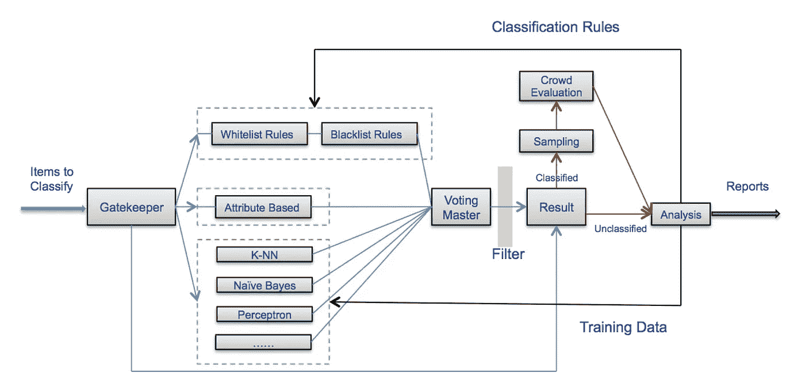

# 部署你的机器学习模型只是开始

> 原文：<https://towardsdatascience.com/deploying-your-machine-learning-model-is-just-the-beginning-b4851e665b11>

## 如何将 ML 模型转化为有用的商业行为:MLOps 入门

凯瑟琳·麦科马克在 [Unsplash](https://unsplash.com?utm_source=medium&utm_medium=referral) 上的照片

L 和许多刚开始从事 ML 的人一样，我接触到的第一个问题是泰坦尼克号数据集。这个问题的任务是在给定机票等级、客舱位置、性别、年龄等特征的情况下，“预测”一名乘客是否在泰坦尼克号灾难中幸存。虽然这是一个有趣的问题，但由于显而易见的原因，它实际上是无用的。没有人真的需要一个巨大的分类器。这个模型在现实世界中无法采取任何行动。

在现实世界中，行动很重要。一个实际上什么都不做的模型并不比完全没有模型好。然而，将 ML 模型转化为有用的商业行为的微妙之处通常不在 ML 研究的范围内。

在本帖中，我们将深入探讨:

*   你的模型在现实世界中可以采取的一系列行动，
*   如何监控模型的工作点，
*   为什么在生产中既不能保证精度，也不能保证召回率(以及如何应对)，以及
*   如果循环中有人类注释者，应该考虑什么。

让我们开始吧。

## **您的 ML 系统可以采取哪些措施？**

概括地说，您的模型可以采取 3 种类型的操作:

*   *软动作*:把某样东西搁置一边供人调查，除此之外什么都不做。让人类决定并采取最终行动。
*   *硬动作*:自动做一些事情(例如，将电子邮件移动到垃圾邮件文件夹，或者取消信用卡交易)。
*   无操作/通过操作。什么都不做。

一个特定的 ML 应用程序可能需要在生产中采取几个行动，这取决于 ML 模型分数。例如，在信用卡欺诈检测系统中，您可以自动取消具有最高模型分数的订单(硬操作)，通过具有最低模型分数的订单(无操作)，并发送两者之间的所有信息以进行人工调查(软操作)。在垃圾邮件检测系统中，您可以自动将具有最高模型分数的电子邮件移动到垃圾邮件文件夹，并将具有中间模型分数的电子邮件标记为潜在垃圾邮件，但仍将其保留在用户的主邮箱中。

最后，排名模型又如何呢？它为搜索、订阅和广告等应用提供了动力。这里的操作是，嗯，排序:以尽可能好的顺序显示项目。

 [## 学习排名:入门

### 为搜索引擎、推荐系统、社交媒体和广告提供动力的算法

towardsdatascience.com](/learning-to-rank-a-primer-40d2ff9960af) 

## **如何监控精度和召回**

ML 课程教你精确度(正确的正面预测的比率)和回忆(我们的模型捕捉到的所有正面预测的比率)的重要性。这是一种交换，你可以牺牲一个来换取另一个。系统运行的精确度和召回率的精确组合称为*运行点*。但是我们实际上如何测量生产中的操作点呢？

先考虑测量精度的问题。如果你的系统采取软动作，那么精度相对容易跟踪。简单地跟踪人们对被搁置的项目所做的决定。如果你的系统采取艰难的行动，你可以建立一个*控制组*:对于体积的一小部分，让一个人来决定，而不是你的模型。那么控制组中的精度就是你的模型精度的估计。

衡量回忆可能要复杂得多。为了做到这一点，根据定义，你需要审核你的负面预测。这很棘手，因为典型的用例可能有不平衡的类。例如，假设您构建了一个欺诈检测系统，每天对 100 万个订单采取通过措施，您的召回率预计为 99.9%。这意味着，平均而言，您每天至少需要审核 1K 个否定，才能发现一个错误否定，如果这个数字具有统计意义，就需要更多。

因此，简单随机抽样的召回审核是非常不切实际的。一个更好的方法是*重要性抽样*，其中我们不是随机抽样否定，而是基于他们的模型分数。关键的想法是从具有高模型分数的数据点进行更多的采样，因为这是我们预期的大部分假阴性所在。在一篇博客文章中，谷歌研究人员 Arun Chaganty 展示了他如何使用重要性抽样将测量召回的成本降低了大约三分之一。

## 为什么在生产中既不能保证精度，也不能保证召回率(以及如何应对)

无论您如何在离线评估集上调整操作点，实际上您都无法保证您的系统在生产中达到一定的精度或召回率。这是因为数据漂移:生产中的数据分布总是与离线测试中的略有不同。数据漂移量取决于问题领域，在欺诈和滥用等敌对领域尤为严重。

这个问题怎么办？一个解决方案是添加一个缓冲区:例如，如果业务目标是 95%的精度，您可以尝试在离线评估集上将您的模型调整到 96–97%的操作点，以便考虑到数据漂移导致的预期模型降级。

对于 ML 团队来说，为商业利益相关者设定正确的期望也很重要。例如，我见过一个案例，ML 团队与业务涉众的合同是保证已知(历史)数据的 X%召回率。这是一份很好的合同，因为它不会试图对 ML 团队无法完全控制的事情做出保证:生产中的实际召回取决于数据漂移的数量，因此是不可预测的。

## 人类在厕所里的动态变化

一旦您在循环中引入了有人类调查员参与的外围操作，您的 ML 应用程序的操作方面就会发生巨大的变化。

首先，一些术语:

*   *积压*是指你已经搁置的用于人工调查的项目数量。
*   *排队率*是所有被你排除在外的订单的比率。
*   *容量*衡量的是在给定的时间段内你最多可以排队多少。例如，如果您雇用 100 名人工注释员，每天工作 8 小时，一个注释需要 5 分钟，那么您每天可以对 10K 项目进行排队，这就是您的系统的容量。

积压管理的基本法则是这样的:如果您的排队率高于您的能力，您的积压就会增加。如果你的排队速度低于你的能力，你的积压就会减少。理想情况下，你会希望有一个稳定的积压工作，进来的和出去的一样多，就像一个浴缸，任何时候流入的水和流出的水一样多。

然而在实践中，由于数据漂移，队列速率可能是不可预测的。例如，在欺诈检测中，新的欺诈攻击可能会导致您的排队率激增。同样，在产品分类中，来自新供应商的产品可能会突然激增。出于这个原因，你会希望你的贴标劳动力有一定的*弹性*，即能够根据需要快速增加或减少劳动力的规模。

沃尔玛的产品分类渠道利用了人类专家和大众工作者。([来源](https://pages.cs.wisc.edu/~anhai/papers/chimera-vldb14.pdf))

沃尔玛实验室的一篇论文提出了这个问题的一个有趣的解决方案(Sun et al 2014):他们的系统使用专家人类分析师和人群工作者的组合来进行产品分类。虽然大众工作者不如人类专家准确，但他们也是极具弹性的劳动力。这种弹性尤其有助于应对“突然涌入的成百上千个项目”。此外，人类专家会定期审核群体生成的标签，以确保其质量。

## 结论:部署您的模型仅仅是开始

我希望至少已经明确了一件事:在部署您的 ML 模型之后，工作还远远没有完成。我认为这项工作才刚刚开始。总结一下:

*   ML 模型只有在采取行动时才有用。这些可以是硬动作(例如，取消信用卡交易)或软动作(例如，将其标记为手动检查)。
*   为了跟踪整个系统的健康状况，监控精确度和召回率是至关重要的。对于高等级不平衡的问题来说，召回审计是昂贵的，但是通过重要性抽样可以降低成本。
*   实际上，由于数据漂移，您无法保证生产中的精确度和召回率。因此，ML 团队和利益相关者之间的良好契约可以保证对已知数据的一定程度的召回/精确。
*   当人工贴标机处于循环中时，除了精确度和召回率之外，您还需要跟踪队列速率。如果队列速度激增，您将需要额外的人工贴标机来跟上额外的数量。

最后，尽管[在 ML 研究中关注模型性能](https://medium.com/towards-data-science/is-my-model-really-better-560e729f81d2)，但应该清楚的是，并非所有对 ML 生产系统的改进都需要模型改进。例如，假设您可以通过为人类贴标机构建更好的 UI 来找到将调查时间减半的方法。这种改进将使我们能够节省标签成本，或者通过利用新的容量来提高整体召回率或精确度。无论哪种方式，如果不对 ML 模型进行任何改进，系统都会有显著的改进。

## 在你走之前…

*喜欢这个内容吗？在 Medium 上关注/订阅，这样你就不会错过我以后写的新帖。* [*成为中等会员*](/@samuel.flender/membership) *这样你就可以无限阅读文章了。并确保在*[*LinkedIn*](https://www.linkedin.com/in/sflender/)*和/或*[*Twitter*](https://twitter.com/samflender)*上关注我！*